# 越多越好——为什么要成为多语言程序员

> 原文：<https://levelup.gitconnected.com/the-more-the-better-why-become-a-multi-language-programmer-3fb61fd3b359>

阿列克斯·马林科维奇在 [Unsplash](https://unsplash.com/?utm_source=unsplash&utm_medium=referral&utm_content=creditCopyText) 上的照片

有时候学习你的第一种编程语言可能会变成一种痛苦的折磨，所以你不会有学习第二种或第三种语言的欲望。然而，止步于单一技术可能会影响职业发展和潜在收益。此外，技术正在迅速改变世界，在这个充满活力的时代，你不能落后。因此，学习第二种、第三种甚至第四种编程语言，或者至少对它有一些基本的了解，意味着投资你的未来，为你打开新的职业机会，例如在一家大型科技公司找到一份工作。

我研究了掌握几种编程语言的所有可能的好处，并把其中最重要的放在一起。你也会发现有经验的编码员是怎么想的。最后，我会建议你学习最热门的语言以及对你非常有用的资源。

# 为什么学习几种编程语言很重要？

如果你以前已经有编程经验，你会有兴趣了解为什么精通多种技术很重要，以及它如何有助于你的就业机会。

*   更多的知识。开发人员的最终目标是识别问题，并决定使用什么技术栈来解决问题。只要你懂几门语言，你就能达到独特的目的。当您手头有不止一种编程语言，并且区分了效率、性能和可用性等因素时，您可以简单地选择最适合的选项来解决特定的问题。
*   更多的机会。现在，对于一个开发人员来说，即使在同一个项目中，出于不同的目的，知道一堆技术和几种语言是很平常的事情。今天精通多种编程语言对你的职业生涯有很大的影响。这会让你更有竞争力，扩大你可以申请的工作范围。因此，你在职业选择上不再受限制，因此你可以得到任何你喜欢的角色。
*   更多的钱。你的工资潜力与你掌握的语言数量成正比。有些公司在寻找一个在算法、数据结构、可扩展系统方面有深厚常识，并且精通一种或几种语言的通才。这些公司通常支付更多，有更多有趣的项目，有签证赞助的选择等。这里最好的例子是所谓的“FAANG”公司，这是脸书、苹果、亚马逊、网飞、谷歌的俚语缩写。我还要加上微软，事实上还有更多。这是一条艰难的职业道路，但值得一试。
*   更好玩。单调和重复是没有乐趣的。长年累月经历同样的事情，人类会感到厌烦，这很正常。编码员也不例外。这就是拥有多种编程语言可以给你带来更多令人兴奋的项目，让你保持头脑清醒，让你跳出框框思考的地方，这对专业人士来说至关重要。

# 熟练的程序员对此有什么看法？

我询问了我的同行，并浏览了许多流行的讨论板，包括 Quora，以了解其他具有长期编程经验的专业人士对学习多种语言的看法。大多数人都认为掌握三种不同的技术是最好的。然而，所有人都声称，你不应该为了表面的吸引力而停止学习新的编码语言。

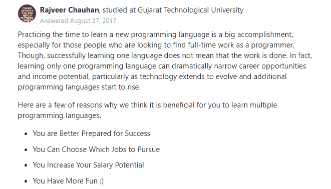

# 从什么语言开始比较好？

考虑到上面提到的优势，学习多种编程语言是值得努力的事情。然而，在这里您可能会陷入困惑，不知道下一步应该选择什么技术，什么资源是理想的培训资源。接下来是最受欢迎的语言和学习平台列表。

# Java 语言(一种计算机语言，尤用于创建网站)

当人们问我从什么开始他们的编程之旅时，我首先推荐的通常是 Java。它是一种非常容易学习的语言，经常被用来介绍 OOP 概念。

Java 也因其“一次编写，随处运行”的理念而闻名，这使得它成为在任何平台上使用的各种应用程序的标准。Java 用例几乎是无穷无尽的——它支持巨大的服务器端企业级应用、金融、银行、交易 web 应用、移动应用、大数据等等。

Java 有一个庞大的支持性开发人员社区，他们积极参与各种论坛，分享他们的经验，并帮助新手解决他们的问题。从社区中获得帮助、指导和可操作的代码反馈是你迫切需要的，尤其是在学习的开始阶段。

## 从哪里学习 Java

1.CodeGym.cc

CodeGym 因其动手学习 Java 的方法而广受欢迎。在平台上注册之后，您几乎马上就要编写第一行代码。您将访问 1200 个越来越复杂的实际任务，这些任务将带您从 Java 基础到更复杂的主题，如类和集合。当我的一些学生第一次尝试这门课程时，他们发现培训是如此令人兴奋，他们甚至没有想过放弃。

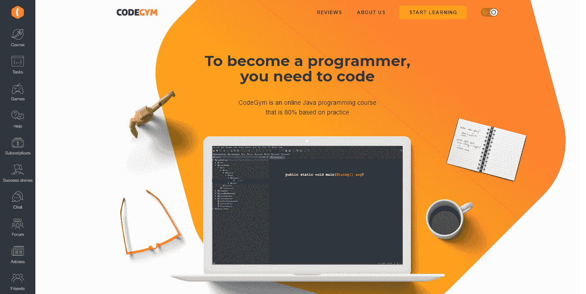

2.Java 基础知识

[Pluralsight](https://www.pluralsight.com/paths/java) 提供在线课程，全面覆盖 Java 编程语言，为开始 Java 应用开发打下坚实的基础。

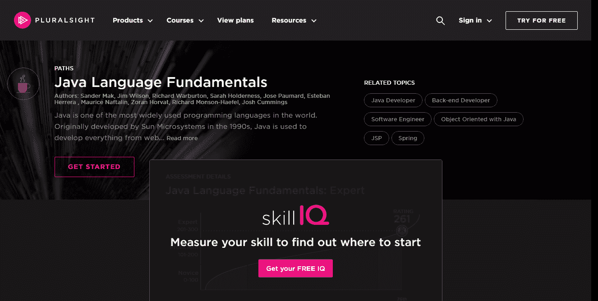

3.代码集

[Codecademy](https://www.codecademy.com/learn/learn-java) 是一个交互式资源，旨在教你 Java 基础知识。通过本课程，您将学习使用 Java 的基本编程概念，并最终掌握七个 Java 项目。

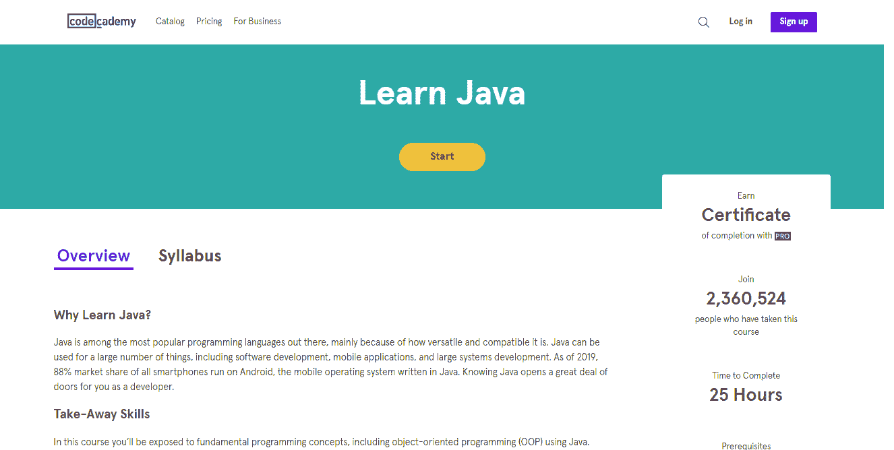

# 计算机编程语言

Python 已经被用于软件开发近三十年了，并且受到了许多致力于为不同项目编写清晰的逻辑代码的专家的欢迎。这很简单，入门门槛也很低。代码也很简单。因此，Python 对于初学者来说是一个简单的开始，对于熟练的程序员来说是一个有趣的工作，因为他们可以快速工作，并且更多地考虑逻辑而不是语法。

Python 无处不在，并且安装在许多机器上。这种语言很适合编写脚本，所以很多开发者使用它。除了网站后端、脚本、网络应用、科学编程和许多软件产品，包括 Abaqus、FreeCAD、Lightware、modo，它还成功地用于解决小任务、“粘合”项目的较大部分，或任何其他 DevOps 目的。它也成为新技术中的首选语言，包括科学计算、人工智能、ML、信息安全等等。除此之外，Python 的扩展库列表和生产就绪解决方案允许快速实现您需要的东西。

## 去哪里学 Python

1.学习 Python

[学习 Python](https://www.learnpython.org/) 为大家提供免费的互动 Python 教程，不考虑之前的体验。该平台涵盖从 Python 基础到数据科学和其他高级概念的不同主题，这使其成为学习者的一站式资源。你也可以加入讨论组，观看专家指导的视频。

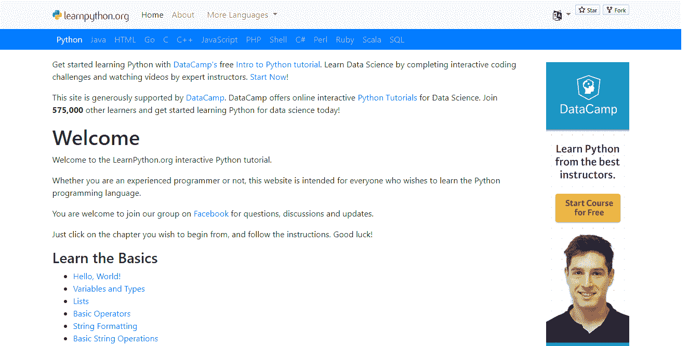

2.艰难地学习 Python

[Zed Shaw](https://learnpythonthehardway.org/book/) 写了这本书，帮助你顺利进入编程。它将指导你学习 Python，并通过练习和记忆帮助你掌握这门语言。完成所有 52 个练习后，您将获得跟上更复杂编程主题所需的技能。

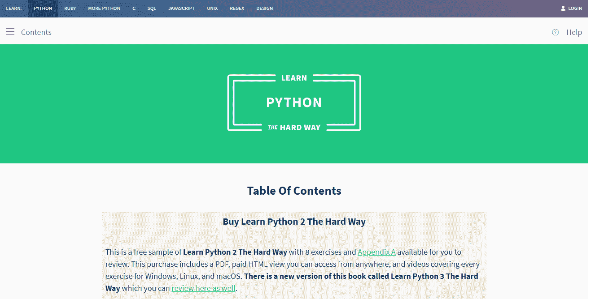

3.GitConnected

在 [GitConnected](https://gitconnected.com/learn/python) 上，你会发现如何学习 Python 之类的编程语言。该网站提供了一系列由熟练的程序员提交的从初级到高级的免费课程。这些内容由已经使用过的程序员投票决定，这使得其他学习者可以选择最好的课程。

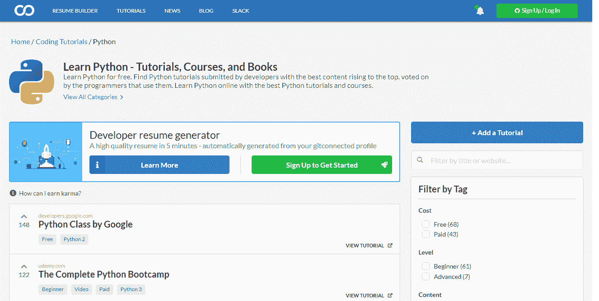

# C#

C#是微软在 2000 年开发的一种多范式编程语言。今天，它被积极地用于为 Windows 环境和 web 应用程序建立程序。NET 框架。只要 C#的语法与 C、C++和 Java 的语法相似，那么对于计划掌握 C#的程序员来说，以前在提到的任何技术方面的经验都是有利的。

就微软 Visual C++对 C#的支持而言，它适用于运行在 iOS、Android 和 Windows 上的应用程序。此外，C Sharp 和 Unity game engine 一起用于创建视频游戏。现在，在 Unity 中，C#是主要选项。

## 从哪里学 C#

1.树屋的 C#基础

在[树屋](https://teamtreehouse.com/library/c-basics-2)，你将学习 C#基础知识，包括语法、类型、字符串、数字和‘if 语句’。课程结束后，您将对 C#编程充满信心，并能够更进一步。

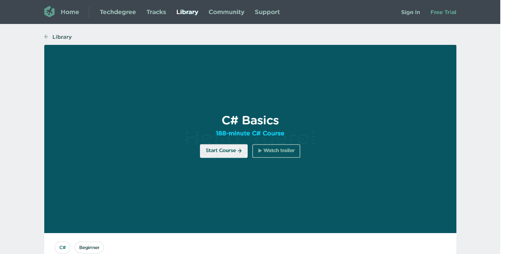

2.初学者的 C#基础:通过编码学习 C#基础

Mosh Hamedani 在 Udemy 举办的这门课程对于没有任何 C#经验的新手或打算更新 c#知识的人来说是一个完美的解决方案。会逼着你从零开始学 C#。在掌握了基础知识之后，你将会学习操作符和表达式，数组和列表，算法和 OOP。这个学习计划还提供了小测验和练习，让你把你的知识马上付诸实践。

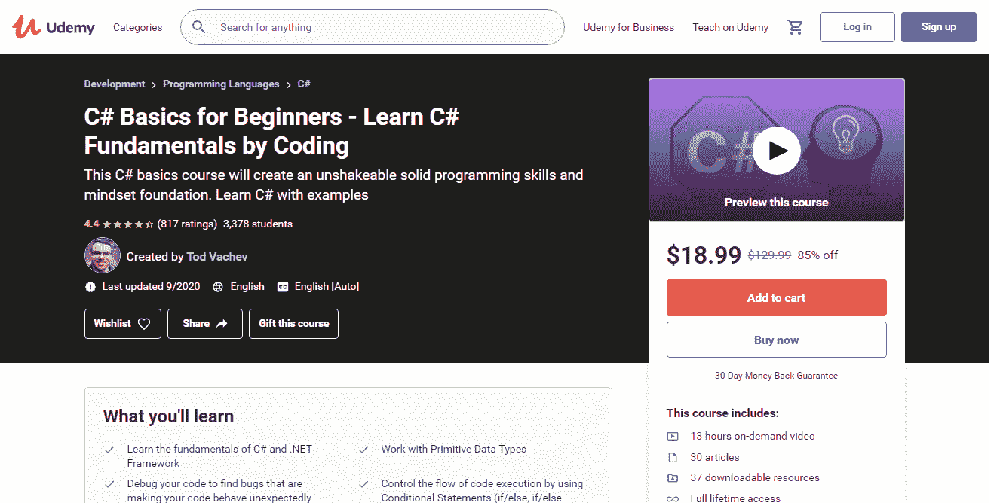

3.斯科特·艾伦的《C#基础》

这门课程在 [Pluralsight](https://www.pluralsight.com/paths/csharp) 上的创建者 Scott Allen 设定了一个目标，向你解释如何使用 C Sharp 语言的高级特性。您将从 C#语法开始，了解解决问题所需的概念和 OOP 技术。你将最终获得足够用于现实项目的知识和技能。

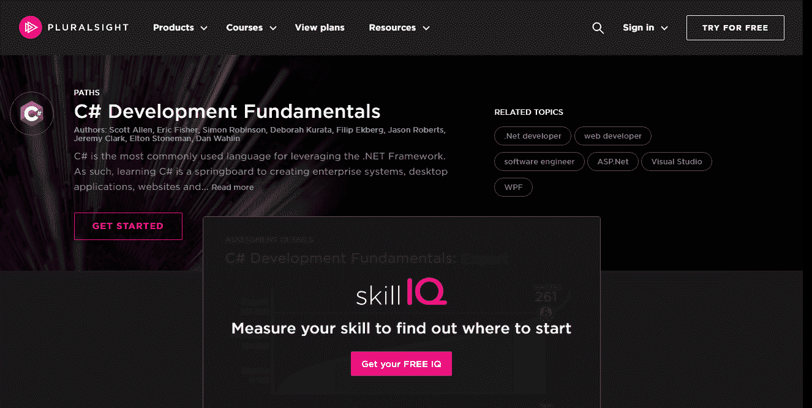

# Java Script 语言

今天，JavaScript 不仅仅是一种用于实现客户端功能和构建动态网站的编程语言。它现在被嵌入到不同的软件系统中，在 Node.js 这样的项目的帮助下部署服务器端网站和非浏览器应用程序。掌握了 js，你就可以在前端和后端开发中取得成功。

## 从哪里学习 JavaScript

1.Freecodecamp.org

如果你是这种语言的新手，Freecodecamp 是学习 JavaScript 的好地方。这个三小时的课程包含了 JS 编程入门所需的一切，并以创建真实项目所需的足够知识结束。

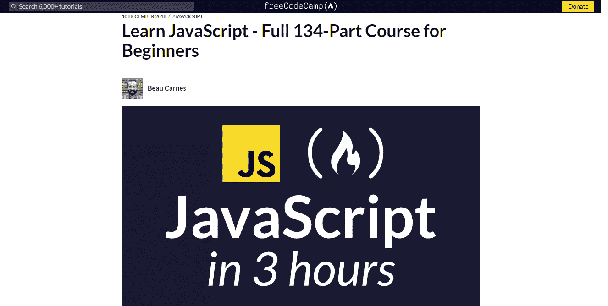

2.协同作战

毫无疑问，学习一门编程语言可能会很复杂。这就是为什么 [CodeCombat](https://codecombat.com/) 推出了一个让你在玩游戏中学习编程的课程。使用这种独特的教学方法，学习过程将会既有趣又快速。

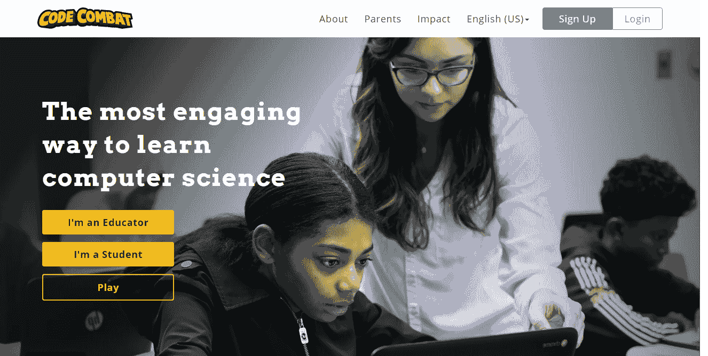

3.代码学校

[代码学校](https://www.pluralsight.com/codeschool)让你免费学习编程。该教程是互动和有趣的，并为您提供标志，徽章和交叉水平，每次你完成了课程。这让学生在学习编码时保持动力。

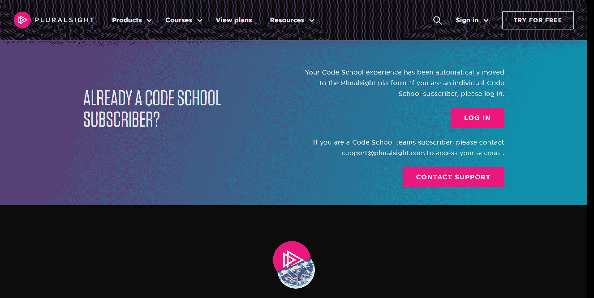

# 包扎

学习几种语言为程序员提供了许多优势，从更多的职业机会到更高的收入潜力和更令人兴奋的项目。然而，你的最终目标不应该是成为你看到的每一种语言的专家。这几乎是不可能的，也不会有多大好处。精通一种语言，然后熟悉另一种语言是学习编程的最好方法。遵循这种方法会使你的知识更深刻，而学习的道路更简单。

**元描述**

你是刚踏入 web 开发的第一步，就想学编程吗？发现学习多种编程语言的好处。