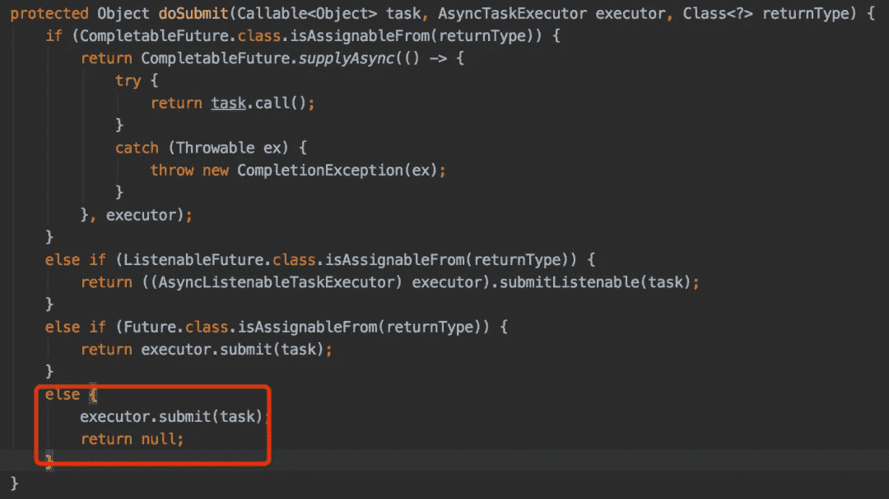

# Java 并发编程中最常见的错误

> 原文：<https://levelup.gitconnected.com/the-most-common-bugs-in-java-concurrent-programming-498d33330423>

并发编程注意事项

照片由 [Rowan Heuvel](https://unsplash.com/@insolitus?utm_source=medium&utm_medium=referral) 在 [Unsplash](https://unsplash.com?utm_source=medium&utm_medium=referral) 上拍摄

对于从事后端开发的同学来说，并发编程一定很熟悉。

说实话，java 的并发编程是一个很难的部分，至少我是这么认为的。不仅更难理解，使用起来也更容易出现 bug。

今天，我将和大家分享一些并发编程中最常见的 bug。希望对你有帮助。

**ThreadLocal 已用完，未清除。**

在 Java 中有很多技术可以保证线程安全。可以使用`synchronized`、`Lock`等关键字锁定代码块。

但是它们有一个共同的特点，就是加锁会对代码的性能有一定的损失。

事实上，《JDK》中还提供了另一种观点，即:`exchange space for time`。

没错，使用`ThreadLocal`类就是这种思路的具体体现。

`ThreadLocal`为每个使用该变量的线程提供一个独立的变量副本，这样每个线程都可以独立地改变自己的副本，而不会影响其他线程的相应副本。

`ThreadLocal`的用法大致是这样的:

1.  首先创建一个 CurrentUser 类，它包含 ThreadLocal 的逻辑。

2.在业务代码中调用 CurrentUser 类。

在业务代码的第一行，将`userInfo`对象设置为`CurrentUser`，这样在业务代码中，就可以通过`CurrentUser.get()`获取刚刚设置的`userInfo`对象。

尤其是当业务代码的调用层次比较深的时候，这种用法非常有用，可以减少很多不必要的参数传递。

然而，在高并发场景中，这段代码存在一个问题。数据只存储在`ThreadLocal`中，数据用完后没有及时清理。

即使`ThreadLocal`使用了`WeakReference`，也可能存在内存泄漏问题，因为只有 key 在 entry 对象中被设置为弱引用，而`value`没有。

那么，如何解决这个问题呢？

解决方法很简单，调用`finally`块中的 remove 方法清理无用数据即可。

**自旋锁浪费 CPU 资源，引发 bug。**

在并发编程中，自旋锁想必大家都很熟悉。

自旋锁的一个非常经典的使用场景是 CAS(即比较交换)，这是一种无锁的思想(说白了就是使用了无限循环)，用来解决高并发场景下的数据更新问题。

`atomic`包下的很多类，比如`AtomicInteger`、`AtomicLong`、`AtomicBoolean`等。，是用 CAS 实现的。

让我们以`AtomicInteger`类为例，它的`incrementAndGet`并不是每次都给变量加 1。

它的底层是用自旋锁实现的:

在`do…while`无限循环中，不断进行数据的比较和交换。如果一直失败，就会一直重试。

在高并发的情况下，`compareAndSwapInt`会大概率失效，从而导致 CPU 不断旋转，严重浪费 CPU 资源。

那么，如果这个问题被解决了呢？

解决方法是使用`LockSupport`类的`parkNanos`方法。

当 CAS 失败时，调用`LockSupport`类的`parkNanos`方法休眠，相当于调用`Thread.Sleep`方法。

这样可以有效减少频繁旋转造成的 CPU 资源过度浪费的问题。

**对**的陷阱`[**@Async**](http://twitter.com/Async)`对**的注解。**

在 Java 并发编程中实现异步函数之前，通常需要使用线程或线程池。

线程池的底层也使用线程。

要实现一个线程，要么继承`Thread`类，要么实现`Runnable`接口，然后在`run`方法中编写具体的业务逻辑代码。

`Spring`开发者为了简化这种异步操作，已经帮我们封装了异步功能。

`Spring`提供了`@Async`注释，通过它我们可以启用异步功能，使用起来非常方便。

1.  将`@EnableAsync`注释添加到`SpringBoot`的启动类。

2.向需要执行异步调用的业务方法添加`@Async`注释。

3.在`controller`方法中调用这个业务方法。

这将启用异步功能。

容易吗？

但是有一个坏消息:用 `@Async`注释启用的异步函数将调用`AsyncExecutionAspectSupport`类的`doSubmit`方法。

默认情况下，将遵循`else`逻辑。

else 逻辑最终将调用`doExecute`方法:

如果您使用`@Async`注释来启用异步函数，这将导致一个问题，默认情况下，每次都会创建一个新线程。

在高并发情况下，可能会生成大量线程，从而导致 OOM 问题。

建议您不要忘记在通过`@Async`注释启用异步功能时定义一个线程池。

**使用默认线程池。**

我们都知道 JDK1.5 之后提供了`ThreadPoolExecutor`类，可以用来自定义线程池。

线程池有许多好处，例如:

*   减少资源消耗，避免频繁创建和销毁线程，可以直接重用现有线程。
*   提供速度，任务来了之后，因为线程已经存在，可以直接使用。
*   提高线程的可管理性。线程是非常宝贵的资源。如果创建过多的线程，不仅会消耗系统资源，甚至会影响系统的稳定性。
*   使用线程池，可以非常方便地创建、管理和监控线程。

当然，JDK 专门提供了`Executors`类供我们更方便地使用，它可以快速地为我们创建一个线程池。

这个类包含许多静态方法:

*   `newCachedThreadPool`:创建可缓冲的线程。如果线程池的大小超过处理需要，它可以灵活地回收空闲线程。如果没有回收，则创建一个新线程。
*   `newFixedThreadPool`:创建一个固定大小的线程池。如果任务的数量超过了线程池的大小，多余的任务将被放入队列中。
*   `newScheduledThreadPool`:创建一个固定大小的线程池，可以执行定时的周期性任务。
*   `newSingleThreadExecutor`:创建一个只有一个线程的线程池，保证所有任务按顺序安装执行。

在高并发场景下，如果使用这些静态方法创建线程池，会出现一些问题。

所以，我们来看看到底有什么问题。

*   `newFixedThreadPool`:允许请求的队列长度为整数。MAX_VALUE，可能会累积大量请求，导致 OOM。
*   `newSingleThreadExecutor`:请求允许的队列长度是整数。MAX_VALUE，可能会累积大量请求，导致 OOM。
*   `newCachedThreadPool`:允许创建的线程数为整数。MAX_VALUE，可能会创建大量线程，导致 OOM。

那么我们该怎么办呢？

建议先用`ThreadPoolExecutor`类，我们自定义线程池。

具体代码如下:

顺便说一句，如果是一些低并发的场景，使用 Executors 类创建线程池也不是不可以，在所有场景中使用也不是不可以。

在这些低并发场景下，很难出现 OOM 问题，需要根据实际业务场景进行选择。

**HashMap 导致内存溢出。**

在实际工作场景中，`HashMap`的使用频率相当高，比如:接收参数、缓存数据、汇总数据等。

但是如果在多线程环境下使用`HashMap`，可能会导致非常严重的后果。

成员变量`HashMap`在`HashMapService`类中定义，数据被添加到`add`方法中的`HashMap`中。

调用`controller`层的`interface`中的`add`方法会使用 tomcat 的线程池来处理请求，相当于在多线程场景下调用`add`方法。

在 JDK1.7 中，HashMap 使用的数据结构是`array + linked list`。

如果在多线程的情况下继续向 HashMap 添加数据，它会调用`resize`方法进行扩展。

将元素复制到新数组时，此方法使用头插入方法，这在某些情况下会导致链表中出现无限循环。

无限循环的最终结果会导致**内存溢出**。

另外，如果 HashMap 中有很多数据，那么链表就会很长。在搜索一个元素时，需要遍历一个链表，查询效率不是很高。

为此，在 JDK1.8 之后，HashMap 的数据结构改为**数组+链表+红黑树**。

如果同一个数组元素中的数据项少于 8 个，则仍然使用链表来保存数据。如果超过 8 棵，会自动转换成红黑树。

为什么要用红黑树？

因为链表的时间复杂度为`O(n)`，红黑树的时间复杂度为`O(logn)`，红黑树的复杂度优于链表。

既然如此，为什么不用红黑树呢？

因为树节点占用的存储空间是链表节点的两倍，所以在节点较少的情况下，红黑树在时间复杂度上略优于链表。

但由于红黑树占用的空间较大，综合考虑 HashMap 后，认为在节点数较少的情况下，使用占用存储空间较多的红黑树并不划算。

JDK1.8 中的 HashMap 不会出现无限循环？

错了，它在多线程环境下还是有无限循环的。

在扩展过程中，链表转换成树时，for 循环无法跳出，导致无限循环。

那么，如果想在多线程环境中使用 HashMap 呢？

答案是用`ConcurrentHashMap`。

**忘记解锁。**

在 Java 中，除了使用`synchronized`关键字来锁定我们需要的代码块，我们还可以使用`Lock`关键字来锁定。

使用`synchronized`关键字锁定后，如果程序执行完毕，或者程序异常，锁定会自动解除。

但是，如果使用`Lock`关键字进行锁定，开发者需要在代码中手动解除锁定。

代码首先创建一个`ReentrantLock`类的实例对象`rLock`，并调用它的 lock 方法来锁定。然后执行业务代码，最后调用`finally`代码块中的`unlock`方法。

但是如果您不通过调用`finally`块中的`unlock`方法来手动释放锁，线程持有的锁将不会被释放。

**程序死锁。**

死锁可能是大家都不希望遇到的问题因为一旦程序在没有外力的情况下出现死锁，程序就会因为资源竞争而一直处于假死状态。

死锁示例代码如下:

当线程获得 OBJECT_1 锁时，它不释放锁，然后申请 OBJECT_2 锁。

这时另一个线程获取了 OBJECT_2 锁，没有释放锁去申请 OBJECT_1 锁。

由于 OBJECT_1 和 OBJECT_2 锁都没有释放，两个线程会一起请求，陷入无限循环，即出现死锁情况。

那么如果避免了死锁问题呢？

***# 1。缩小锁的范围。***

死锁情况可能是由于锁范围如上所述太大造成的。

那么，解决方案就是缩小锁的范围。

在获取 OBJECT_1 锁的代码块中，不包括获取 OBJECT_2 锁的代码。

同时，用于获取 OBJECT_2 锁的代码块不包含用于获取 OBJECT_1 锁的代码。

***# 2。锁的保证顺序。***

在死锁的情况下，线程获取锁的顺序是 OBJECT_1 和 OBJECT_2。

另一个线程以相反的顺序获取锁:OBJECT_2 和 OBJECT_1。

那么，如果能保证每次获取锁的顺序都一样，就不会出现死锁问题。

两个线程，每个线程先获取 OBJECT_1 锁，再获取 OBJECT_2 锁。

**SimpleDateFormat 不是线程安全的。**

在 Java8 之前，我们通常使用 SimpleDateFormat 类来格式化时间。例如:

如果你真的这么写，那也没关系。

但是，如果有一天你觉得 dateFormat 是一段固定的代码，你就应该把它提取出来作为一个常量。

因此，将代码更改为以下内容:

`dateFormat`对象被定义为一个静态常量，这样它可以被所有对象共享。

如果只有一个线程调用`time`方法也没有问题。

但是，`Serivce`类的方法经常被`Controller`类调用，控制器类的接口方法被 Tomcat 线程池调用。

换句话说，多个线程可能调用同一个控制器类的同一个方法，也就是多个线程可能同时调用`time`方法。

`time`方法调用`SimpleDateFormat`类的`parse`方法。

这个方法将调用`establish`方法。

步骤 1、2 和 3 是非原子操作。

但是如果`cal`对象是局部变量，那就好了，但是不好了。当`parse`方法调用`establish`方法时，传入的`calendar`是`SimpleDateFormat`类的父类`DateFormat`的成员变量。

这样可能会有多个线程同时修改同一个对象:`dateFormat`，同一个成员变量:`Calendar`值。

这样，可能会发生一个线程设置了时间，而被其他线程修改，导致时间错误。

那么，如何解决这个问题呢？

*   `SimpleDateFormat`类的对象不应该被定义为静态的，而是可以被改变为方法的局部变量。
*   使用`ThreadLocal`保存`SimpleDateFormat`类的数据。
*   使用 Java8 的`DateTimeFormatter`类。

**双重检查锁定漏洞。**

单身模式更多的出现在实际工作或面试中。

我们都知道有两种类型的单例模式:饥饿模式和懒惰模式。

饥饿模式代码如下:

使用饥饿模式的好处是:没有线程安全问题，但缺点也很明显。

对象在开始时被实例化。如果实例化过程非常耗时，最后没有用到对象，岂不是浪费资源？

这时候你可能会想，不需要提前实例化对象，可以等实际使用的时候再实例化吗？

这就是我接下来要讲的:懒惰模式。

示例中的`INSTANCE`对象开始时为空，只有在调用`getInstance`方法时才会被实例化。

嗯，还不错。但是这段代码仍然存在一个问题。

如果有多个线程调用`getInstance`方法，那么当它们都到达`if (INSTANCE == null)`判断时，可能同时建立，因为`INSTANCE`初始化时默认值为`null`。

这将导致在多个线程中同时创建`INSTANCE`对象，即多次创建`INSTANCE`对象，违背了只创建一个`INSTANCE`对象的初衷。

为了解决饿模式和懒模式各自的问题，有了`double-checked lock`。

需要在`synchronized`前后对 null 进行两次求值。

但我要告诉你的是:这段代码有问题。

这个`getInstance`方法的代码，我是按照`1, 2, 3, 4, and 5`的顺序写的，我希望按照这个顺序执行。

但是 Java 虚拟机实际上会做一些优化，重新安排一些代码指令。重排后的顺序可能会变成:`1, 3, 2, 4, 5`，这样在多线程的情况下也会创建多个实例。重新排列后的代码可能如下所示:

原来如此，有什么解决办法？

答:可以在`INSTANCE`的定义中加入`volatile`关键字。具体代码如下:

`volatile`关键字可以保证多线程的可见性但不保证原子性，也可以禁止指令重排序。

与直接锁定相比，双重检查锁定机制不仅确保了线程安全，还提高了执行效率并节省了内存空间。

**`**volatile**`**的原子性导致 bug。****

**前面我们已经知道`volatile`是一个非常好的关键字，它可以保证多线程中变量的可见性，它也可以禁止指令重排，但是它不能保证原子性。**

**可见性主要体现在:一个线程修改一个变量，另一个线程每次都能得到该变量的最新值。**

**让我们来看看错误的例子:**

**在上面的代码中，`VolatileTest`是 Thread 类的一个子类。其成员变量`stopFlag`默认为`false`，在其`run`方法中修改为`true`。**

**然后在 main 方法的`main`线程中，使用`vt.isStopFlag()`方法进行判断，如果其值为`true`，则打印`stop`关键字。**

**那么，如何修改`stopFlag`的值，并通过主线程中的`vt.isStopFlag()`方法获取最新值呢？**

**正确的例子如下:**

**使用 volatile 关键字修改`stopFlag`。**

**下面重点介绍 volatile 的原子性。**

**用多线程给`count`加 1，代码如下:**

**每次执行结果不一样，但可以肯定的是每次计数值都小于 20000，比如`19999`。**

**在这个例子中，`count`是一个成员变量。虽然定义为`volatile`，但是`add`方法中的`count++`是非原子操作。在多线程环境中，数据可能会有问题。**

**可见`volatile`并不能保证原子性。**

**那么，如何解决这个问题呢？**

**答案是使用`synchronized`关键字。**

**修改后的代码如下:**

**感谢您阅读这篇文章。**

**敬请关注更多内容。**

# **分级编码**

**感谢您成为我们社区的一员！在你离开之前:**

*   **👏为故事鼓掌，跟着作者走👉**
*   **📰查看[升级编码出版物](https://levelup.gitconnected.com/?utm_source=pub&utm_medium=post)中的更多内容**
*   **🔔关注我们:[Twitter](https://twitter.com/gitconnected)|[LinkedIn](https://www.linkedin.com/company/gitconnected)|[时事通讯](https://newsletter.levelup.dev)**

**🚀👉 [**加入升级人才集体，找到一份神奇的工作**](https://jobs.levelup.dev/talent/welcome?referral=true)**