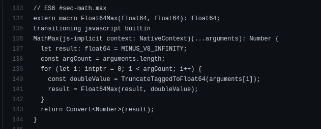
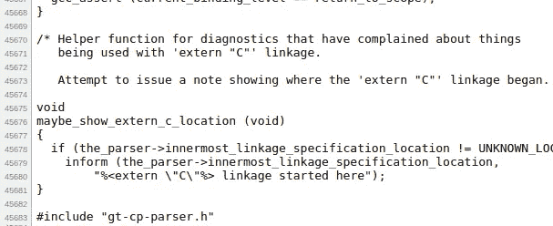
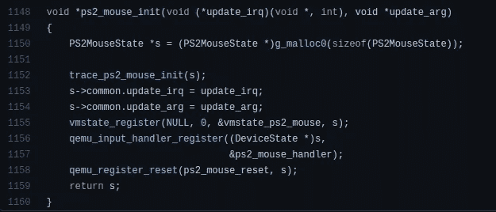
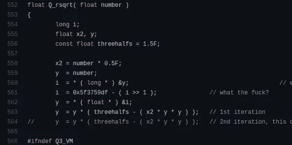
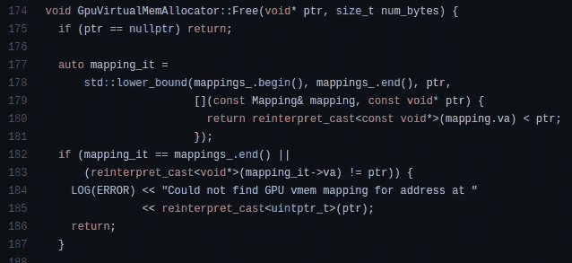
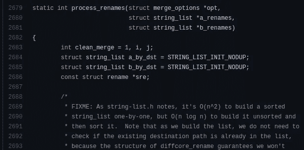

# 最复杂的开源项目

> 原文：<https://levelup.gitconnected.com/the-most-complex-open-source-projects-c3a0d04b1249>

## 令人印象深刻的开源代码库，每个开发人员都应该努力理解

照片由[亚历山大·德比耶夫](https://unsplash.com/@alexkixa?utm_source=unsplash&utm_medium=referral&utm_content=creditCopyText)在 [Unsplash](https://unsplash.com/s/photos/hardware?utm_source=unsplash&utm_medium=referral&utm_content=creditCopyText)

开发人员发起并开发各种项目。许多开发人员试图通过将他们的资源库发布到 GitHub 来开放这些项目的源代码。开源软件开发是当今的一种趋势，因为它有很多优点。例如，这是围绕项目建立用户社区的好方法。有各种各样的开源项目。有些项目很简单，有些项目具有中等复杂程度。同时，有些项目非常复杂，这些项目解决了用户或开发人员面临的关键问题。

当我有空闲时间时，我通常会浏览 GitHub 仓库，以了解流行的开源项目是如何工作的。当我检查一个特定的源代码时，我最大的爱好是通过深入每个模块来找出每个组件是如何连接的。例如，我正在检查 ECMAScript 的`Math.max()`方法在 Chromium 中的实现。我开始浏览 v8 JavaScript 引擎的源代码。然后我意识到他们使用一种叫做 [Torque](https://v8.dev/docs/torque) 的定制语言来实现 ECMAScript 定义。下面的代码是`Math.max()`方法的扭矩实现。

ECMAScript Math.max()方法在 v8 中的实现。作者截图。

之后，我看了看基于汇编的`Float64Max`方法的实现。V8 的源代码有点容易理解。我在浏览 GitHub 资源库时发现了以下复杂的开源项目。这些项目解决了令人印象深刻的问题，但背后有非常复杂的代码。

# GNU 编译器集合

GNU 编译器集合(GCC)为类 Unix 操作系统提供了一套编译器。它最初是由理查德·斯托尔曼为开发 GNU/Linux 操作系统而开发的。现在，GCC 也可以为 Windows、Android 和 macOS 编译代码。它支持不同的编程语言，如 C、C++、Go、Fortran、Ada、D 和 Objective C/C++。根据维基百科，这个项目在 2019 年有近 1500 万代码行。GCC 源代码非常复杂，因为它包含许多编程语言的解析器，以及许多指令集架构的代码生成器。

GCC 的源代码遵循更加程序化和基于模块的代码结构。因此，我们可以看到有大量代码行的源文件。例如，C++解析器有 45683 行代码。GitHub 不会在网络浏览器上渲染这个文件。

GNC C++解析器有 45683 行代码。作者截图。

# QEMU

QEMU(也称为 **Q** uick **Emu** lator)是一个用 c 编写的免费开源硬件虚拟化器/仿真器，QEMU 类似于 VirtualBox 项目，允许用户安装各种客户操作系统。QEMU 最初是由法布里斯·贝拉开发的，他发起了 FFmpeg 和 Tiny C 编译器项目。在 KVM 管理程序模块的帮助下，它比 VirtualBox 和 Linux 上的其他模拟器性能更好。QEMU 可以通过与 KVM 协同工作获得接近本机的性能——因为 KVM 允许 QEMU 直接在主机 CPU 上执行客户指令。

计算机硬件仿真通常提供客户操作系统所期望的内容。例如，如果特定的客户操作系统需要执行基本的 I/O 操作，仿真器通过提供虚拟化的硬件接口来满足需求。因此，QEMU 的源代码包含非常复杂的硬件相关代码。参见下面的虚拟 PS/2 鼠标初始化代码。

QEMU 的虚拟 PS/2 鼠标初始化代码。作者截图。

# 雷神之锤 3 竞技场

过去，游戏开发者为电脑游戏从头开始制作游戏引擎。换句话说，他们在游戏开发过程中创建了自己的渲染实现。如今，开发者可以利用现有的游戏引擎，如虚幻引擎或 Unity，轻松制作任何复杂的游戏。这些游戏引擎提供了许多预先构建的游戏组件。早期的硬件组件有限，不像今天。因此，游戏开发者不得不编写高度优化的代码，以满足大多数计算机用户的需求。

雷神之锤 III 竞技场是 id Software 于 1999 年开发的一款以第一人称射击为主的多人 3D 游戏。这款游戏的源代码于 2012 年发布到 GitHub 中。源代码包含了 *id Tech 3* 游戏引擎的实现——他们用它作为游戏渲染过程的核心。id Tech 3 引擎实现非常复杂的数学函数。例如，下面的平方根倒数实现非常快，但是很难理解。

Quake III 上的快速平方根倒数实现。作者截图。

# 张量流

如果我们从零开始实现一切，机器学习无疑是艰难和耗时的。机器学习库和框架提供了解决机器学习问题所需的 API。因此，机器学习工程师可以在这些库/框架之上构建他们的模型。之后，他们可以将他们的模型与 web APIs 或软件集成。Tensorflow 是一个免费开源的机器学习框架，最初由谷歌大脑团队开发。Tensorflow 广泛用于医疗保健、电子商务和社交网络领域的真实场景。

Tensorflow core 是按照基于类的设计模式用 C++编写的。它提供了 C++和 Python 语言的机器学习 API。Tensorflow Python API 在数据科学家和机器学习工程师中非常受欢迎。Tensorflow 的源代码充满了机器学习概念、数学和各种 API 操作。多种计算设备的支持(CPU、GPU 和 [TPU](https://en.wikipedia.org/wiki/Tensor_Processing_Unit) )使得项目更加复杂。此外，还有几个类别:Tensorflow.js、Tensorflow Lite、Tensorflow Extended 和 typical Tensorflow。

Tensorflow GPU 运行时代码的一部分。作者截图。

# 饭桶

Git 是一个软件项目的分布式版本控制系统。Linus Torvalds 最初开发 Git 是为了 Linux 内核源代码的版本控制目的。Git 是用 C 写的，一些 GUI 部分也是用 [Tcl/Tk](https://en.wikipedia.org/wiki/Tcl) 做的。它激励开发人员进行非线性开发。换句话说，开发人员可以轻松地处理同一代码库的多个状态。如今，Git 驱动了世界上几乎所有的协作软件项目。

Git 内部使用散列和数据结构相关的概念。它使用树形数据结构来链接提交对象。此外，它在创建树节点时使用散列法。Git 项目处理非常复杂的树算法和字符串操作。此外，它遵循了 C 的旧式过程化设计模式。我们总是看到冗长的算法 C 函数调用 Git 源代码中的其他 C 函数。Git 源代码需要高于平均水平的算法知识和耐心来理解每个模块中到底发生了什么。

Git 中逻辑复杂的长函数的例子(来自递归合并策略)。作者截图。

# 分级编码

感谢您成为我们社区的一员！[订阅我们的 YouTube 频道](https://www.youtube.com/channel/UC3v9kBR_ab4UHXXdknz8Fbg?sub_confirmation=1)或者加入 [**Skilled.dev 编码面试课程**](https://skilled.dev/) 。

 [## 编写面试问题+获得开发工作

### 掌握编码面试的过程

技术开发](https://skilled.dev)