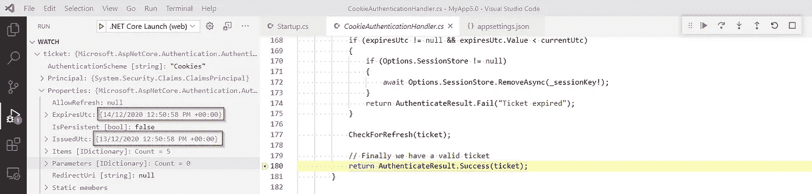

# ASP.NET 核心 3.1 & 5 中会话超时之谜

> 原文：<https://levelup.gitconnected.com/the-mystery-of-session-timeout-in-asp-net-core-3-1-5-70bb854fe168>


https://pixabay.com/images/id-2910951/

## 一点历史和怀旧

嗯，我怀念过去的日子，那时一切都很简单，没有太多的方法来完成某项任务。现在，有很多图书馆在做类似的事情。大多数软件应用程序涉及许多抽象层，这些抽象层应该使事情变得简单，并促进不重新发明轮子的概念。

我最近将. NET Core 3.1 web 应用程序升级到了。净 5。升级本身非常简单明了。升级后，有一些警告说 **Azure AD** 认证库已经过时，应该由**微软取代。Identity.Web** 。

好吧，没什么大不了的。让我们开始吧。切换新库也很容易，但之后我开始注意到用户会话没有像以前那样过期。不清楚发生了什么变化或者根本原因是什么。可能是升级到。NET 5 或微软的**。Identity.Web** 。我不知道，并希望深入了解是什么控制会话超时/持续时间，以及如果默认设置不适合我的应用程序要求，如何调整它。

在过去快乐的日子里，检查或调整会话超时是`web.config`中的一行代码，但现在它变得更加复杂。

```
<system.web>
    <sessionState mode="InProc" timeout="20"></sessionState>
</system.web>
```

会话状态通常存储在服务器在身份验证过程中创建的 cookie 中，然后发送到浏览器。这个 cookie 有几个比特的信息，一个比特是时间戳，告诉会话何时到期。还有滑动过期因素，但让我们忽略它，当没有滑动过期时，我们的讨论集中在会话超时上。

## Azure AD 家政服务

是时候接触一些代码了，因为我非常喜欢边做边学。我将要研究的应用程序使用 Azure AD 对用户进行身份验证。您将需要一个 Azure AD 实例来为我们将创建的应用程序创建应用程序注册。

按照**步骤 1:注册您的应用程序****部分的[这个微软文档页面](https://docs.microsoft.com/en-us/azure/active-directory/develop/quickstart-v2-aspnet-core-webapp)创建一个应用程序注册。**

****P.S.** 最新版本的 VS 代码使用端口 5001 服务。NET 核心 web 应用程序。所以建议将上述指南中的任何端口引用更改为 5001。**

**请注意以下事项:**

*   **域名(可能看起来像`some-domain@onmicrosoft.com`)。在 Azure 广告概览页面中，它将是标题为“租户信息”的框中的主要域。**
*   **租户 Id(这是您的 Azure AD 实例的唯一标识符)**
*   **应用程序 Id**

## **创造。网芯 3.1 应用**

**您需要最新版本的 VS Code plus。NET 3.1 & 5 SDKs。如果你的电脑上还没有这些软件，谷歌搜索会帮助你下载并安装它们。本文中概述的步骤是针对 Windows 机器的，但我想说它们在 Linux 或 Mac 上的工作应该是差不多的。**

**打开一个新的终端窗口，运行下面的程序来引导一个. NET Core 3.1 应用程序，它通过 Azure AD 的认证。用您自己设置的值替换方括号中的值。**

```
dotnet new mvc --auth SingleOrg --domain [DOMAIN-NAME] --tenant-id  [TENTANT-ID] --client-id [CLIENT-ID]--framework netcoreapp3.1 --language C# --name MyApp3.1
```

**使用 VS 代码打开新创建的名为 **MyApp3.1** 的文件夹，点击 Ctrl+F5 运行 web 应用程序。如果 VS 代码提示选择环境类型，选择**。网芯**。如果事情按预期进行，你将被自动重定向到 Azure 广告登录屏幕。为 Azure AD 实例中的任何用户提供有效凭据，您将被重定向到应用程序主页。**

****

**你可以在这里阅读更多关于 OAuth2 和隐性资助流[的内容。为了简单起见，我们只需要知道，一旦用户通过 Azure AD 的身份验证，就会在](https://docs.microsoft.com/en-us/azure/active-directory/develop/v2-oauth2-implicit-grant-flow?WT.mc_id=Portal-Microsoft_AAD_RegisteredApps)[https://localhost:5001/sign in-oidc](https://localhost:5001/signin-oidc)触发一个表单 post，其中提交的表单数据包含一个 ID 令牌和一些额外的验证字段。您可以使用浏览器开发工具来检查这个网络调用。**

****

**复制 **id_token** 表单字段的值，并在 [https://jwt.io](https://jwt.io) 上解码**

****

**上面的模糊字段分别包含您的 Azure AD 应用客户端 Id 和租户 Id。然后有三个时间戳。前两个是在“发布”时间和“不在之前”时间令牌。两者具有相同的值，比实际令牌发布时间早 5 分钟。我猜这是为了解决全球不同机器上的时钟差异。**

**名为“exp”的最终时间戳是令牌的到期时间。在我们的例子中，这是令牌发布时间之后的一个小时(忽略 5 分钟的事情)。**

**我们在这里得到了第一点信息。Azure AD id 令牌(使用默认配置)有一个小时的过期时间。记住这个事实，因为我们很快就会用到它。**

**答。使用 Azure AD 进行身份验证的 NET Core 3.1 web 应用程序对 **Microsoft 有一个 nuget 依赖项。AspNetCore . authentic ation . azuread . ui**。这个图书馆是同一个图书馆的一部分。GitHub 上的 NET Core 回购。请记住这一点。**

****

## **设置 VS 代码以单步执行外部代码**

**。NET Core 是一项在 GitHub 上开发的开源技术，拥有令人惊叹的社区和工具。有一个很酷的特性可以帮助我们，那就是使用微软符号服务器单步执行框架代码的能力。要启用该功能，请按如下方式编辑`.vscode/launch.json`文件。更多细节请看[这里](https://devblogs.microsoft.com/dotnet/improving-debug-time-productivity-with-source-link/#visual-studio-code)。**

****

**现在点击 F5(不是 Ctrl+F5)以调试模式启动应用程序。一切都应该像以前一样工作，但是您将在调试控制台窗口中看到许多行，显示从 Microsoft 参考服务器下载文件，或者如果已经从以前的调试会话下载了文件，则从本地文件夹加载文件。也要有耐心，加载所有依赖项需要一点时间，但投资回报是值得的。**

****

**在深入研究源代码之前，让我们在浏览器中检查会话 cookie。加载并登录应用程序后，打开浏览器开发工具(通常按 F12 即可)。切换到应用程序选项卡，展开侧菜单中的 Cookies 链接，然后单击带有我们的应用程序 URL 的行。**

****

**有两个 cookies，一个用于用户会话信息，一个用于 Azure 应用洞察。会话 cookie 没有显式的过期/最长期限属性。这是一个会话 cookie，而不是一个[持久/永久 cookie](https://developer.mozilla.org/en-US/docs/Web/HTTP/Cookies) 。如果浏览器关闭，它将被删除。如果浏览器保持打开，关于会话何时到期的信息被注入到 cookie 内容中，但是是以只有服务器可读的加密形式。**

## **检查会话 cookie 的内容**

**如果会话仍处于打开状态，请按 Shift+F5 停止调试会话。现在在 VS 代码中打开调试窗口，并在`CookieAuthenticationHandler`类构造函数上添加一个断点。当您将鼠标悬停在断点部分时，可以通过单击出现的+号来添加断点。**

****

**我发现将某个类强制加载到调试器会话中是一个很好的技巧。现在点击 F5，让我们开始调试。**

**应该命中断点。恭喜你，你可以单步进入 ASP.NET 核心源代码，自己研究东西，甚至在同一个类的其他行上应用其他断点。**

****

**我可以就此打住，让你来做回溯，戴上夏洛克·福尔摩斯的帽子，但我愿意和你一起继续这段旅程。在同一个文件中，搜索包含此内容的行，并在其上放置一个断点。**

```
return AuthenticateResult.Success(ticket);
```

**添加这个断点可以使用传统的方法，单击行号的左边，然后按 F5 键继续。第二个断点将被命中，我们可以在手表中添加`ticket`变量来检查它。**

****

**很好，我们可以看到会话 cookie 的所有原始细节(假设用户已经过身份验证)并检查各个值。会话超时不再是一个谜，您可以确定会话超时的确切值，它是上面检查的票证变量的`ExpiresAt`属性。一旦您意识到真正的会话超时值，您就可以更深入地挖掘并理解它为什么有这个特定值。如果您就此打住，确切地知道应用程序应该如何运行仍然是有价值的。**

> **由于 HTTP 管道的复杂性、多个移动部分以及身份验证过程中如此多的抽象层，可能很难仅从文档或在线资源中判断某个应用程序的会话超时值应该是多少。当使用不同的身份验证方法(如 Identity Server 或)时，可以使用这里概述的方法。NET Core 内置身份识别功能。**

## **解释一小时的课程**

**让我们继续使用相同的调试器技术，并尝试理解为什么会话持续一个小时。我猜你可能认为这与从 Azure AD 收到的 id 令牌的持续时间有关。**

**你是 100%正确的，但是让我们证明它。从现在开始，我会变得不那么啰嗦。**

**如果当前调试会话仍处于打开状态，则停止该会话，并添加以下新断点:**

*   **`AzureADOpenIdConnectOptionsConfiguration`的构造函数然后一旦命中就在`Options.UseTokenLifetime = true;`行添加一个断点**
*   **`OpenIdConnectHandler` 的构造函数然后在以`private ClaimsPrincipal ValidateToken`开始的行上添加一个断点**

**我将解释您通常会从调试会话中得到什么。**微软。AspNetCore . authentic ation . azuread . ui**库(是 ASP.NET 核心回购的一部分)将名为 **UseTokenLifetime** 的 **OpenID Connect** 配置选项设置为 true **。**此标志指示 cookie 管道获取 id 令牌持续时间，并使用它来控制会话持续时间。**

****

**`OpenIdConnectHandler`类中的`ValidateToken`方法检查 **UseTokenLifetime** 属性，如果为真，它会将属性包(稍后用于控制会话持续时间)中的值设置为从身份提供者(在我们的示例中为 Azure AD)检索的 id 令牌的持续时间。**

****

**这解释了在. NET Core 3.1 web 应用程序中使用 Azure AD 时一个小时的会话持续时间。**

## **正在升级到。网络 5**

**现在，假设我们想使用闪亮的玩具并升级到。NET 5，并将 Azure 广告认证库升级到最新版本。该项目将编译，但我们会得到一些警告。AspNetCore . authentic ation . azuread . ui 已经过时，我们应该升级到**微软。Identity.Web** 实际上是在 ASP.NET 核心回购协议之外托管的。**

****

**我们可以继续调整代码来进行升级，但我们也可以使用`dotnet new`命令，选择 ASP.NET 5 模板，该模板带有对**微软的 nuget 引用。Identity.Web** 并具有所需的管道设置。**

**在终端窗口中运行下面的代码片段，它与前面的运行非常相似，但是具有不同的项目名称和目标框架。**

```
dotnet new mvc --auth SingleOrg --domain [DOMAIN-NAME] --tenant-id  [TENTANT-ID] --client-id [CLIENT-ID]--framework **net5.0** --language C# --name **MyApp5.0**
```

**从 VS 代码运行新的 web 应用程序，并确保它像以前一样通过 Azure AD 验证。网芯 3.1 app。**

****

**您可以验证项目文件是否引用了。NET 5 目标框架和 **Microsoft.Identity.Web.****

****

## **升级后的应用程序的会话持续时间是多长？**

**您可以使用与。NET Core 3.1 应用程序来查找会话持续时间。NET 5 app。**

****

****惊喜！****

**会话持续时间现在是 14 天。这与最初的一小时会议有很大的不同。但是为什么呢？是不是和……NET 5 或由于对**Microsoft . identity . web .**的更改**

**不幸的是**微软。Identity.Web** 不属于。NET Core repo，因此它的调试信息可能在 Microsoft Symbol 服务器上不可用。不过，它是开源的，我们可以在本地提取回购协议进行检查，或者直接在 GitHub 上检查源代码。**

**[https://github . com/AzureAD/Microsoft-identity-web/blob/00 bb 0a 87 f 7 c 4583 B3 C4 aed 7763 FBA 019209 c22e 6/src/Microsoft。identity . Web/webapp extensions/microsoftidentitywebappauthenticationbuilderextensions . cs # L408](https://github.com/AzureAD/microsoft-identity-web/blob/00bb0a87f7c4583b3c4aed7763fba019209c22e6/src/Microsoft.Identity.Web/WebAppExtensions/MicrosoftIdentityWebAppAuthenticationBuilderExtensions.cs#L408)**

****

****UseTokenLifetime** 不是被初始化为硬编码的 true，而是被初始化为源自另一个名为**Microsoft identity options**的类的值，该类继承自 **OpenIdConnectOptions。**似乎除非显式设置该值，否则它将默认为布尔变量的默认值，即 false。**

****

**好的，这意味着会话持续时间不再与 id 令牌到期挂钩。那么，现在是什么在控制它呢？**

**在默认配置中，有一个用于设置 cookie 身份验证选项的类，它将 cookie 的到期时间默认设置为 14 天。**

****

**这用于指定到期值，该值将在以后分配给会话 cookie 到期属性，因此将会话持续时间设置为 14 天(请记住，我忽略了滑动到期，尽管它默认为 true)。**

****

## **我们被困在 14 天了吗？**

**不，我们可以将会话持续时间调整为对用例有意义的任何值。假设会话持续时间应该是一天。在引导身份验证管道时，我们可以使用另一个重载来为会话持续时间或滑动过期等设置设置自定义值。**

****

**如果您现在检查会话 cookie，它应该会反映上述更改。**

****

**我不确定旧的 Azure 广告认证库是否有类似的工具来调整会话超时或什么。实际上自从我升级到。微软。Identity.Web ，我不需要尝试调整旧的库。**

## **包裹**

**有时文档在某些方面不是很明显，或者库/框架在短时间内变化很快。因此，关注在线资源可能会造成混乱，而不是有所帮助。在本文中，我希望我已经阐明了 ASP.NET 核心应用程序中如何控制会话超时，以及如果您想 100%确定幕后发生了什么，如何排除故障或调查低级应用程序行为。**

**我认为有某种方法可以为像**微软这样的库包含调试符号。但是那是另一天的挑战。****

## **进一步阅读**

*   **[https://www . cloud identity . com/blog/2016/07/25/controlling-a-web-apps-session-duration-2/](https://www.cloudidentity.com/blog/2016/07/25/controlling-a-web-apps-session-duration-2/)**
*   **[https://github.com/aspnet/Security/issues/147](https://github.com/aspnet/Security/issues/147)**
*   **[https://github . com/aspnet/Security/issues/1177 # issue comment-294162446](https://github.com/aspnet/Security/issues/1177#issuecomment-294162446)**