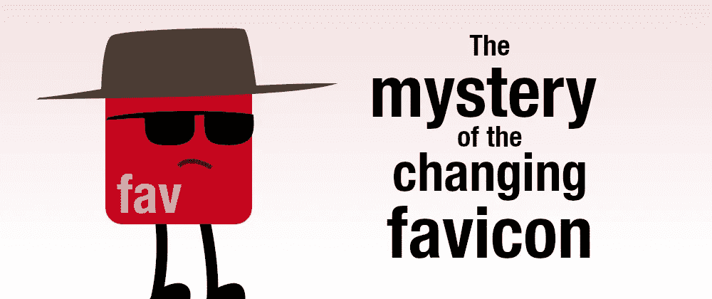
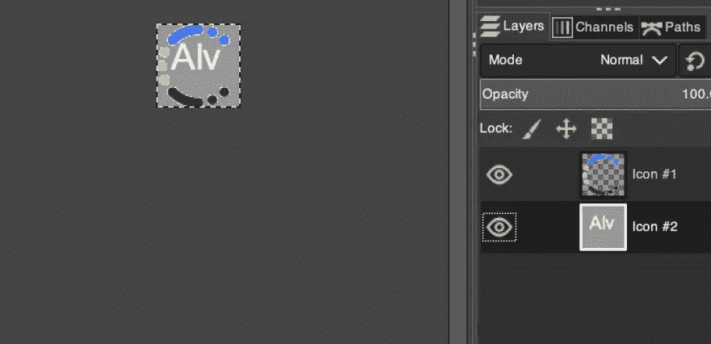
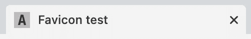
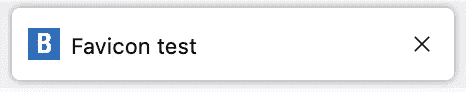

# 变化中的 Favicon 之谜

> 原文：<https://levelup.gitconnected.com/the-mystery-of-the-changing-favicon-33628b485392>



## 一个 favicon 的问题如何突出了一个浏览器的错误(或者可能是一个功能)

昨天在工作中，另一名开发人员向我提出了一个问题。对话是这样进行的(带有一些艺术许可):

*戴夫*:嘿，阿尔瓦罗！我们有麻烦了。
我:什么事？
*Dev* :网站上的 favicon 是错的。这不是公司的标志。
*我*:什么？
*Dev* :是。这不是我们的标志…这是你的名字！
*我*:什么？？？？
*Dev*:*显示屏幕*
*Me*:…
*Dev*:…
*Me*:哦，****！

一清二楚，但我不敢相信自己的眼睛:这是我们的网站，标题是正确的，只是标签上显示的 favicon 没有公司的标志，而是字母“Alv”(来自阿尔瓦罗？)我刷新了又刷新，心想也许是什么恶作剧。但事实并非如此。

> *注:为了避免问题，我删除了网站名称和徽标的截图。在文章的底部有一个小例子来重现通用图标的问题。*

令人困惑的是:**根据浏览器的不同，图标的工作方式也不同。Chrome 和 Safari 显示了正确的 favicon** (带有公司标志)**，而 Firefox 显示了完全不同的标志**(带有一些字母。)并且我们仔细检查了文件是相同的，而不是旧的缓存版本。这是完全相同的文件…但它是不同的。

幸运的是，只花了几分钟就弄清楚发生了什么(并解决了问题。)但我必须承认，这是我最近见过的最奇怪的问题之一。

我们下载了 favicon.ico 文件，并在图像编辑器中打开了它，然后我们看到了问题的根本原因:



的。ico 文件中有多个层(或图标)。顶层(第一个图标)是 Chrome 和 Safari 显示的，底层(最后一个图标)是 Firefox 显示的。

我们甚至进行了一项测试来验证这一点。我们交换了图层的顺序，保存了文件……所有浏览器中的图标都变了！现在 Chrome 有了 Alv 图标(顶层),而 Firefox 有了公司标志(底层)。)

浏览器忽略了透明胶片。这个问题不是堆叠层的问题，而是包含多个图标的. ico 文件，而浏览器选择了一个(且仅一个)图标。正如 Bramus 在 Twitter 上建议的那样:

找出错误的原因后，解决方法变得简单了:**从。ico 文件并保存**。问题(和谜团)解决了。

但为什么是字母“Alv”？最初，我们用一个虚拟图标进行测试。当我们得到公司的标志时，我们把它放在图像编辑器上面的一个层中，并隐藏了测试层。但是**即使图层被隐藏，当我们保存时，它仍然被导出**作为图标的一部分！

我不知道我们是否可以将 Firefox 的行为视为 bug 或功能。但这变成了一个有趣的谜题。

# 重现问题

当地看到了什么问题？在你的计算机上创建一个这样的 HTML 文件(简单的东西，你甚至不需要`<body>`的内容):

```
<!doctype html>
<html>
  <head>
    <title>Favicon test</title>
    <link rel="icon" href="./favicon.ico" />
  </head>
  <body>
    <h1>favicon test</h1>
    <p>The favicon has two layers and it is 
    displayed differently by the browsers.</p>
  </body>
</html>
```

然后创建一个 favicon.ico 文件，里面有两个图层/图标。我用 GIMP 创建了这个文件，添加了两个 64x64 的图层，如下所示:

> 注意:如果你手边没有图像编辑器，你可以从我的网站下载一个[版本的 favicon.ico](https://alvaromontoro.com/images/blog/favicon.ico) 。


然后保存为. ico，放在与 HTML 文件相同的文件夹中。就是这样。你的演示已经可以测试了。在 Chrome 上打开页面，标签会是这样的:



在 Firefox 中打开时，标签看起来会有所不同:



你可以给图标添加更多的层，但结果始终是一样的:Chrome 和 Safari 会选择最上面的一层显示为 favicon，Firefox 会选择最后一层。

*原载于 2022 年 1 月 25 日 https://alvaromontoro.com**[*。*](https://alvaromontoro.com/blog/67996/the-mystery-of-the-changing-favicon)*