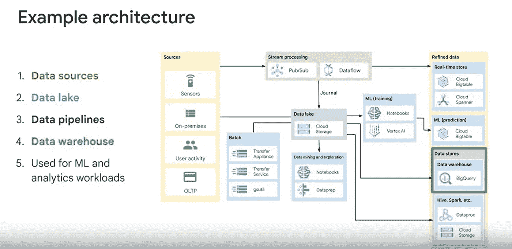

# *神话般的现代数据堆栈

> 原文：<https://levelup.gitconnected.com/the-mythical-modern-data-stack-f213586a2dc0>

## 我的寻找失败了，就像我寻找终极煎饼一样

马蒂亚斯·鲁曼在 [Unsplash](https://unsplash.com?utm_source=medium&utm_medium=referral) 上拍摄的照片

> “现代数据堆栈包含数据管道、目的地、转换层和商业智能/数据可视化平台”——[five tran](https://www.fivetran.com/blog/what-is-the-modern-data-stack)

我阅读了现代数据栈(MDS)上的每一篇文章，听了一些播客、youtube 视频，并得出结论

> 每个人对现代数据堆栈都有自己的定义

我读到过云、自助服务分析、ELT 和数据湖、新人角色、数据即产品、数据域和网格等各种信息。像 FiveTran 这样的一些供应商写得更广泛，还有一些博客。

下面我把它抽出来我的解读(我的艺术性怎么样？).显而易见的问题是**这与旧的/ *遗留*数据堆栈有什么不同？让我们探索一下:**

Doug Foo 由我的[画板](https://sketchboard.me/) skillz 提供

# 主要差异

## 科技已经改变了:

1.  它是基于云的**,因此可为您灵活扩展和管理——专注于业务价值，而不是基础架构升级(永远不可能，但会让我们更接近)**
2.  ****预建的连接器**与平台一起提供，也可以通过预设计的输出模式轻松连接到100 多个系统**
3.  ****数据湖位于**接收和转换之间，许多新的 ETL 工具利用低代码/无代码向导，而不是定制编码(有些工具比以前需要更多的编码)**
4.  ****升级功能**，如托管平台附带的流、流程编排和元数据管理**

## **但它不仅仅是技术:**

1.  ****数据文化** —迈向[数据驱动的组织](https://www.oreilly.com/library/view/creating-a-data-driven/9781491916902/)，自上而下和自下而上都有不同的思维模式和角色**
2.  ****流程** —将数据管理孤岛分解为[个数据域](https://www.oreilly.com/library/view/data-mesh/9781492092384/ch04.html)，并将数据视为一种产品——开放、有文档记录的高质量核心资产**
3.  ****自助服务** —使用新技术(数据湖+笔记本电脑)开放数据和新的数据文化—使用户能够建立自己的见解，并用真实数据进行实验**

# **我们如何到达那里？**

****

**不要绝望，即使没有塔斯和凯斯你也能做到**

**作为一个管理过几十个甚至几百个遗留系统和过程的从业者，我同意“现代化”在保持事物运转之后是一种奢侈。以下是思考这一旅程的几个关键步骤:**

*   ****同意原型** — C 级支持至关重要，大多数人不会在没有试点的情况下押注农场。获得支持并下注——对结果保持乐观。但是不要担心，大多数预测/承诺都被夸大了，你的预测/承诺也会被夸大。**
*   ****尽快上云**——云就像大学性爱，不像青少年性爱，每个人都真的在做。如果你还没有上云，那就太落后了，幸运的是，AWS、GCP 和 Azure 有成千上万的免费顾问随时为你服务。**
*   **构建数据湖 —听起来很大一个不可告人的秘密是，数据湖通常只是一个云文件系统。理清数据流、结构、元数据和安全性是关键——但是想想敏捷，为你的原型加载数据，然后发展其余的。**
*   ****试用新工具** —尝试云原生摄取和转换工具。供应商总是愿意为您构建演示。在云上，这些费用很低，而且通常有免费试用期。**
*   ****了解总成本(TCO)** —迁移遗留工具的一个关键方法是承诺节约成本。推翻 ETL 和 DW 的既定领导并不容易——使用(成本)数据、您的原型(实验)来实践数据驱动的思维模式，以提出数据驱动的迁移提案。**
*   **尽管我讨厌销售，但它是成功的关键。启用用户(自助服务)，构建社区，宣传新工具的力量，并(过度)宣传您的原型的成功。只有当足够多的人玩这个游戏时，创建一个富有洞察力的开放平台才是一个游戏改变者。**

**给你一句我们在五川和 DBT 的朋友的话:**

> **“我们最初计划将我们的数据源引入现有的 SQL Server 仓库。这将需要三个人在两年内的努力，而且仅仅是让我们在两个月内达到[MDS]的目标，就要花费大约 600 万兰特[约 40 万美元]。”— [点火组](https://www.fivetran.com/blog/a-modern-data-stack-improves-analytics-in-seven-key-ways)**

**我从参加在线课程[利用 GCP 实现数据湖和数据仓库的现代化](https://www.coursera.org/learn/data-lakes-data-warehouses-gcp/home/welcome)中获得的一些随机快照有助于您直观地了解现代化的发展:**

****

**coursera——数据湖如何融入图片 pt1**

****

**coursera——数据湖如何融入图片 pt2**

****

**coursera——数据湖如何融入图片 pt3**

**现在回到我寻找完美早餐煎饼的话题上来。**

# **参考**

1.  **[https://www.fivetran.com/blog/what-is-the-modern-data-stack](https://www.fivetran.com/blog/what-is-the-modern-data-stack)**
2.  **[https://medium . com/coriers/what-the-modern-data-stack-and-why-you-need-to-the-it-cd41c 0033944](https://medium.com/coriers/what-is-the-modern-data-stack-and-why-you-need-to-migrate-to-the-it-cd41c0033944)**
3.  **[https://towards data science . com/data-domains-and-data-products-64c c9d 28283 e](https://towardsdatascience.com/data-domains-and-data-products-64cc9d28283e)**
4.  **[https://www . theseattledataguy . com/why-migrate-to-the-modern-data-stack-and-where-to-start/# page-content](https://www.theseattledataguy.com/why-migrate-to-the-modern-data-stack-and-where-to-start/#page-content)**
5.  **[https://towards data science . com/the-beginners-guide-to-the-modern-data-stack-D1 c 54 BD 1793 e](https://towardsdatascience.com/the-beginners-guide-to-the-modern-data-stack-d1c54bd1793e)**
6.  **[https://www . data engineering podcast . com/godata driven-modern-data-stack-episode-203/](https://www.dataengineeringpodcast.com/godatadriven-modern-data-stack-episode-203/)**
7.  **[https://blog.getdbt.com/future-of-the-modern-data-stack/](https://blog.getdbt.com/future-of-the-modern-data-stack/)**
8.  **[https://towards data science . com/the-future-of-the-modern-data-stack-2de 175 B3 c 809](https://towardsdatascience.com/the-future-of-the-modern-data-stack-2de175b3c809)**
9.  **[https://www . Gartner . com/smarterwithgartner/data-fabric-architecture 是实现数据管理和集成现代化的关键](https://www.gartner.com/smarterwithgartner/data-fabric-architecture-is-key-to-modernizing-data-management-and-integration)**
10.  **[https://www . Gartner . com/smarterwithgartner/how-data ops-amplified-data-and-analytics-business-value](https://www.gartner.com/smarterwithgartner/how-dataops-amplifies-data-and-analytics-business-value)**
11.  **[https://www.metabase.com/blog/The-Modern-Data-Stack/](https://www.metabase.com/blog/The-Modern-Data-Stack/)**
12.  **[https://www.mozartdata.com/post/data-stack](https://www.mozartdata.com/post/data-stack)**
13.  **[https://www . oreilly . com/library/view/data-mesh/9781492092384/ch04 . html](https://www.oreilly.com/library/view/data-mesh/9781492092384/ch04.html)**
14.  **[https://www . oreilly . com/library/view/creating-a-data-driven/9781491916902/](https://www.oreilly.com/library/view/creating-a-data-driven/9781491916902/)**