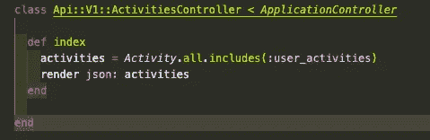

# N + 1 问题

> 原文：<https://levelup.gitconnected.com/the-n-1-problem-a8f66e3fcf54>

## 这是数学…但不是

提示—这是数据库问题！简·安东宁·科拉尔在 [Unsplash](/s/photos/database?utm_source=unsplash&utm_medium=referral&utm_content=creditCopyText) 上拍摄的照片

什么是 N + 1？为什么这是个问题？我发现这个问题需要一点极客潜水。首先，我觉得我需要多了解一点关系数据库和 SQL 查询。此外，我需要一个 ORMs(对象关系映射)的基本复习。让我们倒回去一点:

根据[马努·阿吉特·库玛尔](https://www.sitepoint.com/orm-ruby-introduction/)、*的说法，“一个 ORM 框架是用面向对象的语言(比如 Ruby、Python、PHP 等)编写的。)并包装在关系数据库中。对象类被映射到数据库中的数据表，对象实例被映射到这些表中的行。*

[关系数据库](https://aws.amazon.com/relational-database/)正如其名:*“关系数据库是数据项的集合，它们之间有预定义的关系……表中的每一列保存某种数据，一个字段存储属性的实际值。表中的行表示一个对象或实体的相关值的集合。表中的每一行都可以用一个被称为主键的唯一标识符来标记，并且多个表中的行可以使用外键来关联…”*

ORM 框架允许我们更容易地与(关系)数据库中的数据进行交互，反映了我们用各种属性实例化类实例的方式。活动记录就是这样一个 ORM 框架。它与 Ruby on Rails 一起“开箱即用”。活动记录的一大好处是它与许多不同的关系数据库兼容。根据马努·阿吉特·库玛尔的说法，以下是其他一些例子:

*   *数据表现为模型。*
*   *可以使用这些模型实现关联。*
*   *可以通过相关模型实现继承。*
*   *数据保存到数据库前的验证。*
*   *面向对象处理数据库操作的方式。*

另一个很大的优势是，活动记录接管了执行 SQL 查询的工作，更复杂的查询可能有点吓人(内连接…还是左外连接？？嗯，不用了，谢谢)。对于任何不“了解”SQL 的人来说，这里是通过我们在 W3 学校的朋友得到的描述:

*   SQL 代表结构化查询语言
*   SQL 允许你访问和操作数据库
*   SQL 在 1986 年成为美国国家标准协会(ANSI)的标准，并在 1987 年成为国际标准化组织(ISO)的标准

✴️注意:最基本的 SQL 命令实际上很容易也很有趣，W3Schools 为任何想尝试一下的人提供了一个很酷的互动教程。

所以。回到那个卑鄙的 N + 1 和它固有的…问题。如果我们有一个学生数据库，并且我们想要查询他们的成绩单历史，我们将有 N 个查询(每个学生= >他们的成绩单)，加上 1 个对`Student.all`的查询。如果学校很小(佛蒙特州的万宝路学院有 192 名学生注册*)，那么 Ruby 代码和相应的 SQL 查询可能是这样的:

`Student.all.map { |student| student.report_card }.flatten`

典型的 SQL 调用—小心 N + 1 问题…

在这种情况下，N = 192。这不太好，但也不可怕。但是佛罗里达中央大学拥有 59483 名学生。*当 N = 59，483 时…这是一个很大的查询量！我们总是希望最小化数据库查询的数量，以获得最佳的性能和页面加载。

令人高兴的是，Active Record 为我们提供了一个解决太多查询问题的简单方法:“ *Active Record 让您可以预先指定将要加载的所有关联。这可以通过指定* `*Model.find*` *调用的* `[*includes*](https://api.rubyonrails.org/v6.1.3/classes/ActiveRecord/QueryMethods.html#method-i-includes)` *方法来实现。使用* `*includes*` *，活动记录确保使用尽可能少的查询来加载所有指定的关联。”*

使用。包括时，Ruby 代码应该是这样的:`Student.includes(:report_cards).map { |student| student.report_card }.flatten`

并且只有两个相关的 SQL 查询。DB 优化！✅

没有 N + 1 问题

在幕后，Active Record 使用了一种叫做急切加载的技术。根据 [Ruby on Rails 指南](https://guides.rubyonrails.org/active_record_querying.html#eager-loading-associations) : *“急切加载是使用尽可能少的查询来加载* `*Model.find*` *返回的对象的关联记录的机制。”*如果你有兴趣了解更多幕后发生的事情，这里有一篇非常棒的文章,深入探讨了问题和解决方案，包括在我看来相当于时间复杂性的东西(线性时间！)进行 N + 1 SQL 查询，以及 Active Record 如何通过缓存数据来使用急切加载。

就我的目的而言，我很高兴知道我们为什么使用。包括在我们的 Rails 控制器中，用于“有很多东西”的类。使用。includes 将产生两个 SQL 查询，一个用于 Activity.all，另一个用于所有 user_activities。这里没有 N + 1 的问题！！

一个活动有 _many :user_activities

*学生数据来自《美国新闻与世界报道》

 [## 活动记录查询接口——Ruby on Rails 指南

### 活动记录查询界面本指南涵盖了使用活动记录从数据库中检索数据的不同方法

guides.rubyonrails.org](https://guides.rubyonrails.org/active_record_querying.html)  [## 可视化使用指南:包含在 Rails 中

### 如果您是开发 Rails 应用程序的新手，您可能会遇到术语 N + 1 查询。你可能也…

engineering.gusto.com](https://engineering.gusto.com/a-visual-guide-to-using-includes-in-rails/)  [## Ruby 中的 ORM:简介-站点点

### 任何有开发基于 web 的应用程序或使用 web 框架经验的人都处理过关系…

www.sitepoint.com](https://www.sitepoint.com/orm-ruby-introduction/)  [## SQL 简介

### SQL 是访问和操作数据库的标准语言。

www.w3schools.com](https://www.w3schools.com/sql/sql_intro.asp)