# 新的人工智能淘金热——跨维度机器学习(潘提供！)

> 原文：<https://levelup.gitconnected.com/the-new-ai-gold-rush-pan-provided-981c0f96e8e7>

## 使用混合纯 UMAP 和 HDBSCAN 挖掘高维流形中的数据财富和最优度量。


照片由 iStock 上的 [clearviewstock](https://www.istockphoto.com/portfolio/clearviewstock?mediatype=photography) 拍摄

# TLDR:

> **人工智能向前发展的巨大进步不会通过在**[**munged**](https://www.talend.com/resources/what-is-data-munging/)**/**[**wrangled**](https://www.talend.com/resources/data-wrangling/)**数据上直接应用 AI/ML/DL 工具来实现。而是通过整体应用最优的** [**度量**](https://arxiv.org/abs/1812.05944) **映射到** [**更高维的流形**](https://en.wikipedia.org/wiki/Classification_of_manifolds) **，随后应用适用的 AI/ML/DL 工具，用整个计算流水线在用例特定的** [**适应度函数**](https://en.wikipedia.org/wiki/Fitness_function) **的上下文中进行量化评估！**

[**UMAP**](https://arxiv.org/abs/1802.03426) 简称为降维流形学习技术。虽然在技术上是正确的，但它更适合作为一个 [**跨维度**](https://en.wiktionary.org/wiki/transdimensional) 流形学习工具。

**结合 [**HDBSCAN**](https://github.com/scikit-learn-contrib/hdbscan) 提供了强大的聚类工具。然而，对于实际使用情况，由于与它们的组合超参数相关联的非线性和不连续的结果空间，难以获得有用的结果。**

> **使用 [***混合-整齐***](https://github.com/afcarl/The-New-AI-Gold-Rush-Transdimensional-Machine-Learning) 来控制*&***hdb scan***超参数，其真实潜力对于实际用例变得显而易见。**并且为在更高维度流形中的最优度量上的跨维机器学习(TML)的实际实现打开了新的大门，用于 AI 嵌入、聚类、分类和回归用例。*****

***提供了一个 Jupyter 笔记本，其中包含相关 GitHub 存储库 [***中的数据代码，此处***](https://github.com/afcarl/The-New-AI-Gold-Rush-Transdimensional-Machine-Learning) 。***

# ***一个例子:***

***“数据”由从 200 多万张图表图像中收集的图像 RBG 像素数据组成，用于分段聚类的预期用例，以识别与各种图表特征相关联的像素。经验观察表明有(7)个图表特征要识别。因此，聚类问题被设计为最大化识别潜在图表特征的可能性。单独使用 UMAP，集群在 2D 和三维可视化，如下图所示。***

***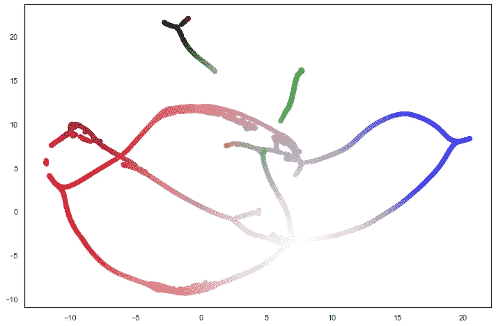******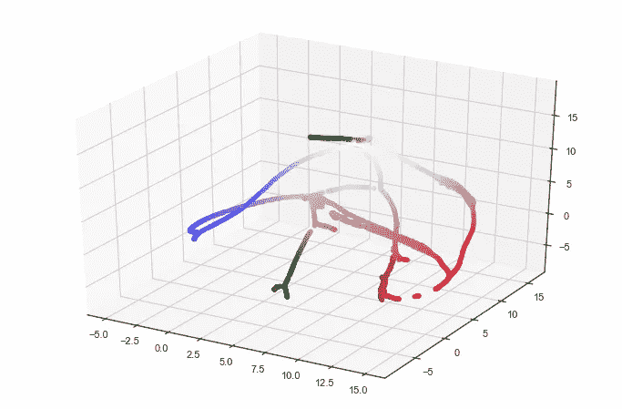***

> ******适应度计算****……(越高越好)……请参见 HDBSCAN* [***文档***](https://hdbscan.readthedocs.io/en/latest/api.html) *了解集群成员离群值 _scores_ & probabilities_。****

```
*clusterer_outlier_scores_sum_SE = np.square( ( 100.0 * clusterer.outlier_scores_ ) ).sum() / u_data.shape[0]clusterer_probabilities_sum_SE = np.square( 100.0 - ( 100.0 * clusterer.probabilities_ ) ).sum() / u_data.shape[0]clustered_COMB_SE_mean = clusterer_outlier_scores_sum_SE + clusterer_probabilities_sum_SEif ( num_clusters_found == 7 ):
    fitness = 10000.0 / abs( clustered_COMB_SE_mean + 1 )
elif ( num_clusters_found == 0 ):
    fitness = -99999.0
else:
    fitness = 10000.0 / abs( clustered_COMB_SE_mean + 1) — ( abs( num_clusters_found — 7 ) * 1000.0 )*
```

> ******UMAP/HDBSCAN 单独:*** *简单重复性测试(同样输入运行 100 倍)****注负适配度(图 1A & B)*****

***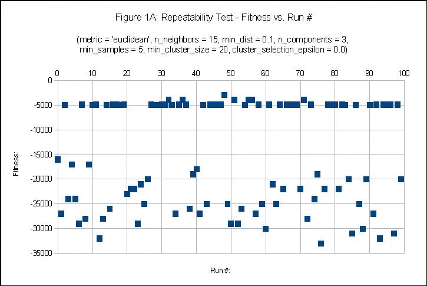******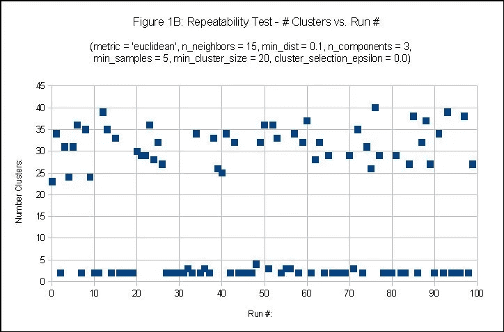***

> *****输入参数…输入参数定义参见****UMAP****[***文档***](https://umap-learn.readthedocs.io/en/latest/parameters.html) *。******

```
**fit = umap.UMAP(
    metric =       ***metric,***
    n_neighbors =  ***n_neighbors***,
    min_dist =     ***min_dist***,
    n_components = ***n_components*** )
***u_data*** = fit.fit_transform( ***data*** );**
```

> *****[***指标***](https://umap-learn.readthedocs.io/en/latest/parameters.html#metric) ***"参数研究:*** *(适应度&【聚类数 vs .指标)，****注负适应度(图 2A&B)……并非所有指标都是生而平等的！*******

****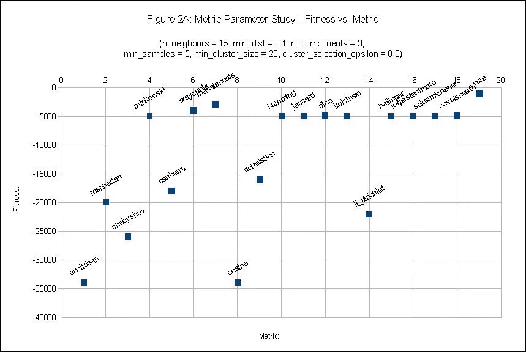********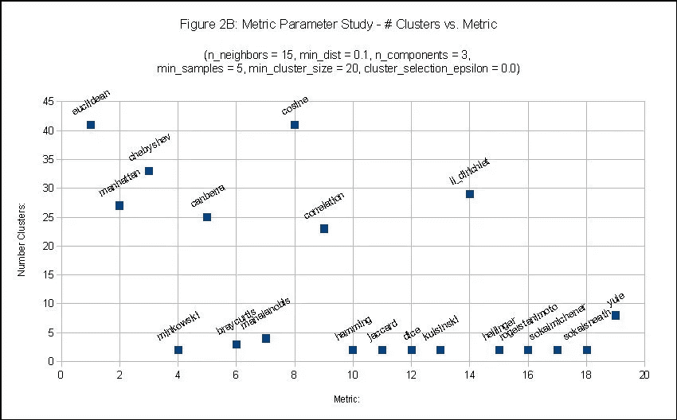****

> *******【UMAP】***[***N _ Neighbors***](https://umap-learn.readthedocs.io/en/latest/parameters.html#n_neighbors)***参数学习:*** *(适应度&【簇数 vs . N _ Neighbors】****注负适应度(图 3A & B)******

****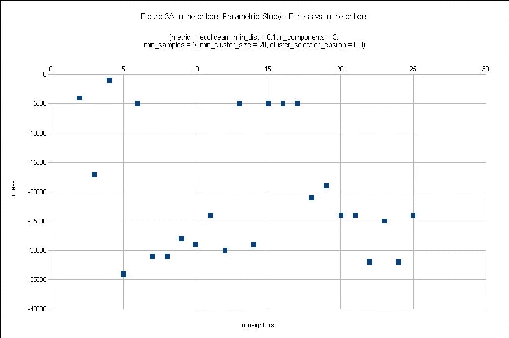********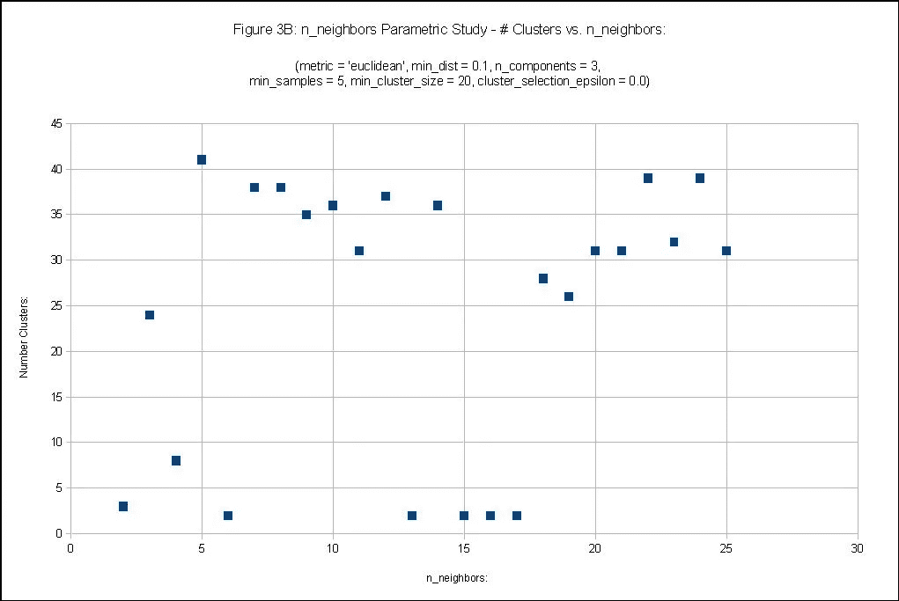****

> *******【UMAP】***[***Min _ Dist***](https://umap-learn.readthedocs.io/en/latest/parameters.html#min_dist)***参数学习:*** *(适应度&【簇数 vs . Min _ Dist】****注负适应度(图 4A & B)******

****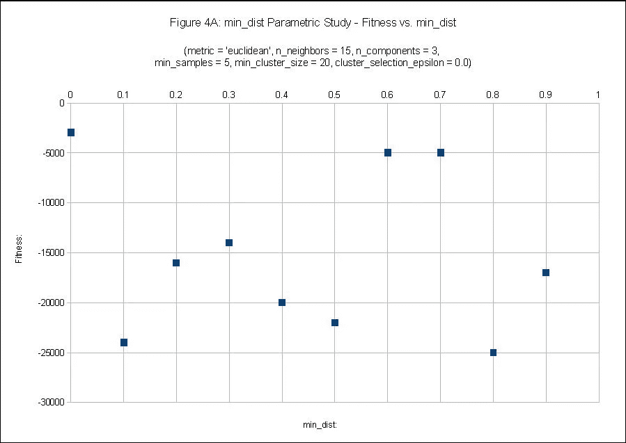********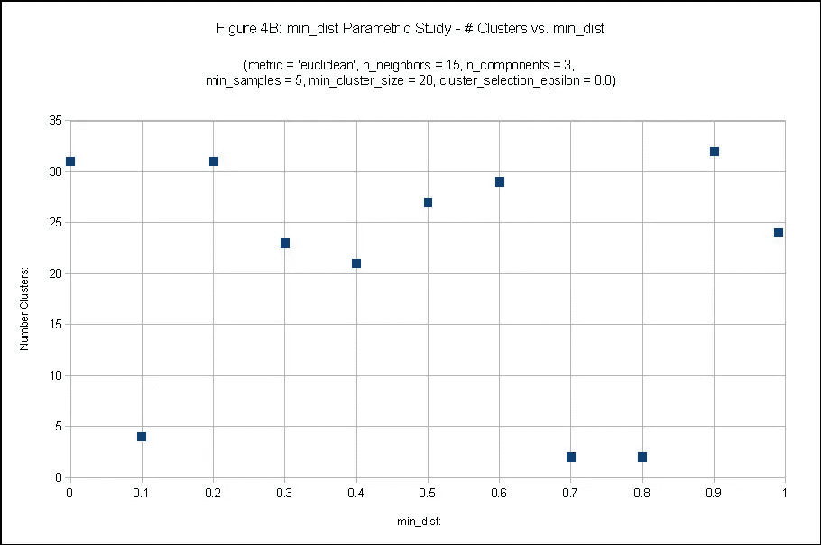****

> *******【UMAP】***[***N _ Components***](https://umap-learn.readthedocs.io/en/latest/parameters.html#n_components)***参数学习:*** *(适应度&# Clusters vs . N _ Components)****注负适应度(图 5A & B)******

****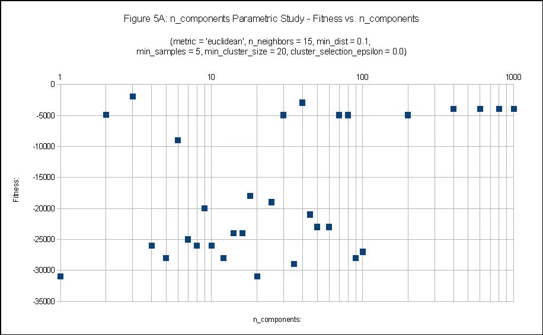********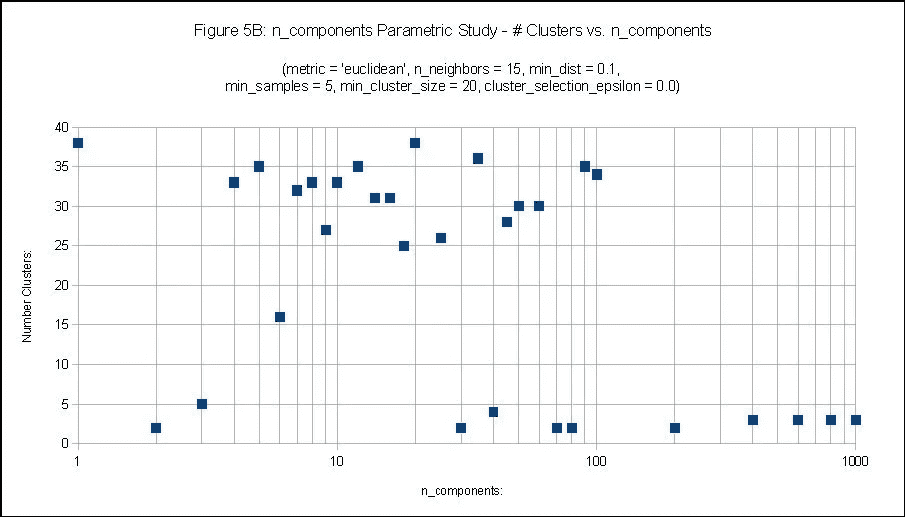****

> *******HDBSCAN*** *输入参数…输入参数定义参见****hdb scan****[***文档***](https://hdbscan.readthedocs.io/en/latest/parameter_selection.html) *。******

```
**hdbscan_labels = hdbscan.HDBSCAN( ***min_samples***, 
                                  ***min_cluster_size***,
                                  ***cluster_selection_epsilon*** ).fit_predict( ***u_data*** )**
```

> *******hdb scan "***[***Min _ Samples***](https://hdbscan.readthedocs.io/en/latest/parameter_selection.html#min_samples)***"参数学习:*** *(适应度&# Clusters vs .****注负适应度(图 6A & B)******

****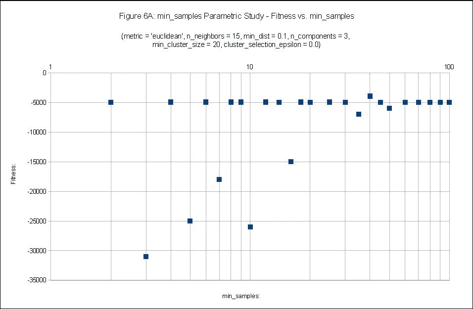********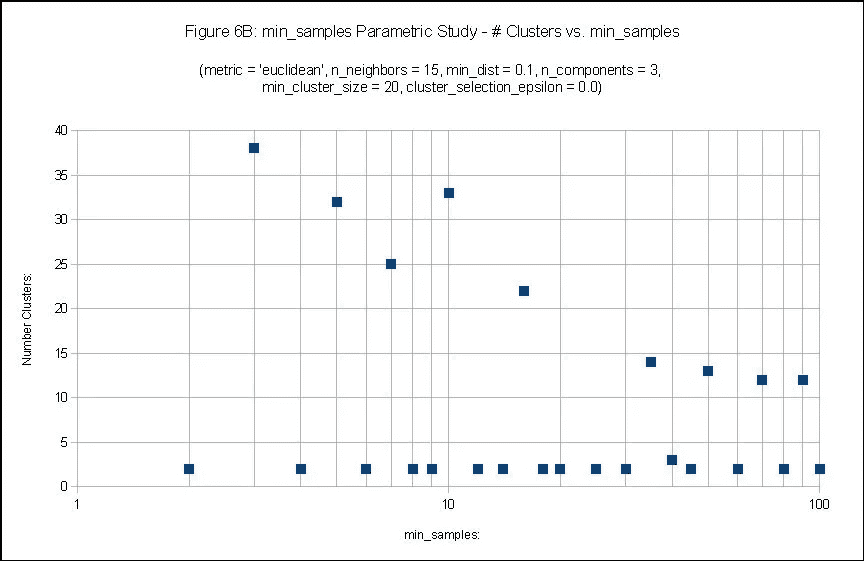****

> *******hdb scan "***[***Min _ Cluster _ Size***](https://hdbscan.readthedocs.io/en/latest/parameter_selection.html#min_cluster_size)***参数研究:*** *(适应度&【簇数 vs . Min _ Cluster _ Size】****注负适应度(图 7A & B)******

****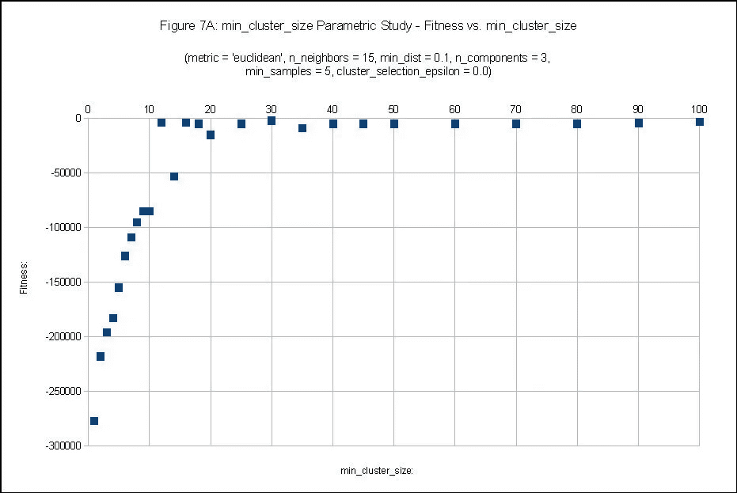********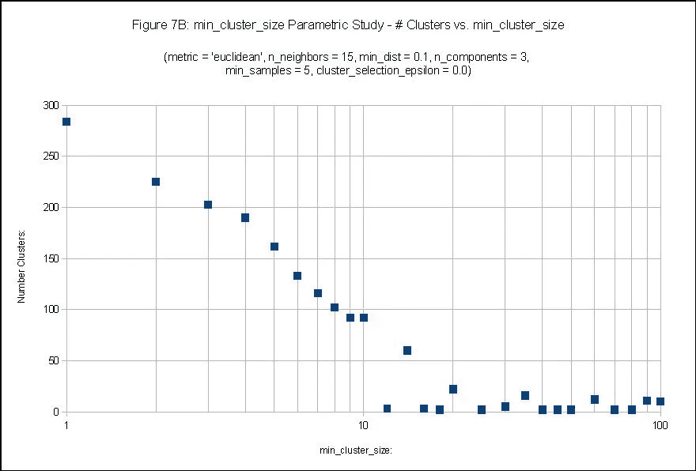****

> *******hdb scan "***[***Cluster _ Selection _ Epsilon***](https://hdbscan.readthedocs.io/en/latest/parameter_selection.html#cluster_selection_epsilon)***参数学习:*** *(适应度&【集群数 vs . Cluster _ Selection _ Epsilon】****注负适应度(图 8A & B)******

****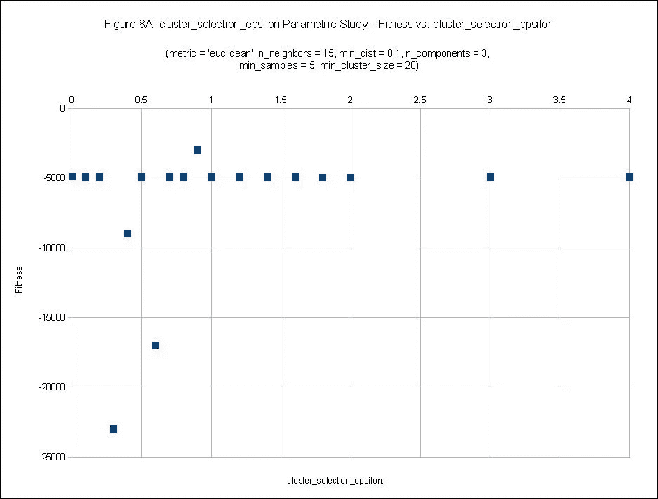********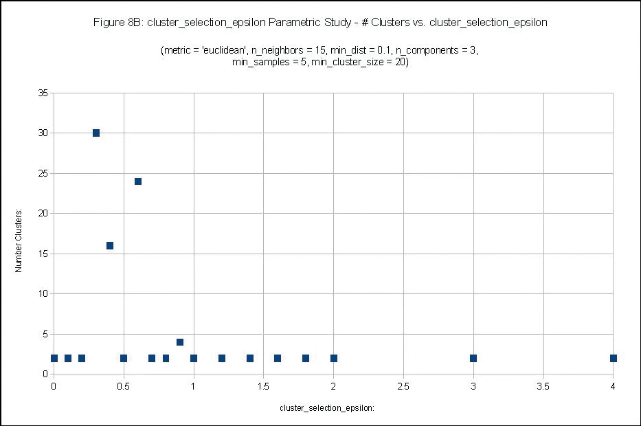****

# ******杂交-纯:******

****[**NEAT**](https://en.wikipedia.org/wiki/Neuroevolution_of_augmenting_topologies) 代表“ **N** 欧洲 **E** 进化的 **A** ugmenting **T** 拓扑”，由 Ken Stanley 于 2002 年在奥斯汀的德克萨斯大学开发。 **Hybrid-NEAT** 是 NEAT 的变体，它结合了局部搜索的元素，以帮助建立与给定基因组相关的最佳适应度，以及各种其他增强功能，以提高效率并减少与进化方法相关的评估计数。Hybrid-NEAT 的一个版本被合并到 Jupyter 笔记本中，包含在与本文 [***这里***](https://github.com/afcarl/The-New-AI-Gold-Rush-Transdimensional-Machine-Learning) 相关的 GitHub 资源库中。****

> *******齐*** *配置文件输入参数…*****

```
**#--- parameters for the UMAP/HDBSCAN/Hybrid-NEAT experiment ---#
[NEAT]
fitness_criterion = ***max***
fitness_threshold = 5000.0
***pop_size*** = 20…# network parameters
num_hidden = 1
num_inputs = 1
***num_outputs*** = 4…**
```

> *******整洁****【eval _ genome】功能……*****

```
**def eval_genome( genome_id , genome , config , winner_flag ):
...
    net = neat.nn.FeedForwardNetwork.create(genome, config)
    output = net.activate( neat_inputs )

    metric = “jaccard”

    # determine “n_neighbors”
    n_neighbors = int(round( ( output[ 0 ] * ( n_neighbors_max — n_neighbors_min ) + n_neighbors_min ),0))

    # determine “min_dist”
    min_dist = output[ 1 ] * ( min_dist_max — min_dist_min ) + min_dist_min

    # determine “n_components”
    n_components = int(round( ( output[ 2 ] * ( n_components_max — n_components_min ) + n_components_min ),0))

    # determine “min_samples”
    min_samples = int(round( ( output[ 3 ] * ( min_samples_max — min_samples_min ) + min_samples_min ),0))

    min_cluster_size = 2
...**
```

> *******Hybrid-NEAT w/UMAP&hdb scan:****最佳适应度轨迹 vs. N_Components = 1，2，3，10 & 100，****注正适应度(图 9)******

********

> *******Hybrid-NEAT w/UMAP&hdb scan:****最佳适应度轨迹 vs. N_Components = 1 比 1000，****注正适应度(图 10)******

****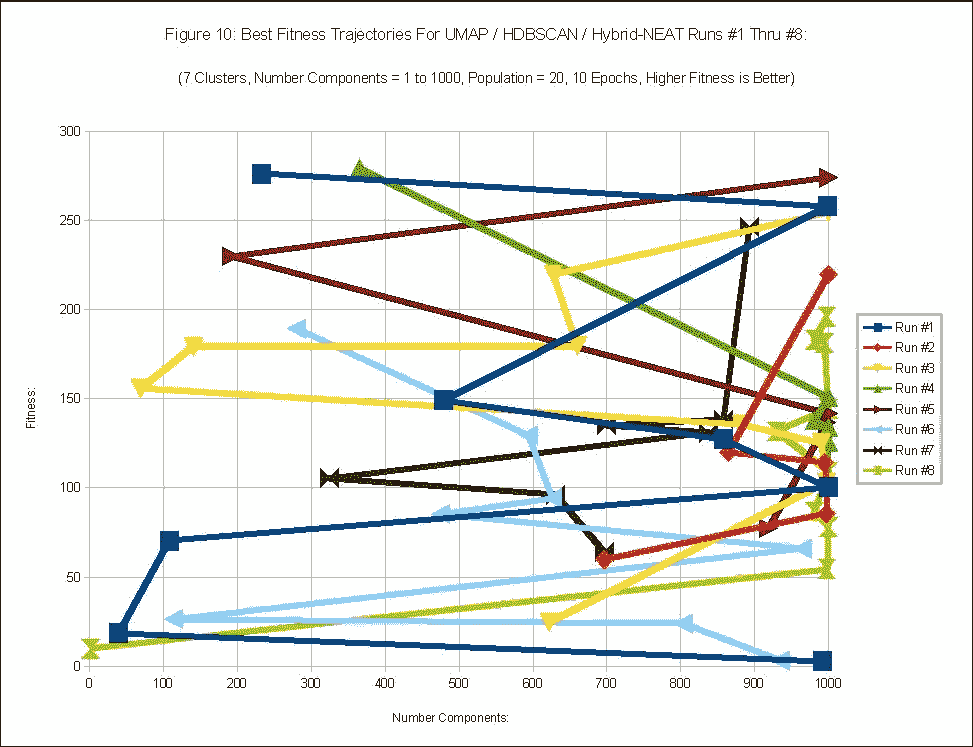****

# ****总结:****

*   *******并非所有指标都是平等的！*******
*   ****即使对于相同的数据，也有无限多的度量、高维流形和适应度函数的组合。对于您的特定使用情形，它们的性能各不相同！ ***使用 Hybrid-NEAT，您可以挖掘出最符合您的用例的结果！*******
*   ****适应度函数仅仅是预期用例的一个实施例。****
*   ****您可以创建自己独特的度量标准，以最大化您特定用例的适应度函数，并定量评估其有效性。****
*   ****要有创造性，跳出框框思考！****
*   ****[***Hybrid-NEAT***](https://github.com/afcarl/The-New-AI-Gold-Rush-Transdimensional-Machine-Learning)在具有挑战性的应用中提供了灵活性、控制性和健壮性，这些应用涉及实际现实世界用例中常见的非线性、不连续和非光滑可微的多维空间。****
*   *******UMAP & HDBSCAN 在与 Hybrid-NEAT 一起使用时，不仅仅是一个集群工具！*** 但可用作开发最佳 AI 嵌入的代理，数据集分离作为分类、回归或聚类用例的潜在前驱步骤。包括对所有 AI ML & DL 工具的输入。 ***只受限于你的集群和想象力的大小！*******
*   *******跨维度机器学习(TML)可以定义为整体应用视角查看数据、度量选择/创建、流形映射、AI/ML/DL 工具选择和适应度函数确定，仅由预期用例的细节驱动，更重要的是，与底层原始数据的维度和流形映射维度无关。*******

## ****灵感:****

*   ****[UMAP](https://github.com/lmcinnes/umap) ，利兰麦金尼斯****
*   ****利兰·麦金尼斯，约翰·希利，史蒂夫·阿斯特尔斯****
*   ****[整齐的](https://www.cs.ucf.edu/~kstanley/neat.html)，肯尼斯·斯坦利****
*   ****[UMAP 到底是怎么工作的](https://towardsdatascience.com/how-exactly-umap-works-13e3040e1668)，[尼古拉·奥斯卡尔科夫](https://medium.com/u/8570b484f56c?source=post_page-----981c0f96e8e7--------------------------------)****
*   ****[如何从零开始给 UMAP 编程](https://towardsdatascience.com/how-to-program-umap-from-scratch-e6eff67f55fe)，[尼古拉·奥斯科尔科夫](https://medium.com/u/8570b484f56c?source=post_page-----981c0f96e8e7--------------------------------)****
*   ****[如何在高维空间聚集](https://towardsdatascience.com/how-to-cluster-in-high-dimensions-4ef693bacc6)，[尼古拉·奥斯科尔科夫](https://medium.com/u/8570b484f56c?source=post_page-----981c0f96e8e7--------------------------------)****
*   ****[tSNE vs UMAP:全球格局](https://towardsdatascience.com/tsne-vs-umap-global-structure-4d8045acba17)，[尼古拉·奥斯科尔科夫](https://medium.com/u/8570b484f56c?source=post_page-----981c0f96e8e7--------------------------------)****
*   ****[为什么 UMAP 优于 tSNE](https://towardsdatascience.com/why-umap-is-superior-over-tsne-faa039c28e99) ，[尼古拉·奥斯卡尔科夫](https://medium.com/u/8570b484f56c?source=post_page-----981c0f96e8e7--------------------------------)****

# ****关于安德鲁(安迪)卡尔:****

****“GitHub AI 大脑中的大脑”和“GitHub 2 vec”NLP 生产力工具的热心开发者。一位充满激情的多学科航空航天机械工程师，在集成人工智能、混合强化机器学习( **Hybrid-NEAT** )、数据科学和基于混合强化学习的优化中的多学科模拟( **Hybrid-NEAT** )、复杂空中、空间和地面系统的设计和分析以及工程工具开发方面拥有丰富的经验。****

*   ****[安迪的《GitHub AI 脑中之脑》](https://2strikehitter.com/AI_BrainofBrains.html)****
*   ****[安迪的在线大脑](https://afcarl.github.io/)****
*   ****[安迪在领英上](https://www.linkedin.com/in/andrew-andy-carl-3875a310b/)****
*   ****[安迪在 GitHub 上](https://github.com/afcarl)****
*   ****安迪在电脑控制的棒球投球机上****