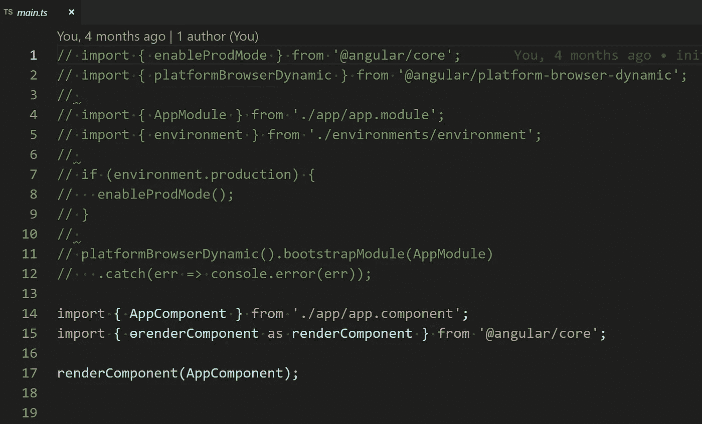

# 新的 Angular ivy 编译器终于可以在 Windows 上运行了！

> 原文：<https://levelup.gitconnected.com/the-new-angular-ivy-compiler-finally-works-on-windows-9042378cede0>

从@ angular/CLI[v 8 . 0 . 0-beta 7](https://github.com/angular/angular-cli/releases/tag/v8.0.0-beta.7)开始，你就可以开始在 Windows 上玩 ivy 了。

Ivy 是【Angular 的新模板编译器。将以 Angular 8 为 opt-in 发布[(不做任何改动的话老编译器还是默认)。](https://blog.angular.io/a-plan-for-version-8-0-and-ivy-b3318dfc19f7)

用常春藤做实验已经有一段时间了。但是，以前的版本与 Windows 不兼容，因为 Windows 与其他操作系统在路径处理上存在差异。在之前的一篇文章中，我解释了如何修改 ivy 使其在 windows 上工作。随着最新测试版的发布，这些修改不再是必要的，ivy 可以在 windows 上开箱即用。

因此，随着编译器现在开始工作，我想看看 Angular 团队是否在进一步减少 Angular hello world 应用程序的包大小方面也取得了一些进展。

我创建了两个新的应用程序，一个启用了 ivy，另一个使用了旧的编译器:

```
ng new hello-ivy --enable-ivy
ng new hello-noivy
```

然后我创建了两个项目的生产版本:

```
ng build --prod
```

最后，我比较了输出。

对于非 ivy 版本，输出如下所示:

```
λ ng build --prodDate: 2019-03-16T15:44:11.314Z
Hash: 3f201851d3ef95b52380
Time: 16435ms
chunk {0} runtime.741402d1d47331ce975c.js (runtime) 1.41 kB [entry] [rendered]
chunk {1} main.6b6e0d8c17e151758eb8.js (main) 151 kB [initial] [rendered]
chunk {2} polyfills.6b954c6c6f98cc7637ef.js (polyfills) 41 kB [initial] [rendered]
chunk {3} polyfills.es5.02b971644bb943e20a3f.js (polyfills.es5) 61.9 kB [initial] [rendered]
chunk {4} styles.3ff695c00d717f2d2a11.css (styles) 0 bytes [initial] [rendered]C:\github\oocx\hello-noivy (master -> origin)
λ dir dist\hello-noivy\
 Volume in drive C has no label.
 Volume Serial Number is 40EE-95EFDirectory of C:\github\oocx\hello-noivy\dist\hello-noivy16.03.2019  16:44    <DIR>          .
16.03.2019  16:44    <DIR>          ..
16.03.2019  16:44            23.591 3rdpartylicenses.txt
16.03.2019  16:44             5.430 favicon.ico
16.03.2019  16:44               594 index.html
16.03.2019  16:44           155.056 main.6b6e0d8c17e151758eb8.js
16.03.2019  16:44            41.994 polyfills.6b954c6c6f98cc7637ef.js
16.03.2019  16:44            63.428 polyfills.es5.02b971644bb943e20a3f.js
16.03.2019  16:44             1.440 runtime.741402d1d47331ce975c.js
16.03.2019  16:44                 0 styles.3ff695c00d717f2d2a11.css
               8 File(s)        291.533 bytes
               2 Dir(s)  10.195.894.272 bytes free
```

这是我得到的 ivy 版本的输出:

```
C:\github\oocx\hello-ivy (master -> origin)
λ ng build --prodDate: 2019-03-16T15:45:28.245Z
Hash: 518505031af296ff682d
Time: 16846ms
chunk {0} runtime.741402d1d47331ce975c.js (runtime) 1.41 kB [entry] [rendered]
chunk {1} main.9f1a13d55d200e37026f.js (main) 205 kB [initial] [rendered]
chunk {2} polyfills.6b954c6c6f98cc7637ef.js (polyfills) 41 kB [initial] [rendered]
chunk {3} polyfills.es5.02b971644bb943e20a3f.js (polyfills.es5) 61.9 kB [initial] [rendered]
chunk {4} styles.3ff695c00d717f2d2a11.css (styles) 0 bytes [initial] [rendered]C:\github\oocx\hello-ivy (master -> origin)

λ dir dist\hello-ivy\
 Volume in drive C has no label.
 Volume Serial Number is 40EE-95EFDirectory of C:\github\oocx\hello-ivy\dist\hello-ivy16.03.2019  16:45    <DIR>          .
16.03.2019  16:45    <DIR>          ..
16.03.2019  16:45            23.591 3rdpartylicenses.txt
16.03.2019  16:45             5.430 favicon.ico
16.03.2019  16:45               592 index.html
16.03.2019  16:45           209.768 main.9f1a13d55d200e37026f.js
16.03.2019  16:45            41.994 polyfills.6b954c6c6f98cc7637ef.js
16.03.2019  16:45            63.428 polyfills.es5.02b971644bb943e20a3f.js
16.03.2019  16:45             1.440 runtime.741402d1d47331ce975c.js
16.03.2019  16:45                 0 styles.3ff695c00d717f2d2a11.css
               8 File(s)        346.243 bytes
               2 Dir(s)  10.198.945.792 bytes free
```

现在我很困惑。ivy 版本的输出实际上比旧编译器的输出更大——205 kB 对 main.js 的 151 kB。这比我用@angular/cli v.7.1.2 得到的结果大得多，因为 main.js 只有 41 kB。

我不知道这里发生了什么。我比较了两个版本的 Webpack Bundle Analyzer 的结果。

这是 ivy 8 . 0 . 0-beta 7 的结果:


这是我之前对 7.1.2 版的实验结果:


不知道什么原因，新版本还包括了@angular/common 和@angular/platform-browser。

为了弄清楚发生了什么，我开始比较这两个项目。我注意到的第一件事是，旧版本在 tsconfig.json 中有“es2015”作为模块格式，而新测试版使用的是“esnext”。我试图改变这一点，但得到了同样令人失望的结果。

然后我比较了 main.ts，它在 v7 和 v8 beta 中看起来非常不同:

v7 使用`erenderComponent`而不是`bootstrapModule`



v7 中的 main.ts(启用 ivy)


v8 beta7 中的 main.ts

这可能是区别吗？让我们更改 v8 main.ts 以匹配 v7 版本，然后重试:


啊？我以为我已经在运行 ivy 了——毕竟，我用——enable-ivy 创建了这个项目，并得到了与没有——enable-ivy 不同的结果。

由于某种原因，在@angular/cli 的这个测试版中，似乎默认情况下 ivy 的配置并不正确(毕竟这就是为什么它是测试版而不是最终版本)。

我经常查看 Angular repo 中的 commits 和 changelog，记得他们还更改了 tsconfig.app.json 中 ivy 的配置设置

```
"angularCompilerOptions": {
  "enableIvy": "ngtsc"
}
```

但是最近被改成了

```
"angularCompilerOptions": {
  "enableIvy": true
}
```

所以也许新的设置还不适用于当前的测试版？让我们把它改回“ngtsc”并再试一次:


“enableIvy”设置为“ngtsc”的结果

现在看起来很有希望！main.js 现在只有 23.8 kB，比非 ivy 版本小很多，只有 v7 中 ivy 版本的一半左右。

让我们通过运行`ng serve --prod`来验证它确实在工作

的确，很管用！


仅传输了 76 kB，并且控制台中没有错误。


在我上一篇关于 ivy 的文章中，我还删除了 zone.js，因为这个简单的 hello world 应用程序不需要它。让我们再做一次并比较结果(和以前一样，我使用的是[本地网络服务器](https://github.com/lwsjs/local-web-server)而不是`ng serve`):


那才 31.5 kB(压缩)，25.5 kB 脚本代码！与非 ivy 版本的 159 kB 相比，这是一个惊人的改进。

让我们看看这对页面加载时间意味着什么。和以前一样，我将 chrome 开发工具中的“完成”指标与“禁用缓存”和“快速 3G”进行了比较。我加载页面 5 次，得到了 ivy 在 v8 测试版中的结果:

1.96 秒，1.95 秒，1.92 秒，1.96 秒，1.95 秒

在我之前的帖子中，我得到了非常春藤版本的结果:

2.13 秒，2.16 秒，2.17 秒，2.17 秒，2.12 秒

我得到了 ivy 在 v7 中的结果:

1.93 秒，1.93 秒，1.97 秒，1.95 秒，1.96 秒

这与之前的 ivy 版本大致相同，因此尽管新的 ivy 版本产生了更小的包，但旧的 ivy 结果已经足够小，不再对我们的 hello world 应用程序产生影响(但它可能仍然会对更大/真实的应用程序产生影响)。

总结一下:ivy 现在可以在 windows 上运行，尽管你仍然需要对 main.ts 和 tsconfig.app.json 做一些小的调整来实现它。它生成的包甚至比以前版本的 ivy 还要小。

我真的很期待 Angular 的 v8 发布，这样我就可以把我的真实项目更新到 ivy 了！