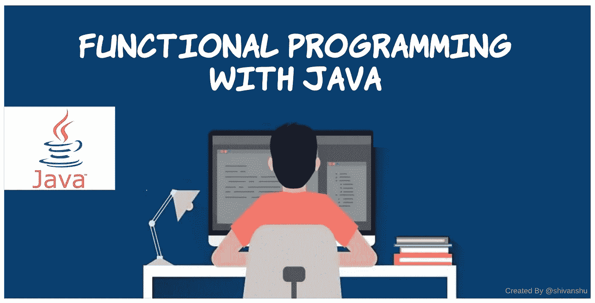

# 函数式编程的 Java 新面貌

> 原文：<https://levelup.gitconnected.com/the-new-aspect-of-java-with-functional-programming-d2ca6517d15e>

函数式编程是 Javascript 和 Python 中一个众所周知的概念。但是，对于 java 开发人员来说，这是一件不可思议的事情。在 [Java 8](https://www.oracle.com/java/technologies/java8.html) 之前，Java 是一个纯面向对象的程序设计，对象是一等公民。我们过去用 Java 做命令式编码。从版本 8 开始，Java 引入了进行函数式编程的新功能。然而，Java 并不是像 Javascript 那样的函数式编程语言。



## 什么是函数式编程？

为了理解函数式编程，我们需要先了解一些基本概念。

1.  **命令式编程:**在这种编程范式中，我们需要告诉我们需要做什么以及如何去做？它依赖于 if、when、for、forEach 等语句。

```
public class Programming {

    //remove duplicates from the list of numbers
    public static void main(String[] args) {

        List<Integer> numbers = Arrays.*asList*(1,2,2,3,4,5,6,7,7,8,9,9,8);

        //imperative style of removing duplicates from the list
        List<Integer> newList = new ArrayList<>();

        for(Integer number: numbers) {
            if(!newList.contains(number)) {
                newList.add(number);
            }
        }
        System.*out*.println(newList);
    }
}
```

2.**声明式编程:**它只是要求做什么，它取决于表达式而不是语句。**声明性代码**专注于构建软件的**逻辑，而不实际描述其流程**。

```
public class Programming {

    //remove duplicates from the list of numbers
    public static void main(String[] args) {

        List<Integer> numbers = Arrays.*asList*(1,2,2,3,4,5,6,7,7,8,9,9,8);

        //declarative style of removing duplicates from the list
        List<Integer> newList = numbers.stream().distinct().collect(Collectors.*toList*());

        System.*out*.println(newList);
    }
}
```

3.**高阶函数:**这些函数可以将函数作为参数，也可以在执行后返回函数。`Collections.sort()`方法是采用比较器 a 参数的高阶函数的一个例子。

```
List<String> list = new ArrayList<>();
list.add("One");
list.add("Two");
list.add("Three");

Collections.sort(list, (String a, String b) -> {
    return a.compareTo(b);
});

System.out.println(list);
```

4.**函数式编程:**是声明式编程+高阶函数+不变性。这种编程完全依赖于纯函数。我们来了解一下**什么是 Java(或者任何编程语言)中的纯函数**？

一个纯粹的函数完全依赖于两件事:

这不会改变任何事情。

它不依赖于任何变化的事物。就像我们在 java lambdas 中只能有 final 变量。

```
//it's not a pure function as it modifies the list of numbers
public int getValue(List<Integer> numbers) {
    numbers.add(100);
    return numbers.get(0);
}

//it's a pure function as it does not modify the value of anything
public int getValue(List<Integer> numbers) {
    return numbers.get(0);
}
```

好吧！！那真的很酷。现在，我们明白了这个新的 Java 术语是什么。但是，我们为什么要在实现中使用它呢？它对我们有什么帮助？

## 为什么我们需要函数式编程？

1.  在代码中具有不变性。
2.  并行化更容易实现。
3.  懒惰评估

**为什么不变性很重要？**

改变数据结构会产生意想不到的副作用，我们必须对此进行检查。有了不变性，我们可以保持数据结构的可预测性和无副作用，并且更容易推理。

在纯函数中，我们可以使用任何数据结构，而不用担心由于对数据结构的异步访问而导致的可变性或模糊结果。

假设，我们有一个命令式代码，它运行良好，除非它是一个顺序代码，这时候，我们需要让它并发，以提高其性能。这样做就变得复杂了。好的，没问题，我们喜欢复杂的事情，我们会做，我们开始将代码从顺序迁移到并发，我们完成了它，现在，我们得到了更快的结果，但是，结果并不准确。没问题，我们会花更多的时间来解决这些准确性问题，现在，我们可以部署我们的新解决方案，以提高性能。

在我们部署我们的新解决方案之前，我有一个问题，我们在并发代码中使用了 10 个线程，它将我们的性能提高了 5 倍，我们不能增加线程的数量以获得更好的性能吗？让我们试试那个。我们将线程增加到 100 个，这次性能下降了。这个实验清楚地告诉我们，并发不仅仅依赖于线程。这也取决于硬件(CPU 的核心数)。

我试图解释开发人员在处理并发代码时需要认识到很多事情。在这里，函数式编程通过在这些事物之上进行抽象来拯救我们。

```
public class Programming {

    //remove duplicates from the list of numbers
    public static void main(String[] args) {

        List<Integer> numbers = Arrays.*asList*(1,2,2,3,4,5,6,7,7,8,9,9,8);

        //sequential code
        List<Integer> newList = numbers.stream().distinct().collect(Collectors.*toList*()); //parallel code
       List<Integer> newList = numbers.parallelStream().distinct().collect(Collectors.*toList*());
        System.*out*.println(newList);
    }
}
```

在上面的例子中，parallelStream()并行执行代码以获得更好的性能。它在内部处理线程，将任务分成多个子任务。

**懒评**

它做一个懒惰的评估。如果流的结果没有在任何地方被使用，则它不执行该流。让我试着在下面的例子中解释一下:

```
public class Programming {

    public static int doubleNum(int number) {
        System.*out*.println("doubleNumber: " + number);
        return number*2;
    } //here result of stream is not being used
    public static void main(String[] args) {

        List<Integer> numbers = Arrays.*asList*(1,2,3,4);

        numbers.stream().map(n -> *doubleNum*(n));
    }

}
//Result:
Process finished with exit code 0--------------------------------------------------------------------
public class Programming {

    public static int doubleNum(int number) {
        System.*out*.println("doubleNumber: " + number);
        return number*2;
    }

    public static void main(String[] args) {

        List<Integer> numbers = Arrays.*asList*(1,2,3,4);

        numbers.stream().map(n -> *doubleNum*(n)).forEach(System.*out*::println);
    }

}
//Result:
doubleNumber: 1
2
doubleNumber: 2
4
doubleNumber: 3
6
doubleNumber: 4
8
Process finished with exit code 0
```

流是 Java 中函数式编程的基本构件。它不是一种数据结构。这是功能的抽象。它是基于推模型的。当数据可供处理时，它会推送数据，而对于列表和其他集合，客户端会拉取数据进行处理。

## 四个著名的功能界面:

1.  `Supplier<T> =====> T get() ------> Factories in streams`
2.  `Predicate<T> =====> boolean test(T) ------> filters in streams`
3.  `Function<T, R> =====> R apply(T) -------> map in streams`
4.  `Consumer<T> ======> void accept(T) -------> forEach in streams`

> 注意:异常在流中没有得到很好的处理，这成为流的一个限制。它只是有一个**数据通道**进行通信。在异步编程中， [CompletableFuture](https://docs.oracle.com/javase/8/docs/api/java/util/concurrent/CompletableFuture.html) 可以优雅地处理错误(或异常)，因为它有 **2 个通道(数据和错误)**进行通信。

## 结论:

在我看来，开发人员更熟悉命令式编码风格，而不是函数式(或声明式)，函数式需要更多的数学思考，使代码更容易出错。为什么我们需要像数学家一样编码？我们应该只关注业务逻辑，并利用提供给我们的 API 和框架来完成其他事情。

希望有帮助，感谢阅读！