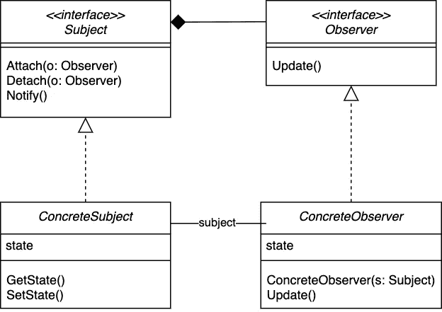

# 围棋中的观察者模式

> 原文：<https://levelup.gitconnected.com/the-observer-design-pattern-in-go-d564048fe9f6>

每个软件工程师都需要知道的基本设计模式。


观察者设计模式是任何有能力的软件工程师的基本工具。一句话，它由密切关注改变其状态的对象的观察者组成。在本教程中，我们将探索我目前最喜欢的编程语言——Go 中的用例、UML 图和实现。

**注意**:术语可以根据观察者/订阅者或主题/话题/发布者而变化。它们都是一样的，但是在本文中我将使用观察者和主题。

## 用例

观察者设计模式的真实例子数不胜数。它们包括:

*   社交媒体平台——朋友可以关注其他朋友，互相分享更新。媒介本身可以使用这种模式！
*   新闻平台——人们订阅新闻站(例如华盛顿邮报),每天/每周都会收到突发新闻事件的通知。
*   机器人操作系统(ROS)——不是一个真正的操作系统，但是 [ROS](https://www.ros.org/) 实际上与它的机器人有基本的通信，建立在观察者模式下，与发布者和订阅者进行信息传输。

还有更多！

## UML 图

谢天谢地，我们有一个简单的图表来分析。你可以得到一些变化，其中的`Subject`不是一个接口，但是我认为保持`Subject`和`Observer`作为接口极大地提高了代码的灵活性，并且提供了可伸缩的契约。



来自你真诚的

从左上角开始，`Subject`通常被列为抽象类，但是 Go 没有类，所以我们将其标记为接口。`ConcreteSubject`将使用应用于`Observers`的相同流程实现该接口。

我们在`Subject`中有`Attach()`和`Detach()`方法，它们都接受一个`Observer`对象。在`Subject`和`Observer`之间有一个复合关系，意味着我们可以有一个从零到多`Observers`的`Subject`。此外，`ConcreteSubject`和`ConcreteObserver`都用虚线实现了这两个接口，而不是继承一个用线填充的类(因为这毕竟是 Go)。

最后，具体对象具有分配给它们的私有状态，然后可以通过公共方法访问和更改这些私有状态，以保持完整性。

**注意:** Go 没有公共或私有关键字。相反，公共方法以大写字母开头，私有方法以小写字母开头。

## Go 中的实现

在这个例子中，我们将创建一个程序，它用传感器来检测温度的变化，用气象站来广播信息。传感器将作为`Subject`接口的实现，而站将是天气传感器的观察者。

让我们制作一个由 3 个文件组成的基本结构。

```
$ mkdir observer-pattern-go
$ cd observer-pattern-go
$ touch main.go observer.go subject.go
```

我们将首先致力于观察者的实现。

## 观察者.去吧

我们的`Observer`接口很简单，我们只需要实现一个包含`Update()`方法的结构。`WeatherStation`将处理此事。由于 Go 中没有类，我们将创建自己形式的构造函数，如第 9–11 行所示，它返回一个对新的`WeatherStation`对象的引用。`WeatherStation`结构只有一个名字作为它唯一的属性。

然后我们通过实现`Update()`方法来实现`Observer`接口。这是通过在第 17 行的函数中注入一个对`WeatherStation`对象的引用来实现的。现在`WeatherStation`实现了`Update()`方法，并且`Observer`接口是快乐的。

`Update()`功能将简单地报告温度以及当天是热、温和还是冷。

## 主题.开始

`WeatherSensor`将通过定义`NotifyAll()`方法来实现`Subject`接口。`WeatherSensor`还有额外的功能，因为它有一个存储气象站引用的片`[]*WeatherStation`。第 18 行的`Subject`关键字意味着我们正在扩展这个结构的接口。最后还有一个状态属性`temperature`。

然后我们还实现了两个方法`addStation()`和`removeStation()`，这两个方法都将对`WeatherStation`的引用作为其参数。添加气象站就像添加到对象的切片一样简单。然而，移除气象站实际上更复杂一些。参考下面的代码，但是我很惊讶 Go 没有更简单的方法来为我们处理这个问题。

`NotifyAll()`方法实现简单地循环所有的`weatherStations`并调用它们自己的`Update()`方法，我们在前面定义过，它表示一天是热、冷还是温和。

当然，我们在第 46–50 行也有 Go 版本的构造函数，它返回一个定义初始温度的新引用`&WeatherSensor`。函数`getRandomTemperature()`只是一个辅助函数，返回一个在上面定义的给定范围内的随机整数。

注意每当我们调用方法`ChangeTemperature()`时，我们传递一个结构引用`*WeatherSensor`。在我们打印出这是新的一天之前，我们改变传感器的温度，然后用`NotifyAll()`通知所有观察者(气象站)这一变化。

## main.go

最后，我们有了主 Go 文件，它将作为执行代码的客户机。这里没有什么疯狂的，我们只是初始化我们的对象，然后使用我们奇特的新观察者模式与它们交互！

您可以使用`observer-pattern-go`目录中的命令运行项目:

```
$ go run *.go
Denver Weather Station reporting:
    The temperature is 101 F, it will be a hot day!
Vail Weather Station reporting:
    The temperature is 101 F, it will be a hot day!
Cheyenne Weather Station reporting:
    The temperature is 57 F, it will be a mild day.It's a new day!
Denver Weather Station reporting:
    The temperature is 17 F, it will be a cold day!
Vail Weather Station reporting:
    The temperature is 17 F, it will be a cold day!It's a new day!
Cheyenne Weather Station reporting:
    The temperature is 29 F, it will be a cold day!It's a new day!
Denver Weather Station reporting:
    The temperature is 1 F, it will be a cold day!
Denver Weather Station reporting:
    The temperature is 1 F, it will be a cold day!
Cheyenne Weather Station reporting:
    The temperature is 29 F, it will be a cold day!
```

现在你应该对 Go 中的观察者模式有了很好的基础理解，恭喜你！对于你自己的自学来说，这里有很多需要改进的地方，比如单元测试、实现额外的传感器和功能或者将调用方法重构到代码库中。

我还认为一些有趣的新功能可能是随机生成传感器本身，然后将它们平均用于天气报告。你甚至可以自己创建一个随机函数来预测天气！可能性是无穷无尽的，但关键是现在有了 Observer 模式的支持，您可以轻松地扩展这个代码库。

我希望你喜欢这篇文章，如果有什么你喜欢的或者想听的，我鼓励你在下面留下评论。感谢阅读！