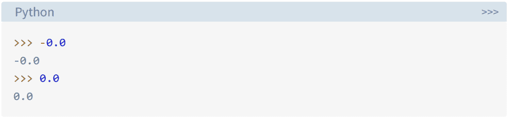

# Python 3.11 的正式版本已经发布，比 3.10 快 10-60%。这可能是最好的版本！

> 原文：<https://levelup.gitconnected.com/the-official-version-of-python-3-11-f81080cd259f>

终于，Python 3.11 正式版发布了！

2020 年 1 月 1 日，Python 正式结束对 Python 2 的维护，这意味着 Python 2 彻底退役，进入 Python 3 时代。自进入版本 3 以来，Python 正式发布了很多修改分支，现在是最新版本 Python 3.11。
其实在研究界有一个不为人知的秘密，那就是 Python 速度不快但很好用，所以用户数量超级庞大，Python 在很多最流行语言的榜单上都排在第一。许多开发人员都期待着提高这种语言的性能，有些人想知道 Python 4 是否会在某个不经意的时刻到来。有这种想法的可以放在一边。Python 之父 Van Rossum 说的，Python 4.0 不一定会来。
Van Rossum 曾说:“我和 Python 核心开发团队的成员对 Python 4.0 一无所知，也不感兴趣。估计至少要编号到 3.33。Python 的加速是增量的，3.11 版本会有新的速度提升。预计会比 3.10 快很多。”
正如 Van Rossum 所说，根据官方信息，最新发布的 Python 3.11 比 Python 3.10 快 10–60%，并且更加用户友好。这个版本已经开发了 17 个月，现在已经公开发布。

Python 3.11 中的具体改进主要体现在:更详细的错误回溯、更快的代码执行、更好的异步任务语法、改进的类型变量、对 TOML 配置解析的支持，以及其他一些非常酷的特性(包括快速启动、零成本异常处理、异常组等。).

Python 指导委员会成员和核心开发人员、Python 3.10/3.11 发布经理 Pablo Galindo Salgado 表示，为了使 3.11 成为 Python 的最佳版本，做了大量工作。

**Python 3.11 新增功能**
**错误回溯**
Python 是一种非常初学者友好的编程语言，具有易于理解的语法和强大的数据结构。但是对于刚接触 Python 的人来说，有一个问题，就是 Python 遇到错误时，如何解释显示的 traceback。
Python 3.11 在回溯中增加了装饰性注释，帮助用户更快地解读错误信息。要获得此功能，请将以下代码添加到 inverse.py 文件中。

例如，可以使用 inverse()计算一个数的倒数。由于 0 没有倒数计时，因此当运行以下代码时会引发错误。注意回溯中嵌入的^和~符号，它们指向导致错误的代码。与以前的追溯一样，您应该从底层开始，一步步向上。这个操作对于查找 bug 非常有用，但是如果代码太复杂，带注释的回溯更好。

**更快的代码执行**
Python 是出了名的慢，例如 Python 中的常规循环比 c 中的类似循环慢几个数量级。
Python 官方正在致力于改善这一缺陷。2020 年秋天，Mark Shannon 展示了 Python 的几项性能改进。这个提议被称为香农计划，他们希望通过几次版本更新使 Python 速度提高 5 倍。不久之后，微软正式加入了该计划，该公司正在支持包括马克·香农和吉多·范·罗苏姆在内的开发人员进行“更快的 CPython”项目。
“更快的 CPython”项目中的一个重要提案是 PEP 659，Python 3.11 在此基础上有很多改进。
PEP 659 描述了一个“专门化的自适应解释器”。主要思想是通过优化频繁执行的操作使代码运行得更快，这类似于 JIT(实时)编译。只是不影响编译而已，相反 Python 的字节码是动态调整或者变化的。
研究人员在字节码生成中增加了一个叫做“加快”的新步骤，可以在运行时优化指令，并用适应性指令取代它们。
一旦函数被调用一定次数，加速指令开始。在 CPython 3.11 中，加速在八次调用后开始。您可以通过调用 dis()并设置 adaptive 参数来观察解释器如何适应字节码。
在基准测试中，CPython 3.11 比 CPython 3.10 平均快 25%。更快的 CPython 项目是一个正在进行的项目，已经计划在 2023 年 10 月发布 Python 3.12 时进行一些优化。你可以在 GitHub 上关注这个项目。
项目地址:[https://github.com/faster-cpython/ideas](https://github.com/faster-cpython/ideas)

**异步任务的更好语法**
Python 对异步编程的支持已经发展了很长时间。生成器是在 Python 2 时代添加的，asyncio 库最初是在 Python 3.4 中添加的，async 和 await 关键字是在 Python 3.5 中添加的。在 Python 3.11 中，您可以使用任务组，它为运行和监控异步任务提供了更简洁的语法。

**改进类型变量**
Python 是一种动态类型语言，但它支持带有可选类型提示的静态类型。Python 的静态类型系统的基础是在 2015 年 PEP 484 中定义的。从 Python 3.5 开始，每个 Python 版本都引入了几个与类型相关的新提议。
Python 3.11 发布 5 个类型相关 pep，再创新高:

*   PEP 646:可变泛型
*   PEP 655:将单个类型的项目标记为需要或可能缺少
*   人教版 673:自我类型
*   PEP 675:任意文字字符串类型
*   PEP 681:数据类转换

**支持 TOML 配置解析**
TOML 是 Tom 的显而易见的极简语言的缩写。这是一种配置文件格式，在过去十年中变得很流行。Python 社区在为包和项目指定元数据时，已经将 TOML 作为首选格式。
虽然 TOML 已经用了很多年，但是 Python 并没有内置的 TOML 支持。当 tomllib 被添加到标准库中时，Python 3.11 中的情况发生了变化。这个新模块建立在 toml 第三方库之上，允许解析 TOML 文件。
以下是一个名为 units.toml 的 TOML 文件示例:

**其他功能**
除了上面的重大更新和改进，Python 3.11 还有更多值得探索的特性，比如更快的程序启动、更多对异常的修改以及对字符串格式的小改进。

**更快的程序启动速度**
更快的 CPython 项目的结果之一就是更快的启动时间。运行 Python 脚本时，解释器初始化需要一些操作。这导致即使是最简单的程序也需要几毫秒才能运行。
在许多情况下，与运行代码所花费的时间相比，启动程序所花费的时间可以忽略不计。但是在短期运行的脚本中，比如典型的命令行应用程序，启动时间会显著影响程序性能。例如，考虑下面的脚本，灵感来自经典的 cowsay 程序。

在 snakesay.py 中，你从命令行读取一条消息，然后将这条消息打印在一个带有可爱的蛇的语音气泡中。你可以让蛇说任何话。下面是一个命令行应用程序的基本示例，它运行速度很快，但仍然需要几毫秒的时间。这种开销的很大一部分发生在 Python 导入模块的时候。

您可以使用-X importtime 选项来显示导入模块所花费的时间。表中的数字以微秒为单位，最后一列是模块名称的格式。
该示例分别在 Python 3.11 和 3.10 上运行，结果如下图所示。Python 3.11 有更快的导入，帮助 Python 程序更快启动。

**零成本异常**
Python 3.11 中异常的内部表示不同。异常对象更加轻量级，异常处理也发生了变化。因此，只要 except 子句没有被触发，try …except 块中的开销就会减少。所谓的零成本异常是受 C++和 Java 等其他语言的启发。当您的源代码被编译成字节码时，编译器会创建跳转表，零成本异常从该表中实现。如果出现异常，则查询这些跳转表。如果没有异常，try 块中的代码就没有运行时开销。

**异常组**
前面，你学习了任务组以及它们如何同时处理多个错误。这都要归功于一个叫做例外组的新特性。我们可以这样看待异常组，它们是包装了几个其他常规异常的常规异常。虽然异常组在许多方面表现得像常规异常，但它们也支持特殊的语法来帮助您有效地处理每个包装的异常。如下所示，您可以通过给出描述并列出包装的异常来创建一个异常组。

**异常注释**
一般异常具有添加任意注释的扩展能力。你可以用。add_note()向任何异常添加注释，并通过检查。__notes__ 属性。

**负零格式化**
用浮点数做计算时，可能会遇到一个奇怪的概念——负零。您可以观察到负零和常规零在 REPL 中的呈现方式不同，如下所示。

有关 Python 3.11 中更新内容的更多详细信息，请参见原始文档。
*参考:*[*https://realpython.com/python311-new-features/*](https://realpython.com/python311-new-features/)

喜欢这篇文章吗？成为一个媒介成员，通过无限制的阅读继续学习。如果你使用[这个链接](https://machinelearningabc.medium.com/membership)成为会员，你将会支持我而不需要额外的费用。提前感谢，再见！