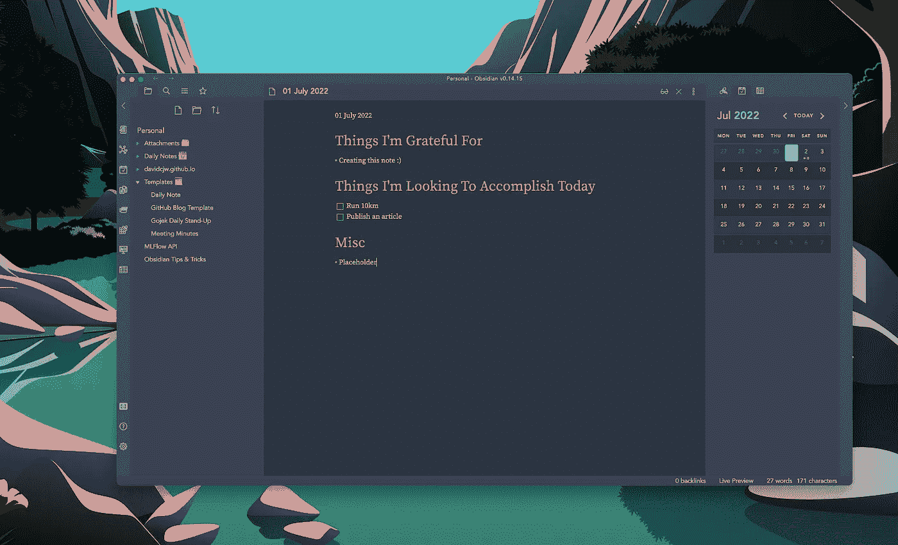

# 作为一名工程师，我从观念转向黑曜石的一个原因

> 原文：<https://levelup.gitconnected.com/the-one-reason-i-moved-from-notion-to-obsidian-as-an-engineer-68c4d78f412c>

## 剧透:是维姆

## 以及为什么你也想这么做

马赫迪·加里布在 [Unsplash](https://unsplash.com?utm_source=medium&utm_medium=referral) 上的照片

**我*热爱*理念。到现在为止，我已经坚持使用它将近 3 年了，我的整个人生几乎都在思考。从会议记录、代码片段到策划我的求婚——凡是你能想到的，你都可以在里面找到。我喜欢概念的地方太多了。**

我喜欢这个事实，我可以根据自己的喜好定制每个页面。

我喜欢*与移动应用程序无缝同步的事实。*

我*喜欢*你可以在一个共享的工作空间与其他人合作的事实。

我喜欢它免费的事实。

我喜欢在网上分享概念页面并导出它们是如此容易。

我的意思是，我可以继续下去，但你得到了重点。我喜欢这种想法。

## 什么变了？

没什么，真的。

就像任何一天我偶然发现黑曜石一样。老实说，我甚至不记得我是如何偶然发现它的——我相信它可能是我点击的 YouTube 上的一些推荐(*向算法*致敬)。

最初，我没有看到它的诱惑力。这个闪亮的，新来的家伙… *我是这么想的，他只是想分散我的注意力。下载完桌面电脑后，我只花了五分钟玩了玩，你瞧，我偶然发现了一个功能，它立刻让我想要深入研究。*

**Vim 按键绑定。**

在黑曜石中使用 VIM 的示例(GIF 由作者提供)

如果你还不知道我以前的文章，**我是一个巨大的 Vim n3rd** 。我已经将 VIM 整合到我的数字工作流程的几乎每一个部分——从网页浏览( [*Vimium chrome 扩展*](https://chrome.google.com/webstore/detail/vimium/dbepggeogbaibhgnhhndojpepiihcmeb?hl=en) )到在 VSCode 上编程( [*VIM 扩展*](https://marketplace.visualstudio.com/items?itemName=vscodevim.vim) )再到使用命令行( [*我的 Zsh*](https://github.com/ohmyzsh/ohmyzsh) 上的 Vim 插件)——我几乎涵盖了所有的领域……除了我的笔记工作流程。

我知道我必须使用它。

Vim 用户会知道，精通 Vim 从本质上改变了一个人与任何应用程序交互的方式。像任何习惯一样，精通 Vim 需要大量的时间和练习，但是一旦掌握了，您就可以前所未有地操作文本和文件，同时保持高度专注，因为您的手指从未离开过键盘。

最重要的是，曜石让我想起了很多关于VSCode(如果你还不知道，这是我的首选 IDE)的事情，因为几乎所有东西都是可定制的，并且有一个市场，人们可以在那里贡献插件。

对我来说，黑曜石感觉像概念，但由工程师建造和制造。以下是我喜欢它的地方(当然除了 Vim)。

# 货物

## [图形视图](https://help.obsidian.md/Plugins/Graph+view)

仅这一点就让黑曜石在与概念的对比中脱颖而出。像 [Roam Research](https://roamresearch.com/) 一样，你可以创建其他笔记的反向链接，并以图表(网络)的形式可视化它们，以查看笔记中的主题是如何连接的。

黑曜石中的图形视图(GIF 由作者提供)

## 可定制性

当然，字体、主题和一般美学都很好定制，但我真正喜欢的是定制热键的能力。我喜欢这个事实，我可以根据我的自定义热键操纵应用程序，加上 Vim，我几乎不需要我的鼠标。它几乎是 VSCode 的笔记应用程序版本。

黑曜石热键页面(作者截图)

## 注释基于降价语法

这就是为什么越来越多的人喜欢观念而不是黑曜石的原因。用 markdown 写，对于一般用户来说肯定不是最人性化的，但是对于工程师来说，感觉就是家。

此外，Obsidian 的斜杠(`/`)命令比 conception 的命令使用起来更麻烦，因此，“迫使”用户在大多数情况下使用 markdown 语法。

此外，如果你读过我写的关于[我如何创建一个类似媒体的博客](https://medium.com/geekculture/how-to-create-a-medium-like-personal-blog-for-free-in-a-day-55ebd9551d9c)的文章，这些帖子是使用 markdown 创建的！为博客写新帖对我来说从来没有这么简单过，因为我现在可以创建一个 markdown 模板，当我想写新帖的时候，我可以很容易地导入它。之后，提交和推送，网站将被更新。

## 插件

随着黑曜石越来越受欢迎，社区贡献插件的数量也将增长。截至本文撰写之时，共有 613 个社区插件，其中许多非常棒。以下是我使用的几个插件:

[**高级幻灯片**](https://github.com/MSzturc/obsidian-advanced-slides)

这个插件可以让你将笔记作为幻灯片使用——这多酷啊？！不再有无聊的幻灯片。您甚至可以使用内置的粉笔板和注释器在`localhost`上呈现它！这是它在预览模式下的样子:

使用高级幻灯片从 markdown 创建幻灯片(GIF by Author)

[**高级表**](https://github.com/tgrosinger/advanced-tables-obsidian)

是的，我们都知道在 markdown 中创建一个表是一件麻烦的事情。谢天谢地，有了[高级表格](https://github.com/tgrosinger/advanced-tables-obsidian)，我们可以轻松地创建表格。

使用高级表格创建表格(GIF by Author)

[**日历**](https://github.com/liamcain/obsidian-calendar-plugin)

“日历”可以让你记录每天的笔记，也可以记录当天你写了多少字。

# 不太好的东西

## 它不是为协作而构建的

是的，目前没有办法和其他人合作开发黑曜石。你最好使用谷歌文档或概念。

因此，这可能是黑曜石更大的缺点之一。如果你是一家公司，正在考虑选择哪个平台，这个因素可能会让 idea 排在前面。

然而对于个人使用来说，这个因素可能不会起这么大的作用。

## 跨设备同步可能会很麻烦

老实说，这个因素对我来说并不是一个大问题，因为我只是使用了 *iCloud Drive* 来同步桌面和手机上的文件夹。您还可以使用其他第三方选项，如 *Dropbox* 、 *OneDrive* 或 *Google Drive* 。

如果你觉得设置东西很麻烦，那么购买黑曜石同步可能是你的一个选择。或者你可以简单地坚持这个观点。

## 转换成本

这个因素并不特别适用于黑曜石。就像切换到任何其他笔记应用程序一样，切换总是有成本的。这包括学习如何以最佳方式组织您的工作流程、学习快捷方式和按键绑定、发现和学习新功能等等。

但是就像约会一样，弄清楚你的优先事项是什么是很重要的，因为你不想太频繁地换来换去。你更喜欢有一个用于协作的应用程序，还是更喜欢有一个通过许多很酷的插件添加到你的工程工作流程中的应用程序？

# 最后的话

当然，你可能会问——为什么不两全其美呢？

为什么不两个都用？(作者截图)

答案？可以，绝对可以(*但是请不要在现实生活中和女生做*)！

坚持对你有用的东西，如果这意味着同时使用这两个应用的话。这篇文章的重点不是说一个笔记应用程序比另一个好，而仅仅是分享我喜欢黑曜石的地方。

***支持我！***—最后，如果你喜欢你所阅读的内容，并且*没有*订阅 Medium，请考虑支持我，并通过我在这里的推荐链接[订阅](https://davidcjw.medium.com/membership) ( *注意:你的一部分会员费将作为推荐费*分摊给我)。否则，留下一个👏🏻鼓掌或💬注释也有助于算法！