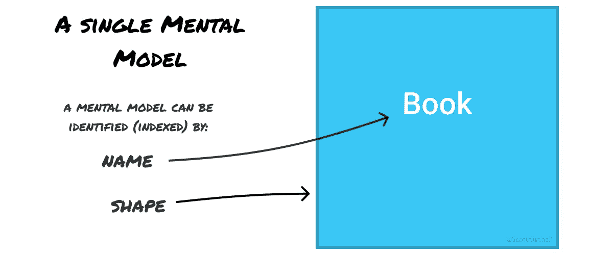
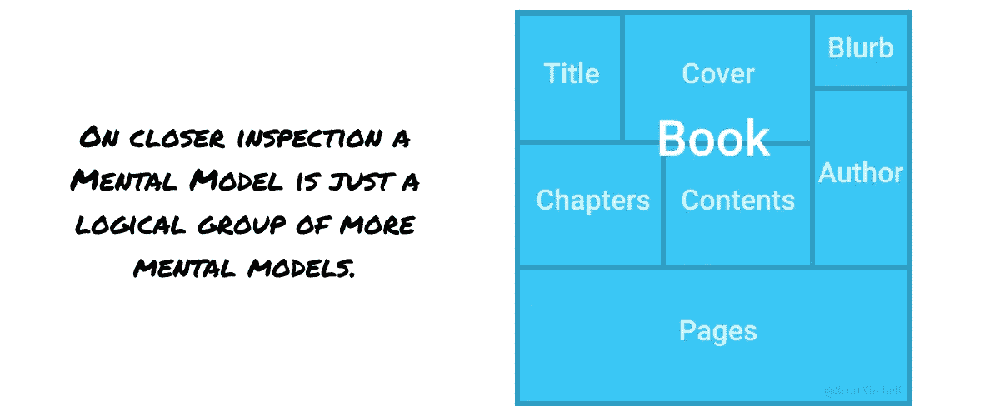
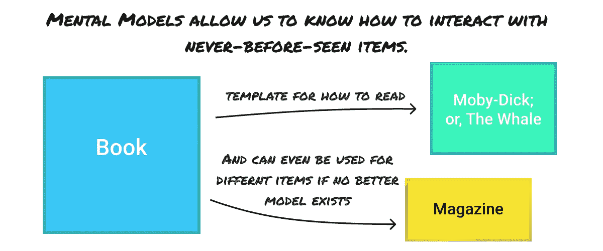
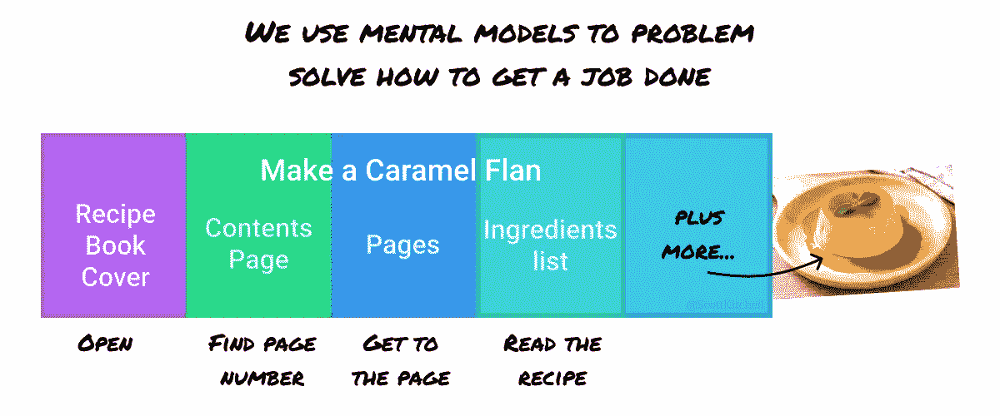
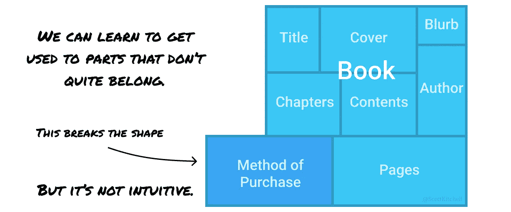
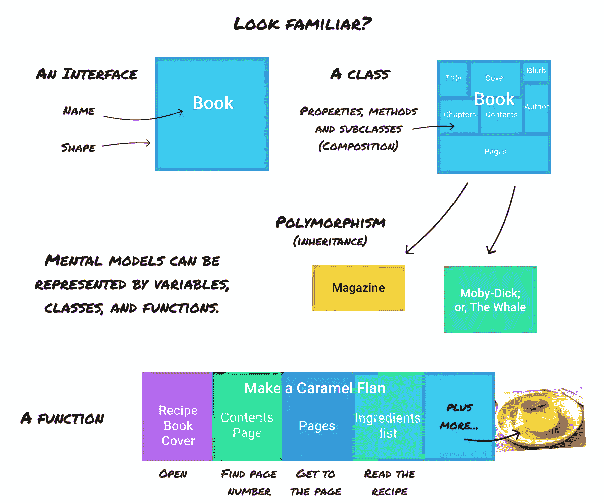
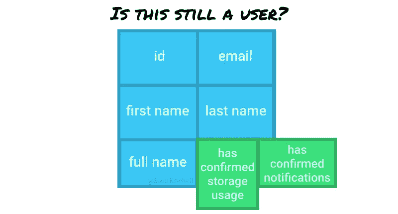

# 干净的代码都在头脑中

> 原文：<https://levelup.gitconnected.com/the-only-rule-you-need-for-writing-clean-code-532a64df0eff>

干净的代码是易于理解、易于使用和易于修改的代码。

你知道，当你看到干净的代码时，因为这是一种乐趣，它看起来直观而简单，错误很容易发现，它允许你快速开发新功能，即使是在一个大的代码库中。

那么如何才能实现这个圣杯呢？

有许多书籍和文章提出了大量的规则来实现“干净的代码”。这些规则包括声明性变量命名、小型纯函数、DRY(不要重复)、类长度、每个文件一个类等等。但是这些规则经常是矛盾的，更不用说有争议的，而且有太多的规则以至于忘记它们几乎是不可避免的。

所以，这里有一条规则来管理它们:

> 总是参考心智模型来编写代码。

太棒了，但是什么是心理模型呢？

比方说，你在桌子上看到一本书，作者是你从未听说过的人。你知道如何使用这本书吗？你当然知道！如果封面看起来很有趣，你会把它捡起来，你知道如果你把它翻到背面(这是你一生中从未见过的)，很可能会有一个广告让你阅读。你知道你可以打开它，里面会有纸页。你知道你应该从最外面的第一页开始，一页一页地通读。

那么你是如何知道这么多如何与你从未见过的东西互动的呢？答案是心智模型。

我们的大脑非常擅长模式匹配，所以当我们看到一本书时，我们的大脑可以访问一个现有的心理模型，这个模型基于我们过去对书籍的所有经验。正是这种心智模式为我们提供了一种理论，关于如何与我们面前的这本书互动。

人类比其他任何动物都更好地储存、模式匹配和检索复杂的心理模型，这种能力赋予了我们相对的超级智能。然而，这也会让我们在生活和代码中误入歧途。

# 那么这对编写干净的代码有什么帮助呢？

首先，我们需要再后退一步，这样我们就可以建立一个正确的心智模型。所以 meta。

把心智模型想象成关于某件事情的知识块。它有形状和名字。当我们在世界上遇到模型时，形状和名称都是我们用来直接索引模型的。(在现实中，形状可能是视觉、听觉、嗅觉或其他感觉，但对于这个模型，只需将其视为一个容器)。

那么心理模型容器里面是什么呢？嗯，它包含了所有关于组成你对事物理解的部分的知识。由于我们的大脑使用心智模型来表示知识，这意味着心智模型内部的每个部分也是心智模型！

当我们遇到新的东西时，我们把这个模型作为我们面前特定事物的模板，根据需要修改它。

当我们需要完成一项任务时，我们可以将这些心智模型串联起来，产生一个新的心智模型来解决它。

## 然而，有两点非常重要:

*1。最初，你可能错误地将正确的心智模型识别为模板，直到你被一些交互完全弄糊涂了，你才会意识到这一点。*

魔术、笑话和视错觉经常以轻松的方式利用这一点，欺骗你的大脑最初使用错误的心理模型，这样笑点就能让你大吃一惊。这可能很有趣，但是由于我们需要使用心智模型来解决问题，使用错误的心智模型也可能导致混乱、失败，以及在编写代码时缺乏信心。

2.*一旦你知道了一件特定事情或一段代码的心智模型，不管一开始它有多不直观，你都会相信它是合乎逻辑的。*

心理模型实际上是我们头脑中的逻辑，所以如果它在那里，你会看到其中的逻辑。然而，从外部来看，其他人不会。不规则的形状不仅看起来不直观，它们也不适合其他的心理模型，使它们更难记忆和解决问题。

# 请告诉我这和我的代码有什么关系！？

好了，让我们回到规则:**总是参考心智模型**来写代码。那你是怎么做到的呢？

上面显示的心智模型是不是看起来有些熟悉？这有帮助吗？

如你所见，变量、类和函数都是心智模型！所以我们的想法是尽可能接近我们现有的心智模型来写这些。

为了让你开始思考，这里有一些代码示例！

# 当创造事物时

遵循**总是参考心智模型**编写代码的规则，首先要做的是决定参考什么心智模型。你想代表什么？一个用户？注册吗？一个通知？一本书？这就不可避免地引发了对命名和代码结构的思考！完美。

## 命名

命名可能是编写干净代码的唯一最重要的因素。

记住，我们可以用事物的形状和名称来识别正确的思维模式。在代码中，像对象、函数或类这样的东西的形状通常隐藏在另一个定义它的文件中，所以我们必须更多地依赖名字本身。(然而，静态类型语言和良好的 IDE 可以帮助更广泛地识别形状)。

哪些词鼓励读者最准确地推断出代码是什么。

`user`、`buyer`、`seller`、`owner`、`creator`和`admin`在形状上可能都是相似的，但是所使用的名称传达了一种(可能是重要的)差异，即读者期望该对象包含什么以及用于什么。

你可能会注意到有时很难给某样东西命名，或者你的名字中有一个`and`。这表明你可能实际上混合了两个或更多的心智模型。

## 定义代码结构

为了考虑如何组织你的代码，考虑你想要引用的心智模型。例如，假设你正在编写一个`setupUser`函数。你希望这个函数做什么？这里有一个例子。

如您所见，该函数基于一些用户详细信息在服务器上创建一个用户，然后设置浏览器本地存储，设置通知首选项，最后返回用户。

这是你期望的名字`setupUser`吗？“设置”是什么意思？这里有一些东西可以改进，但要强调的主要一点是，不太可能任何人对名为`setupUser`的函数的最初心理模型也包括在服务器上创建一个用户。

改进的一个方法是将函数命名为`createAndSetupUser`，然而这意味着函数引用了两个心智模型，而不是一个。更好的方法是将其分离。

虽然这可能还不完美，但我们可以看到代码的每一部分都以一次引用一个心智模型的方式命名和构造，并且不会误导下一个遇到代码的人。

# 修改东西的时候

通常，有经验的开发人员会根据他们“干净”的心智模型，直觉地编写新代码。相反，当修改代码时，各种犯罪都会发生。这是因为通常是另一个开发者给它添加了很小的一部分，这在本地层面上看起来是合理的。

当你修改代码的时候，你必须花一分钟去理解最初的心智模型是什么，并忠实于它！向该函数添加这一行对您来说可能是有意义的，但是从外部来看，该函数现在可能包含一个隐藏的等待发生的 bug。

这里有一个用户的例子。

现在，假设在用户入职期间，您需要记录他们是否看到并同意某些权限。最容易做的事情(甚至可能是最高效的)是将它直接添加到用户模型中。

如果你不知道这些新属性，你会认为它们是用户的一部分吗？

一个更好的方法是考虑它们如何成为新心智模型的一部分。比如`UserPermissions`。

同样，这仍然可以根据用例进行改进，但是，当您或其他人希望找到用户已经确认的权限时，在哪里访问数据和代码应该更直观。如果有人要添加更多的用户权限，他们会有一个明确的家——不需要开会或讨论。

**总是参考心智模型**来写代码，你会惊奇地发现确定什么是干净的代码以及如何写代码是多么容易。