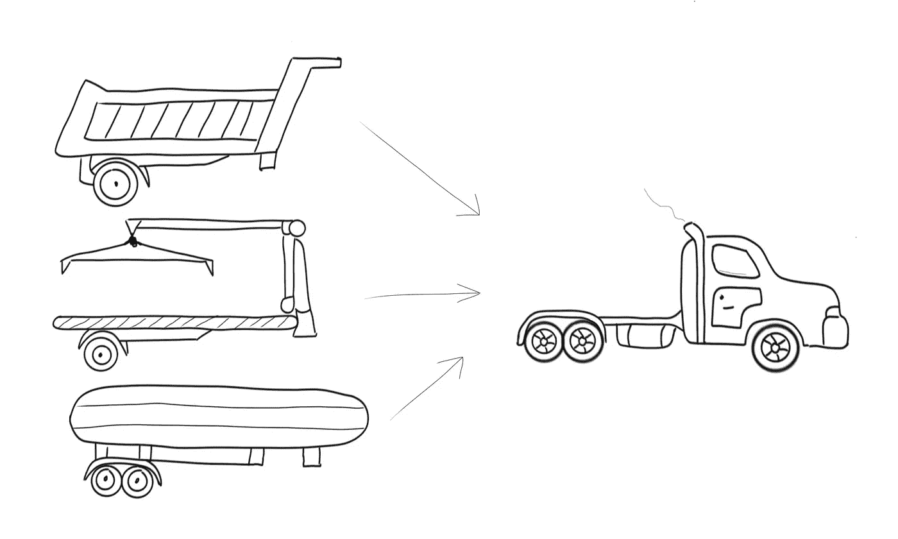

# 开闭原理变得简单

> 原文：<https://levelup.gitconnected.com/the-open-closed-principle-made-simple-cc3d0ed70553>

## 在向现有代码添加新特性时，遵循这一原则可以避免新的错误。



米海三都

卡车是一种多功能设备。根据拖车的类型，他们可以执行不同的任务。我们甚至可以用链条拴住拖车(如果载重允许的话)。

简而言之，卡车**开放**用于扩展不同的拖车，但**关闭**用于修改(如发动机或驾驶室)。编写可扩展代码应该就像交换卡车上的拖车一样简单。

# 冰淇淋机的问题

假设我们必须为 Ted&Kelly 冰淇淋公司编写一个制作可可冰淇淋的程序。

代码虽然很基础，但是看起来还可以。似乎没有原则被打破。我们将软件交付给客户，客户很满意。

但是我们正在编写真实世界的应用程序。这意味着需求会不断变化，新的特性会不断出现。

## 第一个需求变化——添加新口味

最初的项目非常成功，Ted&Kelly 想要扩展。他们要求我们增加对香草冰淇淋的支持。

经过一番思考，我们得出了以下解决方案:

我们修改原始代码，添加一个参数来指定所需的味道，并添加一个“if”语句来在逻辑之间切换。由于我们已经更新了原始的方法签名，调用我们代码的方法将被破坏，但至少从现在开始，我们应该支持额外的风格而不破坏更改。

## 第二个需求变化——创建可可和香草组合

生意很好，所以客户想添加一种组合冰淇淋，一种由可可和香草制成的冰淇淋。事情开始变得复杂，但我们能处理好。

我们添加了另一个 if 语句，在这种情况下,“逻辑”被复制到每个 if 中。在现实世界的应用程序中，我可能会在单独的服务中提取逻辑。但是正如我们将会看到的，提取服务并不总是最好的主意。

当 Ted&Kelly 公司要求更多口味时会发生什么？如果他想进一步结合呢？仅仅添加 if 子句并不是理想的解决方案。

## 此解决方案的问题

每当我们添加一个新的口味或组合，我们必须更新 IceCreamMachine 类。这意味着:

*   我们更新已经部署的代码
*   这堂课变得越来越难读了。想象一下，如果我们有 100 种口味。这个类很容易膨胀到 5000 多行代码
*   我们可以打破现有的单元测试

回想一下卡车的比喻。你会在每次换拖车的时候换引擎吗？大概不会。让我们看看如何修复它。

# 传统的可扩展性方法

Bertrand Meyer 是开闭原则的创始人，他将其定义为“软件实体(类、模块、函数等)”。)应该对扩展开放，但对修改关闭。

换句话说，每当我们需要向旧对象添加新行为时，根据需要继承和更新它们。开闭原则是那些易于理解但难以应用的原则之一。

让我们按照这种方法重写代码:

发生了什么事？最初的类被分成四个，每种口味一个，外加一个基础对象。有了这个解决方案，我们解决了所有最初的问题:

*   班级很小，所以更容易理解和管理
*   每当需要一种新的口味时，我们就添加一个新的类
*   现有的单元测试不受影响

理论上看起来一切正常，我们可以就此打住，但是这个解决方案存在一些**问题:**

*   不能继承多个类。因此，对于两种风格的组合，我们必须复制一些代码或将逻辑提取到服务中
*   如果基类中的代码被更新，所有的子类都会受到影响。假设基类有一些通过构造函数注入的依赖项，每次我们添加一个新的依赖项时，所有的子类都必须将那个参数解析到基类构造函数中

# 可扩展性的现代方法

当 Robert C. Martin 重申 Meyer 的原则时，他更新为**偏好组合而非继承**。

当我们合成对象时，我们可以自由地按照自己的意愿合成任意多的对象。如果我们针对抽象(接口)编程，我们就有能力改变现有代码的行为而无需修改。让我们看看最终的解决方案:

我已经将原始类分成了三个对象:

*   **imakeecream**接口定义了制作冰淇淋的通用抽象
*   **实现 IMakeIceCream 的 CacaoIceCream** 类
*   **实现 IMakeIceCream 的香草冰淇淋**类

通过使用接口，我们将类和实现解耦。接口对于修改是封闭的，所以一旦我们定义了一个接口，它就不能被改变。但是我们可以为新特性定义新接口并继承它们。这使得代码具有可扩展性。

为什么我给每个构造函数都加了一个“imakeecream”**参数？新代码是否具有旧方法或遗留方法的所有特性？**

**答案是肯定的。可可香草组合仍然存在，但我们不需要 if 子句或专门用于它的类。我们可以利用构造函数参数。**

```
var cacaoVanillaIceCream = new CacaoIceCream(new VanillaIceCream());cacaoVanillaIceCream.Make();
```

**就是这样。构图的美妙之处在于，我们可以随心所欲地构图。需要 4 种口味？写一串构造函数就行了。这被称为**装饰器**模式。你可以在这里了解更多信息[。](https://refactoring.guru/design-patterns/decorator/csharp/example)**

**请注意，IMakeIceCream 参数是可选的。这允许我在写作中或者单独使用这个类。**

**像这样写代码会导致插件架构。这很好，因为我们可以通过编写代码来添加新功能，而不会改变现有的功能。任务完成。**

# **外卖食品**

*   **避免更新已部署的代码**
*   **设计您的代码，使其易于扩展**
*   **重构图轻继承；它提供了继承的所有好处，没有任何缺点**

****坚实的原理制作简单的系列:****

*   **[单一责任原则](/the-single-responsibility-principle-made-simple-4e1597a44d7d)**
*   **开闭原则**
*   **[里斯科夫替代原理](/the-liskov-substitution-principle-made-simple-5e69165e7ab5)**
*   **[界面偏析原理](/interface-segregation-principle-made-simple-990da495441c)**
*   **[依存倒置原则](/the-dependency-inversion-principle-made-simple-70108b88dc76)**

# **进一步阅读**

 **[## 清洁编码器博客

### 1988 年，Bertrand Meyer 定义了软件工程最重要的原则之一。开闭原则…

blog.cleancoder.com](http://blog.cleancoder.com/uncle-bob/2014/05/12/TheOpenClosedPrinciple.html#:~:text=The%20Open%20Closed%20Principle%20%28OCP,it%20is%20available%20for%20extension.)** **[](https://stackify.com/solid-design-open-closed-principle/) [## 坚实的设计原则解释:开放/封闭原则与代码示例

### 开放/封闭原则是罗伯特……描述的面向对象软件开发的五个设计原则之一

stackify.com](https://stackify.com/solid-design-open-closed-principle/)**