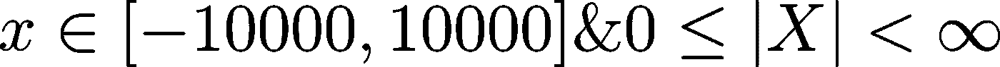
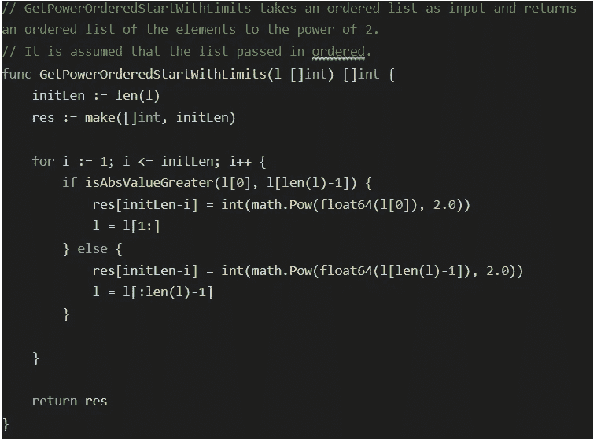
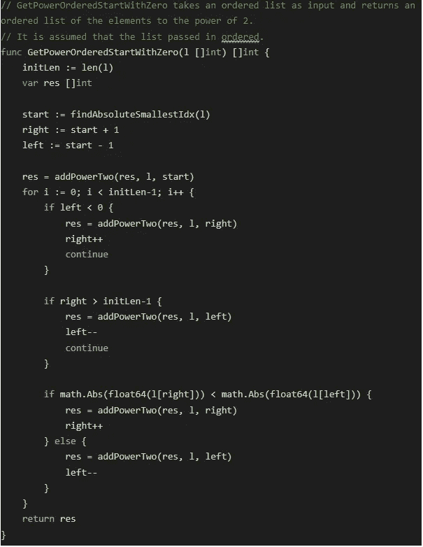
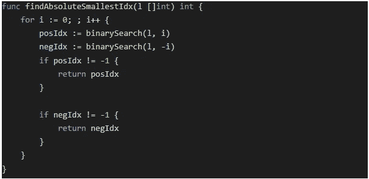
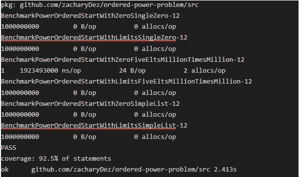
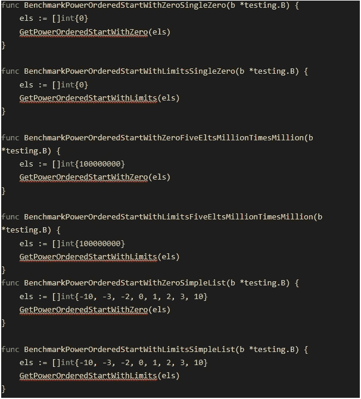
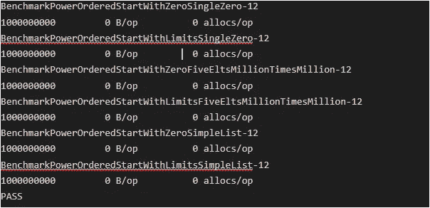
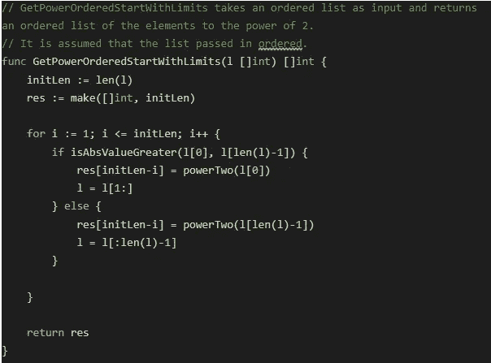
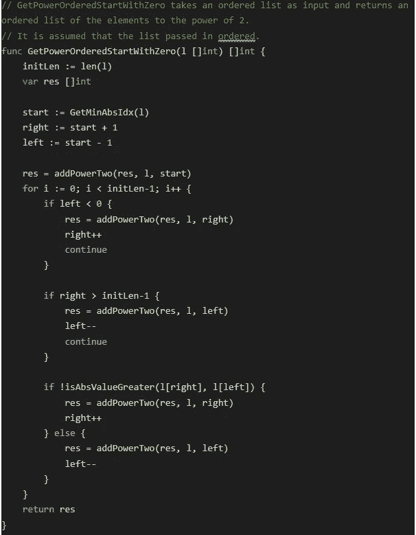
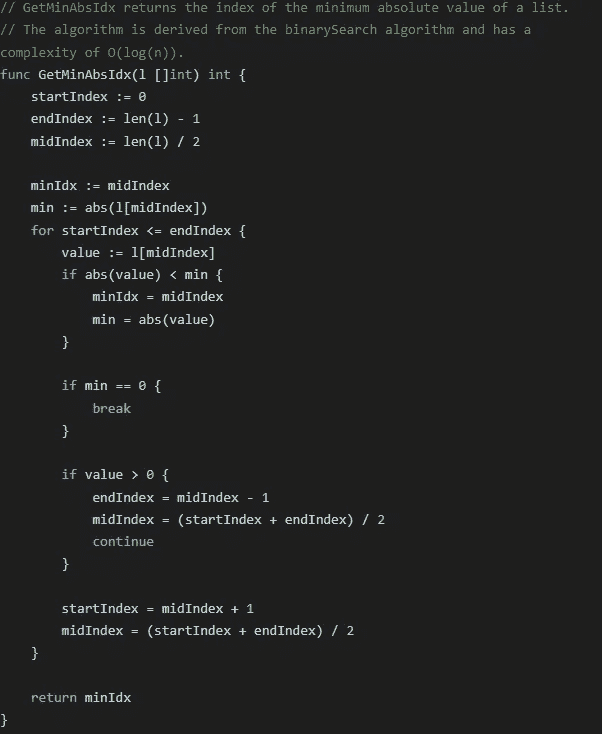

# 有序幂问题

> 原文：<https://levelup.gitconnected.com/the-ordered-power-problem-43d492fcfbbf>

## 计算复杂性的迂回

# 介绍

我最近在相对高压的情况下遇到了一个小而有趣的问题。不细说，有效地解决这个问题对我来说是最有利的。我从这种情况中走出来，意识到最有效的解决方案就在我面前。然而，我仍然不相信我提出的解决方案与最佳方案相差甚远。

我决定重新考虑这个问题，并将我提出的解决方案与最佳方案进行比较。我认为这可能是一个有趣的借口来测试 Wolfram 的 4 步计算思维过程，并在 *golang* 中得到一些练习。

# 资源

所有代码都可以在[我的 GitHub 库](https://github.com/zacharyDez/ordered-power-problem)上找到。

[Golang Tour](https://tour.golang.org/welcome/1) 和官方文档是开始学习围棋的好方法。如果您有其他建议，请告诉我！

# 问题概述

您会得到一个有序整数列表，范围从-10000 到 10000。设计一个算法，返回数字的 2 次幂的有序列表。

# 规定

示例列表:

*   [-10000, 0, 8, 9]
*   [-10000, 10000]
*   [-1, 2, 3, 4, 5]

该列表包含区间-10000 到 10000 之间的任意数量的元素。考虑到列表中可能存在重复，列表的大小可以从 0 到无穷大。

# 摘要

有许多低效的方法来解决这个问题，但是我将集中讨论两种不同的方法。这两种算法之间的区别对于比较它们的执行时间和计算复杂性是很有趣的。

第一种方法寻找列表的绝对最大元素。利用列表已经排序的事实，搜索绝对最大值就是比较第一个元素，最大的负数(如果是负数)和最后一个元素，最大的正数(如果是正数)。虽然我们的数组与输入数组的初始大小不匹配，但我们可以迭代地比较第一个元素与最后一个元素，以找到最大的绝对值，将其添加到结果数组中，并将其从输入数组中删除。

第二种方法使用相反的方法，我们首先找到最小的绝对值(0 是最小的可能值)，我们将这个值添加到新的数组，并且我们迭代地比较这个数组的两边，直到没有元素留在一边或者所有的元素都被检查过。寻找下一个要添加的值似乎有更多的条件，这可能会带来额外的复杂性。

# 计算

我使用输入提取了两种算法的轨迹，以帮助可视化这两种算法是如何操作的。输入是[-10，-3，-2，-1，0，2，3，10]。

对于第一种情况，我们首先填入最大值:

[0 0 0 0 0 0 0 0]

[0 0 0 0 0 0 0 100]

[0 0 0 0 0 0 100 100]

[0 0 0 0 0 9 100 100]

[0 0 0 0 9 9 100 100]

[0 0 0 4 9 9 100 100]

[0 0 4 4 9 9 100 100]

[0 1 4 4 9 9 100 100]

注意用 *make([]int，initLen)* 初始化结果数组导致的零初始化。查看*巡回赛*的[零值](https://tour.golang.org/basics/12)部分。

对于第二种情况，我们从最小的元素到最大的元素构建结果数组:

[0]

[0 1]

[0 1 4]

[0 1 4 4]

[0 1 4 4 9]

[0 1 4 4 9 9]

[0 1 4 4 9 9 100]

请注意，我们没有如上所述的零初始化。得到的数组用 *var res []int* 初始化。

我添加了两种算法的代码，但排除了二分搜索法算法。渲染看起来真的不是很好，我建议直接访问资源库:[https://github.com/zacharyDez/ordered-power-problem](https://github.com/zacharyDez/ordered-power-problem)。您必须深入以前的提交才能找到这个版本。如果你需要任何指导，请伸出手来。

# 口译

现在，我们应该使用哪种算法？就大小而言，我们可以看到第一种算法实现起来简单得多。但是复杂性呢？

第一种算法在线性时间内运行( *O(n)* )。我们对输入数组的每个元素迭代一次。即使我们每次迭代都比较两个元素。这里没有隐藏的细节可谈。

第二种算法稍微复杂一点。乍一看，复杂性似乎是线性的。然而，对*findabsabutesmallestidx*的调用隐藏了额外的复杂性。考虑到在有序列表中查找元素可以在 *O(log(n))* 中完成，我们可以假设查找最小绝对值元素只需要 *O(log(n))* 。这个假设依赖于输入列表包含值 0 的事实。在最坏的情况下，最小的绝对值元素可以是我们区间的上(或下)值元素。让我们调用代表我们搜索最接近 0 的元素的次数的变量: *m.* 算法的复杂度将是 *O(mlog(n))* ，因为我们最多搜索 *m* 次，并且单次搜索花费 *O(log(n))。*

由于这个额外的 *m* 变量，比较给定列表的两种算法的时间复杂度会很困难。在输入列表包含值 0 的情况下，第二算法的时间复杂度将是 *O(n)* ，因为迭代压倒了最小绝对值的发现。在这种情况下，两种算法具有相同的复杂性。

第二种算法还有另一个极端，它会导致一个重要的结果。让我们考虑这样的场景，其中 *x* 的域不是[-10X10，10X10 ]，而是[-10X10⁹，10x10⁹].]最大值，让我们称之为 *m* ，将是-10X10⁹或 10X10⁰.在这种情况下，复杂度将由找到第二算法的最小绝对值所需的时间决定。同样，这是因为我们称二分搜索法为从 0 到 n 的最小绝对值。

Golang 有一个有趣的内置基准测试工具，可以帮助我们演示这个不同的场景。下面是所使用的基准代码和示例输出结果:

需要注意的重要因素是*基准 powerorderedstartwithlimitsfiveeltsmilliontimesmin*记录的唯一大于零的 ns/op。该算法花费这些时间只是为了计算单个列表元素的能力。

如果第二种算法要与第一种算法竞争，我们必须实现一种方法，在小于线性的时间内找到绝对最小值。即使这样，代码的复杂性也可能会带来太多的开销，以至于无法证明使用第二种算法是正确的。这仍然是一个有趣的重构练习。

# 重构

我决定在 O(log(n))中搜索给定列表的最小绝对值。所实现的算法源自经典的迭代*二进制搜索*算法。有了这个变化，我们的两个幂算法都有了相同的复杂度( *O(n)* ) ，基准也是一样的。

以下是相同的基准:

这是操作码的最终版本:

# 结论

毕竟，我没有错，我的第一个直觉算法和理想的第一个算法一样有效，至少在复杂性方面。然而，我很惊讶实现是如此的复杂。我最初的解决方案远不容易实现和维护。我完全忽略了实现 *GetMinAbsIdx* 函数所需的时间，因为我假设列表将总是包含值 0。

我希望这篇内部漫谈能让你们中的任何人感兴趣！也许我成功地激发了你研究学习围棋的兴趣，甚至刷新了你关于算法和数据结构的旧笔记。

一定要查看 GitHub 库来直接访问代码。如果有任何问题或意见，请不要犹豫，我非常感谢您的反馈！