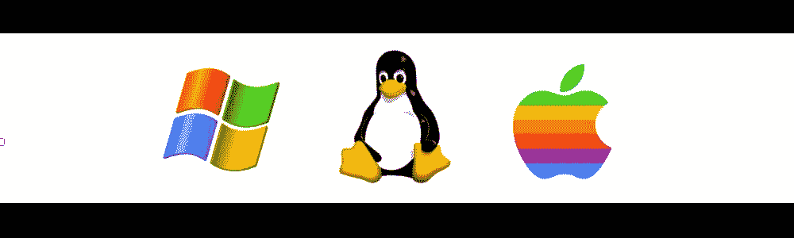

# 操作系统前景:我们所有人的指南

> 原文：<https://levelup.gitconnected.com/the-os-landscape-a-guide-for-us-all-bfb668d9539d>

当观察操作系统(OS)的前景时，相对于科学领域，我们发现了一些有趣的东西:对所有 OS 的解释都不像一个人可以教给一个五岁孩子的东西。人们可能希望有一个单一的操作系统，或者所有的计算机都遵循特定的准则，但事实并非如此。因此，我们需要处理历史的复杂性和技术的所有渐进步骤，并希望我们能够穿越混乱。

幸运的是，大多数无趣的低级工作在 20 世纪 60 年代就已经完成了，现在已经低到对大多数软件/web 开发人员来说已经失去了相关性。最早的“众所周知”的操作系统可能是 Multiplics 机器，这也是本概览在历史上开始的地方。

# 基础

Multiplics machine 是麻省理工学院在 1964-1967 年与贝尔实验室和通用电气联合开发的计算机，它的名字来自多路复用计算机，“一种从多个用户接受计算任务的计算机”。然而，贝尔实验室的一个新项目很快证明是一个更有成果的努力，它将在 2000 年关闭最后一台多功能机器。前 Multiplics 工程师投身于这个新项目，并带来了他们在 Multiplics 开发过程中的经验。

1972 年，他们推出了面向单个用户而不是一群用户的新电脑。第一台 Unix 机器就是这样建立起来的，并为现代操作系统奠定了基础。其中包括众所周知的命令`ls`、`cd`、`pwd`等。，这是第一次成型，以及一个特定的文件系统与开发环境。

很少有人知道 Unix 机器上的这些东西，因为 Unix 计算机很贵。所以在那个时候，让每个人都可以使用一个操作系统还没有被想到，发布源代码就像失去专利一样。因此，代码受到来自单一权威来源的限制性许可的高度保护:Unix 机器的任何新的可能的派生都需要与拥有 Unix 的权威进行协商。

但是因为 Unix 带来的思想是如此的有影响力，那些设计他们自己的操作系统的公司出于兼容性的原因想要使用和 Unix 机器一样的思想，这是不受专利保护的。因此，一些未来的操作系统利用了这一点，例如 BSD 操作系统，版本 1.0–4.0(下面将详细介绍)。然而，这产生了一个新问题:并非所有的衍生产品都使用相同的 Unix 特性，这使得兼容性难以实现。

为了解决这个问题，单一 unix 规范(SUS)制定了将操作系统称为“类 Unix”的要求任何遵循 SUS 的操作系统都将保留允许程序跨平台运行的特定功能。BSDs(Berkeley Software Foundation，始于 1978 年)发布了一个现已停产的操作系统家族，该家族以一种灵活的方式许可他们的类 unix 计算机，这给了他们的用户更多的自由。FreeBSD、OpenBSD、DragonFlyBSD，以及最重要的达尔文操作系统，都是一些最著名的 BSD 操作系统。

无论哪种方式，任何许可仍然是许可，这通常意味着限制。IBM 希望避免与 Unix 或 BSD 谈判，希望拥有自己的操作系统，可以随意使用。他们将需要从头开始创建它，而不是使用 CP/M OS，这在当时(大约在 1980 年，从 1974 年开始)是广泛可用的。在与软件供应商的一次小纠纷后，IBM 给了一家小公司这样做的机会，这导致了微软在 1980 年推出 MS-DOS，击败了 CP/M。在接下来的几十年里，微软开始主宰个人电脑市场。

这种操作系统的代码也受到专利保护，这意味着，到目前为止，外行人很难获得所有的操作系统软件。甚至用于教育目的的 MINIX OS 代码(Unix 的分支，1987 年发布)也有一些许可问题，阻碍了它的普及。类似的事情也可以说是关于操作系统的 BSD 家族。唯一永久和完整的解决方案是一个拥有无数软件应用程序的免费操作系统，它是开源的，任何人都可以查看、学习和复制。用来构建他们自己的操作系统，一般来说，使用他们认为合适的任何方式。

因此，GNU 项目是由理查德·斯托尔曼在 1983 年创建的。他想区分他的许可和 Unix，所以他把他的项目叫做“GNU”:**G**NU 是 **N** ot **U** nix！”:操作系统类似 unix，但没有任何限制性许可。许多人加入了这个项目，毫无疑问是受到了 GNU 宣言的启发，并开始构建这个神秘的操作系统。编译器、文本编辑器、解释器、用户界面等。，都是从头开始写的，大部分代码是几年后，也就是 1990 年前不久完成的。

然而，GNU 项目仍然面临着一个大问题:低级代码仍然需要编写，比如内核，他们称之为 GNU Hurd。当开发还在继续的时候，一个聪明而积极的计算机科学学生宣布他正在作为一个副业项目构建一个内核，不久之后，向公众发布了它。GNU 的开发人员意识到 Linus Torvalds 已经完成了他们需要的大部分工作，没有理由不在他们的操作系统中使用它。

许多开发人员没有在 Hurd 上工作，而是转向 Torvalds 的内核，并很快开始将其整合到 GNU OS 中，重写某些 GNU 应用程序以使内核工作。托瓦尔兹欣喜地将他的项目命名为“Freax ”,因为它现在需要被识别。但是因为这个操作系统的核心是如此的有影响力，有人把“Linux”这个名字附加到 GNU 操作系统上。有了这个最后的组件，第一个开源的、非限制性的许可操作系统在 1991 年诞生了。可以自由地使用、修改、学习和做任何你想做的事情。

与此同时，成立于 1976 年的苹果公司已经获得了足够多的软件和许可，以构建一个名为“系统 1”的操作系统，并于 1984 年发布。在此期间，微软在发布 Windows 1-3 操作系统家族方面也取得了长足的进步。在 BSD 家族中，大约有十几个新的操作系统，可能最著名的是 1982 年发布的 SunOS(后来在 1992 年被 Solaris 取代)和 1986 年发布的 Xenix。一台名为 NeXTSTEP 的 Unix 计算机于 1989 年发布，最有趣的一点是它的某些部分最终出现在了 MAC 电脑自 2000 年以来一直使用的操作系统 Darwin 中。

这些是操作系统的基础，应该能让你对我们已经走了多远有一个大概的了解:从封闭源代码、授权软件，到完全免费的操作系统。与它的同辈相比，GNU 和 Linux 的想法被证明是革命性的。

# Linux 操作系统

虽然仍然有很好的理由使用 BSD OS 的 T1，但 Linux 已经变得如此普及，以至于统计数据说明了一切:世界上大多数超级计算机使用 Linux，90%的云基础设施和相当一部分正在运行的服务器也使用 Linux。

其余的[数据也令人难以置信。现在有数百种不同的 Linux 版本，被称为发行版(也称为发行版或风味版)，每一种都不同，但有时本质上是相同的。每个发行版都试图适应特定的需求，比如一台有一整套取证工具的机器，或者一个在弱计算机上工作的轻量级操作系统。鉴于它们的数量和本文的篇幅，讨论每一个都是多余的。然而，看看他们的历史和他们是如何被谈论的是很有用的。](https://hostingtribunal.com/blog/linux-statistics/)

最初的 Linux 操作系统没有得到很好的维护，所以有些人想创建自己的发行版，由他们独立维护。从原始代码库中出现了三个主要的分支:Slackware (1992 年)、Debian (1993 年)和 Red Hat (1994 年):

*   Slackware OS 的是 Linux 最初的几个分支，主要包括 TCP/IP 协议栈，这也是它们早期流行的原因。鉴于 TCP/IP 变得如此重要，这些协议已经包含在 SUS 中，并且现在默认情况下在几乎所有类似 unix 的机器中实现。由于这个原因，Slackware 变得过时了，只有少数几个版本仍然保留着，比如 Slackware ARM。
*   **Debian** 是一个更广为人知的发行版，它将会有一个缓慢但安全的发布时间表。开发人员伊恩·默多克开始开发这个新版本的 Linux，并于 1993 年宣布和发布。随着时间的推移，注意到可靠的更新流，人们更信任 Debian 而不是原始的 Linux 代码库，这使得 Debian 成为 Linux 发行版的前沿。虽然人们仍然可以下载原来的 Debian 操作系统，但更常见的是下载/使用它的分支，如 Kali Linux 或 raspberryPi 操作系统。
*   **Red Hat** 是一家成立于 1993 年的公司，为其他企业推广开源软件，并通过向他们提供软件咨询来赚钱。他们编写 Red Hat 是为了增强安全性、合规性和使用灵活性，并维护代码库(包括内核)作为其业务模型的一部分。红帽发行版的一个例子是 CentOS。

然而，看到 Debian 有一个难以使用的用户界面，另一个 Linux 操作系统发行版家族获得了牵引力:Ubuntu。Ubuntu 基于 Debian，于 2004 年发布，目标是让 Debian 更加用户友好。随着时间的推移，这个家族越来越受欢迎，并启发了许多其他发行版，如 Linux Mint，这是最受欢迎的 Linux 发行版之一。

值得一提的另一个 Linux 操作系统是 Chrome 操作系统，用于 Chromebook，这是一款廉价的笔记本电脑，在学校获得了惊人的成功。有趣的是，这个操作系统只能预装在运行它的机器上，这意味着因为在撰写本文时 Chrome 操作系统似乎至少占所有操作系统的 1.21%，这使它成为更常见的 Linux 发行版之一。

自 20 世纪 90 年代初以来，新的发行版不断涌现，而微软和苹果也不断发布带有主题命名的新版操作系统。Linux 发行版最终在 2015–2017 年左右稳定下来，少数发行版处于领先地位。然而，这并不是操作系统历史的终结:当 Linux 发行版成倍增加的时候，另一个改变游戏规则的事件发生了:智能手机。

# 移动操作系统、RTOS 和物联网

然而，这似乎很奇怪，即使相对“简单”的手机也需要操作系统才能运行。黑莓用的是黑莓 OS。三星用 Tizen OS，iPhone 用达尔文，诺基亚用 Symbian OS 安卓用安卓。2000 年代的大多数手机都有内部开发的轻量级操作系统来适应他们的手机，试图将用户留在他们的生态系统中(想想苹果的 iCloud)。

如今，只有两个主要的移动系统:iOS 和 Android，黑莓等其他系统远远落后。除了 iOS(从达尔文进化而来)之外，大多数其他手机操作系统都以某种方式基于 Linux，比如 Sailfish 操作系统或者 Firefox 操作系统。

然而，物联网的操作系统不一定运行在 Linux 上。物联网需要小型设备来执行非常具体的工作，而 Linux 在大多数时候对这些迷你电脑来说太大了。这些操作系统也可能是实时操作系统(RTOS)，用于内存分配、后处理等。，可能根本不需要，这是任何 Linux 都配备的。

更重要的是，这些设备的许可并不完全正确，这意味着虽然它们的操作系统不再使用，但至少 BSD 许可仍然有效。有了它们，少数几个[操作系统](https://ubidots.com/blog/iot-operating-systems/)开始为自己正名，每一个都与其他操作系统略有不同(康蒂基似乎是领头的)。但是因为这些小设备是如此的轻便，许多公司可以创建他们自己的操作系统来满足他们的特定需求。比如亚马逊开发了 FreeRTOS，而微软用的是 Windows 10 IoT。

仅此而已；还有很多我错过的操作系统(比如游戏机)和无数其他开源的操作系统。无论哪种方式，这涵盖了大约 95%的已知操作系统，并为我们提供了一个整体景观的概览。