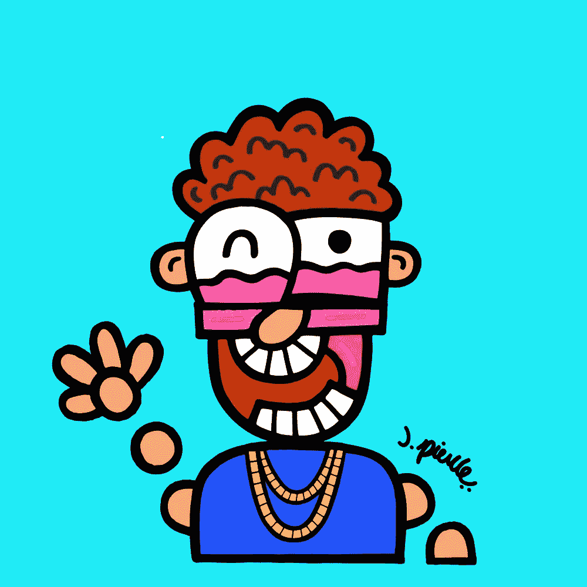
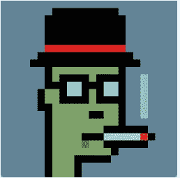
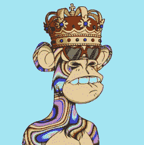
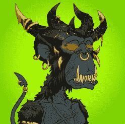
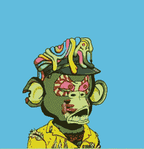
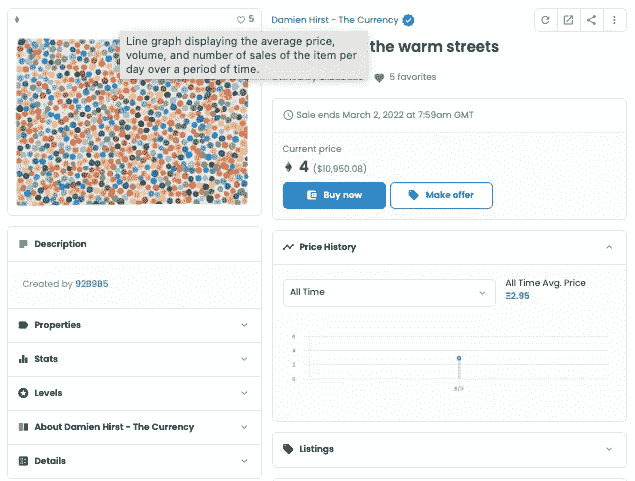
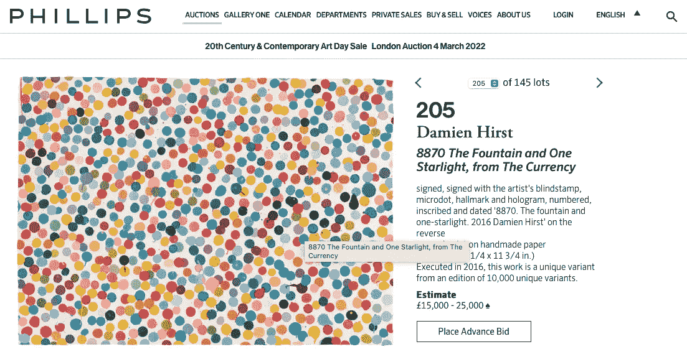
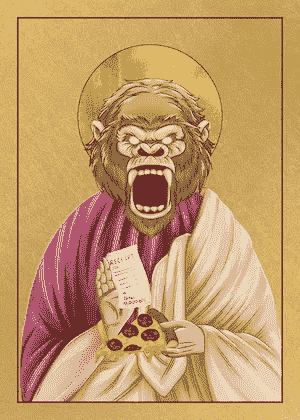
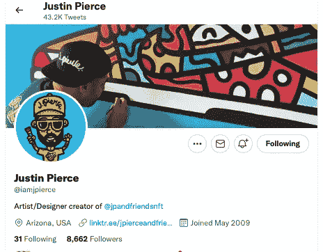
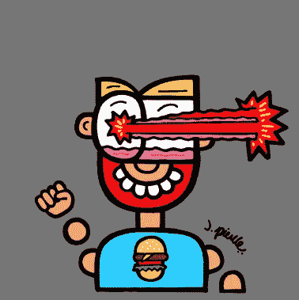

# 那些拥抱 NFTs 来扩大他们的影响和影响力的画家们

> 原文：<https://levelup.gitconnected.com/the-painters-who-are-embracing-nfts-to-grow-their-reach-and-increase-their-impact-63ea6041188e>

## 达明安·赫斯特和贾斯汀·皮尔斯成功了——下一个会是谁？

[我的“J. Pierce &朋友”NFT — #502](https://opensea.io/assets/0x633cfa9ac099d18c1b33736892427f0a7c1d120a/502)

> *“我不知道这是不是艺术，但我知道我喜欢*
> 
> *——华特·迪士尼*

我们都看过著名的艺术作品，并暗暗相信我们可以做得更好。大多数父母都表示，他们 4 岁的孩子可以复制一些世界上最受尊敬的现代艺术作品。有些人甚至进行了实验来证明这一点。

纪录片' [*我的孩子可以画出那个*](https://youtu.be/j46V9wclBaw) *'* 检验了艺术价值是否是创作本身所固有的，或者创作是否需要由特定的人来完成才能具有真正的价值。

纪录片中的孩子据称从他们的画中赚了几十万美元——这证明了这一点:

不管是什么东西，是一幅画，一件雕塑，还是一个有形或虚拟的象征。它从哪里起源，谁创造了它，谁对它负责，都不重要。如果我们一致认为它有价值，那么它就有价值。

这就把我们带到了 NFTs。

# NFTs 是艺术吗？

迄今为止，NFT 最著名的项目主要是定制的限量版 JPEGs 系列。这类项目通常是在他们之前成功的项目的衍生物，其主要用途是作为社交媒体上的个人资料图片。

最初有 crypto punk——一系列 10，000 个极简的 26x26 像素图像:

[隐朋克#6297](https://opensea.io/assets/0xb47e3cd837ddf8e4c57f05d70ab865de6e193bbb/6297)

接下来是无聊猿游艇俱乐部，以猿为主角的主题建筑:

[无聊猿#8585](https://opensea.io/assets/0xbc4ca0eda7647a8ab7c2061c2e118a18a936f13d/8585)

变异猿游艇俱乐部将无聊的猿类和变异血清应用于这些动物，赋予它们更奇怪的特性和特征:

[突变猿#4849](https://opensea.io/assets/0x60e4d786628fea6478f785a6d7e704777c86a7c6/4849)

幼猿变种人俱乐部以变种人猿游艇俱乐部为灵感——年轻是他们唯一的与众不同的因素:

[幼猿突变#2017](https://opensea.io/assets/0x1ed89eb526a8be0ac8c5f7a1646698c6913029e1/2017)

我希望你现在已经明白了。

新的项目一直在启动，许多项目试图建立在上一个项目成功的基础上。有些是由艺术家和程序员的团体和集体发起的，这些团体和集体对过去的成功负有责任。其他人只是在“模仿”他们之前的人(双关语)。

我当然是在嘲笑这里的任何人，无论是那些购买了这种 NFT 的人还是那些最初创建它们的人。

上述四个独立的 NFT 在最后一次出售时总共赚了 1566 ETH(按今天的汇率计算超过 470 万美元)。

但鉴于 NFT 项目的激增，这些项目基于一次生成并出售数千张相似(但略有不同)的图像，因此毫不奇怪，许多旁观者对 NFT 从艺术角度给世界带来的东西持悲观和愤世嫉俗的看法。

鉴于艺术家显然有潜力接触到一个由积极的(看似富裕的)收藏家组成的市场，通过传统媒体成名的艺术家(无论是摄影师、电影制作人还是画家)也在探索 NFT 市场就不足为奇了。

# 达明安·赫斯特——货币

你可能听说过英国艺术家达明安·赫斯特——他最著名的作品是各种现代艺术作品，比如[“在一个活着的人的头脑中死亡的物理不可能性”](https://www.damienhirst.com/the-physical-impossibility-of)——一具悬浮在甲醛罐中的虎鲨尸体。

赫斯特是成功的和著名的。上面这幅作品是[据报道在 2004 年至少卖了 800 万美元。](https://en.wikipedia.org/wiki/The_Physical_Impossibility_of_Death_in_the_Mind_of_Someone_Living)

2021 年 7 月，他启动了自己的项目——“货币”，迈出了进入非金融交易领域的第一步。你可以在一个单独的帖子中阅读更多关于这个项目的内容，讨论这个项目以及它对艺术、金钱和价值的概念意味着什么，[这里](https://tobyhazlewood.substack.com/p/damien-hirsts-nft-experiment-will?utm_source=url)。

来源:[推特](https://twitter.com/hirst_official/status/1415265846314905602?s=20)

关于[“货币”](https://www.esquiresg.com/making-choice-damien-hirst-the-currency-art-nft-collection/)，需要知道的重要事情有:

*   2016 年，这位艺术家创作了 10，000 幅独特的个人‘点画’，分别命名和编号，并安全储存。每幅实物画都有一个 NFT。
*   当公开拍卖开始时，每个买家都可以选择接受纸质印刷品，或者 NFT 及其附带的数字图像——但关键是他们必须做出选择——他们不能两者兼得。每件艺术品(或 NFT)售价为 2000 美元。
*   在要约期结束时，所有由所有者保留的对应于 NFTs 的硬拷贝绘画都被赫斯特销毁了。所有用来交换实物画作的 NFT 都在区块链被烧掉了(通过把它们送到一个废弃的钱包里)。

赫斯特实际上是在进行一项实验，以确定他的买家认为哪里存在最大的价值——要么是 NFT 的所有权*要么是 NFT 所代表的实物画作的所有权。*

值得注意的是，选择 NFT 的买家还会收到他们图像的数字副本，因此如果他们愿意，可以打印一份艺术品并在他们的墙上展示。

# 销售怎么样了？

现有信息表明，约 2200 幅赫斯特作品的买家选择保留数字代币，而不是用它来交换画作。该项目在 [NFT 市场 OpenSea](https://opensea.io/collection/thecurrency) 上的页面显示，这些代币目前存放在大约 1700 个加密钱包中。

值得注意的是，NFT 收藏的“底价”(任何拍卖的最低价格)目前是 4 ETH——在撰写本文时，相当于略高于 1 万美元。

《货币》中的 NFT——在 OpenSea 出售

目前还不清楚是 7800 名买家选择用他们的 NFT 换实物画作，还是该项目未能卖出全部 10000 套。

不管是哪种情况，一些原画的买家随后提出转售。伦敦的飞利浦拍卖行[将很快出售一件样品，估计价格超过 2 万美元。](https://www.phillips.com/detail/damien-hirst/UK010222/205)

2022 年 3 月发售的货币' # 8870—

从表面上看，这些画的价值似乎比非艺术珍品要高得多，但两者都大幅升值了。如果这是赫斯特在非功能性翻译领域的唯一尝试，那将令人惊讶。

当像赫斯特这样的杰出艺术家已经扩展到非艺术领域时，很有可能许多其他人也在计划他们的行动。

这是另一个例子。居住在美国亚利桑那州的画家贾斯汀·皮尔斯。

# J.皮尔斯和朋友

退一步说，我作为 NFT 投资者的第一次实验是痛苦的。经过细致的研究，我选择了 NFT 的一个项目，并铸造了他们的两个 NFT，希望我能在下一个大项目(也是利润丰厚的项目)中占得先机。

为了学习如何评估项目，并亲身体验重新打造 NFT 的过程，价值几百美元的 ETH 似乎是一个很小的代价，所以我认为这钱花得值。我[写了一本电子书](http://tzh.gumroad.com/l/jqcUd)详细描述了这个过程，与他人分享我的学习。

当我从一个名为“[隐圣徒](https://opensea.io/collection/the-crypto-saints?search[sortAscending]=false&search[sortBy]=PRICE)的项目中选择并铸造了两个 NFT 时，我希望一旦该项目完成了其目标 7777 个 NFT 的铸造，每个都会获得价值和合意性。

[隐圣# 1996——我的一个](https://opensea.io/assets/0x1b1cbf84f3833aa2dec981aef8c7bd2730f1223c/1996)

碰巧的是，该项目失去了动力，几个月后，当购买量刚刚超过 2000 时，它停止了铸造。秘密圣徒的所有者留下了他们最初的艺术品，这些艺术品的价格后来逐渐下降。

我想我最好更新一下我的电子书,吸取隐圣徒实验的经验教训。在研究其他项目时，我第一次遇到了艺术家贾斯汀·皮尔斯和他的 NFT 项目“J. Pierce 的朋友们”

# “现实生活中”的成功艺术家

贾斯汀·皮尔斯是住在亚利桑那州的知名艺术家。

[贾斯汀·皮尔斯在推特上](https://twitter.com/iamjpierce)

他色彩明亮的画作以充满活力的风格化图像为特色，他拥有私人和名人收藏家的固定客户群，包括 NBA 球星勒布朗·詹姆斯和演员塞缪尔·L·杰克逊。

在疫情最高潮的时候，杰克逊穿着一件皮尔斯设计的 t 恤出现在吉米·基梅尔现场秀上。

[https://twitter.com/iamjpierce/status/1253881031607779328?s=20](https://twitter.com/iamjpierce/status/1253881031607779328?s=20)

他的作品装饰了壁画、车辆包装以及耐克和万斯定制的运动鞋。他色彩明亮的艺术反映了他的灵感，包括安迪沃霍尔的作品。

当我遇到他的 NFT 项目时，我很想了解更多——它已经完全铸造好了(我错过了以每 NFT 0.037 ETH 的发行价铸造一个的机会)。我唯一的选择就是在发现这个项目后不久，在市场上高价购买一个。

[J .皮尔斯&好友— #1441](https://opensea.io/assets/0x633cfa9ac099d18c1b33736892427f0a7c1d120a/1441?ref=0x5c5321ae45550685308a405827575e3d6b4a84aa)

该系列中的 NFT 是在铸造时产生的，每一种都具有 100 多种个体特征。性状的组合决定了系列中 NFT 的相对稀有性(以及价值)。如果你想知道更多关于这个过程是如何工作的，[我关于这个主题的电子书](http://tzh.gumroad.com/l/jqcUd)详细描述了它。

每一个 NFT 都是用贾斯汀·皮尔斯自己手绘的元素组装而成的，这些元素是在铸造时由算法组装的，从而制造出每一个独特的 NFT。你是否觉得这种艺术有吸引力将取决于你的个人品味，但毫无疑问，NFT 是他艺术作品的代表。

他的创作风格很好地从实物绘画转化为非实物绘画。

他的参与和他的 NFTs 在线所有者和收藏家的热情参与——在 Twitter 上和在项目不和谐频道内——是显而易见的。他经常出现在家乡亚利桑那州的电视上，宣传他的作品，并扩大人们对他的 NFT 项目和 NFT 生态系统的认识。

来源: [YouTube](https://youtu.be/V7tCD_g2nQ8)

与其说 NFT 是由一群在项目完成后消失的不知名的艺术家和程序员产生的，Pierce 似乎认识到他的 NFT 的价值可能会提升他职业生涯中创意股票的价值。

他显然致力于将 NFTs 视为与他的艺术品收藏家联系的另一种媒介，而不是一次性的额外收入来源。他正在拥抱和探索非功能性写作和其他渠道的世界，把它作为创造性表达的额外媒介。

最重要的是，他似乎在这个过程中获得了巨大的乐趣。

# 未来会怎样？

作为 j . Pierce Friends 的投资者，我当然希望对非功能性测试的需求会随着价格的上涨而增长。我也喜欢这件艺术品，我钦佩这位艺术家继续宣传和推广这个项目和他的艺术的动力——不仅仅是 NFTs，还有他参与的所有其他项目。

正如达明安·赫斯特的 NFT 项目所展示的那样，作为“货币”一部分发行的国家艺术博物馆和实物绘画都大幅升值。这更多的是因为收藏家认为拥有与他作为创作者相关的东西会带来声望和价值，而不是艺术品上的点。当他把自己标榜为 NFT 创作者时，这种声望并不是一夜之间获得的——而是多年来他作为艺术家积累股票价值的结果。

这是一个有用的提醒，无论我们从美学角度多么喜欢一件艺术品，它的价值很大一部分是由谁创作的以及项目背后的故事决定的。我相信这是 J. Pierce & Friends(以及其他类似的 NFT 项目)脱颖而出的地方。

时间会证明一切！

如果你喜欢阅读这样的故事，并且愿意支持我和媒体上的其他作家，可以考虑注册**成为媒体会员。一个月 5 美元，给你无限的故事。如果你注册使用* [*我的链接*](https://tobyhazlewood.medium.com/membership) *，我会赚一小笔佣金。故事中的其他各种链接也是如此。**

* [## 通过我的推荐链接加入灵媒——托比·黑兹伍德

### 作为一个媒体会员，你的会员费的一部分会给你阅读的作家，你可以完全接触到每一个故事…

tobyhazlewood.medium.com](https://tobyhazlewood.medium.com/membership)* 

*注意:*本文仅供参考。不应将其视为财务或法律建议。在做任何重大财务决定之前，先咨询财务专家。**