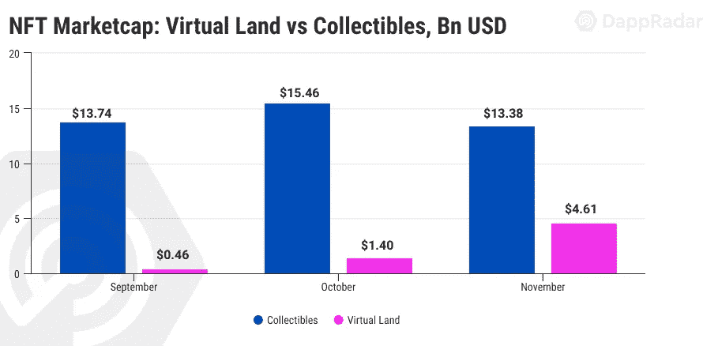
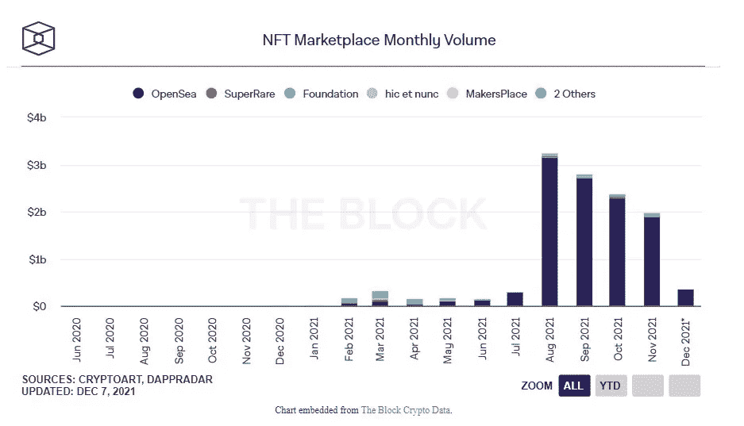
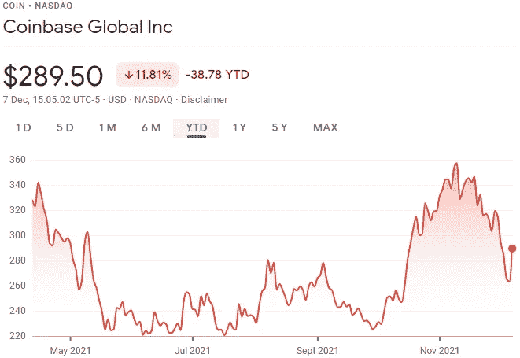
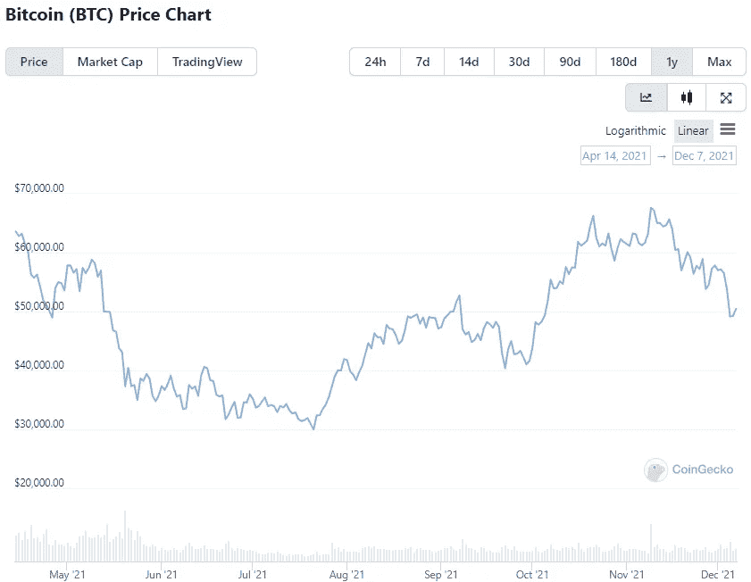

# 去中心化统治之路:为什么比特币基地的 NFT 市场会把平台变成无所不在的力量

> 原文：<https://levelup.gitconnected.com/the-path-to-decentralized-domination-why-coinbases-nft-marketplace-will-turn-the-platform-into-an-bd255902cc7a>

它已经是世界上第二大加密货币交易所，但比特币基地计划建立一个全面的 [NFT 市场](/nfts-explained-what-they-are-how-they-work-and-their-future-8808937d92b3)将该平台变成加密货币生态系统中无处不在的资源。

比特币基地联合创始人[布莱恩·阿姆斯壮](https://www.bloomberg.com/news/articles/2021-11-10/-big-or-bigger-than-crypto-trading-coinbase-bets-large-on-nfts)对不可替代代币的未来非常乐观，并认为这些资产最终可能会超过加密货币交易。

“我们对 NFTs 感到非常兴奋，这将是未来加密的一个非常大的领域，现在已经是了，”Armstrong 说，并补充说“它可能会和比特币基地的加密货币交易所一样大或更大”。

*(图片:***)**

*根据 Defiant 的统计数据，尽管人们担心 NFT 市场的寿命，但到 2021 年底，不可替代代币的总市值将超过 200 亿美元。*

*随着元宇宙的出现，投资者寻求购买虚拟土地，虚拟房地产的兴起推动了当前的显著增长。*

**

**(图像:*[*a 覆盖*](https://www.arover.net/2021/12/07/former-lyft-executive-joins-opensea-as-chief-financial-officer/) *)**

*如上图所示，OpenSea 目前在一定程度上是 NFT 市场中最具主导地位的市场，整个平台的月交易量短暂达到 30 亿美元以上，但据信比特币基地内置的加密货币交易所可以让用户购买、出售和持有 NFT 的过程更加无缝。*

*例如，要在 OpenSea 上进行交易，用户需要首先在比特币基地等交易所购买加密货币，并设置一个连接到平台的 MetaMask 等钱包。然而，随着比特币基地与法定货币的简化整合，用户直接通过信用卡或借记卡在交易所购物可能会简单得多。*

*Forrester 副总裁 Mike Proulx 解释说:“该公司希望通过一个简单的[用户界面]使自己与众不同，该界面将 NFT 过程去神秘化，并使其更易于日常创造者和收藏家使用。”。*

*虽然 NFT 仍有大量工作要做，以与我们习惯于在[加密货币领域](/keeping-your-crypto-safe-4-essential-ways-to-secure-your-cryptocurrency-wallets-e1f10f5b4ea1)看到的交易量水平竞争，但整合到比特币基地 6800 万强大用户群将为该领域提供前所未有的曝光率，目前该领域每周只有约 10，000 个活跃的 NFT 钱包。*

# *无缝的社会驱动型投资*

*谈到比特币基地的 NFT 市场，Brian Armstrong 表示，该公司致力于开发一个平台，为用户提供社交体验以及买卖不可替代代币的能力。阿姆斯特朗认为，此举将使比特币基地的平台在结构上更类似于 Instagram，而不是易贝。*

*该市场定于 2022 年上半年推出，将寻求在 NFT 市场增长的形成阶段超越其竞争对手。*

*“我认为让人们关注你最喜欢的艺术家或创作者，并从你关注的人那里获得一些内容，这真的很强大，”[Armstrong](https://www.fnlondon.com/articles/why-coinbases-chief-expects-the-nft-market-is-more-like-instagram-than-ebay-20211110)说，强调了他对社交驱动的 NFT 空间的意图。“此外，如果你真的喜欢，你可以去那里买一件 NFT，并在你自己的社交档案中展示它。”*

*“就像这样简单的事情，你如何连接你的钱包？你知道，希望你不必安装 Chrome 扩展，”Armstrong 说，这表明比特币基地的市场可能比目前的平台更加用户友好。“如果你的身份、支付方式等一切都已经从你的 Gmail 账户连接上了，那么购物有望成为一次点击体验。”*

# *在华尔街收获回报*

*值得注意的是，[比特币基地成长为不可替代的代币可能意味着该公司的股价将更少依赖比特币的表现来升值。](https://en.freedom24.com/ideas/10418-coinbase-investidea)*

**

*在纳斯达克推出 COIN 之后，我们可以看到该股票经历了加密货币市场带来的大部分著名波动。这并不令人惊讶，因为该平台仅在加密货币生态系统内运营，但考虑到尽管 BTC 在 11 月创下历史新高，但硬币目前仍低于其发行价，这仍会令人失望。*

**

**(图片:* [*守宫*](https://www.coingecko.com/en/coins/bitcoin) *)**

*在同一时期，我们可以看到 BTC 的价值与硬币的价值走势极其相似，这说明了外汇对世界上最著名的加密货币的命运有多么依赖。*

*“比特币基地最近的增长主要是由于比特币的反弹，因为这些资产彼此之间有很强的相关性，同时该公司也有额外的增长动力，”自由金融欧洲投资研究主管 Maxim Manturov 解释道。*

*随着该公司的专用 [NFT 市场](/how-to-evaluate-commercial-nft-projects-and-mint-your-first-token-53ee4d14ee9d)的出现，曼图罗夫还强调了该平台为机构投资者提供的主要服务的发展，该服务“将尖端技术结合在一个单一的解决方案中，以允许更多的资产进行交易。”*

*通过超越传统加密货币交易的创新，比特币基地有能力打破比特币依赖的枷锁——尽管许多加密爱好者会辩称，从历史上看，这并不是坏事——并按照自己的方式确保增长。*

*不可替代代币在投资界仍是一个存在分歧的存在，但比特币基地为适应非替代代币的买卖所做的工作可能会为更广泛的接受铺平道路。这样一来，该平台很可能成为整个加密领域无所不在的力量。*