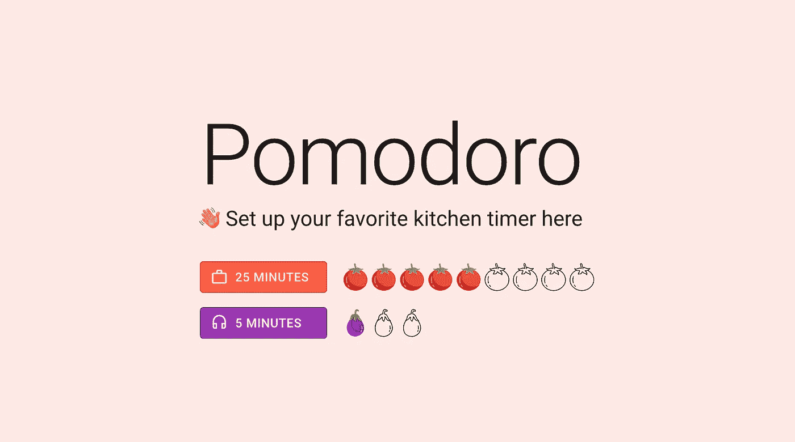
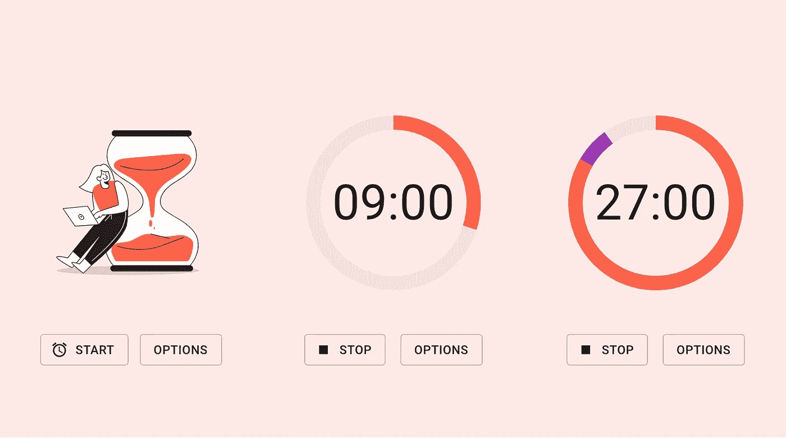
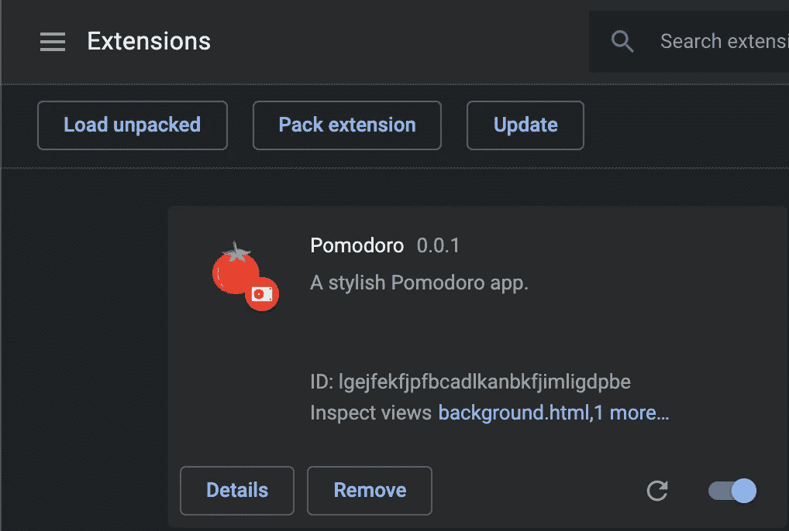

# 在 React 中烘焙 Chrome 扩展的完美配方

> 原文：<https://levelup.gitconnected.com/the-perfect-recipe-to-bake-a-chrome-extension-in-react-884e84ba25ba>

*按照这个食谱，你也可以烘焙出完美的 Chrome 扩展！*


照片由[鲁本·麦克费特斯](https://unsplash.com/@reubenmcfeeters?utm_source=medium&utm_medium=referral)在 [Unsplash](https://unsplash.com?utm_source=medium&utm_medium=referral) 拍摄

Chrome 是全球最受欢迎的网络浏览器，占据了近 70%的市场份额。Chrome Extensions 是一些小软件程序，可以增加你的网络浏览体验。

通过简单地混合三种基本成分:HTML、CSS 和 JavaScript，您就可以创建一个优秀的扩展。然后把它们都放到一个大的 zip 文件中。但是，当您可以利用丰富的 JavaScript 用户界面库并舒适地呆在您熟悉的开发环境中时，为什么要从头开始呢？

在本文中，我们将看看一个结合了 [React](https://reactjs.org/) 和它的使能器 [Create-React-App](https://reactjs.org/docs/create-a-new-react-app.html#create-react-app) 的配方，来制作一个有品味的 Chrome 扩展。

> 为了清晰易读，本文中的代码示例经过了编辑。你可以在[这个库](https://github.com/naush/chrome-ext-example)中找到原始源代码。

为了演示，我们将构建一个 Chrome 扩展来促进[番茄工作法](https://en.wikipedia.org/wiki/Pomodoro_Technique)。

> 番茄工作法是弗朗西斯科·西里洛发明的一种时间管理方法。这种技术将工作分解成间隔，由短暂的休息分开。Pomodoro 是意大利语中番茄的意思，指的是番茄形状的厨房计时器，它的发明者用它来测量他的活动时间。

我们的扩展将包括一个页面，供用户选择他们的会话持续时间。显示数字厨房定时器的弹出窗口。和一个后台脚本，每当到休息时间时会发出哔哔声。

# 入门指南

Chrome 扩展的核心是[清单文件](https://developer.chrome.com/extensions/manifest)。该文件指示浏览器如何与浏览器的 API 进行交互，并定位资产文件。

运行`npx create-react-app pomodoro`开始一个新的 React 项目。我们构建扩展的第一步是用下面的代码替换机器生成的`public/manifest.json`文件:

```
{
  "manifest_version": 2,
  "short_name": "Pomodoro",
  "name": "Pomodoro",
  "version": "0.0.1",
  "description": "A classy Pomodoro app.",
  "icons": {
    "16": "logo.png",
    "128": "logo.png"
  },
  "permissions": [
    "storage",
    "alarms"
  ],
  "options_page": "index.html",
  "background": {
    "page": "background.html",
    "persistent": false
  },
  "browser_action": {
    "default_popup": "popup.html",
    "default_title": "Pomodoro"
  }
}
```

清单调用了组成我们的扩展的三个核心组件——选项页面、弹出页面和后台脚本。我们还向用户请求两个权限，用于在浏览器存储中存储用户设置，并在用户会话到期时提醒用户。

需要注意的一点是，Create-React-App 默认将所有内容编译到一个文件中。我们必须覆盖默认配置，将组件分解到单独的文件中，

## 多个入口点

设置多个入口点有不同的方法。为了简单起见，我将弹出 Create-React-App 来调整底层的 [Webpack](https://webpack.js.org/) 配置。

运行`npm run eject`弹出默认的 Webpack 配置文件，并将它们返回到您的项目中。为您想要添加的每个对应的入口点创建一个入口文件。

```
src
├── index.tsx
├── popup.tsx
└── background.ts
```

对您的`config/webpack.config.js`文件进行以下编辑。

```
entry: {
  index: './src/index',
  popup: './src/popup',
  background: './src/background',
},
```

这一改变将告诉 Webpack 在哪里可以找到三个入口点的源文件。在同一个配置文件中，我们还将指定哪个模板用于我们的入口点，以及用什么来命名编译后的文件。

```
plugins: [
  new HtmlWebpackPlugin(
    {
      inject: true,
      chunks: ['index'],
      template: './public/index.html',
    },
  ),
  new HtmlWebpackPlugin(
    {
      inject: true,
      chunks: ['popup'],
      template: './public/index.html',
      filename: 'popup.html',
    },
  ),
  new HtmlWebpackPlugin(
    {
      inject: true,
      chunks: ['background'],
      template: './public/index.html',
      filename: 'background.html',
    },
  )
],
```

现在我们准备好构建我们的扩展了！

# 准备

## 第一步

构建一个带有两个设置的选项页面，这两个设置允许用户分别选择他们想要分配给工作和休息的时间。



来自[www.flaticon.com](http://www.flaticon.com)的 [Icongeek26](https://www.flaticon.com/authors/icongeek26) 制作的图标

西红柿和茄子各代表一个 5 分钟的时间段。用户可以选择任意数量的西红柿或茄子来表示他们想要的时长。您可以在我的[库](https://github.com/naush/chrome-ext-example/blob/develop/src/pages/Options.tsx)中找到这个设计的完整实现。

与传统的 React 应用程序不同，弹出窗口和后台脚本与我们的选项不在同一个页面上运行。Chrome 扩展是反应式软件程序，只在必要时加载组件。跨这些组件共享全局状态的一种方法是添加一个持久层。

我们有两个选择。通用`localStorage`或 Chrome 浏览器专用[存储](https://developer.chrome.com/extensions/storage) API。

```
localStorage.setItem(
  'pomodoro',
  JSON.stringify({
    work: 25,
    break: 5,
  })
);
```

在上面的代码片段中，我们将应用程序状态序列化为一个字符串，并将其存储在键`pomodoro`下。或者，我们可以使用前面提到的存储 API，它允许在本地存储数据，或者在当前用户登录的所有 Chrome 浏览器之间同步数据。

```
chrome.storage.local.set({
  pomodoro: JSON.stringify({
    work: 25,
    break: 5,
  }),
}, () => {});
```

## 第二步

创建一个带有启动屏幕、计时器以及启动和停止计时器的按钮的弹出窗口。加入一个额外的链接，把用户带到选项页面。



插图由[manypixels.co](https://www.manypixels.co/)

弹出菜单上的主显示由三个[循环进度](https://material-ui.com/api/circular-progress/)组件堆叠而成。`React.useEffect`和`setInterval`的组合给数字钟供电。

```
React.useEffect(() => {
  let interval: any; if (state.status === Status.PLAY) {
    interval = setInterval(() => {
      // Refresh display every second
    }, 1000);
  } else {
    clearInterval(interval);
  } return () => clearInterval(interval);
});
```

下面的例子说明了如何从`localStorage`中读取数据，这样我们就可以执行上一步配置的用户设置。

```
const item = localStorage.getItem('pomodoro');
const settings = JSON.parse(item);
```

和`chrome.storage`变种。

```
chrome.storage.local.get(['pomodoro'], (item) => {
  const settings = JSON.parse(item);
});
```

我们可以使用 Chrome [tabs](https://developer.chrome.com/extensions/tabs) API 将用户带回选项页面。然而，自 Chrome 42 以来，一个更好的方法是使用[运行时](https://developer.chrome.com/extensions/runtime) API，它将打开一个新的选项卡或聚焦于一个打开的选项页面。

```
<button
  onClick={() => chrome.runtime.openOptionsPage()}
>
  Options
</button>
```

## 第三步

编写一个后台脚本，当用户点击开始按钮时进行监听，并在用户会话到期时发出警报。

Chrome [alarm](https://developer.chrome.com/apps/alarms) API 是我们用例的完美匹配。它既能唤醒后台脚本，又能以多种方式控制时间。对于我们的例子，我们将简单地设置闹钟在精确的时间点响起:从现在起 25 分钟和 30 分钟。

```
const work = 25; // minutes
const break = 5; // minutes<button
  onClick={() => {
    const now = new Date().getTime();
    const workTime = now + (work * 60 * 1000);
    const breakTime = workTime + (break * 60 * 1000);
    chrome.alarms.create('work', { when: workTime });
    chrome.alarms.create('break', { when: breakTime });
  }}
>
  Start
</button>
```

另一方面，我们将把下面的代码添加到我们的后台脚本中来监听这些事件，并在被调用时快速连续发出两声嘟嘟声。

```
// background.tschrome.alarms.onAlarm.addListener((alarm) => {
  Beep.play(2);
});
```

瞧，我们的番茄红素 Chrome 扩展完成了！

# 库克的笔记

*   *你可以运行标准的构建命令* `*npm run build*` *来编译源代码。要在本地测试 Chrome 扩展，请确保打开了开发人员模式。点击管理扩展页面中的* `*Load unpacked*` *按钮，选择您的* `*build/*` *目录。*



*   *在将你的扩展上传到* [*Chrome 网络商店*](https://chrome.google.com/webstore/category/extensions) *之前，你需要将你的构建目录打包成一个 zip 文件。为了节省时间，您可以添加一个归档实用程序和一个自定义命令来简化该过程。运行* `*npm install --save-dev bestzip*` *，在* `*package.json*` *中添加以下内容:*

```
"scripts": {
  "start": "node scripts/start.js",
  "build": "node scripts/build.js",
  "test": "node scripts/test.js",
  "zip": "bestzip extension.zip build/*"
},
```

*   *为了完整起见，下面是如何使用* [*标签*](https://developer.chrome.com/extensions/tabs) *API 打开 Chrome 42 之前的选项页面。*

```
chrome.tabs.create({ url: chrome.runtime.getURL('index.html') })
```

*   *看看我的另一个项目，*[*PTO Balance*](https://chrome.google.com/webstore/detail/pto-balance/jfaflcanbgpoaldjieneidggdfmfgibh)*，一个构建在*[*React*](http://reactjs.org/)*和*[*Material-UI*](https://material-ui.com/)*之上的 Chrome 扩展。PTO Balance 通过将您从繁琐的 PTO 计算中解放出来，努力改善您的工作生活平衡。*