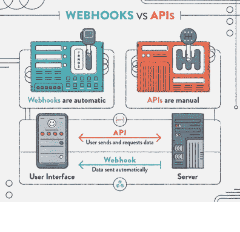

# 网络钩子简明英语指南

> 原文：<https://levelup.gitconnected.com/the-plain-english-guide-to-webhooks-7befe8daf987>



该图展示了 webhooks 如何与传统的请求/响应周期形成对比。

通过使用 API，网络应用程序变得越来越相互关联，这对于在不同的网络应用程序之间共享数据是必不可少的。它们也变得非常重要，尤其是对于软件即服务(SaaS)应用程序。用户希望快速和定期更新；为了满足这一需求，开发人员在他们的 API 中加入了 webhooks。Web-hooks 是一个过程，在这个过程中，来自 API 的数据可以被传递，而不必接收每个响应的请求。这篇文章概述了什么是 web 挂钩，为什么你应该在你的 web 应用中包含它，以及如何在你的 API 中添加它。

什么是网钩？

Webhook 是一个应用程序用实时信息更新其他应用程序的方法。Webhooks 基于*事件反应*的概念运作(不用打电话给我，有新情况我会打电话给你)，避免了(用户)客户端应用不断向服务器请求实时数据的需要。

对于那些更专业的人来说，一个更简洁的定义是:

*“web hooks 是用户定义的 HTTP 回调，链接到一个 web 应用，由特定事件触发。”*

webhook 实时向其他应用程序传送数据，以便立即接收数据。*什么是 API？* API 代表应用编程接口，但这是什么意思？API 可以共享数据和功能。例如，您可以使用 Google Maps API 按位置或名称查找博物馆，从每个地方提取大量数据。然后，您可以使用这些数据，并将其显示在您的 UI 用户界面上。

与用户需要做出动作(请求)来从服务器获取数据的典型 API 相反。webhook 不需要请求，它只是在数据可用时发送数据。例如，当你订阅银行服务时，当你用信用卡进行交易或者余额低于一定金额时，你会收到一条推送通知。这对用户和开发者来说是一个更好的体验，因为它降低了服务器成本，使 web 应用程序更加高效。

这是 webhooks 的核心概念。要使用 webhook，你需要向提供服务的公司注册一个 URL。URL 是应用程序中的一个地方，它将接受数据并对其进行处理。当有新的信息时，网络钩子会把它发送到你的 URL。使用 webhooks，您可以在服务器上发生某些事件时获得推送通知。例如，当你订阅银行服务时，当你用信用卡进行交易或者余额低于一定金额时，你会收到一条推送通知。

使用 webhooks 的第一步是给 webhook 提供者一个 URL，您可以将请求发送到这个 URL。这可以通过配置您的后端或 API 来完成。这意味着您需要在您的应用程序中设置一个可从网络访问的 URL。绝大多数 webhooks 会以 XML 或 JSON 的形式发布数据，这是一种从服务器接收的数据形式。

那么 webhooks 长什么样呢？

API 调用服务器端应用程序，服务器端应用程序向客户端应用程序提供客户端可以调用的端点 URL。服务器端可能会为一个简单的聊天应用程序公开以下 API 端点 URL。

```
 POST /messages createNewMessage 
GET /messages/{messageId} readMessage
POST /messages/{messageId}/comments postComment
GET /messages/{messageId}/comments/{commentsId} readComment
```

如果客户端 app 想向服务器发布新消息，客户端 app 调用服务器 *POST /messages*

此外，如果客户端应用程序想要读取已经发布到服务器上的特定消息的评论，客户端应用程序调用*GET/messages/{ messageID }/comments/{ comments id }*

使用服务器提供的 API(端点 URL ),在服务器的数据库中创建和存储消息和注释，并从服务器数据库中读取。

Webhooks，是客户端应用程序为服务器端应用程序提供一个要调用的 URL，服务器端应用程序调用该 URL，只要服务器被更新了一些需要发送给用户的新信息。webhook 本质上只是客户端应用程序提供给服务器端应用程序的一个端点 URL。在我们简单的聊天应用程序示例中，它可能是这样的:

{ " newcommentwebbook ":" https://client chat . com/web hook/new comment " }

webhook 只不过是一个简单的客户端提供的端点 URL。客户端应用程序必须在服务器端调用 webhook 之前的某个时间将这个端点 URL 传递给服务器端应用程序。如果我们希望服务器在针对特定消息发布新评论时通知用户。在这种情况下，每当一个新的评论被发布到数据库时，服务器端应用程序应该(在将评论发布到数据库之后)调用上面的 webhook URL，让客户端 web 应用程序知道一个新的评论已经可用。

使用 webhooks，服务器可以通知客户端发生的新事件(即发布了新消息)。需要在 API 端点中配置 API，以便有一个占位符，允许 webhook URL 从客户端应用程序传递。这可以通过服务器端 API 为 webhook URLs 提供一个参数来实现。服务器端应用程序应该有某种机制来存储客户端提供的 webhook 端点，以便在需要时可以被服务器端调用。因此，在我们的示例中，服务器端 API 请求主体应该有一些参数，其中客户端应用程序可以包含它们的 webhook URL。

由于我们的 web 应用程序中不断增长的互联性，Webhooks 是一个必不可少的工具。这是用户立即接收更新并节省服务器成本的一种方式。如果你想让你的 web 应用程序更加动态和灵活地满足今天用户的需求，那么在你的 web 应用程序中添加一个 webhook 将是至关重要的。