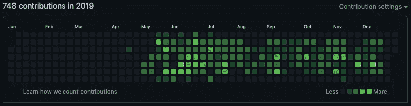
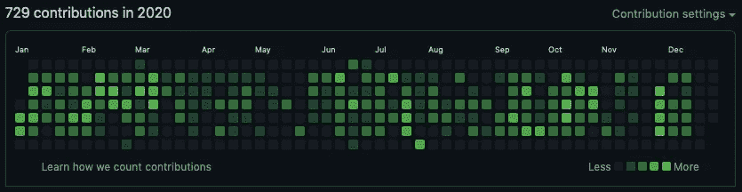
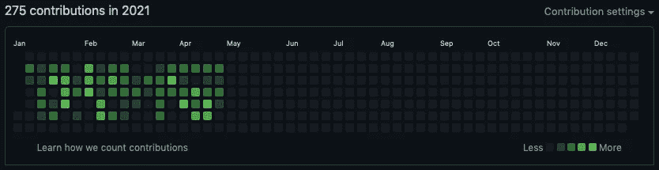

# 咨询的快乐和悲伤(作为一名软件工程师)

> 原文：<https://levelup.gitconnected.com/the-pleasures-and-sorrows-of-consulting-as-a-software-engineer-c978434cd145>

## 两年的贡献

2019 年 4 月至 2021 年 4 月投稿。

## 介绍

在本文中，我们将讨论一些痛苦、挑战、经验教训，以及等待任何有兴趣进入软件咨询或外包公司的人的好事。先从我们大多数人关心的事情说起；然而，在面试时犹豫直接问。

## 时间呢？

> “在这里，员工的工作时间很灵活。尽管大多数情况下，这取决于客户。”

老实说，就我而言，在咨询之前，我从未想过我会关心工作时间。因为我通常喜欢工作——甚至在晚上学习。

正如我们中的一些人已经知道的，这取决于客户和团队文化。无论如何，我认为分享我在咨询期间作为一名高级开发人员每周工作的平均时间是很有趣的，大约每周 60 小时。让我们更深入地探讨这个问题。

通常，我每天工作 12 小时——差不多。不是每个星期都是典型的一周，所以我经历过几次比那更长时间的工作或在周末工作。作为一个想要生活平衡的人，即使这样做是有补偿的，我通常会协商并尽量不去做。

不幸的是，有几个不可协商的时间。有史以来最糟糕的时机之一，一个周日晚上，当我和我另一半的家人一起吃饭时，我被团队领导联系了。然后他告诉我有一个紧急的变化，需要在午夜前几个小时完成，因为这是部署的一部分。

你猜怎么着？我找了个借口，继续写，在回家的路上继续写，最后完成了。

现在，让我们快速地谈论一下团队文化。虽然我在逗留期间每天工作 12 小时，但我坚信没有人应该一直这样做，除非这是自我强加的。此外，这对任何人的健康都是不可持续的。

不幸的是，我注意到领导的某些行为微妙地迫使其他成员在那些疯狂的时间工作。我以前每次冲刺后都会发现它。听说过“亚马逊”这个双关语吗？他们说:

> “你每周工作 60 个小时，但仍然觉得做得不够”。

## 回顾/事后分析

> “说真的，哪里出了问题？”

进行回顾或事后反思并不是什么新闻。这在任何公司都很正常。嗯，在理想的世界里，这些会议应该是富有成效的，无可指责的。

正如我们之前讨论过的，工作时间很长，这在团队中很正常。鉴于这些有规律的延伸，人们可能会认为回顾至少是健康的；然而，大多数情况下，这变成了一场可怕的讨论。通常情况下，并不是因为会议本身。更重要的是，这是因为团队成员觉得即使条目完全不相关，也需要在“哪里出错了”一栏中有条目。

想象有一个伟大的冲刺。给定一致的需求，开发人员通常能够更快地完成增强。顺利达到冲刺目标后，任何人都会认为团队会很高兴，对吗？遗憾的是，有些人会为了有话可说而选择给自己专业领域之外的工作领域提供不请自来的建议。

举个例子，在我咨询的日子里的一次回顾中，有人(不是开发人员)因为在一两天的站立会议上听到“没有来自开发方的更新”作为一些开发人员的状态更新而给开发团队蒙上阴影。令人沮丧的是，断章取义的评论和建议来自一名 QA 测试人员。之后，管理层决定增加成功 sprint 的故事，这导致测试人员工作到周末来完成 sprint。

在我看来，给测试人员充足的时间总是好的。在开发方面有一点停机时间并没有什么错。根据我的观察，当开发人员不同时处理事情时，他们会更好地支持团队。此外，如果没有计划，仅仅为了更新而做一些事情是不合适的。此外，如果某件事很重要，那么它至少应该是 sprint 或 backlog 的一部分。

假设一次成功的冲刺，我们已经看到了一次回顾的结果。话虽如此，我认为在这些会议上讨论一个失败的 sprint 是什么样子是没有意义的。让我们进行下一个话题。

## 工作量和范围

> “根据需要改变角色。你准备好了吗？”

你喜欢全栈开发吗？如果是的话，你会很适合。事实上，在我逗留期间，我被部署到四个不同的办公室，进行端到端的开发。回想起来，我会说这很有趣！至少对于开发部分是这样的；然而，每天的通勤并不是一件好事。

事不宜迟，让我们来谈谈一天中的典型工作量(假设每件事都井井有条，嗯，往往不是这样，但让我们保持简单)。

让我们选择一个简单的任务，它通常是可预测的，并且容易估计 CRUD”创建、检索、更新和删除记录是任何软件工程师经常要做的任务之一。听起来很简单，但实现起来并不那么快。让我们为这个需求列出一个非详尽的最低任务列表。

**对于后端:**

1.  设计领域模型
2.  生成必要的变更日志
3.  为每个领域模型创建单元测试
4.  创建域存储库并构建一些查询(如果需要的话)
5.  为域存储库查询设置集成测试(如果适用)
6.  创建服务接口和实现
7.  再次创建单元测试，但是这次是针对服务实现的。
8.  创建控制器(端点)
9.  应用安全性，等等。

**为前端:**

1.  为 CRUD 创建页面
2.  创建表单，并添加验证
3.  创建用于调用后端端点的服务
4.  应用加载动画，等等。

这样的例子不胜枚举。令人惊讶的是，由于每个需求都有预算，开发人员被期望在两天内交付这样的任务。现在，如果有来自用户的担忧呢？根据个性，一个人可能喜欢或害怕根据需要改变自己的角色。

根据我的经验，开发人员直接与客户和产品所有者沟通。此外，除了开发工作之外，还会有用户打电话来寻求支持。老实说，起初，这种经历对我来说有点陌生，因为我习惯于在一家内部公司工作，在那里这些事务有不同的角色。幸运的是，我很快就适应了新环境。然而，我注意到缺少需求签署，我认为这是一个危险信号，因为它通常会导致需求的自发变化。

除了其他任务，直到今天，我还是更愿意磨练自己作为软件工程师的技能。在那段时间里，由于有大量的需求积压，我抓住机会做了更多与开发相关的任务。

另一方面，模糊的责任界限并没有错，只要个人愿意。此外，我们都有自己的专长、偏好和弱点。重要的是团队成员互补。

## 结论

> “不全是彩虹和独角兽，不过还好。”

咨询工作是一种令人谦卑的经历。在我看来，它可以成就或毁掉一个人的职业生涯。幸运的是，就我而言，我已经获得了我想要的技术专长和指数级增长:我经历了从零开始设计系统、维护和集成现有系统、优化系统的几个部分等等。

正如任何事情一样，在前进的道路上，总是会有机遇和挑战。但是有了健康的团队文化，任何挑战都是可以忍受的。让我们为他人着想，表现得专业些。

这篇文章反映了我的咨询经验。而且，它并不能反映整个咨询行业。然而，如果你是一名软件工程师，正在寻找咨询工作，我希望你喜欢阅读这篇文章，并在任何方面对你有所帮助。继续努力，祝你好运！