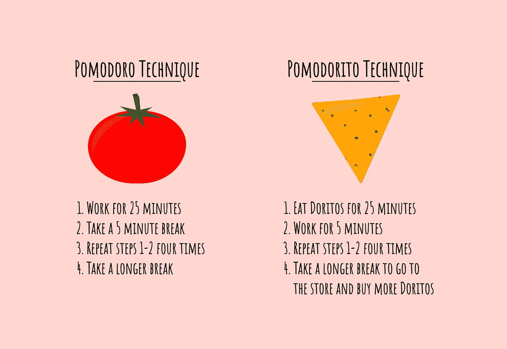

# 番茄工作法

> 原文：<https://levelup.gitconnected.com/the-pomodorito-technique-72f6b9a9616a>

## 你听说过番茄工作法；现在为番茄工作法让路😋

你可能听说过[番茄工作法](https://en.wikipedia.org/wiki/Pomodoro_Technique)、**一种时间管理方法，包括重复工作和休息间隔**以帮助保持注意力，同时获得一些必要的休息。在美国，这在科技员工中相当流行。

这个名字的由来很有趣:这个方法的创造者使用了一个番茄形状的厨房定时器来控制工作/休息块(Pomodoro 在意大利语中是番茄的意思)。这就是为什么每个工作区都被称为“番茄”

方法简单。首先，您选择一项任务，然后:

1.  工作 25 分钟。
2.  休息 5-10 分钟。
3.  重复步骤 1-2 四次。
4.  多休息 20-30 分钟。

我发现这是一种有效的时间管理方法。我经常这样做，并在工作时在办公桌上放几个计时器(尽管它们不是番茄形状的。)

# 番茄工作法

除了番茄工作法，我向你介绍半开玩笑的番茄工作法(不是雷的附属方法):

1.  吃多力多滋 25 分钟。
2.  工作 5 分钟。
3.  重复步骤 1-2 四次。
4.  休息一段时间去商店买更多的多力多滋(你可能已经用完了)。

或者，如果你家里有一大堆多力多滋，你可以用第四步打个盹。吃东西会让人筋疲力尽，好好睡一觉会让消化更容易。

虽然番茄工作法更像是一个笑话，但它可能是一个很好的倦怠指数。**如果你发现自己在尝试番茄工作法，但很快又陷入了番茄工作法，那可能是时候去度假了……或者开始找新工作了！**