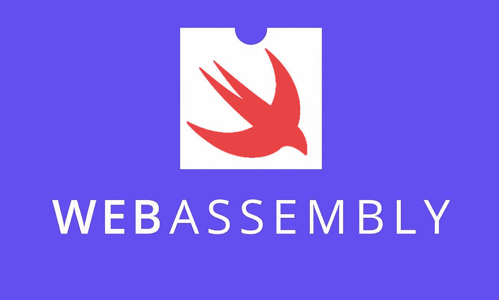

# Swift + Web Assembly 的力量(第 1 部分)

> 原文：<https://levelup.gitconnected.com/the-power-of-swift-web-assembly-part-1-fdfa4e9134ee>

## 想知道如何在 Go 或 Rust 项目中利用 Swift 吗？如何无痛地将 Swift 融入不同的语言？



图片来自[https://prog.hu/welcome/](https://prog.hu/welcome/)

*编写一次，随处运行*几十年来一直是软件公司和开发者的梦想。删除重复代码的想法不仅仅是用最少的成本做最多的事情，也是为了避免忘记更新所有副本的灾难。如果你曾经参与过一个大规模的软件项目(即使是一个小项目)，你可能会看到不同的团队如何试图集中核心解决方案和算法以避免重复。但是，我相信在这条道路上成功的并不多。

[**网络组装**](https://webassembly.org/) 可能是实现梦想的独唱之路。这是一种利用在项目中运行自包含且独立于语言的二进制文件的强大方法。官方说法是，网络组装是

> 基于堆栈的虚拟机的二进制指令格式。Wasm 被设计为编程语言的可移植编译目标，支持客户端和服务器应用程序在 web 上的部署。([https://webassembly.org/](https://webassembly.org/))

在这里，我想展示如何使用 *wasm* 将 Swift 实现集成到 Go 项目中，使用[https://book.swiftwasm.org/](https://book.swiftwasm.org/)中给出的说明以及我与 GitHub 维护者的[讨论](https://github.com/swiftwasm/swift/issues/1880)。一旦你学会了这些概念，你就能够在不同的项目中使用它们，比如 Rust，JS 等等。

# 工具

让我们首先回顾一下您需要拥有或安装的工具

**macOS/Ubuntu:** 这些操作系统为 Swift 提供了最好的支持。本教程使用的是 *Ubuntu 20.04.1 LTS*

Swiftenv: 安装和管理不同版本 Swift 的强大工具。要安装，只需按照这里描述的说明:[https://swiftenv.fuller.li/en/latest/installation.html](https://swiftenv.fuller.li/en/latest/installation.html)

**swift-wasm:** 一旦你安装了 *Swiftenv* ，你就可以安装在[https://github.com/swiftwasm/swift/releases](https://github.com/swiftwasm/swift/releases)上市的 *swift-wasm* 的最新版本了。*在我写这篇文章的时候，最新的版本是 2020 年 10 月 14 日*

在安装之前，您可能需要安装更多的依赖项。

```
$ apt update 
$ apt install binutils git gnupg2 libc6-dev libcurl4 libedit2 libgcc-9-dev libpython2.7 libsqlite3-0 libstdc++-9-dev libxml2 libz3-dev pkg-config tzdata zlib1g-dev curl lsb-release
```

一旦安装了依赖项，您就可以安装 *swift-wasm*

```
$ swiftenv install [https://github.com/swiftwasm/swift/releases/download/swift-wasm-DEVELOPMENT-SNAPSHOT-2020-10-14-a/swift-wasm-DEVELOPMENT-SNAPSHOT-2020-10-14-a-ubuntu20.04-x86_64.tar.gz](https://github.com/swiftwasm/swift/releases/download/swift-wasm-DEVELOPMENT-SNAPSHOT-2020-10-14-a/swift-wasm-DEVELOPMENT-SNAPSHOT-2020-10-14-a-ubuntu20.04-x86_64.tar.gz)$ swiftenv versions
> wasm-DEVELOPMENT-SNAPSHOT-2020-10-14-a-ubuntu20.04 (set by /root/.swiftenv/version)$ swiftenv global 
> wasm-DEVELOPMENT-SNAPSHOT-2020-10-14-a-ubuntu20.04
```

**Wamer:**Web assembly 运行时工具可以加载 wasm 二进制文件，并在受支持的主机语言中与之通信。虽然现在有一些可用的选项(如 wasmtime、wasmer 等。)我发现 [wasmer](https://wasmer.io/) 是目前为止最好最简单的。要安装，只需按照文档:

```
$ curl https://get.wasmer.io -sSfL | sh
$ source /root/.wasmer/wasmer.sh
```

# **Swift**

让我们首先创建一个新的 Swift 包可执行项目并运行它。

```
$ swift package init --type executable
> Creating executable package: swiftwasm
> Creating Package.swift
> Creating README.md
> Creating .gitignore
> Creating Sources/
> Creating Sources/swiftwasm/main.swift
> Creating Tests/
> Creating Tests/LinuxMain.swift
> Creating Tests/swiftwasmTests/
> Creating Tests/swiftwasmTests/swiftwasmTests.swift
> Creating Tests/swiftwasmTests/XCTestManifests.swift$ swift build
> [4/4] Linking swiftwasm$ swift run
Hello, world!
```

# **开始**

wasmer 对许多语言有丰富的支持，如 Go、Rust、C/C++、PHP 等。对于这些教程，我选择 Go，因为它是一个常用的教程，而且几乎更容易学习和开始。让我们首先创建一个新的 Go 项目:

```
$ go mod init "your-github-repository"
```

创建 *main.go* 并添加一个简单的 *Hello World！*去它的

```
package mainimport (
 "fmt"
)func main() {
 fmt.Println("Hello World!")
}
```

并运行它

```
$ go run ./
> Hello World!
```

# **整合 wasmer**

我们现在已经做好了一切准备，是时候将 wasmer 集成到我们的 Go 应用程序中了。用以下代码编辑 *main.go*

```
package mainimport (
 "fmt" "github.com/wasmerio/go-ext-wasm/wasmer"
)func main() {
 // Reads the WebAssembly module as bytes.
 bytes, err := wasmer.ReadBytes("binary.wasm")
 if err != nil {
  panic(err)
 } // Compile bytes into wasm binary
 module, err := wasmer.Compile(bytes)
 if err != nil {
  panic(err)
 } // Get current wasi version and corresponded import objects
 wasiVersion := wasmer.WasiGetVersion(module)
 if wasiVersion == 0 {
  // wasiVersion is unknow, use Latest instead
  wasiVersion = wasmer.Latest
 }
 importObject := wasmer.NewDefaultWasiImportObjectForVersion(wasiVersion) // Instantiates the WebAssembly module using derived import objects.
 instance, err := module.InstantiateWithImportObject(importObject)
 if err != nil {
  panic(err)
 }
 defer importObject.Close()
 defer instance.Close() fmt.Println(instance)
}
```

通过运行该代码，您将得到下面的异常，表明我们还没有向应用程序提供有效的 wasm 二进制文件

```
$ go run ./
> panic: open binary.wasm: no such file or directory
```

# 创造。Swift 的 wasm

为了让 Go 应用程序工作，我们需要生成一个 Web 程序集(。wasm)二进制文件，并将其放在正在生成的 *main.go.* 文件旁边。来自 Swift 项目的 wasm 二进制很容易。只需遵循以下步骤

```
$ # ensure you have swift-wasm on your machine
$ swiftenv global
> wasm-DEVELOPMENT-SNAPSHOT-2020-10-14-a-ubuntu20.04$ # set Toolchain path alias
$ TOOLCHAIN_PATH=$(cd $(dirname "$(swiftenv which swiftc)") && cd ../share && pwd)$ # build using defined Toolchain
$ swift build --triple wasm32-unknown-wasi -c release --toolchain $TOOLCHAIN_PATH
```

生成的文件放在。 *build/release/* 是以项目的名字命名的。将它复制到 Go 项目目录，并将其重命名为*binary . wasm。*重新运行 Go 项目，您将看到以下输出

```
$ go run ./
> {0x7f33440201a0 0xc00000e080 map[_start:0x4b0f80] 0xc000012010 <nil>}
```

# **启动二进制**

从上面的输出可以看出，Go 应用程序可以运行一个 *_start* 函数。这个函数只是启动二进制(和 *swift run* 一样)，但是不接受任何参数，也不返回值。编辑 *main.go* 并添加一个新函数来启动二进制文件

```
func main() {
 .........
 start(&instance)
}func start(instance *wasmer.Instance) {
 // Gets start function from the WebAssembly instance.
 start := instance.Exports["_start"] // Calls that exported function with Go standard values. The WebAssembly types are inferred and values are casted automatically.
 result, err := start()
 if err != nil {
  panic(err)
 } // To ensure the start function doesn't return any values
 fmt.Println(result.GetType() == wasmer.TypeVoid)
}
```

运行 Go 项目，您将看到 Swift 项目的输出，以及函数返回 *void* 的事实

```
$ go run ./
> Hello, world!
> true
```

# 下一步是什么

这是关于如何从 Swift 项目中生成和使用 wasm 二进制文件的介绍。如果你渴望完成更复杂的任务，你可以阅读这里发布的下一部分:[https://medium . com/@ h . shah bazi/the-power-of-swift-web-assembly-part-2-30 B6 c 4619 c 27](https://medium.com/@h.shahbazi/the-power-of-swift-web-assembly-part-2-30b6c4619c27)

此外，这两个项目都可以在 [GitHub](https://github.com/hassan-shahbazi/swiftwasm-go/tree/part1) 上访问