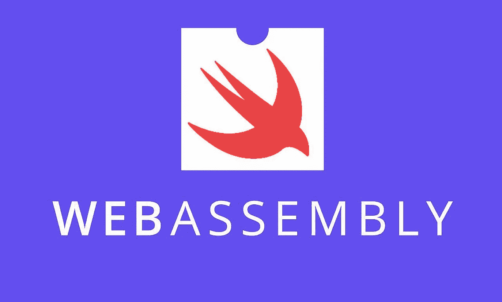

# Swift + Web Assembly 的力量(第二部分)

> 原文：<https://levelup.gitconnected.com/the-power-of-swift-web-assembly-part-2-30b6c4619c27>

## 导出函数和内存管理



图片来自[https://prog.hu/welcome/](https://prog.hu/welcome/)

这是***Swift+Web Assembly***教程的第二部分，更侧重于导出函数、函数参数和内存管理等高级主题。在第 1 部分中，我们看到了如何从 Swift 包中生成 wasm 二进制文件，以及如何用 Go 应用程序启动它。在第 2 部分中，我将向您展示如何定义您自己的公共函数，这些函数可以从 Go 应用程序中调用。如果您还没有阅读第 1 部分，请从那里开始。

# 导出的函数

打开 Swift 项目，通过添加以下功能编辑*Source/your-project-name/main . Swift*

```
[@_cdecl](http://twitter.com/_cdecl)("hello")
func helloFromHost() {
  print("The function is called from a host application")
}
```

这只是一个简单的 Swift 函数，但它的特别之处在于 *_cdecl* ，它允许您为函数定义一个名称，并让主机(在我们的例子中是 Go 应用程序)通过该名称调用它。构建项目和生成 wasm 二进制文件还需要一个步骤，您应该为 *-Xlinker* 构建标志提供公共名称。

```
$ TOOLCHAIN_PATH=$(cd $(dirname "$(swiftenv which swiftc)") && cd ../share && pwd)$ swift build --triple wasm32-unknown-wasi -c release --toolchain $TOOLCHAIN_PATH -Xlinker --export=hello
```

现在编辑 Go 项目以访问" *hello* "功能

```
func hello(instance *wasmer.Instance) {
 // Gets hello function from the WebAssembly instance.
 hello := instance.Exports["hello"]// Calls that exported function with Go standard values. The WebAssembly types are inferred and values are casted automatically.
 result, err := hello()
 if err != nil {
  panic(err)
 } // To ensure the hello function doesn't return any values
 fmt.Println(result.GetType() == wasmer.TypeVoid)
}
```

使用新的 wasm 结果运行 Go 项目，输出如下

```
$ go run ./
> The function is called from a host application
> true
```

# 函数参数和回报

现在我们知道了如何为主机导出函数，让我们通过添加参数和返回值使 Swift 函数变得更加复杂

```
[@_cdecl](http://twitter.com/_cdecl)("sum")
func sumFromHost(x: Int32, y: Int32) -> Int32 {
  return x + y
}
```

构建并复制新的 wasm 二进制文件

```
$ TOOLCHAIN_PATH=$(cd $(dirname "$(swiftenv which swiftc)") && cd ../share && pwd)$ swift build --triple wasm32-unknown-wasi -c release --toolchain $TOOLCHAIN_PATH -Xlinker --export=hello -Xlinker --export=sum
```

然后编辑您的 Go 项目以添加对“*sum”*函数的访问

```
func sum(instance *wasmer.Instance) {
 // Gets sum function from the WebAssembly instance.
 sum := instance.Exports["sum"]// Calls that exported function with Go standard values. The WebAssembly types are inferred and values are casted automatically.
 result, err := sum(1, 2)
 if err != nil {
  panic(err)
 } // To ensure the hello function doesn't return any values
 fmt.Println(result.ToI32())
}
```

使用新的 wasm 运行 Go 项目会产生以下输出

```
$ go run ./
> 3
```

# 字符串作为参数

函数“*sum”*使用 Int 作为参数和返回，但是如果我们想要一个更复杂的类型比如字符串呢？答案很简单，但是需要更多的步骤。让我们看看，如果我们像对 Int 类型那样尝试，会发生什么:

```
[@_cdecl](http://twitter.com/_cdecl)("concatenate")
func concatenateFromHost(s1: String, s2: String) -> String {
  return s1 + " " + s2
}
```

如果您尝试构建项目，您将得到以下错误，表明在使用" *_cdecl* 时无法使用*字符串*类型。这是因为 [Web Assembly 目前只支持简单的值类型](https://webassembly.github.io/spec/core/syntax/types.html#value-types)

```
$ swift build --triple wasm32-unknown-wasi -c release --toolchain $TOOLCHAIN_PATH -Xlinker --export=concatenate> error: method cannot be marked [@_cdecl](http://twitter.com/_cdecl) because the type of the parameter 1 cannot be represented in Objective-C                          
func concatenateFromHost(s1: String, s2: String) -> String> error: method cannot be marked [@_cdecl](http://twitter.com/_cdecl) because the type of the parameter 2 cannot be represented in Objective-C                          
func cconcatenateFromHost(s1: String, s2: String) -> String
```

# 内存管理

但是没有什么是不可能的。为了使错误消失，我们必须根据内容的大小(长度为 *s1* 和 *s2* )分配内存，然后将指向内存的指针作为参数传递给 Swift 函数。然后，通过改变函数来使用指针而不是原始的字符串类型，我们可以很容易地访问 *s1* 和 *s2*

```
[@_cdecl](http://twitter.com/_cdecl)("allocate")
func allocate(size: Int) -> UnsafeMutableRawPointer {
  return UnsafeMutableRawPointer.allocate(byteCount: size, alignment: MemoryLayout<UInt8>.alignment)
}
[@_cdecl](http://twitter.com/_cdecl)("deallocate")
func deallocate(pointer: UnsafeMutableRawPointer, size: Int) {
  pointer.deallocate()
}[@_cdecl](http://twitter.com/_cdecl)("concatenate")
func concatenateFromHost(s1: UnsafePointer<CChar>, s2: UnsafePointer<CChar>) -> UnsafePointer<CChar> {
  let str1 = String(cString: s1)
  let str2 = String(cString: s2)
  let result = str1 + " " + str2

  return UnsafeMutablePointer<CChar>(mutating: result)
}
```

在 Go 应用程序中，你应该分配内存，然后用*字符串*内容填充它。

```
func main() {
 .........
 concatenate(&instance, "Hello", "World!")
}func concatenate(instance *wasmer.Instance, s1, s2 string) {
 // Allocate memory function
 allocate := instance.Exports["allocate"] memoryPointerS1 := func() int32 {
  // run allocate for s2
  pointer, err := allocate(len(s1) + 1)
  if err != nil {
   panic(err)
  } // copy s2 to memory
  memoryS1 := instance.Memory.Data()[pointer.ToI32():]
  copy(memoryS1, s2)
  memoryS1[len(s1)] = 0 return pointer.ToI32()
 }() memoryPointerS2 := func() int32 {
  // run allocate for s2
  pointer, err := allocate(len(s2) + 1)
  if err != nil {
   panic(err)
  } // copy s2 to memory
  memoryS2 := instance.Memory.Data()[pointer.ToI32():]
  copy(memoryS2, s2)
  memoryS2[len(s2)] = 0 return pointer.ToI32()
 }()// Get concatenate function from the WebAssembly instance.
 concatenate := instance.Exports["concatenate"]// Calls that exported function with memory pointers.
 result, err := concatenate(memoryPointerS1, memoryPointerS2)
 if err != nil {
  panic(err)
 } // The result is another memory pointer is another string
 fmt.Println(result)
}
```

再次构建并生成 wasm

```
$ swift build --triple wasm32-unknown-wasi -c release --toolchain $TOOLCHAIN_PATH -Xlinker --export=allocate -Xlinker --export=deallocate -Xlinker --export=concatenate
> [1/1] Linking swiftwasm$ go run ./
2031808
```

如你所见，返回值是另一个 Int，它指向返回值的指针。这是因为函数" *concatenate* "返回一个指向包含结果字符串的内存的指针。为了使它变回字符串，我们必须在 Go 项目中添加以下函数

```
func concatenate(instance *wasmer.Instance, s1, s2 string) {
 ...........  
 output, _ := convertToString(instance, result)
 fmt.Println(output)
}func convertToString(instance *wasmer.Instance, output wasmer.Value) (string, int32) {
 memory := instance.Memory.Data()[output.ToI32():]
 var builder strings.Builder
 counter := 0for memory[counter] != 0 {
  builder.WriteByte(memory[counter])
  counter++
 }
 return builder.String(), int32(counter)
}
```

结果会是什么

```
$ go run ./
> World World!
```

最后一步是在代码执行完成后释放内存。不执行最后一步很容易增加未使用的内存并影响 Go 运行时性能

```
func concatenate(instance *wasmer.Instance, s1, s2 string) {
 ...........  
 output, size := convertToString(instance, result)

 // deallocate memory function
 deallocate := instance.Exports["deallocate"] // deallocate memoryS1
 _, err = deallocate(memoryPointerS1, len(s1))
 if err != nil {
  panic(err)
 } // deallocate memorySs
 _, err = deallocate(memoryPointerS2, len(s2))
 if err != nil {
  panic(err)
 } // deallocate output memory
 _, err = deallocate(result, size)
 if err != nil {
  panic(err)
 }
}
```

# 作为参数的数组

处理*数组*与处理*字符串*几乎是一样的，这可能是一个很好的练习，让你检查到目前为止你的学习情况。如果你觉得在处理它们时有问题，你可以在 GitHub 上查看完整的代码(下面的链接)

# 下一步是什么

这一部分主要是关于在二进制端运行导出的函数，而我们仍然不知道如何在 Go 端调用函数*。如果你想了解那个，可以关注这里发布的下篇:[https://medium . com/@ h . shah bazi/the-power-of-swift-web-assembly-part-3-e 583 c 6 ab 8 AFE](https://medium.com/@h.shahbazi/the-power-of-swift-web-assembly-part-3-e583c6ab8afe)*

*此外，这两个项目都可以在 [GitHub](https://github.com/hassan-shahbazi/swiftwasm-go/tree/part2) 上访问*