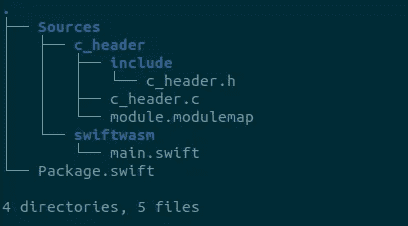

# Swift + Web Assembly 的力量(第三部分)

> 原文：<https://levelup.gitconnected.com/the-power-of-swift-web-assembly-part-3-e583c6ab8afe>

## 导入的函数:从运行时应用程序调用函数


图片来自[https://prog.hu/welcome/](https://prog.hu/welcome/)

这是***Swift+Web Assembly***教程的第 3 部分，也是最后一部分，该教程更侧重于一个高级主题，即导入函数，其中二进制代码从 Go 应用程序调用函数。在过去的 2 部分中，我们看到了如何从 Swift 包中生成 wasm 二进制文件，并将其加载到 Go 应用程序中。此外，我们还学习了如何在 Swift 中定义可以从 Go 应用程序中调用的公共函数。在这一部分，我们学习如何让二进制调用 Go 应用程序的函数。如果您还没有阅读第 1 部分和第 2 部分，请从那里开始。

# 导入的函数

想象一个场景，其中二进制文件需要从数据库中获取数据。在这种情况下，二进制文件必须能够从 Go 应用程序中调用一些函数，因为它不能访问主数据库。

## 生成模块地图

首先，我们需要添加 *c* 头文件，并为 Swift 项目制作一个 *modulemap* 。在*源*下添加以下目录



c_header 和模块映射

打开头文件 *c_header.h* ，如下定义导入的函数

```
#ifndef c_header_h
#define c_header_h#include <stdlib.h>
#include <stdint.h>
#if __wasm32____attribute__((__import_name__("fetch_code")))
extern int c_fetchCode(int input);#endif
#endif /* c_header_h */
```

在 *c_header.c* 中你只需要导入头文件

```
#include "c_header.h"
#include <stdlib.h>
```

要使 Swift 文件中的标题可访问，您必须通过生成*模块映射*将其打包

```
module c_header {
  header "include/c_header.h"
  link "c_header"
  export *
}
```

现在，您必须定义一个新的目标，并将其作为依赖项添加到主项目中。

```
import PackageDescriptionlet package = Package(
    name: "swiftwasm",
    targets: [
      .target(name: "c_header", dependencies: []),
      .target(name: "swiftwasm", dependencies: ["c_header"]),
    ]
)
```

## 添加公共函数

如果你做的一切都是正确的，在 *main.swift* 中导入 *c_header* 应该不会出现错误

```
import c_header
```

为了能够测试我们在 *c_header.h 中定义的 *"fetch_code"* 函数，*创建一个公共函数并从 Go 调用它。(实际上，其他一些 Swift 函数可能会调用 *fetch_code* ，但现在让我们简化一下)

```
[@_cdecl](http://twitter.com/_cdecl)("fetch")
func fetchCodefromHost(input: Int32) -> Int32 {
  return c_fetchCode(input);
}
```

## 更新 Go 应用程序

目前，我们已经在 *c 头*中定义了一个函数，并在 Swift 文件中调用它，但是函数 *c_fetchCode* 还没有实现。重点是，作为一个导入的函数，实现应该由 Go 应用程序来完成。让我们看看怎么做。

**首先，**从定义 Go 应用中的 C 函数签名开始。重点是，该函数必须具有与您已经在 Swift 项目**的 *c_header* 中定义的签名相同的签名，但是您必须始终将第一个参数定义为 *void****

```
// #include <stdlib.h>
//
// extern int fetchCode(void *, int);
import "C"
```

**第二个**，在 Go 中实现该功能，并将其导出以匹配您在上面已经提供的名称

```
//export fetchCode
func fetchCode(context unsafe.Pointer, input C.int) C.int {
 return input * 2
}
```

**第三个**，创建一个新的*导入*，它将 C 定义绑定到 Go 实现，并在实例化二进制文件时将其添加到 wasm 导入对象中，完成后不要忘记关闭它。

```
import (
 "fmt"
 "unsafe" "github.com/wasmerio/go-ext-wasm/wasmer"
)func main() {
 .......... // Make new C imports
 imports := wasmer.NewImports()
 imports, err = imports.AppendFunction("fetch_code", fetchCode, C.fetchCode)
 if err != nil {
  panic(err)
 } // Extend the import objects with C imports
 importObject.Extend(*imports) // Instantiates the WebAssembly module using derived import objects.
 instance, err := module.InstantiateWithImportObject(importObject)
 if err != nil {
  panic(err)
 }
 defer importObject.Close()
 defer imports.Close()
 defer instance.Close() fmt.Println(fetchCodeOnBinary(&instance, 2))
 fmt.Println(fetchCodeOnBinary(&instance, 5))
}
```

**最后，**构建 Swift 项目并将 wasm 二进制复制到 Go 目录中，然后运行 Go 项目

```
$ TOOLCHAIN_PATH=$(cd $(dirname "$(swiftenv which swiftc)") && cd ../share && pwd)
$ swift build --triple wasm32-unknown-wasi -c release --toolchain $TOOLCHAIN_PATH -Xlinker --export=fetch -Xlinker --allow-undefined$ go run ./
> 4
> 10
```

# 结束了

如果您仔细地遵循了这 3 个部分，您就能够在 Go 应用程序中轻松地构建 Swift wasm 二进制文件、加载并与之通信。你可以在 GitHub 上找到 Swift 和 Go 项目