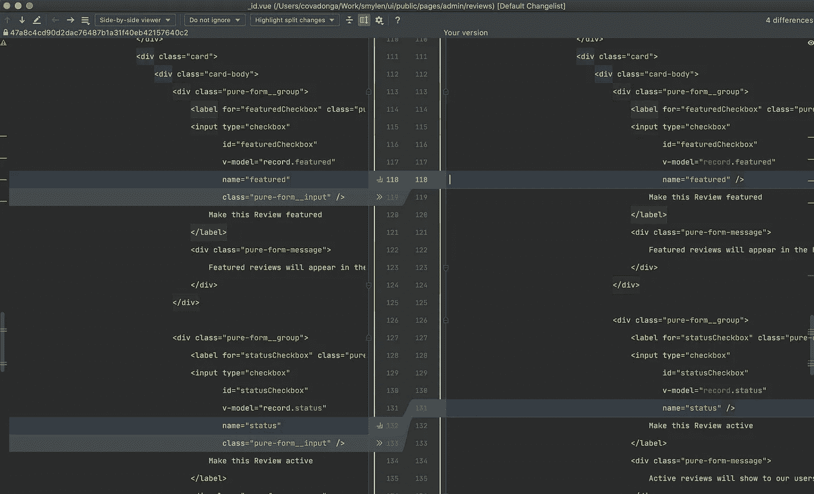

# 提交代码的实用方法

> 原文：<https://levelup.gitconnected.com/the-pragmatic-approach-to-committing-code-cb77db2dbb8c>

关于开发高质量软件的最好的书之一可能是 A. Hunt 和 D. Thomas 写的《实用程序员 T3》。它最初于 1999 年出版，但同样的原则和建议仍然有效(甚至更重要！)今天。在本书中，作者关注于应用于软件开发的实用主义，这意味着基本上要意识到你的整个开发过程，最终目标是产生尽可能高质量的代码。

本文描述了开发人员在编写代码时应该应用的一些技术，以确保尽可能高的输出和与其他队友最有效的协作。

# 假设

为了简单起见，我们将假设一些关于您的过程的事情。**如果你没有应用其中的一两个以上，我建议尽快修改你的开发流程。**

*   您的代码库位于存储库中，并使用配置文件(env、json 等)来设置特定于环境的设置。一个现代的存储库很可能是基于 git 的，但是一些公司可能仍然在做 svn。
*   您正在所谓的*特性分支*中开发，并且您至少有一个*主*分支保存您的生产代码，还有一个*暂存*分支保存您的预发布代码(实际名称可能不同)。
*   你遵循 [Git 工作流程](https://www.atlassian.com/git/tutorials/comparing-workflows/gitflow-workflow)(或者类似的东西)。
*   您有一个测试套件，至少覆盖了您的部分源代码，还有一个 CI/CD 服务自动生成构建，或者手动触发它。
*   你使用一个现代的 IDE(比如 WebStorm 或者 VSCode)，或者一个适当配置的 Vim/Atom/等等。对于我的例子，我将使用 [WebStorm](https://www.jetbrains.com/webstorm/) 。

# 多次提交

有时，您将不得不处理跨越项目多个领域的大特性，但是您不能将您的工作分成多个拉式请求(PRs ),因为它们本身没有多大意义。即使发生了这种情况，将相关的功能划分到提交中，并给出简洁、清晰和有用的提交消息，这仍然很重要。这将有助于你的审阅者了解你打算对每一个提交做什么，甚至允许她一个接一个地审阅。

即使您已经一次处理了整个特性，也可以使用这种方法:通过仔细检查每个文件并相应地对它们进行分组，在最后创建不同的提交。这也将帮助您回到您的更改中，并再次检查它们，潜在地捕获语法错误、代码风格的不一致，或者甚至发现潜在的重构。

# 代码样式

还会有一篇专门关于这个主题的文章，以及为什么这个主题如此重要(在我上面提到的书中肯定强调了这一点)，然而，**记得严格遵循你的团队的代码风格**(假设你已经和你的团队就这些达成一致，否则尽快这样做是很重要的)。
使用大多数现代工具，你可以在配置文件中指定规则，然后让你的 IDE 或编辑器自动检查它们(甚至修复大多数错误)(提示:例如，WebStorm 允许你选择任何一段代码，并通过按 Cmd + Option + L 来应用代码样式)。**所以绝对没有理由在任何现代项目中不使用代码风格**。

这里必须做一个旁注:有时你会发现自己在编辑一个没有遵循任何代码风格的文件:不正确的缩进，缺少标点符号，等等。将整个文件固定在您用来处理一个特性的同一个 PR/Commit 上并不是一个好主意。这通常会分散读者的注意力，让他们感到困惑，并导致一份充斥着文件的公关。相反，切换到您的 staging 分支，修复文件中的样式，并将其作为独立的 PR 提交。与此相关，记住当你打开一个文件时，一些 ide 会自动修复代码样式，所以一般来说，如果你在一个团队中工作，最好禁用这个特性。

# 单元测试

在特性编写完成后，你要做的第一件事就是去编写单元测试，测试代码以确保一切按预期运行(当然，这是假设你没有遵循测试驱动的开发方法，在这种情况下，你的测试会在特性开发之前编写)。

请注意，我说的是*功能已经编写*而不是*功能已经完成*。这一点很重要，因为一个特性在完全集成之前不能被认为是完整的，这意味着已经添加了一组最小的单元测试。

测试多少和写什么测试是另一篇文章的主题，但是这里的要点是:

*   您的覆盖率必须至少为语句> 90%,函数为 100%,分支为 85%左右。低于这个数字，你的审核者可以(也应该)拒绝你的拉取请求。
*   如果你没有写任何测试，你的特性就没有完成 x%。在编写、执行和通过单元测试之前，不可能知道一个特性完成了多少。
*   注意你的测试:不要仅仅为了满足你的团队的覆盖需求或者仅仅为了表明你在你的特性中添加了测试而编写它们。确保任何错误或不一致都被发现并修复:**记住，成功的测试不是正确通过，而是至少发现一个错误。测试也是一个很好的机会，可以发现重构可以使解决方案的总体结构更好的地方。**

> 一个成功的测试是发现至少一个错误，而不是正确通过的测试。

# 运行您的测试(本地)

您的新特性可能不是在真空中开发的，并且肯定涉及到与现有模块的通信。也许这不是一个新功能，只是对现有功能的一些更新。这意味着不仅新的测试很重要，套件中已经存在的测试也很重要。如果您的实现对项目的另一部分产生了负面影响，并且假设您有一个健康的测试套件，那么在密封您的 pull 请求之前，通过在本地运行您的整个测试套件将会发现错误。

注意这一步是关于**本地**运行测试。不要提交和推动，让您的 CI 服务器为您完成。这将引入不必要的提交和错误修复，而这些本来是可以避免的。这是假设您可以在本地运行测试，这将取决于项目的规模和环境的性质(例如:一些 Java/。NET 构建可能需要大量的时间和资源来执行整个测试套件，而一个中等规模的节点项目可以在 5 分钟内运行整个单元测试套件。

重要提示:在确保测试套件通过之前，不要让您的评审员查看您的代码。如果审核人打开一个有一个或多个不合格标记的拉动式请求，她会立即停止查看，并将其退回给您进行调整，从而导致双方都浪费时间。

# 检查您的更改

一个接一个地检查你的变更可能看起来像是很多额外的工作，特别是在你已经通过单元测试和手工测试验证了一切正常之后。然而，在这个特殊的步骤中，我们感兴趣的是单元测试无法捕捉到的东西，因为它们只能检查语义和语法的正确性，而不能检查代码的实际“风格”。

给你额外的几分钟时间，让你一个接一个地检查你的改变，让你发现解决方案可以进一步改进的地方。如果拉取请求非常大，这一点尤其重要。

使用 WebStorm 和 Git，这特别容易:

*   点击 Cmd + 9 打开 **Git 面板**，点击**局部修改**标签。
*   此选项卡列出了在当前更改列表中有更改的所有文件。
*   选择第一个文件，然后按 Cmd + D。这将触发比较屏幕。
*   切换并排查看器(我相信它比统一查看器提供了更好的全景)。
*   检查您当前的更改，然后按下 F7 以前往下一个更改。按 Shift + Cmd + ]跳到下一个文件，或按 Shift + Cmd + [回到上一个文件。



并排更改 WebStorm 中的查看器

## 重构

在回顾您的更改时，您可能会发现自己在简单但仍然重要的事情上发现了多个改进的领域:变量和方法名，代码块在它们自己的功能中会更好，等等。重构这些是非常容易的，依靠你的 IDE，你可以做到这一点，而不用担心在这个过程中破坏任何东西。

例如，要重命名 WebStorm 中的变量，只需将光标放在变量上，然后按 Shift + F6。输入新名称，然后按 Enter 键。这将扫描您的变量的范围，用您的新名称替换任何用法。依靠你的编辑器比使用 find & replace 更好也更安全。

好的一面是，如果出于任何原因你使用*查找&替换*并犯了一个错误，如果你的测试覆盖率是 100%，你的测试将会捕捉到错误。

# 推

**一个开发人员已经完成了一个特性，并且遵循了前面提到的技术，现在可以说这个特性已经完成了 x%。**假设代码是按照规范编写的，并且测试是有意识地为测试规范而编写的，那么在任务完成的百分比和遗漏的内容方面就不那么不确定了。相反，如果一个开发人员声称一个特性已经完成了 90%,但是还没有编写任何测试，那么她估计要花费 10%的努力来修复新特性可能在整个系统中引入的所有可能的问题。对于任何一个中/大型项目来说，这至少有点不现实(一般来说，据说你至少有 50%的时间是用来修复 bug 和测试的……)。

推送提交包括将分支上传到您的远程存储库:

```
git push --set-upstream origin <your-branch-name>
```

这将在您的远程创建一个新的分支并上传您的提交。如果您正在使用 Github 或 Gitlab(或任何其他 GUI)，您可以通过它们的用户界面创建一个 Pull 请求。这些接口非常有用，因为它们用一组协作特性扩展了 Git，允许多个开发人员轻松地对提交的任何一段代码做出贡献。

**Pull Request (PR)** 基本上是将您的变更合并到您的目标分支的意图，它通常应该是您的 *staging* 分支。你的简历应该包括一个中等长度的描述，描述你做了什么:简要说明你做了什么，做了什么决定，为什么，什么问题已经解决，什么问题仍然需要解决，等等。还应关注技术方面:提及任何必需的配置项以及如何创建它们，指定测试该功能应遵循的步骤，对于包含 UI 的功能，提供一些屏幕截图，以便评审者知道会发生什么。请注意这个描述:不要只是复制粘贴提交消息，基本上是因为审查者已经可以在历史中看到它们，而是添加相关信息。

```
**feature/your-feature => staging => production**
*-> the very minimum stages your changes should go through. Some companies will have multiple staging branches (alpha, beta, release x, etc).*
```

当创建 PR 时，您需要选择一个或多个评审者，他们是团队中的其他开发人员，来评审变更。根据公司的方法，评审员的角色可能或多或少很重要。一些公司做得很轻松，而另一些公司则非常认真，对一份公关的审查可能会持续几天甚至几周。

不管你公司的政策是什么，这里的最终目标是让另一双眼睛看到你的变化。让另一个开发人员看你的代码提供了一个无价的洞察力，因为他们通常从不同的角度攻击变化:这将揭示你可能忽略的事情，提供问题的替代解决方案，发现你可能因为众所周知的**开发人员偏见**而跳过的错误，最重要的是，**给你一个机会从别人将会给你的建议**中学习。正因为如此，评审者的评论不应该被理解为批评:花点时间去理解什么被纠正了，为什么，如果在对问题进行推理后，你仍然认为你的解决方案是正确的，就展开讨论，并回复每一条评论，承认问题并解释问题是如何解决的。

在评审者的每次评审之后，您可能会面临一个新的循环迭代:如果发现了 bug，您将不得不去修复它们，更新测试，再次评审代码，并将更改提交给 PR，请求新的评审，并指出已经做了什么来解决问题。

# 合并

一旦您的评审者和您自己对*拉式请求*感到满意，就到了将您的特性分支合并到*阶段*的时候了。部署到*试运行*提供了一个在与您的生产环境非常相似的环境中测试您的更改的机会:一个正确设置的试运行环境将使用与生产环境相同的服务、数据库和 API，并且利益相关者可以访问(如果是 web 应用程序，通过 URL 如果是移动应用程序，通过演示 APK；如果是桌面应用程序，通过安装程序，等等)。在这一点上，非技术用户将进入测试组，通过测试工作应用程序来提供他们对特性的反馈。大多数时候，你可以期待一些改变，主要是关于用户界面/UX，措辞等。

**一旦你的功能已经登陆 *staging* 就被认为已经完成**。它现在作为一个更大的变更集的一部分而存在，尽管您可能仍然会遇到集成问题，但是大部分工作已经完成了。您可以期待有人在稍后报告问题，但是如果遵循了正确的步骤，您的功能现在应该看起来非常可靠，受到一组代表性测试的保护，并通过了您自己、您的评审者和您的利益相关者的全面检查。你现在可以进入下一个任务了！