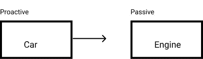
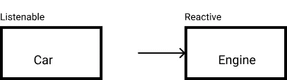
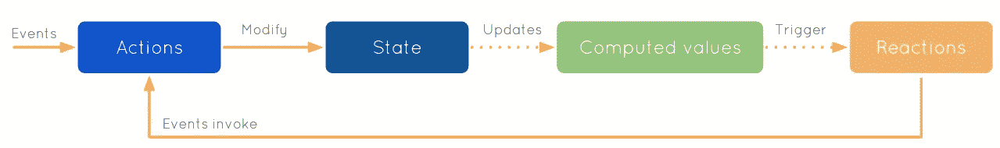
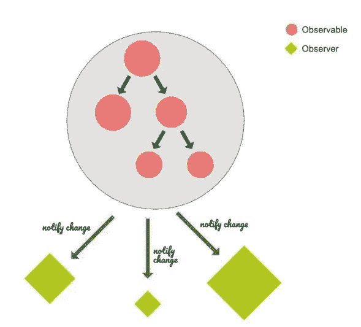
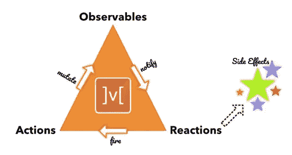
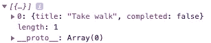
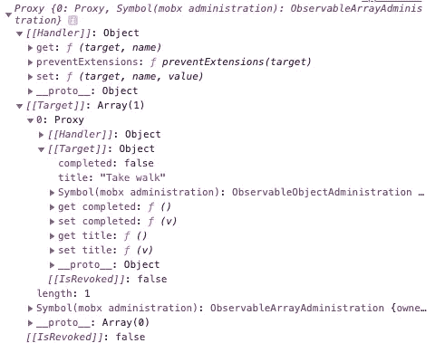
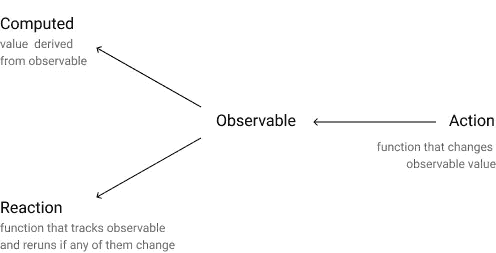

# MobX 和反应式编程背后的原则

> 原文：<https://levelup.gitconnected.com/the-principles-behind-mobx-and-reactive-programming-4c43e73742e7>

> MobX 是一个久经考验的库，它通过透明地应用函数式反应式编程使状态管理变得简单和可伸缩。

为了理解 mobx 的核心概念，我们应该首先深入了解函数式反应式编程。

# 功能反应式编程

**函数式编程**是使用**纯函数**和**不可变数据结构**开发应用程序的范例，并且没有**副作用**。纯函数总是为相同的给定输入返回相同的输出，并且不对其函数范围之外的变量进行操作。

```
**// Pure function**
function result(a, b){
  return a + b
}result(3,5); **// Impure function**
const c = 6;function result(a,b){
   return a + b + c;
}result(3,5)
```

函数式编程是一种理想的编程解决方案，它提供了可预测性，并且不容易出错。

然而，如果没有可变的数据结构和副作用，很难构建真实世界的程序。如果一个行为的影响超出了它发生的范围，我们称之为副作用。典型的副作用可能是渲染、网络请求、文件操作、CLI / log 输出等。我们可以使用**函数式反应编程**来有效地控制副作用，同时仍然在一定程度上保留函数式编程原则。

> 反应式编程是关于控制副作用的

**函数式反应式编程**的本质是在声明的时候完全指定一个值的动态行为。让我们考虑一个电子表格应用程序。在电子表格中，变量是单元格。如果电子表格中的任何单元格发生更改，引用该单元格的任何单元格也会随之更改。

# 被动编程与反应式编程

在被动编程中，两个组件之间的关系是一个组件通常控制另一个组件。



被动编程。参考:[http://dontpanic.42.nl/2016/07/reactive-programming.html](http://dontpanic.42.nl/2016/07/reactive-programming.html)

```
Car.prototype.turnKey = **function**() {   
  **this**.engine.fireUp(); 
}
```

在反应式编程中，这种关系是相反的。组件本身负责控制它的值和行为。



无功编程，参考:[http://dontpanic.42.nl/2016/07/reactive-programming.html](http://dontpanic.42.nl/2016/07/reactive-programming.html)

```
Engine.listenToKey = **function**(car) {   
  car.onKeyTurned(() => {     
    **this**.fireUp();   
  }); 
}
```

# 观察者模式

以这种模式。我们有一个**制作人**来保存订阅它的听众列表。**每当生产者的状态改变时，监听器**被通知。

```
function Producer(){
 this.listeners = [];
}Producer.prototype.add = function(listener){
 this.listeners.push(listener);
}Producer.prototype.remove = function(listener){
 var index = this.listeners.indexOf(listener);
 this.listeners.splice(index,1);
}Producer.prototype.notify = function(message){
 this.listeners.forEach(function(listener){
  listener.update(message);
})
}var listener1 = {
 update: function(message){
  console.log('message')
 }
}var notifier = new Producer();
notifier.add(listener1);
notifer.notify("Hello World");
```

# 可观察量

一个可观察对象按顺序发出它的值，但是不是消费者请求下一个值，而是可观察对象在它们变得可用时推给消费者。即。发出值并将它们推送给它的侦听器。可观察是一个序列，其项目随着时间的推移变得可用。当一个观察者订阅一个可观察对象时，它将收到序列中的值，因为它们变得可用，而不必请求它们。下面是一个使用 [**RxJS 库**](https://github.com/Reactive-Extensions/RxJS) **的可观察的例子。**

```
var source = Rx.Observable.fromEvent(document.body, 'mousemove');source.subscribe(val => console.log(val),
 e => console.log(e),
 () => console.log('completed')
);source.subscribe(val => {
  console.log(`x: ${val.offsetX} & y: ${val.offsetY}`)
  },
  e => console.log(e),
 () => console.log('completed')
);
```

我们可以创建**鼠标移动**事件序列的可观察对象，监听观察者变化的观察者可以对事件做出反应。

# MobX

> *任何可以从应用程序状态派生的东西，都应该被派生。自动地。*



MobX 流程图



MobX Flow Ref:[https://www . packtpub . com/sites/default/files/downloads/MobXQuickStartGuide _ color images . pdf](https://www.packtpub.com/sites/default/files/downloads/MobXQuickStartGuide_ColorImages.pdf)

```
const { observable, autorun } = require("mobx");const todoStore = observable({
/* some observable state */
  todos: [],
  /* a derived value */
  **get** computedCount() {
    **return this**.todos.filter((todo) => todo.completed).length;
  },
});/* a function that observes the state */
autorun(**function** () {
  console.log(
    `Completed ${todoStore.computedCount} of  ${todoStore.todos.length}`);
});/* ..and some actions that modify the state */
todoStore.todos[0] = {
  title: "Take walk",
  completed: false
};
// synchronously prints 'Completed 0 of 1 items'todoStore.todos[0].completed = true;
// synchronously prints 'Completed 1 of 1 items'
```

1.  **定义状态并使其可观察**

我们可以用`observable`的方法把我们的状态变成可观测的变量。它为我们的状态对象创建了一个**代理对象**,它可能有任何嵌套层次。正在跟踪通过代理对对象的访问，包括读和写。可观察到的`todos`如下所示:



普通 todos 阵列



使用代理对象可观察到的 todos

**注意:**`Proxy`对象包装另一个对象并拦截操作，比如读/写属性和其他，可选地自己处理它们，或者透明地允许对象处理它们。您可以在本文中学习编写代理对象的实际用例:
[https://czaplinski.io/blog/make-your-own-mobx](https://czaplinski.io/blog/make-your-own-mobx/)

2.**处理派生**

任何可以从状态中导出而不需要任何进一步相互作用的东西都是导出。如果影响它的任何值发生变化，上面示例中的计算值将自动从状态中导出。

3.**使用动作改变状态**

动作是改变状态的任何一段代码。

4.**处理副作用**

在这个例子中，存储更新的副作用是在`autorun`方法中执行的。autorun 方法会在每次更新存储值时自动运行。



# 与 Redux 的差异

Redux 实现不可变存储。redux 中的操作负责对存储进行更改。还原器是纯函数，每次状态改变时总是返回一个新的状态。

相反，mobx 实现了带有数据更改传播的可变存储。这些操作负责对商店进行更改。然而，商店可以直接变异，没有行动。MobX 遵循可观察的可变数据结构来实现状态生命周期和跟踪变化。

## **参考文献**

*   https://mobx.js.org
*   [通过 Packt 用 RxJS](https://pragprog.com/titles/smreactjs5/) 进行反应式编程
*   [Michel Weststrate — MobX 与可预测性和速度的独特共生关系](https://www.youtube.com/watch?v=NBYbBbjZeX4)
*   [什么是(函数式)反应式编程？](https://stackoverflow.com/questions/1028250/what-is-functional-reactive-programming)
*   [后 MVC 第 6 部分:反应式编程](http://dontpanic.42.nl/2016/07/reactive-programming.html)

谢了。如果你有反馈，请在评论中告诉我。