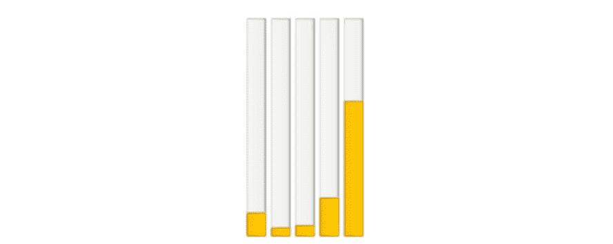
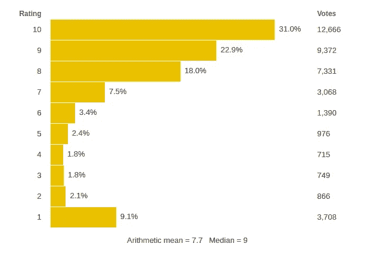
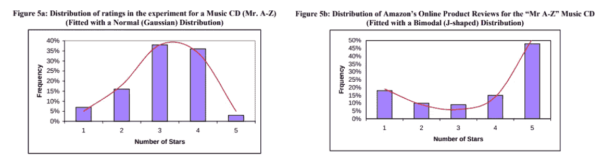
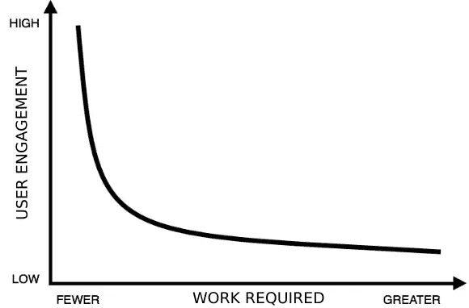

# J 曲线的问题(在线评级系统中)

> 原文：<https://levelup.gitconnected.com/the-problem-of-j-curves-in-online-ratings-systems-caf94fab4819>

*注意:这篇文章的目的是给出问题的一个总体概述，并提出一个可能的解决方案。我故意选择不去太多的杂草，并保持相当高的水平。请参阅链接的文件了解更多详情。*

在线评级系统存在一个问题。当你给用户更多的选择时(如果你愿意的话，增加评分的分辨率)，你降低了它的准确性——评分的集合与群众意见的接近程度。这个问题的一个重要原因是所谓的 J 曲线分布。

2007 年有一篇论文发表，题目是“*为什么网上商品评论呈 J 型分布？胡南、保罗·a·帕夫洛和张芷芊的《克服在线口碑传播中的偏见》。[此处链接](https://www.researchgate.net/publication/228604596_Why_Do_Online_Product_Reviews_Have_a_J-Shaped_Distribution_Overcoming_Biases_in_Online_Word-of-Mouth_Communication)。他们研究了 J 曲线是如何因消费者/用户方面的偏差而出现的。但是在我们研究这个问题之前，你可能会想为什么我们要关心评级系统呢？*

评级系统在网络世界中扮演着重要的角色。任何时候你想了解公众的想法，评级——就像投票箱一样——都是有用的。如前所述，在评级系统中存在细微差别和准确性之间的权衡。你给用户的评分选项越多，你得到的意见范围就越大。换句话说，你提高了评级的分辨率，理论上，也提高了你收到的反馈的细微差别。然而，在现实生活中，当涉及到，比如说，五星评级系统的准确性时，事情会变得有点古怪。这部分是因为评级最终偏向双峰 J 曲线分布的极端。另一方面，类似简单的拇指向上/拇指向下系统的分辨率相对较低，但观点更准确，因为 J 曲线的影响较小。那么…这个 J 曲线呢？这就是这篇论文的由来。

简而言之，胡等人查看了来自的许多不同的产品评论——该网站有一个 5 星评级系统——在几乎所有情况下都遇到了相同的分布:评级分布看起来像一个大写的 j。换句话说，在极度负面的评论中有一个小尖峰(★)，在中间几乎没有任何东西(★★、★★和★★★)和正面评论中有一个大尖峰(★★★★★★★)。这是反直觉的，也不是理想的——给定 5 个评级的选项，人们会期望对给定项目的一系列意见不会聚集到极端——类似于经典的钟形曲线。我假设这些系统是按照正态分布来构建的，否则，为什么不采用一个简单的评级系统呢？不要误解我的意思，J 曲线仍然提供有用的数据，只是不是以他们想要的方式。收视率最终被扭曲到极端，给出了一个不准确的“普通观众”对某事的看法。

这适用于一系列其他网站——这不是亚马逊独有的事情。例如，在撰写本文时，IMDB 上新《守望者》第一季的收视率分布如下:

在论文中，研究人员从他们自己创建的一个“假”亚马逊风格的网站上收集实验结果。实验数据生成的图形更像钟形曲线，而不是来自 Amazon.com 自愿结果的双峰 J 分布(图来自论文):

胡等人指出了 J 曲线出现的两个可能原因，并假设结果会因此出现偏差。引用(格式是我的):

> “……由于两个自我选择偏差(**购买**和**少报**)，几乎所有在线产品评论都具有不对称的双峰正偏(J 形)分布，因此在线产品评论的平均值被证明是产品质量的有偏估计值。少报偏差导致双峰(U 形)分布，购买偏差导致不对称的正偏态(J 形)分布。”

**漏报偏见**指的是对产品或服务有强烈感觉的人更有可能离开评价，不管是正面的还是负面的。因此呈 U 形。

购买偏见指的是购买产品的人也更有可能留下评论。鉴于他们已经购买了该产品，很可能这是他们已经喜欢的东西，或者他们最终经历了某种形式的沉没成本谬误——“我已经在该产品上投入了资金/经常使用该服务，因此值得捍卫”。这就是为什么积极的评论多于消极的评论。j 型曲线。

# 一个解决方案？

在某种程度上，收视率的 J 曲线分布是对人群意见的有偏见的代表，我们有一个问题。虽然没有办法完全消除少报和购买偏见(我可以看到)，但我可能有一个解决更大问题的办法。这是一个解决方案，旨在稍微改变用户对商品进行评级的动机。

当然，在野外试验之前，没有办法知道这种解决方案有多有效。但是，基本上，它是一个经过修改的竖起大拇指系统，有四个选项:

*   双大拇指向上(↑↑)
*   竖起大拇指(↑)
*   拇指向下(↓)
*   双拇指向下(↓↓)

它的工作原理就像你习惯的常规拇指向上/向下评级系统，比如说，在 YouTube 上，但允许更多的细微差别，同时(希望)避免 J 曲线结果。问题是，我的系统中有一个偏好不太极端的评级的偏好——**↑**和↓。

如果你在给一个产品评分，你只会看到两个按钮——**↑**和↓。要获得更极端的评级——**↑↑**和↓↓——你必须再次点击相应的按钮。比如说，你要点击 **↑** 两次才能到 **↑↑** 。基本原则是:如果你想要一个更极端的评级，你必须投入更多的工作。这个想法是建立一个过滤机制，把一个单纯冲动的人从“真正的信徒”中分离出来。你要做的工作越多，你就越需要证明你真的想给出一个极端的评价。现在，你可能会说让用户点击按钮两次只不过比点击一次多一点工作量。没错。然而，我的直觉是，考虑到大量的用户，像这样的小激励会促使足够多的用户避免极端的选择，从而理顺分布。当然，总会有“多少工作才算足够”的问题应该考虑这一点。例如，是否应该要求用户为他们选择的评级写一个理由？需求这个词应该有多短/多长？也许在按下按钮之间会有一个暂停，这将鼓励你在评价某个东西 **↑↑** 或↓↓之前暂停并考虑一下。当然，根据幂定律，如果你对评级的要求更极端一点，你会看到严重的用户流失。因此，这归结为一个谨慎的平衡行为。

你同意我的评估吗？请联系，让我知道你的想法！我错过了什么？

**其他想法:**我在这里提出的解决方案只处理已经对产品或服务进行评级的人。它没有直接解释两种偏见——购买和少报——而是为部分评级人员提供激励，以(希望)提供更周到的评级。你也可以从另一端解决这个问题——以某种方式让沉默的大多数停止沉默。就像有许多关于如何增加投票率的想法一样，你可以应用相同的技术和激励措施来增加“评论投票率”——比如特殊徽章和其他奖励，或者只有在用户提交了 *n* 条评论后，某些应用程序功能才可用。