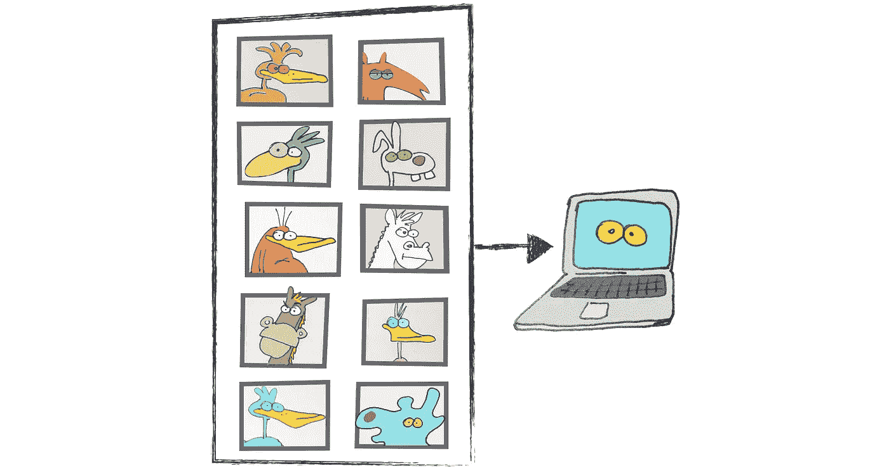
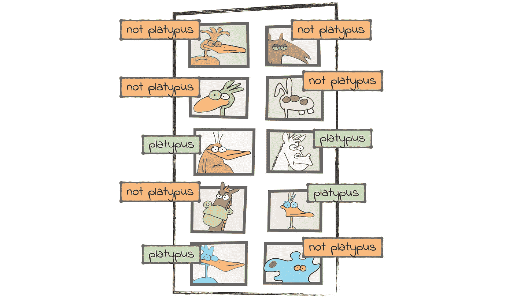
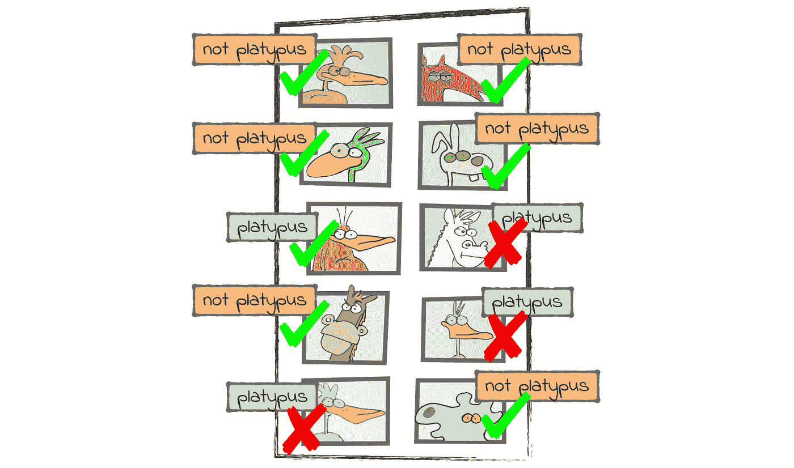
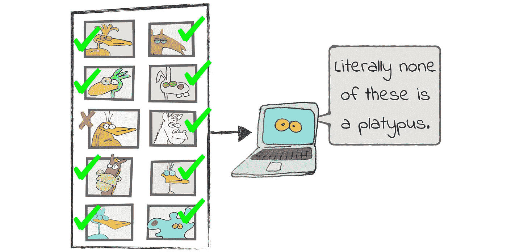

# 准确性的问题

> 原文：<https://levelup.gitconnected.com/the-problem-with-accuracy-3670891b908e>

想象一下，我们正在建造一个鸭嘴兽探测器。这个系统拍摄动物照片，并识别鸭嘴兽:



这个系统是一个 ***二进制分类器*** *r* ，因为它要么返回肯定的结果，要么返回否定的结果。假设我们从上面的图片中得到这些结果:



乍一看，这些结果看起来还过得去，但不是很好。让我们找到一个度量标准，对这种直觉进行量化。一个流行的衡量标准是*——正确结果的百分比。让我们看一下结果，用绿色勾号标出正确的，用红色叉号标出不正确的:*

**

*分类器在 10 个结果中找到了 7 个，因此准确率为 70%。*

*准确性让人感觉很自然，但它不是一个完美的衡量标准。它有一个狡猾的问题，这使得它往好里说是可疑的，往坏里说是误导的。在这篇文章中，我将描述这个问题，并告诉你如何解决它。*

# *作弊分类器*

*我们打个赌吧，我有信心赢。我敢打赌:*

*   *我可以编写一个类似上面的鸭嘴兽分类器；*
*   *准确率高达 90%；*
*   *短短两行 Python 代码。*

*你愿意打赌吗？(请做。我们都知道我在作弊，但还是迁就我吧。)*

*成交！下面是分类器:*

```
*def classify(image):
    return False*
```

*上面的代码在测试图像上有 90%的准确率。你可以猜到，这个辉煌的业绩是一个假象。它不是来自智能分类器——它来自这样一个事实，即测试数据中只有一张图像是鸭嘴兽。分类器总是否认图像代表鸭嘴兽，所以它在其他 9 种情况下是正确的:*

**

*现在你有了:一个简单、准确…而且完全没有意义的分类器。*

*上面的例子并不像你想象的那样做作。现实生活中的分类器也会遭遇同样的问题，即使他们不想作弊。事实上，这个问题在真实的系统上可能更糟，因为更难发现。*

*作为一个例子，考虑一个机器学习驱动的火灾探测器。火灾是很少发生的事件，因此分类器可能学会从不或几乎从不发出警报。这样的分类器可能是准确的，但也是非常危险的。*

*这就是准确性的问题。这是一个直观的衡量标准，但是对于现实世界的系统来说并不适用。我们需要一些东西来代替它。*

# *比准确性更好*

*让我们来看看准确度的两种替代方案:*精度*和*召回*。*

*下面是 ***精度*** 的工作原理。从分类器中取出所有肯定的结果。在我们的例子中，这些将是系统分类为鸭嘴兽的所有图像。其中有多少是鸭嘴兽？这就是分类器的精度。*

*作为一个具体的例子，想象一个鸭嘴兽分类器，它很挑剔，很特别。这个分类器不会说一幅图像是鸭嘴兽，除非它非常确定它正在看一只鸭嘴兽。假设每 100 张它识别为鸭嘴兽的图像中，就有 98 张确实是鸭嘴兽。这是 98%的精确度。*

*另一方面，分类器不妥协的态度可能会导致一些*假阴性*。这时分类器会拒绝一只完美的鸭嘴兽:*

**

*这就是斯特恩高精度分类器的权衡。当它给我们一个自信时，我们可以相信它:“是的，这是鸭嘴兽。”但当它说:“不，这不是鸭嘴兽”时，我们应该警惕*

*precision 的对应词是 ***recall*** ，我们可以这样概括:取数据中所有的鸭嘴兽。其中有多少是系统正确分类的？像精度一样，召回率通常用百分比表示。如果一个系统有 97%的回忆，这意味着它识别了 100 只鸭嘴兽中的 97 只。*

*召回率高的系统是随和宽容的。它撒下一张大网，可以捕捉到大多数鸭嘴兽。另一方面，在急于捕捉它们的过程中，该系统也可能捕捉到一些*误报*:不是鸭嘴兽，但被归类为鸭嘴兽的东西。*

**

*我总是发现很难记住精确和回忆之间的区别。我甚至想出了一个小记忆法来帮助我记住哪个是哪个:*

> *绝对精确地说鸭嘴兽就是鸭嘴兽。*

*这个头韵提醒我，当一个系统说“是”的时候，我应该相信它的精确度很高。相反，当一个系统说“不”的时候，我应该相信它的高召回率。*

*现在，我们有两个而不是一个指标来代替准确性。使用两个指标而不是一个迫使我们玩一个平衡的游戏。你应该建立一个挑剔的高精度分类器，还是一个悠闲的高召回分类器？让我们看看如何做出选择。*

# *选择正确的指标*

*想象一下，你正在比较两个系统:一个具有高精度，另一个具有高召回率。两者哪个更好？*

*你可以用一个更简单的问题来代替这个问题:当系统出错时，你更希望得到哪个——误报还是漏报？如果你想最小化*误报*，首选*精度*。为了最大限度地减少*假阴性*，最好选择*召回。**

*这里来一个具体的例子。回想一下我之前提到的机器学习驱动的火灾报警器。在这种情况下，误报意味着即使没有发生火灾，警报也会响起:*

**

*相比之下，假阴性意味着系统无法识别正在发生的火灾:*

**

*在这种情况下，误报没什么大不了的，但误报却是。大多数人不会介意偶尔不必要的户外散步，但没人愿意在着火的大楼里逗留。对于这个系统，我们应该把重点放在召回上，即使牺牲一些精确度。如果系统有很高的召回率，那么当它说:“不，没有发生火灾”时，我们可以相信它*

*相比之下，想想一个办公室接待系统。这个系统识别员工，并为他们敞开大门。假阴性意味着系统无法识别某个员工。当这种情况发生时，这个人必须证明她的身份——也许是通过刷卡。另一方面，误报意味着系统向一个随机的陌生人敞开大门。*

*在这个例子中，大多数公司宁愿冒假阴性的风险，也不愿冒假阳性的风险。换句话说，他们更注重精确而不是回忆。如果系统有很高的精度，那么当它说:“是的，我认识这个人”时，我们可以信任它。*

*我给了你一个在精确度和召回率之间选择的经验法则，但是在实践中事情会变得更加复杂。想象一下，一个偏执的火灾探测系统每天会发出许多警报。这样的系统有很高的召回率，因为没有火灾会被忽视——但我还是不会使用它。虽然偶尔出现假阴性是可以的，但没有人喜欢每隔几分钟就有一次可怕的火警。*

*在实践中，精确和召回之间的决定总是一个平衡的行为。在某些情况下，你甚至不能决定关注哪一个——你只是想在两者之间找到一个好的平衡。对于这些情况，统计学家有一个称为 *F1 得分*的指标。它将精确度和召回率合并为一个平均指标:*

```
*F1 = 2 * (precision * recall) / (precision + recall)*
```

*所以，你有它。如果你不确定是追求精确还是回忆，考虑关注 F1 的分数。*

# *包装它*

****准确度*** 是二进制分类器最明显的度量。它回答了这个问题:“有多少例子被正确分类？”*

*即使很直观，准确性也会误导人。我们已经看到了一个精确系统的例子，但它在实践中并不是很有用。作为替代，我们看了另外两个指标: ***精度*** 和 ***召回*** 。*

*当一个高精度的系统识别出某个东西时，我们一般可以信任它。另一方面，该系统可能容易出现 ***假阴性*** 。当系统无法识别它正在寻找的一些东西时，就会发生假阴性。*

*高召回率的系统则相反。它通常能识别它在寻找的东西，但也可能看到不存在的东西。那些错误是 ***误报*** 。*

*根据您构建的内容，您可能会容忍假阳性或假阴性。因此，你可以设计系统来提高精确度或召回率。*

*如果你对精确和回忆都没有强烈的偏好，你还有第三个选择。你可以优化系统的 ***F1 分数*** ，在精确度和召回率之间取得平衡。*

*就像他们说的，你得到你测量的。小心选择你的度量标准，你会得到一个有用的系统。现在，对不起，我得赶快离开这栋大楼——火警又响了。*

****

**本帖是* [编程机器学习](http://www.progml.com/) *的衍生，程序员零到英雄入门，从基础到深度学习。前往* [*此处*](http://www.pragprog.com/titles/pplearn) *为电子书，* [*此处*](https://www.amazon.com/gp/product/1680506609/ref=as_li_qf_asin_il_tl?ie=UTF8&tag=ductyp-20&creative=9325&linkCode=as2&creativeASIN=1680506609&linkId=21357a11b4a7bc9be95476540d1d3a09) *为纸质书，或来* [*论坛*](https://forum.devtalk.com/tag/book-programming-machine-learning) *如有疑问和评论！**