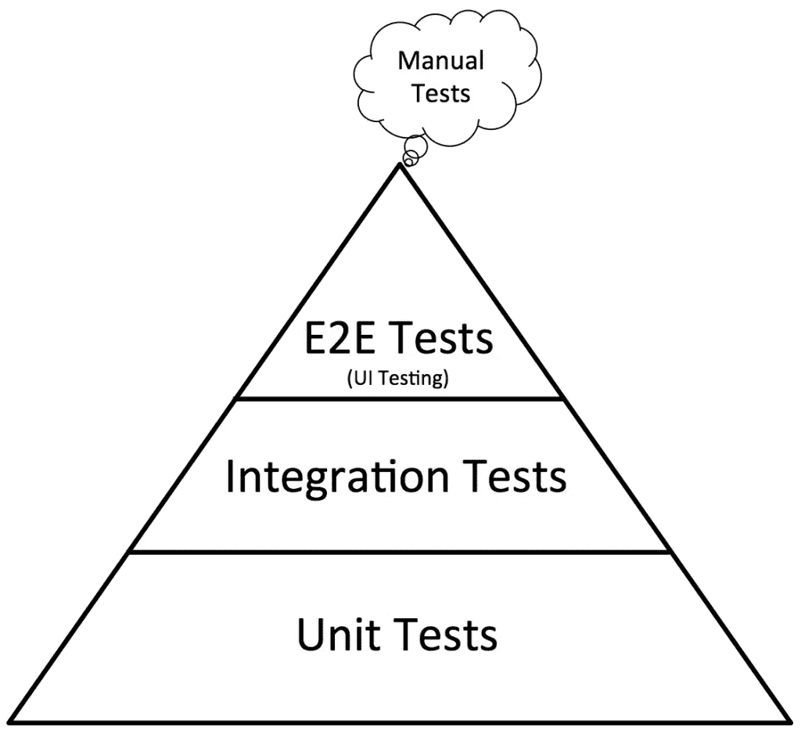

# 端到端测试的问题是

> 原文：<https://levelup.gitconnected.com/the-problem-with-end-to-end-tests-65509df4bc7a>


盐很棒。根据[维基百科](https://en.wikipedia.org/wiki/Salt)的说法，一般来说，盐是生命必不可少的，咸味是人类的基本味觉之一。

大多数人用食盐烹饪食物。然而，如果你加盐太多或太少，那么你可能会吃不下这样的饭。

这并不会使盐变质。是吗？不。它只需要添加正确的数量。

除了获得正确的数量，还有一些[医学状况](https://www.sharecare.com/health/sodium/what-conditions-require-reduced-sodium)，建议你要么减少盐的摄入量，要么完全不吃。

那么，盐是坏的吗，仅仅因为有人被要求取消它吗？

我不是医生，但[可能不是](https://www.healthline.com/nutrition/6-dangers-of-sodium-restriction)。

端到端测试也是如此。它们非常适合测试软件，但是它们也有自己的问题。太多或太少对你也不好。

在继续之前，你知道什么是端到端测试吗？

# 什么是端到端测试？

在所有测试中，我认为端到端测试非常容易理解。

如果您有一个银行应用程序，用户可以从他们的帐户中取款，如下所示:


[来源](https://thereduxjsbooks.com)

你可以写一个端到端的测试来测试用户是否真的可以取钱，也就是没有错误。

在前端应用程序中，端到端测试会自动运行浏览器，并检查某些功能是否正常工作，同时假装是用户。

在伪代码中，测试文件可能如下所示:

```
const testWithdrawal = (browser) => {
	browser
	 .goToURL("http://localhost:3000")
	 .click("button-1")
	 .expect("#amount")
	 .toContainText(2490701)
}
```

测试就像一个真实的用户。它启动一个浏览器，并访问加载应用程序的 url。它还模拟单击取款按钮，然后做出断言，确认最终金额等于之前的金额减去 10000。

很容易理解。

那么，端到端测试的实际问题是什么？

# 什么问题？

端到端测试是一种强大的测试。在测试整体功能时，它们可以为您节省大量时间。

事实上，如果您曾经查找过前端应用程序的不同类型的测试，您很可能会遇到如下所示的“测试金字塔”:



[图像来源](https://www.google.com/url?sa=i&rct=j&q=&esrc=s&source=imgres&cd=&cad=rja&uact=8&ved=2ahUKEwigktrilc_eAhVJLMAKHQGkCCEQjhx6BAgBEAM&url=https%3A%2F%2Fwww.ministryoftesting.com%2Fdojo%2Flessons%2Fthe-mobile-test-pyramid&psig=AOvVaw35gh8hXTdTzZarPF8pq-7H&ust=1542122889983847)

本质上，端到端测试被标榜为最有用的测试。

这是真的，但是如果你是测试新手，你可能会错误地理解前面的陈述。

你可能看不到其他类型测试的必要性。或者更糟的是，您可能会试图消除单元和(或)集成测试，而只进行“最终有用的测试”——端到端测试。

在您对端到端测试做出错误的解释之前，请考虑以下几点:

## 1.端到端测试很慢

想想吧。启动浏览器、加载应用程序、设置某些状态、模拟用户点击等..这可能需要一些时间！

事实上，运行一套端到端测试需要大约 30 分钟并不罕见。

虽然您可能认为这不是很多时间，但请记住，在开发应用程序时，大多数时候您需要即时反馈。

这个新特性会破坏现有的功能吗？是否按预期工作？

你想要一个快速的答案，如果每次都要花 30 分钟，你就必须培养一些耐心。

如果您错误地认为端到端测试是您需要的唯一一种测试，那么您可能已经编写了太多这样的测试，可能需要几个小时才能完全运行您的测试套件。

你会同意这不是快速获得迭代反馈的最佳方式。

## 2.端到端测试失败的频率更高。

假设您知道什么是单元测试，只要测试是确定的，并且没有对代码库进行任何更改，那么一个编写良好的单元测试运行一百次就可能成功。

上面的陈述对于单元测试来说是正确的，但是对于端到端测试来说就不一样了。

那么，我说他们更频繁地失败是什么意思呢？

您可能有一个端到端的测试失败，而被测试的代码正在按预期工作。没有虫子。没什么问题。那为什么端到端测试失败了？

嗯，代码可能花了太长时间才被执行，API 可能花了更长的时间来响应或暂时停机，等等。

这不仅仅是端到端测试的问题。随着许多外部依赖而来的是这些问题。

端到端测试很棒，但是要知道，即使你的代码像预期的那样工作，它们也可能失败。

你知道，这就像有一个奇怪的老板，今天对你很满意，明天对你皱眉头，就像他们看到了鬼一样。你没做错什么，你是同一个人，他们只是对自己的情绪不太可靠。

你现在明白了。

## 3.调试端到端测试可能很困难

调试。我们都爱调试，对吧？当然不是。如果我不用花那么多时间调试代码，我会在几分钟内发布新功能。呃，那太夸张了。

调试端到端测试有时真的很痛苦。除了不得不打开浏览器并非常努力地重现 bug 之外，如果您的测试在另一台机器上失败，例如 CI 服务器，您可能会经历更多的挫折。

为了抑制这种挫折，在一个像 docker 容器这样的可复制环境中运行端到端测试是非常常见的。

您看到您的知识库增长了多少以适应端到端测试了吗？嗯，这对初级开发人员来说也很困难。不管怎样，我想那是为了他们好。他们将被迫在工作中学习，但要意识到额外的学习曲线。

## 4.端到端测试更难编写

我不会强调这一点，因为你可能已经知道这一点。值得一提的是，与其他类型的测试(即单元测试、集成测试和快照测试)相比，一套端到端测试通常会花费更多的时间来设置和编写。

# 在这些问题中…

不要误解这篇文章的本质。我不反对端到端测试。它们太棒了。然而，如果你是测试新手，很容易认为它们是没有任何缺点的终极救星。

事实并非如此，这就是为什么一个好的测试套件应该有正确的测试组合。

这就像做一碗美味的汤。水很好，但是如果在做汤的时候倒太多水，你会以痛苦的晚餐结束。每种成分都必须按正确的比例添加。尽管“适当的比例”大多是主观的，但通常总有一部分是每个人都能接受的。

一般来说，编写测试也是如此。

多写单元测试，少写快照测试/集成测试，更少写端到端测试。

# 结论

当你理解了为什么“伟大的”端到端测试不应该构成你的整个测试套件时，就去用一个平衡的测试套件编写应用程序吧，希望有更少的错误。

*细拉！*

[](https://levelup.gitconnected.com)[](https://gitconnected.com/learn) [## 查找最佳编码教程和课程-学习编码| gitconnected

### 使用我们完整的编码资源列表学习任何编程语言或框架。我们分享、汇总和排名…

gitconnected.com](https://gitconnected.com/learn)