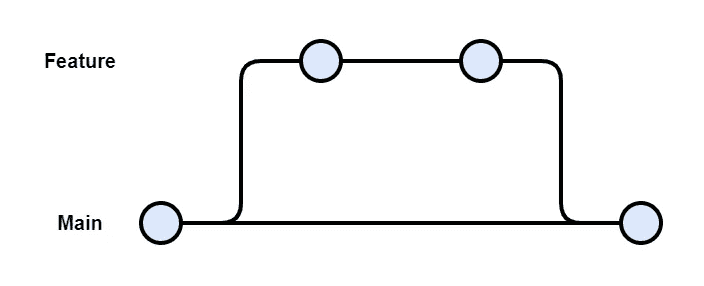
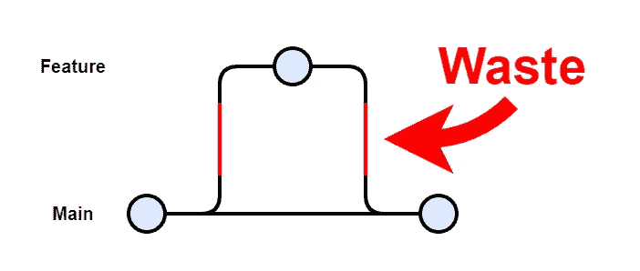

# 特征分支的问题是

> 原文：<https://levelup.gitconnected.com/the-problem-with-feature-branches-1c493a7be3a3>

随着越来越多的公司努力更快地交付软件，遗留的过程减缓了他们的速度，其中之一就是特性分支。

特性分支的使用分离了工作，增加了代码变更的规模，并且阻止了持续的集成。如果出现以下情况，您可能需要重新考虑特征分支的使用:

*   不断陷入大的合并冲突；
*   正在和其他开发者竞赛合并代码；或者
*   没有提交到 git 中的主分支。

# 为什么它们不相容？

**特性分支**是为每个特性创建一个分支的过程，在 Gitflow 中使用([https://www . atlassian . com/git/tutorials/comparising-workflows/git flow-workflow](https://www.atlassian.com/git/tutorials/comparing-workflows/gitflow-workflow))。使用特征分支的过程是:

1.  为新特征创建特征分支。
2.  进行更改，直到特征完成。
3.  将特征分支合并到主分支中。

特征分支

**持续集成**是将所有开发人员频繁变更的代码进行合并的过程([https://www.thoughtworks.com/continuous-integration](https://www.thoughtworks.com/continuous-integration))。随后可以将更改提交到单个分支。这个过程是:

1.  进行代码更改。
2.  将变更提交到主分支。

连续累计

**由于变更持续时间不同，这两个过程不兼容**。持续集成预计至少每天完成，而一个“特性”通常预计需要很多天，有时甚至几周才能完成。

一方面，如果你每天都要创建特性分支，那么开发人员不断创建分支并合并它们的工作就是一种浪费。

特色分支浪费

另一方面，如果您将特性分支分开好几天，那么您将无法遵循持续集成。

这就是特性分支与持续集成不兼容的原因。

所以…

# 替代方案是什么？

**基于主干的开发**是只使用单一版本代码的过程。所有开发人员都可以通过不使用分支来遵循这个过程。

为了拥抱持续集成并采取措施实现持续交付，必须停止特性分支的习惯。

下次你考虑打破这个习惯，通过持续集成你的代码，让你自己更快地交付更好的软件。

如果你想进一步讨论这个问题，请通过**Twitter**@ BenTorvo 或【ben@torvo.com.au】电子邮件 T6 联系我

# 常见问题解答

**问:如果不在常规开发生命周期中使用，分支有什么用？**

A.分支可以用于“不受信任的贡献者”,他们希望对代码库提出修改建议。

**问:如何在不破坏整个代码库的情况下进行更改？**

A.一个建议是使用特性标志来允许半实现的特性在需要时或仅由授权用户访问。