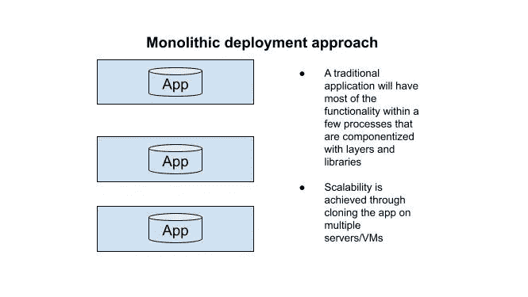
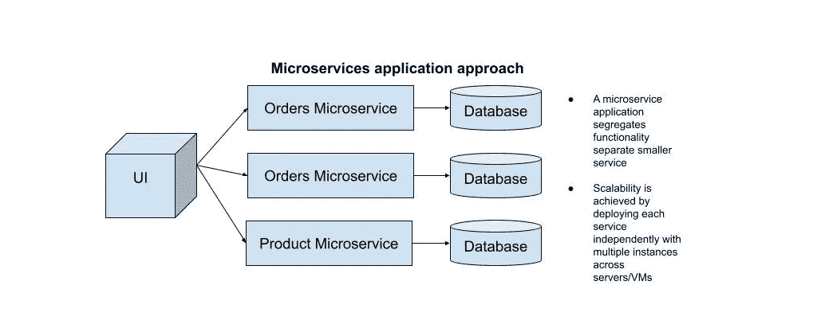

# 微服务的问题是

> 原文：<https://levelup.gitconnected.com/the-problem-with-microservices-2068f64c52e2>

什么是微服务，何时使用微服务，需要考虑什么

照片由
[Joshua Woroniecki](https://unsplash.com/@joshua_j_woroniecki) 在 [Unsplash](https://unsplash.com/photos/lzh3hPtJz9c) 拍摄

首先，我只想说一个爱微服务，觉得他们很棒。但是在与不同的人交谈时，我也可以看到为什么有些人认为微服务不好，以及他们所发生的问题，所以我只是想尝试澄清一下我们何时应该真正使用微服务，以及有什么好处和需要注意的事情。

## 什么是微服务

首先，让我们看看传统的单片应用程序是如何工作的。

实际情况是，应用程序是一个整体，为了实现可伸缩性，我们需要克隆整个应用程序。听起来很理想，我知道。

现在让我们来看看微服务方法。

现在我们可以看到，可伸缩性是通过扩展具有大量流量的单个服务而不是整个应用程序来实现的，这很好，因为它带来了很多好处。

微服务方法意味着设计和开发一个应用程序，该应用程序是一组松散耦合的服务，它们之间相互通信以实现业务需求。

您使用微服务有多种原因，例如:

1.  *改进的可扩展性*
2.  *围绕业务能力组织*
3.  *提高生产率和速度*
4.  *自主*
5.  *更快交货*

虽然这在理论上听起来很棒，但你可能根本不需要采用微服务。

## 使用微服务的理由:

1.  如果你想让你的单片应用程序适应可伸缩性，可管理性和速度。
2.  如果您构建的应用程序要求快速的交付速度等等。
3.  如果您需要在几乎不停机的情况下独立部署新功能
4.  如果你需要更高程度的团队自治。例如，一个大型的单片应用程序和一个大型团队会因为大量的合并冲突而使更改变得更加困难。

## 不使用微服务的理由:

1.  微服务为复杂的问题提供了很好的解决方案，但是如果企业没有更复杂的问题，那么你可能不需要微服务。
2.  微服务更难构建，需要开发人员对微服务有很好的理解，如果没有这样的人或在较小的团队中采用微服务，可能会导致不好的后果。
3.  为了实现微服务而实现微服务，或者因为它在理论上提供了许多积极因素，这并不是一个足够好的实际投入工作的理由。有些应用本质上和功能上都很简单，没有必要采用微服务。

我知道，我知道，题目说的是'*问题*'。再来看看微服务带来的问题。

## 微服务是一种分布式系统架构

这意味着使用微服务比创建一个单一的应用程序要复杂得多，而且不仅仅是构建 REST APIs。您需要考虑服务、安全性和设计本身之间的通信。

监控也更加复杂，例如，一个请求在完成之前可能会经过多个服务，这就产生了一个需要适当监控的路径，以确定问题的潜在原因。

## 微服务需要很小

微服务需要小而易懂，但具体指的是什么可能会因你问的人而异。一个很好的参考点可能是——如果重新实现服务需要几周以上的时间，而且这样做听起来很可怕，那么很可能服务已经太大了。

## 微服务需要专注于一项任务

在设计微服务时，我们需要记住，它应该只完成一项任务。现在，很明显，它可以与其他微服务通信来这样做，但如果从外部来看，你应该只将它与一个任务相关联。例如，如果我们有一个订单微服务，它应该只负责订单，但在内部，它很可能会与产品、电子邮件等微服务进行通信，以实现目标。

## 微服务应该是自治的

正如我们上面提到的，微服务的真正力量在于它们允许我们独立部署它们。这意味着我们应该能够在不与其他团队成员真正协调的情况下进行更改或实现，因为我们只在单个服务上工作。这是微服务将带来的真正价值，允许巨大的可伸缩性。

## 结论

整体式方法和微服务方法各有优缺点，并且完全基于期望的结果。如果你想处理复杂的问题，微服务是很好的选择，因为它们速度快、可伸缩且易于部署。但是，在现实中，对于许多较小的企业和应用程序，您并不真的需要采用微服务，因为它会变得非常复杂，作为一个团队，您应该考虑这是否是正确的决策。