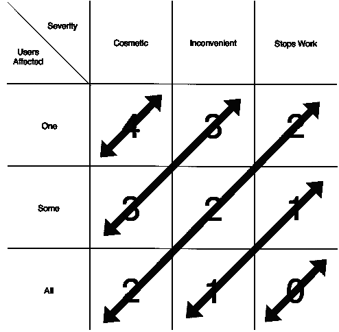

# 你解决的问题比你写的代码更重要🔊

> 原文：<https://levelup.gitconnected.com/the-problem-you-solve-is-more-important-than-the-code-you-write-d0e5493132c6>

## 软件有一个有时被遗忘的目的。

一把锤子放在一块木头上的照片。木头上粘着一个螺纹螺丝。螺丝钉被重重地敲弯了。

听听音频版！

程序员似乎忘记了软件的真正目的，那就是解决一个现实世界的问题。

50 年前的 1968 年，由北约科学委员会主办的软件工程工作会议[召开。那时，人们开始注意到软件正在成为社会的一个基本部分。然而，这也变得太难理解了。那次会议之后，编程开始成为一个完整的行业。它开始脱离商人的控制。](http://homepages.cs.ncl.ac.uk/brian.randell/NATO/NATOReports/)

不管从那以后编程走了哪条路，业务和软件开发之间的分离仍然是一个问题——或者像会议第一次呼吁的“工程”。如果开发人员变得过于狭隘地专注于开发，他们可能会错过他们编写的软件背后的目的。他们可能看不到不需要任何代码的隐藏解决方案。

这里有一个例子。

有一家初创公司正在开发一种设备，允许人们使用蓝牙打开家门。与设备交流的可视界面是一个小工具，即使手机被锁定也是可见的。它只有一个按钮，叫做“开门”当用户靠近房子时，他们会抓起手机，找到小工具，然后单击按钮打开。

他们的销售彻底失败了。客户没有耐心拿起手机，解锁，打开应用程序，等待它加载，然后每次想进屋都要点击按钮开门。

有人看着这个工作流程问道:

> 如果我们使用蓝牙，并且我们的商业模式接受任何拥有手机的人都可以进入房子，为什么我们需要让别人拿起手机并按下按钮呢？让我们允许门在检测到设备接近 1 米时解锁。这样我们就不需要支付设计和编码可视化界面的成本了！

蓝牙的故事是一个聚焦狭窄的极好例子:目标是用最少的努力打开门。如果传感器是无线的，那么设计一个可视化界面是没有意义的。

如果你意识到企业想要达到的目标和对用户的价值，你就可以将这些知识与你对该技术的了解结合起来。只有这样，你才会有足够的信息来得出更好的答案，并得出结论，界面对于一个产品来说是不必要的。

这是如何解决编程问题[的一个很好的例子，除了解锁功能的代码之外，不需要编写任何额外的代码](https://medium.freecodecamp.org/code-that-dont-exist-is-the-code-you-don-t-need-to-debug-88985ed9604)。然而，[就像技术债](/how-to-use-technical-debt-in-your-favor-98bae475ba68)，**都不应该以此为借口**在其余地方写废话代码。

> 不是每个代码都值得编写

有时候，修复一个严重的 bug 可能不是优先考虑的事情。如果你是一个加密交易所，你的系统允许[重复存款](https://medium.com/@fagnerbrack/the-day-a-bug-was-fixed-only-because-the-ceo-called-in-f653a34079eb)发生一次，如果解决问题的成本很高，人工干预可能是最好的成本效益解决方案。

严重性和优先级之间的这种权衡让我想起了一位同事最近向我展示的一个模型[。它被称为优先级矩阵，一个二维的](https://www.facebook.com/gazza)[模型](https://medium.com/@fagnerbrack/you-cant-call-yourself-an-explorer-without-a-map-4e19ce51daa3)，可以用来根据它影响了多少用户和严重性来区分错误的优先级。

描述二维优先级矩阵的图片。Y 维度表示标题为“受影响的用户”的列，包含值“一”、“一些”和“全部”X 维度表示标题为“严重性”的列，其中包含值“装饰性”、“不方便”和“停止工作”根据在轴中的位置，bug 的优先级或多或少是重要的。例如，如果一个 bug 是装饰性的，并且影响一个用户，那么优先级是 4；如果一个 bug 停止了某人的工作并影响了一些用户，那么优先级是 1；如果一个 bug 停止了其他人的工作并影响了所有用户，那么它的优先级最高，值为零。

之前描述的单笔重复存款问题属于影响**一个用户**的**不便**范畴。因此，优先级 3。

> 不是每个错误都值得修复

作为开发人员，尝试为所有事情编写脚本是很常见的。然而，一些可重复的任务可能不值得自动化。如果您打算隐藏底层命令如何工作的基本知识，您不需要花时间编写脚本。

复杂逻辑的封装和有用知识的抽象是有区别的。有时，信息应该清晰易懂。如果你将它们抽象化，它们会产生相反的效果，更难理解。

在 CLI 中使用某些类型的低级命令比抽象知识的高级命令更有用，比如 Git 别名。

> 不是每个命令都值得编写脚本

几年前，我参与了一个使用[增量交付](/code-less-think-more-incrementally-98adee22df9b)的项目。这是一个身份验证系统，要求用户提交一些个人数据，由第三方提供商进行验证。

这个团队想要构建一个奇特的字段验证功能。然而，随着截止日期越来越近，在每个 sprint 计划中，验证故事被降低了优先级。最终，该团队发现这种花哨的验证一开始就不存在任何意义。

原因如下:验证是强制性的！

提供有效信息符合用户的利益。如果用户提供了错误的数据，他们将无法通过验证，也无法使用系统。此外，大多数浏览器支持足够好的标准 HTML 验证。

在最糟糕的情况下，无法验证自己的用户会打电话给支持人员进行手动验证。

> 不是每个特性都值得编码

作为一名开发人员，如果你理解了你试图解决的问题，你就能写出更好的代码，有时甚至不用代码。你不是一个拿工资在屏幕上写字符的代码猴子。你是专业人士，被雇来解决问题。

然而，如果你试图不加思考地用技术解决每一个问题，就好像代码是一颗[银弹](https://medium.com/@fagnerbrack/how-to-reject-the-belief-on-the-silver-bullet-1d86b686acbb)，你将很难理解是什么给了客户价值，也很难想出好主意。

你的目的和你写代码的目的是创造价值，让现有的世界变得更好，而不是满足你对世界应该是什么样子的自我中心观点。

有句谚语说:“如果你只有一把锤子，所有的东西看起来都像钉子。”

最好先有个钉子，这样可以考虑是否需要锤子。

也就是说，如果你首先需要一个钉子的话。

如果你的团队从我关于这篇文章或我正在进行的任何其他项目的谈话和/或问答中受益，请在`contact at fagnermartins.com`给我写信。

另请参见[您的测试应该如何验证代码是否解决了问题，而不是它是否运行了](https://medium.com/@fagnerbrack/the-test-should-verify-if-the-code-solves-the-problem-not-if-it-runs-afea37a3a6e)。

感谢阅读。如果您有任何反馈，请通过 [Twitter](https://twitter.com/FagnerBrack) 、[脸书](https://www.facebook.com/fagner.brack)或 [Github](http://github.com/FagnerMartinsBrack) 联系我。

想当面聊聊吗？你可以在 [**悉尼软件工匠聚会**](https://www.meetup.com/Software-Crafters-Sydney/) 找到我。