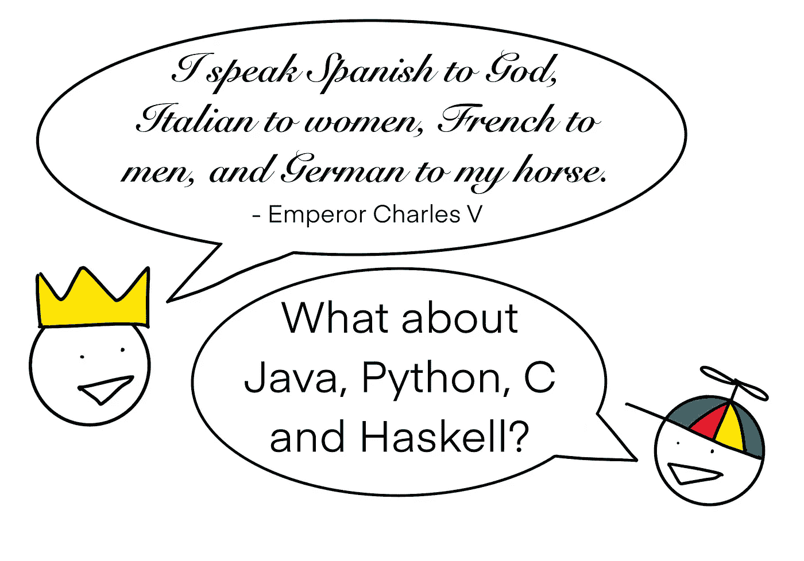

# 帮助我掌握软件工程的编程语言

> 原文：<https://levelup.gitconnected.com/the-programming-languages-that-helped-me-master-software-engineering-12793de99fbb>

## 我的不同编程语言之旅以及从中得到的教训

作者的漫画，是好是坏

要成为一名专业的软件工程师，了解多种编程语言是值得的。每个人都擅长特定的任务，提供不同的抽象概念，并提供解决问题的新方法。

> *“如果一个人只懂一种语言，他就不应该称自己为专业人士”——*[*比雅尼·斯特劳斯特鲁普*](https://www.stroustrup.com/quotes.html)

C++的发明者比雅尼·斯特劳斯特鲁普甚至说，懂几种语言是成为专业软件工程师的先决条件。

每个软件工程师都有他们自己的学习语言的道路，以及他们从每种语言中学到了什么。在这里，我展示了我学习和使用的语言，以及它们教给我的经验。

# Java 语言(一种计算机语言，尤用于创建网站)

> “1996 年——詹姆斯·高斯林发明了 Java。Java 是一种相对冗长、垃圾收集、基于类、静态类型、单分派、面向对象的语言，具有单实现继承和多接口继承。”— James Iry，[“一部简短、不完整且大多错误的编程语言史”](http://james-iry.blogspot.com/2009/05/brief-incomplete-and-mostly-wrong.html)

我主要在高中、大学、实习和我的第一份工作中使用 Java，当时 Java 7 和 8 很流行，streams 还没有出现。

## 面向对象编程

不出所料，Java 是学习面向对象编程的优秀语言，因为它们被融入到语言中。它通过继承向我介绍了多态性、[钻石问题](https://dzone.com/articles/dealing-with-diamond-problem-in-java)和泛型。随之而来的还有一些如何过度的坏例子。从那以后，我在一个项目中再也不需要超过两层的接口或继承。

## 并发的线程模型

并行编程有两种基本模型:消息传递和共享内存访问。Java 的线程模型实现了后一种方法，并且做得很好。

多线程共享内存的问题是，几个线程可能试图以某种方式访问相同的变量，从而使程序处于不一致的状态。幸运的是，Java 有一系列并发原语，比如锁、信号量和临界区，可以帮助您防范与并发相关的错误。

Javas 的成熟使它成为学习和推理并发运行的一个极好的环境，但是不可否认，它会变得相当复杂。

## 出色的文档

Java 有一个庞大的标准库，它的公开文档几乎没有。它的 JavaDoc 工具使编写和汇编自己的文档变得很容易。从那以后我就没见过更好的了。(我可能也没有搜索那么多，但那是另外一个故事。)

# 计算机编程语言

> “1991 年——荷兰程序员吉多·范·罗苏姆前往阿根廷进行一项神秘的操作。他带着一个巨大的颅骨伤疤回来了，发明了 Python，被大批追随者宣布为终身独裁者，并向世界宣布“只有一种方法可以做到。””— James Iry，[“一部简短、不完整且大多错误的编程语言史”](http://james-iry.blogspot.com/2009/05/brief-incomplete-and-mostly-wrong.html)

我开始用 Python 写小脚本，后来在两份工作中把它作为主要语言，主要是 web 服务和微服务。

## 管理您的需求

大多数语言在某种程度上要求您管理依赖关系，但是 Python 项目让我第一次真正接触到了它。 [Pip](https://pypi.org/project/pip/) 和[poems](https://python-poetry.org/)是我在这方面的常用工具，它们提供了一种添加、更新或锁定需求的简单方法。

这为更重要的可重复构建的概念提供了素材。给定相同版本的代码，也就是给定一个特定的 git 提交，你应该能够构建完全相同的工件。这意味着将需求锁定到精确的版本，并将这些锁定文件作为源代码控制的一部分。

也说明了蟒蛇生态系统的成熟。它不仅提供了大量的第三方模块，而且还附带了不错的工具来管理它。

## 异步编程

多亏了 GIL，Python 不进行并行计算。然而，它仍然支持并发编程，在这种情况下，我们可以交错执行多个函数，以产生它们同时发生的错觉。

`asyncio`为此提供了一个全面的接口。在许多方面，它比线程更容易使用，对于像 web 服务器这样的 I/O 密集型应用程序，它的性能要高得多。[但是，它有自己的一套陷阱，](https://betterprogramming.pub/the-dangers-of-async-in-python-and-how-to-avoid-them-6e6f98f19f0e)你必须小心不要写下事件循环。

JavaScript 还提供了带有`async/await`语法的异步编程。但由于这是我的学习之路，我把它归功于 Python，抱歉。我不想争论哪个更好，但是在 Python 中，你可以创建一些很酷的`async iterators`。我很难理解在 JavaScript 中用流做类似的事情。

## 混合蛋白

有时通过继承的 Javas 多态性会导致问题。通常，不同的类之间有一些共享的功能，但是它并不完全适合一个基类。[蟒蛇混血儿前来救援](https://dev.to/bikramjeetsingh/write-composable-reusable-python-classes-using-mixins-6lj)。

继承表示“是-是”的关系，混合表示“可以-做”的关系。这意味着你可以封装在一个类中没有意义的功能。

来自 Java 的 mixins 给了我另一个如何组织和重用代码的工具。他们还帮助我理解像 Scala 这样的语言中的`traits`。从概念上讲，它们非常相似，但是 mixins 允许包含状态，而 traits 不允许。

# C

> “1972 年——丹尼斯·里奇发明了一种强大的枪，可以同时向前和向后射击。对他发明的 C 和 Unix 造成的死亡和永久伤残的数量不满意。”— James Iry，[“一部简短、不完整且大多错误的编程语言史”](http://james-iry.blogspot.com/2009/05/brief-incomplete-and-mostly-wrong.html)

我最近没怎么用 C，主要是为了我的学士和硕士项目，以及在辅导课上提供例子。所以下一点不应该是惊喜。

## 两颗北极指极星

每种语言都以某种方式拥有它们。有些人只是隐藏得更好。不管是好是坏，c 都不是这些语言中的一种。所以一旦你编写并调试了一个指针数组，每个指针都指向另一个指针数组，你就真正理解了它。

也许这样的试火是不必要的，但迟早你必须理解指针，C 迫使你理解它以完成任何事情。

## 了解内存布局

c 提供了一个基本的运行时环境，您必须进行内存管理，并且许多与 I/O 系统的交互都是围绕底层系统调用的薄薄的包装。这让您对操作系统的工作原理以及用户进程的内存布局有了更好的了解。

为了更进一步，我还尝试了一点堆栈溢出攻击。如果你想进入内存布局，我可以推荐[这本书](https://www.oreilly.com/library/view/hacking-the-art/9781593271442/)。

# ML 和 Haskell

> “1973 年——罗宾·米尔纳创造了 ML，一种基于 M&M 类型理论的语言。ML 产生 SML，它有一个正式指定的语义。当被问及形式语义学时，米尔纳的脑袋爆炸了。ML 家族中其他众所周知的语言包括 OCaml、F#和 Visual Basic— James Iry，[“一部简短、不完整且大多错误的编程语言史”](http://james-iry.blogspot.com/2009/05/brief-incomplete-and-mostly-wrong.html)

不，ML 在这里不是代表机器学习，而是元语言。它是一种不太为人所知的函数式语言。唯一使用它的公司(据我所知)是 Jane Street，它使用一种叫做 OCaml 的方言。我将它与 Haskell 捆绑在一起，因为它们都是纯函数式语言，并且非常相似。

## 函数式编程概念

我从函数式语言中学到了函数式编程概念，这似乎是显而易见的。但是了解不可变变量、纯函数、currying 和模式匹配会让你对结构化代码有一个新的视角。[这绝对让我的代码更干净！](https://javascript.plainenglish.io/how-to-write-clean-javascript-code-with-functional-programming-54fd60a56074)

这也是少数几个我可以推荐一个明确的起点的话题之一，[学你一个 Haskell](http://learnyouahaskell.com/chapters) ，在 HackerRank 或者 project Euler 上尝试一些问题。

# 进一步提及

在每一个开发人员的职业生涯中，当然都有只是零星使用的语言。但是，尽管它们可能没有给人留下深刻而持久的印象，还是有更多的收获。这是我的亚军。

## 戈朗

我只在一份工作中使用过少量的 Golang，所以它没有时间给我留下深刻的印象。

我喜欢它的测试方法，尤其是基于表格测试的想法。如果代码看起来不那么混乱就好了。

Golang 也有不同的并发方法。它使用通道来实现消息传递，而不是前面提到的构建在共享内存上的线程。我自己没用过，但还是值得一提。与其他语言相比，它将让您对并发有一个新的更好的理解。

## JavaScript/类型脚本

我要坦白一件事。JavaScript 教给我的概念并不多，主要是因为它离我的第一语言还很远。但是你的道路可能会不同，这没关系。JavaScript 在**异步编程**方面非常出色，它的生态系统和`npm`会让你立刻精通依赖管理。

JavaScript 可以教给你的另一个概念是[用不同版本的 node.js 和依赖关系管理虚拟环境](https://javascript.plainenglish.io/use-nvm-for-multi-project-success-a93e8abd1306?sk=df6ac84de5825442d8132db1506c9a8c)。我相信理解虚拟环境是成为高级工程师的重要一步。

## Bash/Shell

我对 shell 脚本犹豫不决。

一方面，它们让你高效地完成小任务。例如，在 Python 或 Java 这样的语言中可能需要 50 行的代码，在 bash 中可能需要 5 行。在快速自动化任务方面，它是首屈一指的。

另一方面，众所周知，bash 脚本难以阅读和维护。没人应该写更多的 bash。

因此，使用小型 bash 脚本作为强大的工具，但不要让这种力量腐蚀了你。

# 最后的想法

希望这次旅程能让你对不同的编程语言和它们所传达的概念有一个大致的了解。也许你甚至会有动力去学习一门新的语言。

我的学习之路并没有结束，还有大量的语言和技术有待探索。例如，我希望在某个时候捡起铁锈。

我很想在评论中听到你是如何遇到不同的概念的，或者你认为哪些概念值得一篇更深入的文章！

# 资源

 [## 一部简短、不完整且大多错误的编程语言史

### 1801 年的今天，约瑟夫·玛丽·雅卡尔使用穿孔卡片来指示织布机将“你好，世界”织成挂毯。…的 Redditers

james-iry.blogspot.com](http://james-iry.blogspot.com/2009/05/brief-incomplete-and-mostly-wrong.html)  [## 学你一个哈斯克尔的伟大好处！

### 编辑描述

learnyouahaskell.com](http://learnyouahaskell.com/chapters)  [## 使用 Mixins 编写可组合、可重用的 Python 类

### 编程的一个重要原则是不要重复。避免重复被认为是很好的做法…

开发到](https://dev.to/bikramjeetsingh/write-composable-reusable-python-classes-using-mixins-6lj)  [## 黑客:利用的艺术，第二版

### 黑客是创造性解决问题的艺术，无论这意味着找到一个非常规的解决方案来解决一个难题…

www.oreilly.com](https://www.oreilly.com/library/view/hacking-the-art/9781593271442/)