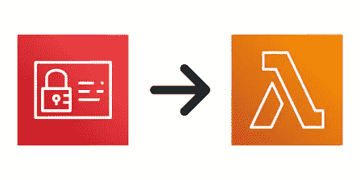
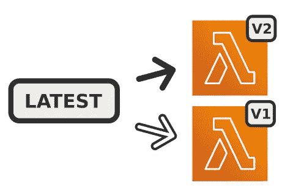
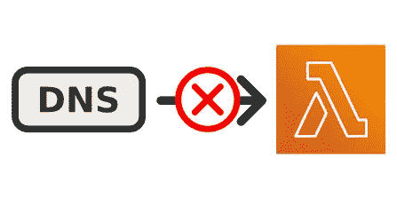
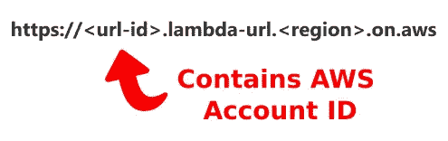
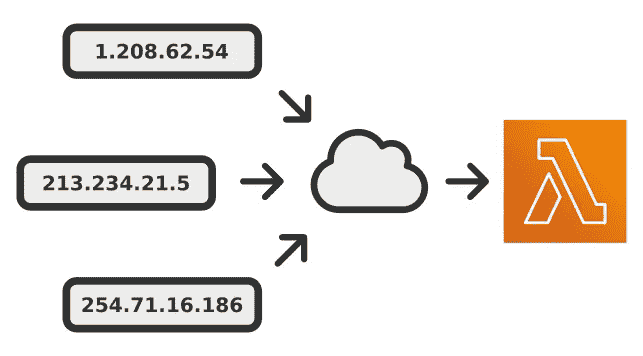
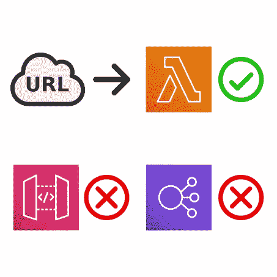

# AWS Lambda 函数 URL 的利与弊

> 原文：<https://levelup.gitconnected.com/the-pros-and-cons-of-aws-lambda-function-urls-5868c9dacf20>

AWS Lambda 函数 URL 于 2022 年 4 月 6 日发布，作为一种基础设施配置，它为您提供了直接触发 AWS Lambda 函数的公共 URL。


该服务提供了一种比 AWS API 网关或 AWS 应用程序负载平衡器(ALB)更快、更简单的方式来触发 AWS Lambda 函数。URL 遵循如下标准结构:

```
https://**<url-id>**.lambda-url.**<region>**.on.aws
```

# 优点:快速实施和部署

AWS Lambda 函数 URL 的配置和部署非常快速，同时比其他替代方案需要更少的设置。当我设置端点时，它几乎可以立即使用，并且只需要一些配置值。


AWS API Gateway 和 AWS ALB 运行缓慢

AWS API Gateway 需要更长的部署时间，并且需要一组更复杂的资源来设置。API、资源、方法、部署、Stage 和 Lambda 权限都是设置的一部分。

AWS ALB 需要配置额外的底层资源，并且有前期使用成本。设计 AWS 网络需要做很多工作，但至少它们包含 VPC、子网、IGW 和安全组。AWS ALBs 还需要多个不同的资源来组成一个工作系统。

# Pro: IAM 用于访问控制

AWS Lambda 函数 URL 身份验证的选项是“无”或“使用 IAM”。当您使用 None 时，代码中应该包含任何额外的安全性。但是，当您使用 IAM 时，您可以以显著的粒度引用 IAM 资源。这意味着，如果您和您的客户都使用 AWS，只需直接参考他们的 AWS IAM 资源，就有一个强大而简单的安全集成点。



AWS IAM 至 AWS Lambda

# Pro: AWS Lambda 别名支持

新的 URL 还支持 AWS Lambda 别名，这意味着在替换底层基础设施时，您可以保持一致的面向公众的 URL。这并不像使用 DNS 那样实际，但是如果你不介意 AWS Lambda 别名和版本控制系统的话，这是可行的。



AWS Lambda 别名

# 缺点:没有自定义 DNS 支持

如前所述，DNS 不能用于 AWS Lambda 函数 URL，这对发布和向客户提供服务都是一个问题。



没有自定义 DNS

缺少自定义 DNS 类似于私有 AWS API 网关，如果您对发布过程使用 DNS 自动化，这可能会导致问题。

通过部署 AWS CloudFront 并指向后端的 URL，可以解决自定义 DNS 问题。这与部署 AWS API Gateway 的工作量差不多，这抵消了使用新特性的好处。

# 缺点:AWS 帐户 ID 暴露

根据 AWS，新的 URL 暴露了用于服务的 AWS 帐户 ID，这可以向任何恶意行为者提供信息。出于安全目的，AWS 帐户 id 不被视为凭证，但是可能的话应该避免发布此信息。



AWS 帐户 ID 暴露

# 缺点:有限的网络控制

由于 AWS Lambda 功能 URL 的实现，没有办法实现基于 IP 或比前述授权更低的任何级别的网络控制。这是一个限制，根据您的环境，这可能是一个问题。对于像我过去工作过的大型企业来说，这是不可接受的，但如果你正在运营一家初创企业，牺牲实施速度可能是值得的。



没有 IP 控制

# 摘要

看到更多的功能被添加到 AWS Lambda 和无服务器解决方案中总是件好事。然而，新的 AWS Lambda 函数 URL 在访问控制和 DNS 实现方面还有很多不足之处。希望在不久的将来，我们将获得自定义 DNS 作为一项功能，这样我们就不必使用 AWS 别名和 AWS 提供的 URL。



URL vs ALB vs API

点击此处了解更多内容，或通过以下方式联系我:

*   **推特:** [@BenTorvo](https://twitter.com/BenTorvo)
*   【ben@torvo.com.au】邮箱: [邮箱:](http://torvo.com.au/)
*   **网址:**[torvo.com.au](http://torvo.com.au/)

# 更多信息

 [## Lambda 函数 URL

### 使用函数 URL 向 Lambda 函数添加一个专用的 HTTP(S)端点。

docs.aws.amazon.com](https://docs.aws.amazon.com/lambda/latest/dg/lambda-urls.html)