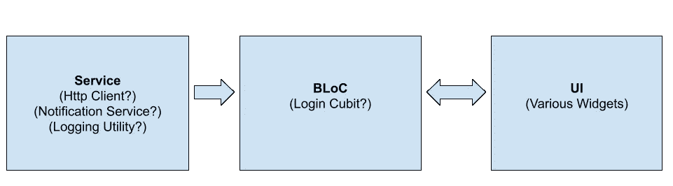

# 颤振单元试验快速指南

> 原文：<https://levelup.gitconnected.com/the-quick-guide-to-flutter-unit-testing-2f892539622b>

## 新颤振测试仪指南，但初级编码经验。

媒体界有一种误解，认为单元测试不适合 MVP。相反，单元测试是 MVP 的福音！如果没有单元测试，您有两个选择:

1.  最终不可避免地向用户发布一个错误
2.  手动测试一切，每次更新

第一个不好，原因很明显，但第二个是一个伪装的魔鬼。在一个小的应用程序中，在你`git push`之前测试核心功能是很容易的，但是一旦你开始添加一些功能，手动测试就变成了一项耗时的任务。

有了自动化的单元测试，您就避免了错误的产生，并且节省了大量的时间:不再需要手动测试每个分支，您最终可以在 30 秒或者更短的时间内一次测试完所有的分支。从长远来看，预先花掉 10%的额外时间可以节省你几个小时。

更重要的是，如果你正确设置了代码库，颤振测试非常容易编写。即使您没有，Flutter 的设计也考虑到了良好的实践，因此向更易测试的代码库迁移并不困难。

## 建筑



准备测试的 Flutter 代码库使用了一些简单的依赖注入模式。通常，服务会与 BLoC 层对话，而 BLoC 层会与 UI 层对话。

## 服务

服务可以有依赖关系，但只能依赖于其他服务。这不是什么不知名的“最佳实践”，这是直觉。您的服务为您执行功能，并且可以在许多地方使用。如果我们将它直接绑定到一个特定的小部件或区块，它就不再是一项服务，它只是您的小部件/区块的一部分！

我们如何依赖注入服务？我用的是一个叫`get_it`(此处[为](https://pub.dev/packages/get_it)的包！).我建议看一下文档，但是总的来说，这个包的流程非常简单。首先，在应用程序的根目录下，创建一个名为`service_locator.dart`的文件(或者你想要的任何东西)。然后，在文件顶部做`final getIt = GetIt.instance;`。编写一个注册所有服务的函数，恰当地命名为`registerServices`。对于每个服务，按照`getIt.registerSingleton<MyService>(MyService());`的思路做一些事情。下面是我的`service_locator.dart`在真实应用中的样子:

这里通常不应该有逻辑，但是一点点配置不会有什么坏处。

这里的最后一步是在运行应用程序的`void main() {}`函数中调用`registerServices`。

服务几乎没有依赖性，因此它们是迄今为止最容易测试的。对于这种情况，考虑一个简单的`LocalImageService`类(这个类用于生产应用程序，所以这不是一个“玩具”用例！):

这里有几件事情正在发生:首先要注意的是，我们实际上正在使用`getIt<ImagePicker>()`(这来自外部包)来消费一个依赖项。这就是服务定位器发挥作用的地方。另一件事是只有一个执行路径需要测试，那就是`selectImage` api！所以让我们开始测试它。

测试进入`test`目录，而不是`src`目录。路径是完全相同的:例如，如果我们在`src/services/local_image_service.dart`下有`LocalImageService`，您将想要进行测试`test/services/local_image_service_test.dart`。另一个区别是文件名只是`{filename}_test.dart`。

我们要为此设置模拟/假货。我用`mocktail`，([这里用](https://pub.dev/packages/mocktail)！)但是也可以用 mockito。我们唯一需要的模拟是对我们的`ImagePicker`的模拟。使用 mocktail 很容易设置:

```
class MockImagePicker extends Mock implements ImagePicker {}
```

我们还需要一个假的`XFile`(函数的返回值。一个“假”和一个模拟非常相似，但是唯一的区别是你不能根除实现。当逻辑每次都非常相似，或者对象只是一个外壳，根本没有逻辑时，我会使用 fakes)。

```
class FakeXFile extends Fake implements XFile {}
```

现在，我们要做的就是编写测试！

我在评论中描述了所有的复杂性，所以我建议看一看那些。

您可能还想测试并确保返回值也是`fakeXFile`，但是我将把它留给读者作为练习。

就是这样！您编写并依赖注入了一个服务。

## 集团

顺便说一下，BLoC 现在是 cubit:我们将测试 Cubit，而不是测试 BLoC，它们在功能上是等价的，可以互换。

这是我们的腕尺:

超级简单。请注意，我们在任何地方都不依赖于 UI:这完全是在块层，但是它可以通过功能直接绑定到 UI:也许(并且很可能)这个 cubit 在其他地方没有用，并且有一些特定于应用程序的动作。那也行！

测试是什么样的？幸运的是，BLoC hand 用他们的`bloc_test`包帮你测试。

下面是其中一个测试的样子，评论道:

因为我们已经处理了依赖注入，所以测试设置起来既快又容易！

## **小工具**

测试的最后一层是小部件测试。小部件与 bloc 对话，bloc 很好，因为我们可以操纵它们的状态来观察 UI 是否做出相应的反应。

下面是我们将要测试的小部件:

非常简单的小部件，除了是一个很好的例子之外，真的没什么用。

一般来说，将字符串存储在变量中对于翻译之类的事情来说是个好主意，但是

这里应该写很多测试，但是我们只做一个:

*   点击文字按钮是否调用上传功能？
*   非空状态是否意味着我们显示`hasImageCopy`文本？
*   空状态是否显示`TextButton`？(这是我们要写的)

我们现在需要模仿腕尺，但是腕尺有一个特殊的模仿:

```
class MockImageUploadCubit extends MockCubit<XFile?> implements ImageUploadCubit {}
```

我们的测试现在将使用`testWidgets`关键字。这意味着我们正在运行一个小部件测试，我们应该得到一个无头的`widgetTester`。本质上，这是一个窗口小部件被渲染的环境，但不是给你我看的，只是为了让我们可以验证在那个环境中发生的事情。

```
testWidgets('should show button on null state', (tester) async {});
```

总的来说，我最喜欢编写小部件测试，因为它们实际上只涉及一个依赖项:当前块！这意味着几乎没有什么需要剔除的，所以编写这些测试轻而易举。

就是这样！恭喜，您已经测试了应用程序的所有层。在我们分开之前，这里有一个我在应用程序中使用的 Makefile，这样我可以快速查看生成的覆盖率报告。将您不想包含在您的覆盖报告中的任何文件添加到`t-clean`部分。

我在每次提交/ PR 之前运行`full-t`,以确保我没有错过任何测试的黑暗角落，并允许自己有很大的覆盖率。