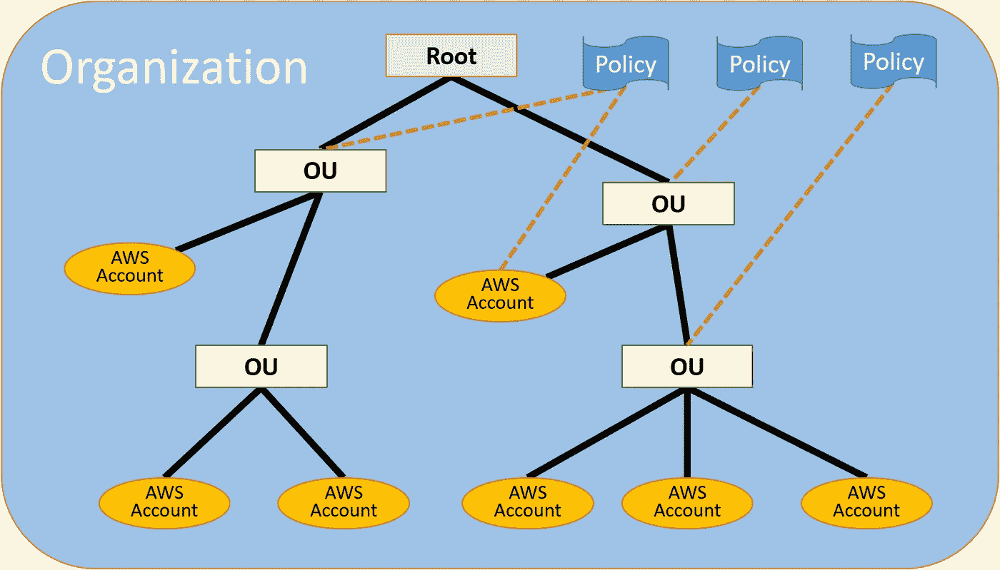

# AWS 组织的快速概述

> 原文：<https://levelup.gitconnected.com/the-quick-lowdown-on-aws-organizations-c55775bf45f9>

图:AWS 组织层次结构。来源:[亚马逊](https://docs.aws.amazon.com/organizations/latest/userguide/images/BasicOrganization.png)。

几年前，亚马逊将他们的 VPC ( [虚拟私有云](https://docs.aws.amazon.com/vpc/latest/userguide/what-is-amazon-vpc.html))服务宣传为顶级隔离，他们没有为多账户配置提供很多支持。更大、更复杂的客户没有这种能力，他们开始使用多账户架构来实现计费、安全性和弹性的隔离。Amazon 顺应用户需求，逐渐支持帐户的管理合并和跨帐户通信。 [**AWS 组织**](https://docs.aws.amazon.com/organizations/latest/userguide/orgs_introduction.html) 现在是支持多账户策略的正式架构。

对于我们这些在多账户策略成为(受支持的)事物之前就开始使用 AWS 的人来说，或者对于任何还没有跟上这种新的多账户范例的人来说，这篇文章将很快触及重要的概念。

## I .仅仅通过设置会破坏任何东西吗？

在一个帐户中，您创建一个组织，然后该帐户成为主帐户。主帐户**中的所有内容都继续像您通常预期的那样运行**。

主账户现在将正式拥有所有**成员账户**和成员账户资源。[所有开票合并](https://docs.aws.amazon.com/awsaccountbilling/latest/aboutv2/consolidated-billing.html)至主账户(注意:您可以创建一个 [*开票合并，仅限*](https://docs.aws.amazon.com/organizations/latest/userguide/orgs_getting-started_concepts.html#feature-set-cb-only) 组织)。

主账户可以**以编程方式提供新成员账户**或**向现有账户发送邀请**加入组织。当一个帐户加入一个组织时，它将受该组织的政策约束。你能把一个账户拆回来吗？是的，从主账户。

主帐户获得了许多控制成员帐户中的操作的新方法，但是新组织的默认配置不包括限制性策略，因此成员帐户将继续正常运行**直到您有目的地从主帐户配置策略。**

所以不，如果你创建一个组织，它可能不会破坏任何东西！

## 二。它提供什么？

除了合并计费之外，以下是您可能希望使用 AWS 组织的一些原因:

1.  **可见性** —组织提供跨所有成员帐户的[服务汇总视图](https://docs.aws.amazon.com/organizations/latest/userguide/orgs_integrated-services-list.html)，提供有用的管理、监控和合规性统计数据。这主要是通过[可信访问](https://docs.aws.amazon.com/organizations/latest/userguide/orgs_integrate_services.html)概念实现的。
2.  **控制** — [服务控制策略](https://docs.aws.amazon.com/organizations/latest/userguide/orgs_manage_policies_scp.html)(scp)提供了一个按帐户进行权限管理的集中控制层——想象一下 [IAM](https://docs.aws.amazon.com/IAM/latest/UserGuide/introduction.html) 应用于整个帐户。当然，这里讨论的其他项目也有控制含义；需要特别注意的是，新的架构(参见第 4 / V 节)使得对网络/VPC 的控制与对部署到其中的内容的控制分离开来。
3.  **标记合规性** — [标记策略](https://docs.aws.amazon.com/organizations/latest/userguide/orgs_manage_policies_tag-policies.html)提供了一种集中审核标记策略合规性的方法，并且可以选择强制执行。(一个急需的能力！)
4.  **新架构** —组织支持共享 VPC 和更强大地使用[资源访问管理](https://docs.aws.amazon.com/ram/latest/userguide/what-is.html) (RAM)服务。

## 三。更多关于控制。

组织为成员帐户引入了分组概念(见上图)。单个**根**包含**账户**和**组织单位**。组织单位是对客户进行分组的一种方式，最多可嵌套 5 层。

主帐户可以创建服务控制策略(scp ),并将其应用于任何帐户或 OU。该模型是这样工作的:

1.  一切都被禁用了。
2.  **白名单**中的策略支持访问服务和操作。默认策略提供所有访问权限。
3.  然后**黑名单**中的策略移除对服务和动作的访问。默认不应用任何限制。

明确地说，SCP 充当 IAM 前的过滤器，因此如果成员帐户上的 SCP 禁用所有 S3 活动，该成员帐户中的完全访问管理员将根本无法使用 S3。SCP 可以基于应用于不同帐户和 OU 级别的策略进行分层，因此一个帐户将有一个**有效 SCP** 。scp 的[语法](https://docs.aws.amazon.com/organizations/latest/userguide/orgs_reference_scp-syntax.html)类似于 IAM，AWS 提供了大量[有用的示例](https://docs.aws.amazon.com/organizations/latest/userguide/orgs_manage_policies_example-scps.html)。

## 四。有关标记合规性的更多信息。

AWS 组织支持创建标记策略，这些策略规定了大小写、允许的标记键、标记键的允许值等。可以运行符合性报告来显示所有成员帐户中的不符合资源。

请注意，标记策略和合规性报告仅包括已标记的资源，完全未标记的资源不在此功能范围内！有些不直观的是，您可以强制资源获得某些标记，但是您必须使用 scp 而不是标记策略，如这个[示例](https://docs.aws.amazon.com/organizations/latest/userguide/orgs_manage_policies_example-scps.html#example-require-tag-on-create)所示。

在上述 SCP 策略和使用[标记策略](https://docs.aws.amazon.com/organizations/latest/userguide/orgs_manage_policies_tag-policies-enforcement.html)之间，相当完整的标记实施是可能的。请注意，强制将阻止相关操作的发生，有时是以不明显的方式(例如，当一个资源向另一个资源传播标记时)。事实上，AWS 反复建议按照这里的步骤[来逐步理解标签策略是如何工作的。](https://docs.aws.amazon.com/organizations/latest/userguide/tag-policies-getting-started.html)

## 动词 （verb 的缩写）更多关于新架构的信息。

AWS 资源访问管理器(RAM)是在帐户之间共享资源的一种方式；AWS 组织让它变得更好。使用 RAM，您可以创建一个受[支持的](https://docs.aws.amazon.com/ram/latest/userguide/shareable.html) **资源共享**和一个**主体**(另一个您想要共享的帐户)。主体收到邀请，必须接受邀请才能创建共享。对于 AWS 组织，邀请过程消失了，主体可以是 ou 或整个组织，从而实现更简单和更灵活的共享(例如，您与“开发”OU 共享访问权限，当您添加新的开发帐户时，他们会自动接收共享)。

最关键的是，AWS 在 re:Invent 2018 上发布了 [VPC 分享](https://docs.aws.amazon.com/vpc/latest/userguide/vpc-sharing.html)，仅在组织内部提供。添加共享 VPC 是一件非常大的事情，我推荐最近的[帖子](https://aws.amazon.com/blogs/networking-and-content-delivery/vpc-sharing-a-new-approach-to-multiple-accounts-and-vpc-management/)和 [2018 演讲](https://youtu.be/ar6sLmJ45xs?t=1361)的部分内容(注意:链接将带您进入最相关部分的开头)，以了解如何在您的架构设计中使用它。

特别值得一提的是，VPC 共享意味着你可以做一些新的事情，例如:

*   您的网络团队可以拥有贵公司其他人使用的 VPC 上的网络配置，但不能更改，
*   通过将跨帐户流量保持在更少的 VPC 中，您可以更灵活地避免支付 AWS 数据传输费用，并且
*   您可以在设计时考虑单独的帐户(用于计费、安全性或弹性隔离)，而不必与单独的 VPC 相对应。

## TL；速度三角形定位法(dead reckoning)

除非您要求，否则 AWS 组织可能不会破坏您的设置！它支持 VPC 共享和标记执行功能。它在帐户层启用了一个新的类似 IAM 的层。此外，它还提供了很好的工具，可以在跨客户级别汇总和管理大量可见性、合规性和监控内容。因此，如果其中任何一个看起来像相关的用例，可能都值得你花时间深入挖掘 [AWS 组织](https://docs.aws.amazon.com/organizations/latest/userguide/orgs_introduction.html)。

在 [LinkedIn](https://www.linkedin.com/pulse/quick-lowdown-aws-organizations-matt-lievertz/) 上交叉发布。