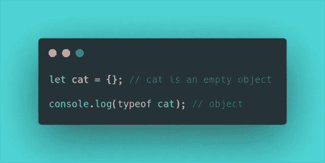
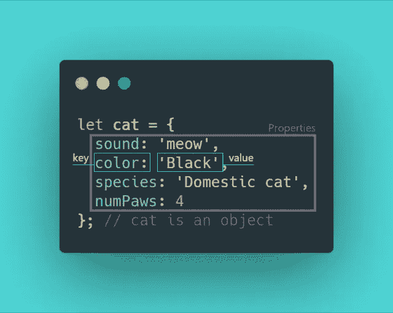
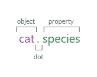
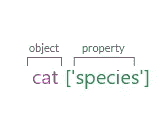
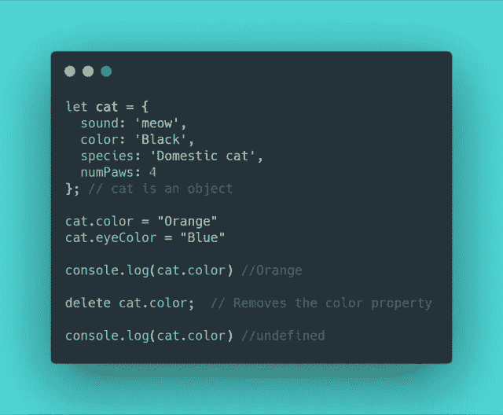
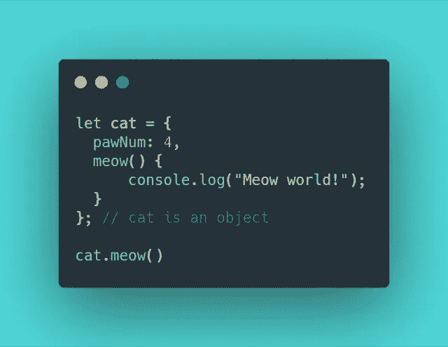
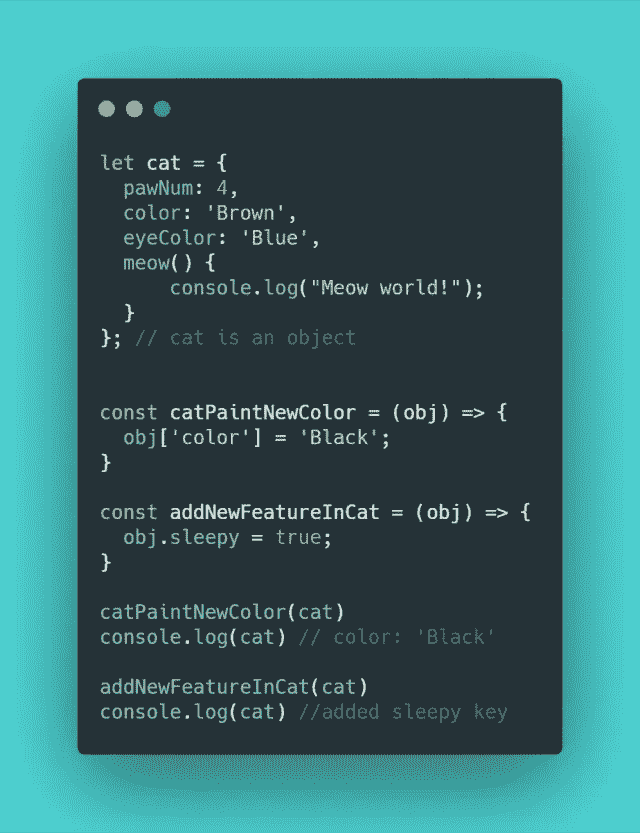
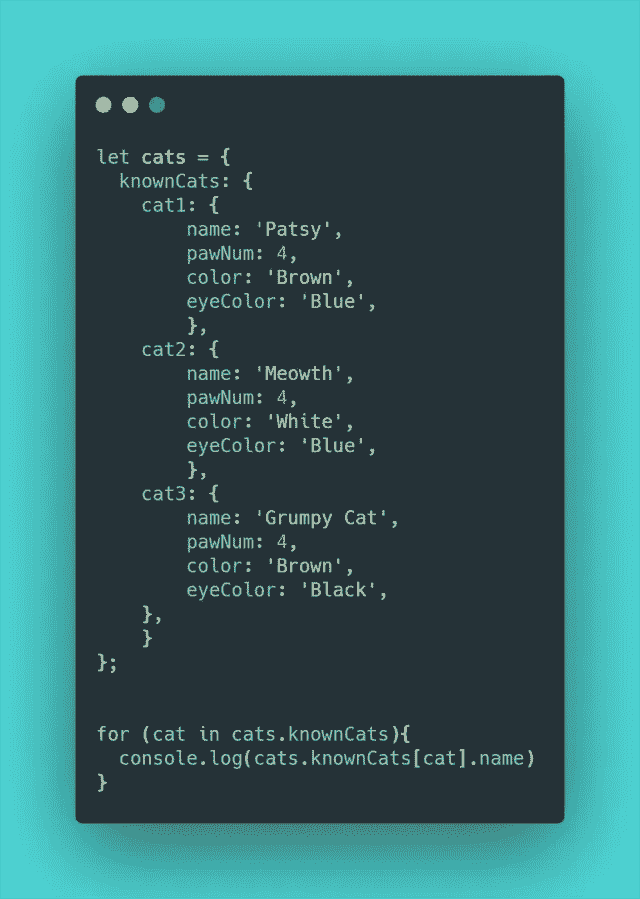

# 对 JavaScript 对象相当好且相当准确的介绍

> 原文：<https://levelup.gitconnected.com/the-quite-nice-and-fairly-accurate-intro-to-javascript-objects-bb2e2b718dc3>

JavaScript 有两种关键的数据类型:原语和对象。我在[中写了一篇介绍 JavaScript 原语的文章，这是对 JavaScript 原语数据类型](https://dev.to/ale3oula/the-quite-nice-and-fairly-accurate-introduction-to-javascript-primitive-data-types-e99)的非常好且相当准确的介绍。

现在，让我们来看看对象基础知识。😎

## **JavaScript 对象**

在 JavaScript 或通用编程中，对象可以模拟现实世界的事物，例如动物、汽车或人。对象用于存储键值集合，并表示更复杂的实体。

我们可以用花括号`{}`定义(并创建)一个带有*对象文字*的 JavaScript 对象:

## **键:值对**

我们可以用*无序的*数据填充一个对象，称为**属性**。*属性*是一个**键:值**对，其中键是一个字符串(也是*属性名*)，值可以是任何数据类型。键类似于指向内存中保存值的位置的变量名。该值可以是任何数据类型(包括函数或其他对象)。

## **访问属性**

访问对象属性有两种方式:**点符号**和**括号符号**。

使用*点符号*，我们写下对象的名称、点运算符，然后是属性名:

使用*括号符号*，我们将属性名(键)作为字符串传入:

## **分配给一个属性**

对象是**可变的**，这意味着我们可以*更新*它们。我们可以使用*点或括号符号*来选择属性，在赋值操作符的帮助下，我们可以添加新的键值对(如果没有同名的属性)或更改现有的属性(如果属性已经存在)。我们还可以用删除操作符从对象中删除一个属性。

## **作为属性的方法**

我们也可以在我们的对象文字中包含*方法*；使用 ES6 语法，我们可以将它们包含在对象中，如下所示:

## 通过引用传递

在 JS 中，当一个函数被调用时，它直接将变量的值作为参数传递。在函数内部改变变量不会影响传递的变量。然而，对象是通过引用传递的**。当我们将一个赋给对象的变量传递给一个函数时，这被解释为指向内存中保存该对象的空间。因此，函数可以永久更改该对象。**

## **遍历对象**

JavaScript 为我们提供了`for…in`语句来遍历对象的属性。

参考资料:

[对象](https://javascript.info/object)
[JavaScript 对象](https://www.w3schools.com/js/js_objects.asp)
[使用对象](https://developer.mozilla.org/en-US/docs/Web/JavaScript/Guide/Working_with_Objects)
[在 JS 中创建对象的 4 种方法(附示例)](https://www.developerdrive.com/2018/11/4-ways-to-create-an-object-in-javascript-with-examples/)

 [## 学习 JavaScript -最佳 JavaScript 教程(2019) | gitconnected

### 67 大 JavaScript 教程-免费学习 JavaScript。课程由开发人员提交并投票，从而实现…

gitconnected.com](https://gitconnected.com/learn/javascript)