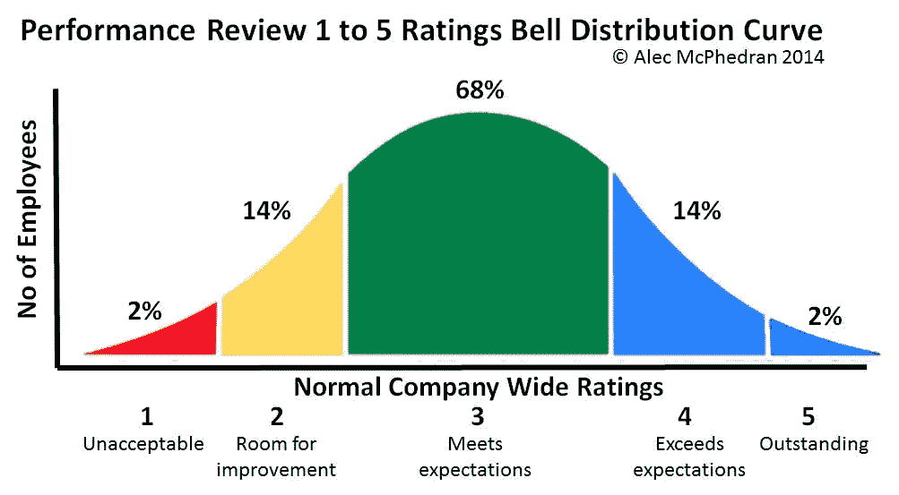
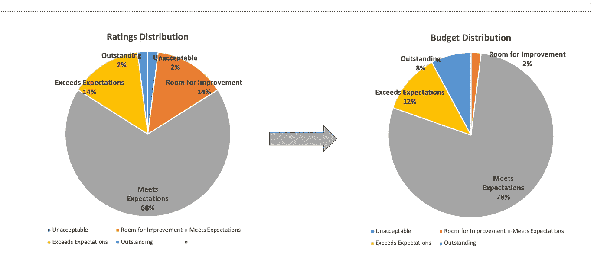
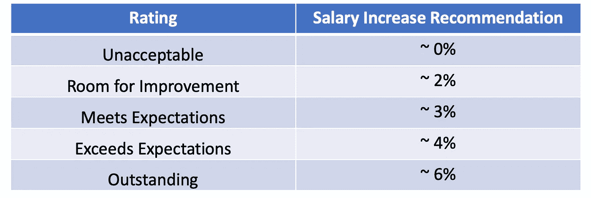

# 绩效评估背后的真实故事

> 原文：<https://levelup.gitconnected.com/the-real-story-behind-the-performance-reviews-7315910e7dd6>

## 决定年度评分和薪酬增长的流程概述

[https://pixabay.com/images/id-3972328/](https://pixabay.com/images/id-3972328/)

对于大多数不担任管理角色的员工来说，绩效评估只是填写自我评估，然后等待反馈和加薪。对于整个过程是如何运作的，经常会有疑问。虽然这应该是一个透明的过程，但在现实世界中，大多数工人并不了解全貌。如今，公司正试图提出创新的想法来改革这一“痛苦”的过程。每个公司都有自己的方式，但我将在这里描述一个大中型公司的绩效评估过程中涉及的各个步骤。我在 it 领域的几个不同的组织中工作过，所以大多数软件工程师都与 IT 有关。

如果你在一家资金雄厚的初创公司工作，那么本文描述的过程并不适用于你。另一方面，这可能会给你一个远离大公司的理由。

首先，让我澄清最明显的事情，绩效评定和薪酬增加是两个不同的过程。他们有很强的联系，但这两个事件可以彼此独立发生。让我们分别理解这两个过程，并找出其中的联系。

# 绩效评级

*   **自我评估:**这是绩效评估周期的第一步。每个员工都必须通过回答一系列问题来记录他们的自我评估。每个人都已经知道这个过程，所以我们可以跳过细节。然而，如果你需要提示，这里有我写的一篇关于写好[自我评价](https://betterprogramming.pub/5-tips-to-make-your-self-appraisal-stand-out-623b3d8d882a)的文章。
*   经理评估:大多数人认为这是唯一的另一步，但这只是这个过程中的许多步骤之一。大多数经理都有自己的记录，并从不同的团队成员和同事那里收集员工的反馈。他们综合所有信息，记录他们的评估/反馈，并确定“建议”或“初始”评级。
*   **下一级评估:**现在到了有趣的部分，这可能会成为早期职业程序员的新闻。这是与下一级经理/执行官的评分一致，以确保没有偏见，并根据绩效水平适当分配评分。如果下一级经理不相信或有不同的看法，评分可以在此处更改。
*   部门圆桌会议:我称之为“圆桌会议”，但这不是正式名称，而是我以前的一家公司在经理与部门主管开会时使用的名称。这是一个单位或部门的所有经理讨论其直接下属的评分的部分。目标是确保类似角色和类似产出的员工获得类似的评级和晋升。在这种情况下，经理们有时不得不证明评级的合理性，并解释为什么他们的候选人应该比其他类似职位的人得到更好的评级。

> 如果你写了一份很好的自我评估，那么它真的可以帮助经理证明更高的评级是合理的。

*   **钟形曲线:**部门级调整的目的之一是确保评级可以沿着钟形曲线分布。没有人会承认这一点，但管理层的意图是尽可能接近钟形曲线。大多数员工(约 70%)属于中等水平，在五分制中为 3 分。公司可能会称之为高度重视、符合预期或其他，但实际上，这是给予大多数员工的“中等”评级。为了与钟形曲线保持一致，有时管理团队必须降低或提高评级。

图片来源:https://www . Pinterest . com/alecmpchedran/training-and-coaching/

*   **人力资源校准:**一旦部门最终确定了评级决定，通常会与人力资源部门召开一次校准会议。这里的目的是与人力资源讨论边缘情况或例外情况，并做出调整。从人力资源的角度来看，他们希望确保评级是公平的，并符合公司的指导方针。

在这之后，最后一步是最终的管理层批准，评级就完成了！

## 促销

对于少数幸运儿来说，这是另一个并行的过程。晋升有两个主要标准:

*   **工作准备度:**如果你在当前级别表现良好，并展现出对下一级别的期望，你就符合下一个工作准备度的标准。你可能认为你已经准备好了，但是你的经理也必须同意。
*   业务需求:在初级职位上，这可能不起作用，但随着你在职位上的成长，大多数公司都会提出业务需求或高层晋升的理由。再说一遍，如果你真的值得升职，你的经理有责任找到一种商业理由。

# 薪酬增加

评定最终确定后，下一步就是增加薪酬。重要的是要明白，这是一个不同的过程，取决于几个因素。虽然加薪取决于评级，但较高的评级并不总是保证更高的加薪。让我们看看所有因素在薪酬决策中发挥了什么作用。

*   **预算分配:**薪酬决策中最重要的因素是年度审核的预算分配。这每年都有所不同，取决于许多因素，比如去年的收入、盈利、利润率、明年的投资、目标支出等。财务部和高层管理人员经过严格的数字运算，为包括绩效评估在内的不同费用提出预算分配。如果公司做得很好，预算可能会更高，并导致整体更高的增量。重要的是要明白，每个部门，每个经理都有固定的预算，他们不可能超过这个预算。这就像一个必须在所有员工中分配的馅饼，每个部分的大小可能不同，但是把所有的部分加起来也不过是一个馅饼。

> 百分比可以改变，但总金额必须保留在预算数字中。

评级分布是“预算分布:按作者列出的图像”的输入

> 如果年度预算低或没有，可以获得较高的评级但较低的薪酬增长。这种情况在美国经济衰退时期(2008-2012 年)经常发生，当时许多公司无法提供年度增长。

*   **薪资中点:**每个角色都有一个由人力资源部门定义的薪资范围或薪资中点。目标是让每个员工的工资接近这个范围的中点。您目前的工资在工资范围内的位置会影响薪酬决定。如果您远低于中点，与已经处于中点的人相比，相同评级的人可能会获得更好的加薪。同样，如果你在中点以上，你可能会看到一个减少的增量。这不是很多变化，但值得一提。

> 尽管评级较高，但薪酬增幅较低的另一个原因是，当当前工资接近该范围的最高工资时。

*   **薪酬建议:**现代人力资源管理系统能够充分考虑上述因素，并提出薪酬建议。总之，任何一级或二级经理看到的都是人力资源管理系统推荐的固定预算和加薪(例如，Workday，Peoplesoft)。经理确实有权修改其直接下属的加薪幅度，但仅限于此。无论如何，他们不能超过分配的预算。如果他们增加一名员工的工资略高于推荐水平，他们就必须削减另一名员工的工资，以平衡总预算。通常，所有复杂的计算都是由人力资源团队完成的，以便为每个评级得出系统生成的百分比，类似于下面的示例。

针对 5 分评分的薪资建议示例:按作者列出的图像

> 促销作为促销预算的一部分有一个单独的百分比增长，在美国通常在 2%-8%之间。

*   **下一级校准:**与评级一样，所有薪酬评级都向上一级，然后是部门主管，最后提交。在每个层面上，都可以进行调整，但每个人都必须保持在他们的总体预算之内。
*   **财务审批:**所有的薪酬决策都会汇总到财务部进行审批或确认整体预算分配。一旦获得批准，其报告经理将与每个人分享详细信息。
*   **绩效评估会议:E** 每个人都熟悉管理人员与员工分享评估反馈的最后一步。有些经理会召开不同的绩效评估和薪酬变动会议，而有些经理则喜欢同时召开。

我上面所描述的是大公司绩效评估的许多常见做法之一。另一种常见的做法是使用 3 点刻度，跳过与钟形曲线的对齐。在这个系统中，限制被取消，因此任何数量的员工都可以获得任何评级。但是，他们仍然需要遵守预算限制，因此只需为每个评分创建一个平均百分比，并分配增加的部分。在该系统中，不同等级之间的增长差异减小了。

# 最后的想法

不管你的角色是什么，绩效评估都非常有压力。许多经理很难在这一过程中游刃有余，因为他们感受到了满足其直接下属期望的压力。他们经常因为无法控制的原因而无法获得期望的评级和加薪。正如本文所见，在决策过程中有许多变量和多层次的参与，如果你没有得到承诺的加薪，这可能不完全是你的经理的错。正如我之前提到的，有许多不同的方式进行评估，并且正在尝试使它们对所有员工都有价值和透明。

我希望这篇文章能让你对整个绩效评估过程有所了解，或者至少提供一些基本信息，让你可以向你的经理提出正确的问题。请随意评论或提问，我会尽我所能做出回应。感谢阅读！

如果你喜欢这篇文章，你可以在你的邮箱里订阅[这里](https://praveshbhargav.medium.com/subscribe)我最新的文章。如果你正在考虑加入 Medium，请使用我的[推荐链接](https://praveshbhargav.medium.com/membership)来支持我。

 [## 让你的自我评估脱颖而出的 5 个技巧

### 软件工程师 ace 性能评审指南

better 编程. pub](https://betterprogramming.pub/5-tips-to-make-your-self-appraisal-stand-out-623b3d8d882a)