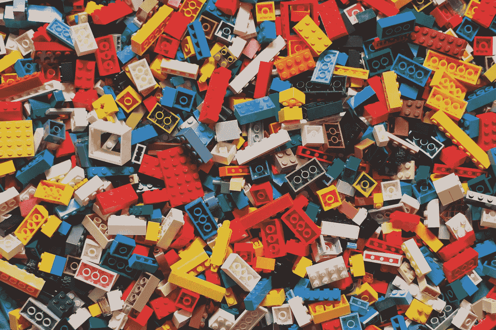

# Web 模板失败的原因，以及为什么自定义设计总是最好的

> 原文：<https://levelup.gitconnected.com/the-reason-that-web-templates-fail-and-why-custom-design-is-always-best-c43650311615>

## 你在把你的工作标准化成默默无闻吗？

哈维·卡夫雷拉在 [Unsplash](https://unsplash.com/s/photos/lego?utm_source=unsplash&utm_medium=referral&utm_content=creditCopyText) 上的照片

bit.ly/3scCrXD**[****查看我的 YouTube 频道寻找自由网页开发者小贴士。*和我一起获得指导，加速你的自由职业生涯:*****](https://t.co/PSY8gtM7Cp?amp=1)**[**mattsausters . uk**](https://mattsaunders.uk/)****

**网站开发过程包含了大量的变量。作为开发人员，我们经常希望通过在工作中建立模式来减少错误的范围。这表现为可重用的对象和功能，以及像客户调查问卷和启动清单这样的流程。**

**但是通常，我们开发人员会把标准化的想法带得有点远。使用模板来更快地实现我们的目标并从工作中获得更大的利润是很有吸引力的。**

**但是我已经无数次地经历过这个特殊的街区，每次旅行我都被拉回来根据客户的个人需求开发自己的定制解决方案。**

**让我告诉你我是如何得出这个结论的，然后分享我是怎么做的。**

# **我的网站设计业务使用模板**

**我已经做了 15 年的网页开发员，但是我是在三年前开始我现在的事业的。从一开始，我的目标之一就是简单。我想以一种标准化的方式带领我的客户完成 web 开发过程，摆脱那些经常困扰 web 设计项目的变体。**

**所以我建立了自己的可重用模板。**

**我的解决方案是让 WordPress 像 CMS 一样工作，并利用 Gutenberg 来创建我可以在每个客户网站上使用的自定义模块。这样，我可以保留对前端的细粒度控制，并使用 WP 来处理数据。**

**你可能会想“听起来很棒！”，而且在很多方面，的确如此。**

# **模板化的好处**

**三年来，我无情地改进了我建立网站的方式，缩短了交付时间，并力求每一次迭代都更加简单。**

**这使我能够找到创新的方法来为我的客户快速提供网站。从这个过程中产生了俄罗斯娃娃原则的想法。**

****

**俄罗斯娃娃原理(鸣谢:作者)**

**我开发这个模型是为了帮助区分网站中嵌套层次的内容:**

*   **全球内容—对整个网站可用(即社交媒体图标，可能出现在多个地方)**
*   **页面级内容—仅影响给定页面(即页眉、面包屑或页脚)**
*   **内容级内容—指的是

    <main>标签内的内容(即段落、块引用或图像)</main>** 

**这个系统本质上意味着我可以把 WordPress 变成一个产品——每个网站都使用相同的文件和字段，只需对 CSS 做一些简单的调整，使每个网站都有自己的特色。这很有效，我正在快速创建网站。**

**但是有了标准化，你就可以走得太远了。**

# **为什么定制胜过模板化**

**从商业角度来看，模板完全有意义。对你来说更快，对顾客来说更便宜。它也将大量的权力交到了技术不太熟练的开发者和客户手中，降低了在网络上创建内容的门槛。**

**但这种简单也是它的败笔。**

**当我以这种方式开发网站时，我开始注意到我的页面设计缺少了一些东西。他们看起来并不差，*，*他们只是缺乏个性。**

**每个页面都由一系列可重复使用的模块组成。例如，一个标题，一个段落，一个博客文章列表，然后是一个表单。每一个项目，整齐地[包含在它自己的组件](/how-to-write-bullet-proof-html-css-quickly-d03daa12e9bb)中。从 web 开发人员的角度来看，没有比这更优雅的了。**

**但是用这种方式设计页面的问题是，你最终会得到一堆分散的对象，却没有一个连贯的设计系统将它们整合在一起。**

**在写作中，这类似于把几段文字放在一个页面上，而不把它们连接起来。读者会失去线索。在视觉设计中，用户感觉到缺少了一些东西:一个统一的主题，帮助它变得有意义。**

**对我来说，页面设计缺乏内聚力会抵消掉节省的时间和金钱。如果缺乏最终结果，交付过程再优雅也没用。这是标准化的胡作非为。**

**意识到这一点后，我再次迭代我的过程。**

# **使用模板的更好方法**

**正如你现在看到的，我是可重复性的大力提倡者。我相信许多自由职业者和小机构最终会失败，因为他们没有投入足够的时间来创造网站项目的可持续性。**

> **自由职业者最终会失败，因为他们没有投入足够的时间来创造网站项目的可持续性。**

**但是你也看到了，我相信你可以走得更远。这就是我所做的，现在我正从洞里爬出来。**

**我上面概述的过程的问题是，我跳过了网站设计过程的一个基本方面:**设计*T2 阶段！*****

**这一点现在看起来很明显。但是每次你使用模板或可重用模块，你都不是真正的*在设计。你在*大楼。*这绝对没问题——事实上应该鼓励这样做— **但是** **只有当你已经完成了满足特定客户需求的设计阶段。*****

> **每次你使用模板或可重用模块，你都不是真正的在设计。你在*大楼。***

**当你用 Sketch、Illustrator 或类似的应用程序在视觉上构思一个页面时，你创造了内在的美学凝聚力，也就是我前面描述的缺失部分。**

**在经历了这个过程并进入前端开发之后，您很可能会将您的工作分成几个部分来建立可重复的模式和块。但是神奇的事情发生在这个视觉构思阶段。没有它，设计就…缺乏灵魂。**

# **解决方案是在混合两种技术中找到的**

**具有讽刺意味的是，我曾经强烈反对任何类型的模板。我感觉到在这个过程中的某个地方，创造力将会消失。**

**但是我所学到的是，你可以利用定制设计和 T21 标准化的理念来创造你最好的作品。标准化使你能够在系统中进行逻辑思考，而定制赋予你创造力。两者是共生的。**

**当然，挑战在于找到两者之间的平衡。**

****如果你喜欢这篇文章，请考虑** [**订阅我的简讯**](https://thebusinessofwebdesign.com/newsletter) **了解更多。****