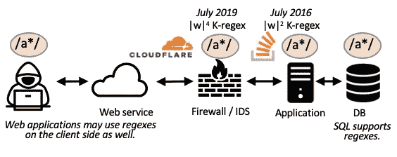
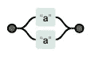
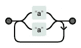
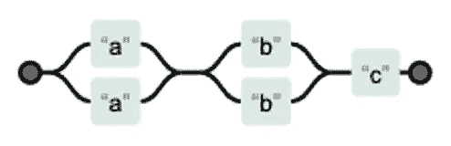
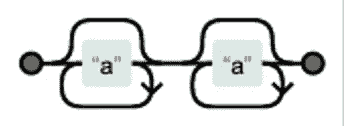

# 正则表达式拒绝服务(ReDoS)备忘单

> 原文：<https://levelup.gitconnected.com/the-regular-expression-denial-of-service-redos-cheat-sheet-a78d0ed7d865>

# 介绍

这篇文章旨在作为一篇“技术性的两篇文章”，总结一个名为[基于正则表达式的拒绝服务](https://en.wikipedia.org/wiki/ReDoS)(又名 ***正则表达式 DoS*** *，* ***ReDoS*** )的安全漏洞。有各种各样关于 ReDoS 的文章，但是我不知道有哪一个好的一站式商店对这个主题的所有方面都有更高层次的处理。我在最后加入了更详细的治疗方法的链接。

我大量使用标题来帮助你找到你的问题。

# 什么是正则表达式？

正则表达式(regex)是您的工程团队用来操作字符串的工具。他们可能用它来对非结构化的输入进行某种排序，例如在处理用户数据或处理日志文件时。

正则表达式是字符串的模式语言。您可以使用正则表达式提出类似“这个字符串看起来像电子邮件吗？”。

正则表达式内置于大多数编程语言中，并由一个*正则表达式引擎*评估，该引擎接受一个字符串和一个正则表达式(字符串模式)并决定该字符串是否匹配该模式。

# 什么是 Regex DoS？

ReDoS 是一个性能问题。它可以通过外部拒绝服务攻击或“偶然但非恶意”因素的组合导致服务中断(参见堆栈溢出时的[错误汇合](https://stackstatus.net/post/147710624694/outage-postmortem-july-20-2016))。

ReDoS 的核心前提是，一些正则表达式——我将把这些称为 *ReDoS 正则表达式*——可能需要非常长的时间来匹配(或不匹配)一些字符串。如果所讨论的输入是可信的，这是没问题的，但是正则表达式通常应用于用户可控制的输入，例如确认一个 web 表单实际上包含一个电子邮件地址和一个电话号码。

这种长时间的匹配会将合法客户端的计算资源(CPU 时间、工作线程)转移到一些长时间运行的正则表达式匹配上。这可能导致两方面的问题:

1.  如果攻击者能够识别出正则表达式运行缓慢的输入，他们就可以将这些输入发送给您，并关闭您的服务(或者增加您的云支出)。
2.  如果您的正则表达式应用于新的输入类别(例如，您的服务某一天的流量增加了 10 倍，或者您在一个新的国家部署了您的软件)，新的输入可能会发现以前隐藏的性能问题，同样也会影响您的服务。

# 我应该担心重做吗？

正则表达式在整个系统堆栈中使用(见图)，所以整个系统堆栈中的软件都可能是重做的来源。

从客户端代码到防火墙，到后端应用程序，再到数据库查询，正则表达式在整个 web 栈中都有使用。如果这些正则表达式中的一个(1)很慢，并且(2)处理危险的输入，那么它很容易被重做。比如 Cloudflare 的防火墙在 2019 年有一个 ReDoS 问题，Stack Overflow 的后端在 2016 年有一个 ReDoS 问题。

以下是您应该检查的条件:

1.  你在不可信的输入上使用了一个 ReDoS 正则表达式。我将在下一节中讨论这一点。
2.  *你的正则表达式引擎使用一个缓慢的正则表达式匹配算法*。这是大多数编程语言运行时内置的正则表达式引擎的情况——这包括 **Java、JavaScript(各种风格)和 Node.js、C#/。NET，Ruby，Python，Perl，PHP** 。安全起见，Go 和 Rust 都使用快速的 regex 引擎，谷歌的 RE2 库也很快。
3.  *您的 regex 引擎没有资源使用限制*。一些 regex 引擎提供了限制，包括 Perl、PHP 和 C#/.NET。NET 正则表达式引擎是有用的。**如果你在。NET，使用带超时的 API！**

如果你操作一个 web 服务器，如果你使用的是 **Node.js** 或者其他事件驱动的框架，允许一个昂贵的请求阻塞其他请求，你应该特别小心。在这里和这里阅读更多关于这个[的内容。](https://medium.com/@davisjam/a-sense-of-time-for-javascript-and-node-js-68c9114f5d48)

# 如何判断我是否有一个 ReDoS 正则表达式？

我维护一个项目，有一套好的自动检查器[在这里](https://github.com/davisjam/vuln-regex-detector)。我还维护着安全正则表达式项目，尽管目前它只能检测出一小部分有问题的正则表达式。

如果你想手动找到一个 ReDoS 正则表达式，基本的经验法则是*避免歧义*——正则表达式引擎可能做出两个不同的选择并在同一点结束的情况(我在下面的附录中介绍了这一点，见标题"*是什么让 ReDoS 正则表达式如此缓慢？*》。

歧义通常是 or 和量词(*、+、{5，10}等)的结果。).有些暧昧比其他的更惨——*(a | a)*暧昧，但也只是一点点。 *(a|a)** 是指数模糊的，因为每增加一个 *a* ，路径的数量就会翻倍。请参见插图。

两个模棱两可的正则表达式: *a|a 在左/上方，和(a|a)+在右/下方。两者都模棱两可；正则表达式引擎可以用两种不同的方式解析同一个字符串“a”。但是右边的例子要糟糕得多，因为量词引起的后沿——“aa”可以被解析成 4 种方式，“aaa”可以被解析成 8 种方式，等等。*

坦白地说，你的眼睛很难做到这一点。我查看了数百个 ReDoS 正则表达式，仍然无法处理特别复杂的例子。但是这里有一些经验法则:

1.  嵌套的量词可以是指数级危险的——例如 *(a*)** 。检查是否可以通过使用外部量词来“回到”内部量词。
2.  量化一个分离可能是指数级危险的——例如 *(a|a)** 。检查是否有任何字符串可以通过析取中的两个不同路径进行匹配。
3.  串联量词在多项式上可能是危险的，例如 *abc* 。 **def。*.某个字符串可以被第一个量词、中间模式和下一个量词匹配吗？这些是最常见的一种 ReDos 正则表达式，因为很多正则表达式都包含一个*。** 或一个 *[\s\S]** (即一个包罗万象的量词)。每一个额外的可达量词都会增加成本。*
4.  作为前一种情况的特例，如果您正在执行*部分匹配，*例如“在这个自由格式的文本中搜索一个电子邮件地址”，那么 regex 引擎会添加一个隐式的*。*?*到你的正则表达式的开头。

# 如何在我的软件中修复重做？

您可以通过使上述任何重做条件无效来解决重做问题。

1.  您可以将 ReDoS 正则表达式转换为安全正则表达式或替代字符串逻辑。
2.  您可以净化输入。
3.  您可以使用更快的正则表达式引擎。
4.  您可以使用 regex 引擎的资源限制(仅适用于 C#/。网)。

## 选项 1:使用安全的正则表达式(或替代的字符串逻辑)

如果可选的字符串逻辑是可行的，这是一个很好的方法。但是，有些 API 只接受正则表达式，所以您可能需要将正则表达式重构为一个安全的变体。

一般来说，你的目标是消除正则表达式中有问题的歧义。

1.  我通常使用可视化工具来识别这种模糊性，比如 [regexper](https://regexper.com/) 。
2.  接下来，我消除歧义。这可以通过几种方式来实现。例如，您可能会更改您要量化的内容，例如从电子邮件正则表达式*。+@.+* 向无双[^@]+@.+ .那么中间的“@”就成了两个量词之间的*守卫*。或者你可以改变可选性，例如转换数字正则表达式 *\d+\。？\d+* 到等价的 *\d+(\。\d+)？*。如果您在代码中使用捕获组，您可能需要引入多层正则表达式，例如一个粗粒度的，然后一个细粒度的。
3.  然后，我确认之前有问题的输入现在是安全的(例如，使用 [Regex 101](https://regex101.com/) )，并检查我在这个过程中没有添加新的歧义。
4.  最后，我对照输入的测试套件检查正则表达式，以确认我没有更改它的字符串语言(或者至少没有以有问题的方式)。

## **选项 2:净化输入**

您可以应用的最简单的清理是在将输入提供给正则表达式之前测试输入的长度。如果合法输入很短，那么在正则表达式检查之前而不是之后执行长度限制。这有助于避免通过多项式行为重做(如 *abc 的常见模式)。*def。** )。

还有更复杂的消毒，但我不相信自己能做好。如果合法输入很长，就不要采用这种方法。如果你的正则表达式是指数型的，那么 *30 个字符*就“太长”了。大多数缓慢的正则表达式都是二次的(它们使用。*太自由了)，为此您将看到毫秒到秒的匹配时间，用于输入*1000–5000 个字符*。

## 选项 3:使用更快的正则表达式引擎

目前，最广泛使用的快速正则表达式引擎是 Russ Cox/ [Google 的 RE2 正则表达式引擎](https://github.com/google/re2)。它对大多数编程语言都有绑定。您可以将它作为一个依赖项引入，并在那里评估您的正则表达式查询。你也可以试试 Geoff Longdale/Intel 的 [HyperScan 引擎](https://github.com/intel/hyperscan)。

*优点*:保证跑得快。

*缺点*:

1.  更快的引擎可能不支持高级功能，尤其是反向引用和环视断言。
2.  某些正则表达式可能表现出稍微不同的匹配行为。这可能很难检测到，所以这是增强您的测试套件的好时机。你也可以尝试像微软的 Rex 项目一样的输入生成器(这里的输入生成器集合是 T21)。

## 选项 4:使用资源限制

如果你用 C#/工作。NET 中，最佳实践是始终对正则表达式匹配使用基于超时的 API。

在其他编程语言中，您可以使用线程和计时器“推出自己的”版本。

# 为什么没有网站有这方面的工具？

如果你有网站建设的经验，想帮忙，请给我写信。我有很多想法。

# 我可以在哪里了解更多信息？

这里收集了关于 ReDoS 的各种资源:案例研究、学术研究和其他面向从业者的帖子。

## 生产中重做的示例

*   *Cloudflare* 在 2019 年发生过一次停运。根本原因是正则表达式计算失控。他们的仵作是这里的。
*   *堆栈溢出*在 2016 年发生了一次中断，也是由失控的正则表达式引起的。他们的验尸是[这里](https://stackstatus.net/post/147710624694/outage-postmortem-july-20-2016)。
*   Atom 文本编辑器在 2016 年有一个失控的正则表达式。这不是 ReDoS(不拒绝为其他客户端提供服务)，但是一个有趣的“开发者视角”可以在这里找到。

## 学术文献中的红学

按时间倒序排列，以下是与 ReDoS 最相关的研究论文。我包含了博客文章、源代码等的链接。如果有的话。

*   *关于正则表达式拒绝服务的冲击与挫败*。(戴维斯 2020)——这是我的博士论文。它旨在成为 ReDoS 的权威参考。背景部分描述了我所知道的所有文献(包括一些下面没有提到的早期作品)。[论文](http://people.cs.vt.edu/davisjam/downloads/publications/Davis-Dissertation-2020.pdf)，[视频](https://youtu.be/TDIlcm3joq0)。
*   *正则表达式很难。* (Michael 等人，ASE’19)——围绕正则表达式的软件工程实践。在第 8 节中，他们报告说大多数软件工程师不知道 ReDoS。[总结](https://medium.com/ase-conference/regexes-are-hard-e7933ae3122d)，[全文](http://people.cs.vt.edu/davisjam/downloads/publications/MichaelDonohueDavisLeeServant-RegexesAreHard-ASE19.pdf)。
*   为什么正则表达式不是通用语言？ (Davis 等人，ESEC/FSE'19) —第 7 节包括按编程语言对正则表达式性能的分析。[总结](https://medium.com/@davisjam/why-arent-regexes-a-lingua-franca-esecfse19-a36348df3a2)，[全文](http://people.cs.vt.edu/davisjam/downloads/publications/DavisMichaelCoghlanServantLee-LinguaFranca-ESECFSE19.pdf)。
*   *正则表达式拒绝服务(REDOS)在实践中的影响。(* Davis 等人，ESEC/FSE'18) —测量超线性正则表达式的使用范围，加上识别试探法和修复策略。[总结](https://medium.com/bugbountywriteup/introduction-987fdc4c7b0)、[全篇](http://people.cs.vt.edu/davisjam/downloads/publications/DavisCoghlanServantLee-EcosystemREDOS-ESECFSE18.pdf)、[探测器合奏](https://github.com/davisjam/vuln-regex-detector)。
*   *营救:制造正则表达式 DoS 攻击*。(沈等，ASE'18) —一种识别超线性正则表达式的动态方法。[全纸](https://cs.nju.edu.cn/changxu/1_publications/ASE18.pdf)，[检测器](https://github.com/2bdenny/ReScue)。
*   *JavaScript 和 Node.js 的时间感*。(Davis 等人，SECURITY'18) —讨论了对 Node.js web 服务尤其成问题的相关威胁中的重做。[总结](https://medium.com/@davisjam/a-sense-of-time-for-javascript-and-node-js-68c9114f5d48)，[论文+视频+幻灯片](https://www.usenix.org/conference/usenixsecurity18/presentation/davis)。
*   使用正则表达式的程序中 DoS 漏洞的静态检测。(Wustholz 等人，TACAS'17) —与魏德曼等人相似，他们描述了基于自动机分析的 ReDoS 的必要和充分条件。它们包括针对 Java 程序的端到端漏洞检测。[满纸](http://www.cs.utexas.edu/users/marijn/publications/evil-regexes.pdf)，[探测器罐子文件](http://www.wuestholz.com/downloads/regexcheck.zip)。
*   *利用 NFA 的歧义性分析回溯正则表达式匹配器的匹配时间行为*。(魏德曼等人，CIAA'16) —基于自动机分析的重做的必要和充分条件。[全文](https://link.springer.com/chapter/10.1007/978-3-319-40946-7_27)，[魏德曼的论文](https://oatd.org/oatd/record?record=handle%5C%3A10019.1%5C%2F102879)，[探测器源代码](https://github.com/NicolaasWeideman/RegexStaticAnalysis)。
*   正则表达式匹配可以简单快速(但在 Java、Perl、PHP、Python、Ruby、…)中比较慢。(Cox 2007)——支持汤普森匹配算法的回溯正则表达式引擎的温和争论。这个系列还有几篇博文。[技术报告](https://swtch.com/~rsc/regexp/regexp1.html)、[线性时 RE2 正则引擎](https://github.com/google/re2)。

## 关于重做的其他观点

*   Jan Goyvaerts 有一个关于避免重做的很好的指南，尽管也有一些缺点。
*   OWASP 有一个专门介绍重做的页面，但仍在建设中。
*   Snyk.io 有一篇关于这个话题的[博文](https://snyk.io/blog/redos-and-catastrophic-backtracking/)。
*   Jeffrey Friedl 的[精通正则表达式](http://shop.oreilly.com/product/9780596528126.do)包括对慢速正则表达式引擎、重做和一些正则表达式优化的讨论。

# ***附录:是什么让 ReDoS 正则表达式这么慢？***

这一部分更具技术性。

用编程语言编写的正则表达式由该编程语言的*正则表达式引擎进行评估。这些引擎获取一个正则表达式和一个字符串，并决定正则表达式是否匹配字符串。不幸的是，他们遵循的搜索算法容易浪费时间反复尝试同样的事情。*

这就是正则表达式引擎的搜索过程是如何工作的。正则表达式引擎查看它在正则表达式中的当前位置和字符串的当前字符，并且:

*   如果在正则表达式中有匹配这个字符的方法，它就继续。
*   如果有多种方法，它会尝试其中一种，然后将其他方法留待以后使用。
*   如果无法匹配，它会返回到先前保存的选项之一。

## 重叠 ORs

作为一个例子，让我们将这种方法应用于这张图片，在字符串 *ab* 上。

regex /(a|a)(b|b)c/的搜索图。这个正则表达式有“重叠 or ”,它为正则表达式引擎创建了许多不同的探索路径。

*   正则表达式引擎从左侧开始，并在路径中找到一个分叉。它发现它可以通过上升或下降来匹配*a*——它现在尝试一个分支，然后保存另一个分支。
*   现在它看到它可以通过上升或下降来匹配*b*——它将尝试一个分支并保存另一个分支。
*   现在它在找一个 *c* ，但是它出人物了。所以它会原路返回。
*   它为 *b* 尝试另一个分支，并且再次(冗余地)寻找 *c* 。这将失败，所以它将回到它最后的未尝试的道路，为 *a* 的“向下”版本。
*   再次，我们到达一对 *b* (我们以前来过这里！)，我们将再次尝试向上和向下(我们之前已经尝试过了！)，到达 *c，*失败。
*   正则表达式引擎最终通过四条不同的路径寻找一个 *c* 四次，所有路径都指向同一点。

## 重叠的星星

再来做一个例子。这个问题比前一个问题更难理解，但它也更能代表现实软件中出现的正则表达式问题(参见[堆栈溢出中断](https://stackstatus.net/post/147710624694/outage-postmortem-july-20-2016))。所以让我们试试这张图片上的方法，在字符串 *aaa…aab* 上，也就是 *N+1* 个字母长。

regex /a*a*/的搜索图。这个正则表达式有导致冗余路径的“重叠星”。

*   regex 引擎从左侧开始，有一个选择:它可以消耗循环中的第一个 *a* (然后再次面临相同的选择)，或者跳过循环，转到下一个。
*   一旦它前进到第二个循环，它将消耗掉*和*的剩余部分。
*   一旦所有的 *a* 都被消耗完，它就会遇到一个 *b* 并拒绝该搜索路径。

通过一点推理，我们可以计算出正则表达式引擎将尝试多少种不同的失败路径。逻辑是这样的:

*   正则表达式引擎有一个 *a* 的消费序列。它可以将序列分成“左半部分”和“右半部分”，并将左半部分馈送到第一 *a* 循环，将右半部分馈送到第二 *a* 循环。
*   每个循环可以消耗一个到所有的 *a* ，所以我们可以在 *N* 点划分字符串——这些是第一个 *a* 循环中的 *N* 决策点，在这里我们决定是停留还是前进。
*   所以我们有 *N* 条失败的路径，每条路径都要求我们消耗掉字符串中所有的 *N* 个字符。这意味着该算法在宣告失败之前总共需要 *N* 个步骤。这是一个微小的简化，因为路径共享一些工作——N 个路径分别导致 1 个不同的步骤、2 个不同的步骤等等，成本为*1+2+…+N-1+N =**N .*

同样，我们在搜索中有很多冗余——这些路径最终都在第二个 *a* 循环中结束。

对于一个短字符串来说， *N* 还不算太差。但是由于正则表达式在整个系统堆栈中使用，有时在很长的字符串中使用，这也是一个问题。