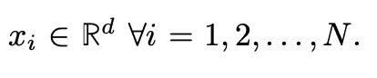
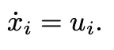
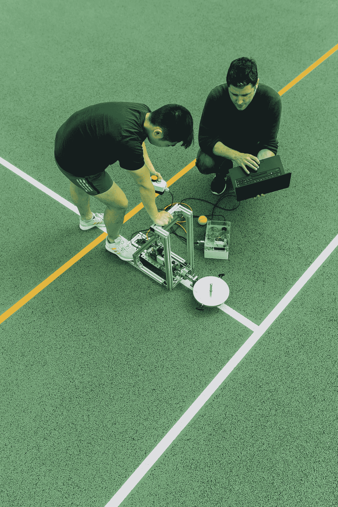
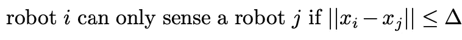
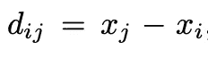

# 多智能体系统的会合问题

> 原文：<https://levelup.gitconnected.com/the-rendezvous-problem-for-multi-agent-systems-889bcfac870b>

拉奇姆·凯贾尔科在 Pexels 上拍摄的照片

在上一篇文章中，我从较高的层面介绍了网络控制系统领域:

 [## 网络控制系统

### 网络控制系统模型多代理系统使用许多学术领域，最主要是图论和…

medium.com](https://medium.com/@CalebMBowyer/networked-control-systems-974c67d30e6e) 

在本文中，我描述了网络控制系统或多智能体控制领域中最基本的问题之一，即会合。

# 什么是会合问题？

问题设置如下。我们有 N 个机器人，每个机器人都有任意的初始位置:

其中对于 2D 平面 d=2。如果我们正在处理一个空中或 3D 问题，那么 d=3。目标是通过一个设计良好的控制法则让所有的机器人在一个共同的位置聚集或会合。每个代理 I 的动力学被给定为:

状态导数和控制上的下标 I 表示 N 个代理集合中的任意代理 I。这个问题的解决方案需要确定如何选择控制律 u_i，使得所有的智能体在一个公共点集合或相遇，称为某个 x_M。

在 [Unsplash](https://unsplash.com/s/photos/constraints-engineering?utm_source=unsplash&utm_medium=referral&utm_content=creditCopyText) 上拍摄的 [ThisisEngineering RAEng](https://unsplash.com/@thisisengineering?utm_source=unsplash&utm_medium=referral&utm_content=creditCopyText)

这个问题还有其他实际限制。其中两个没有全球定位系统，机器人经常“近视”或只能感知如此远的物体。由于第一个限制，机器人不知道任何绝对位置。由于第二个约束，机器人 I 和 j 只有在彼此相距一定距离的情况下才能相互感知:

由于机器人通常不知道其他机器人的绝对坐标，所以它们只能使用相对距离，并且该相对距离只有在由机器人用来测量相对距离的任何传感技术的限制所定义的某个增量内才能被测量。因此，代理 I 和 j 可以测量一系列相对距离:

这就是问题的设置，但是这个问题的解决方案还没有被描述，也就是说，你不知道如何让每个代理以这样的方式移动到一个公共点。在下一篇文章中，我将问题从任意的 N 个代理简化为只有两个代理，并给出了这种简化设置下的会合问题的解决方案；此外，在下一篇或另一篇文章中，我会展示一些模拟代码，展示控制律确实会导致收敛，点质量确实会会合。

直到下一次，

凯勒。

考虑成为一个媒体成员，永远不会错过我的故事。无限制地访问我的作品和其他作者的作品:

 [## 加入我的介绍链接媒体-迦勒鲍耶

### 阅读凯莱布·m·鲍耶(以及媒体上成千上万的其他作家)的每一个故事。您的会员费直接支持…

medium.com](https://medium.com/@CalebMBowyer/membership) 

# 分级编码

感谢您成为我们社区的一员！在你离开之前:

*   👏为故事鼓掌，跟着作者走👉
*   📰查看[级编码出版物](https://levelup.gitconnected.com/?utm_source=pub&utm_medium=post)中的更多内容
*   🔔关注我们:[推特](https://twitter.com/gitconnected) | [LinkedIn](https://www.linkedin.com/company/gitconnected) | [时事通讯](https://newsletter.levelup.dev)

🚀👉 [**软件工程师的顶级工作**](https://jobs.levelup.dev/jobs?utm_source=pub&utm_medium=post)