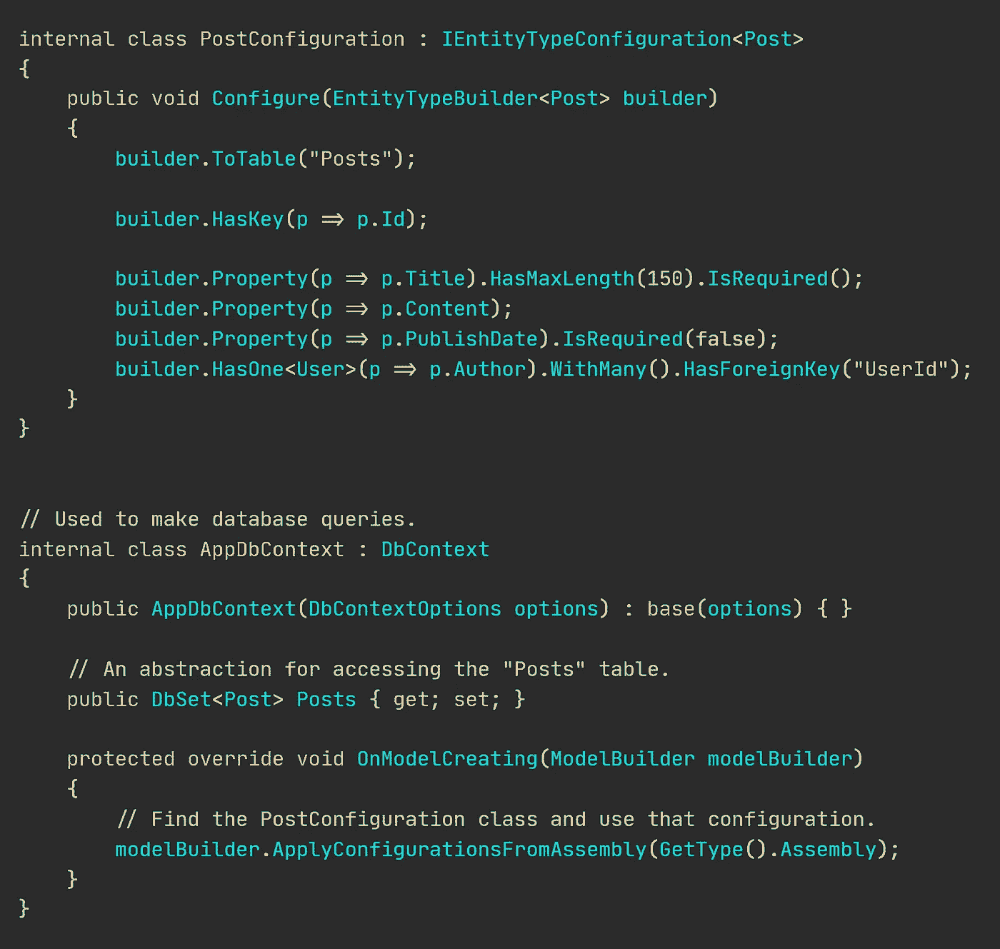
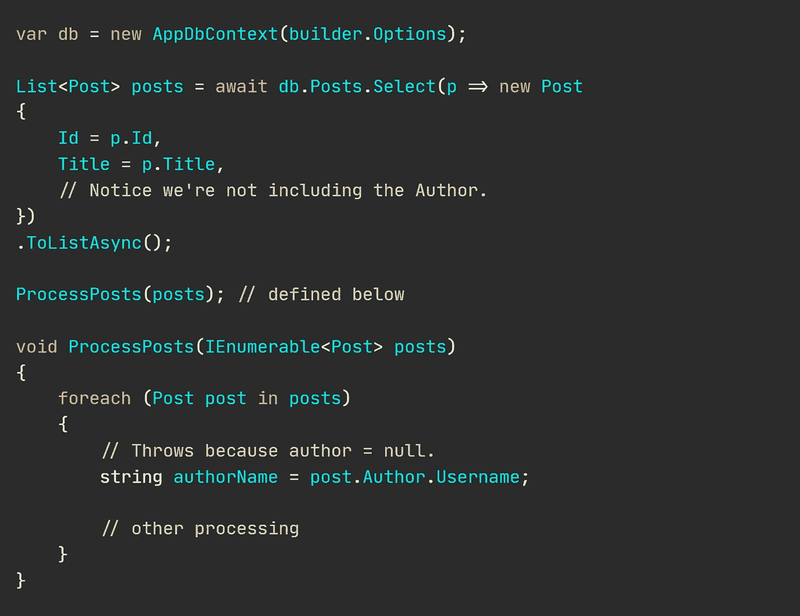
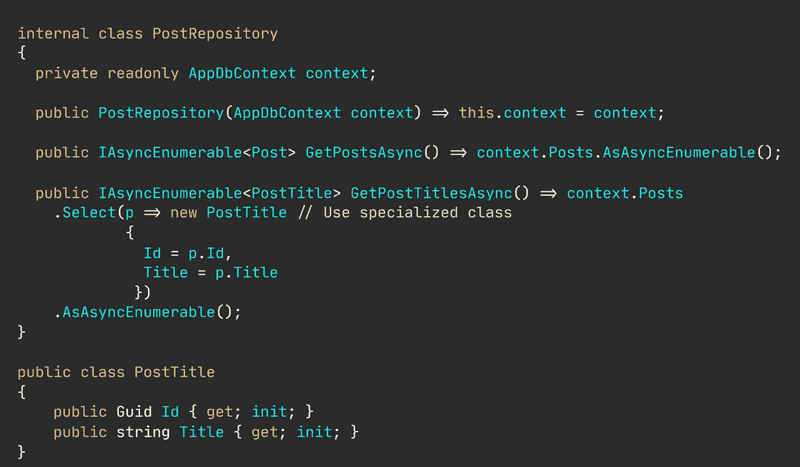

# 存储库模式是关于重构的，而不仅仅是数据访问和灵活性

> 原文：<https://levelup.gitconnected.com/the-repository-pattern-is-about-reconstitution-not-only-data-access-and-flexibility-b3986380a248>

## 固执己见的建议

## 在访问一个实体的属性后，你是否遇到过空指针异常？存储库使得使用重构的实体变得安全。

作者[尼可拉斯·米勒德](https://medium.com/u/7c7a43b3d9de?source=post_page-----b3986380a248--------------------------------)

尽管存储库模式已有近 20 年的历史，但许多现代开发人员似乎很难理解它是如何工作的，以及它旨在减轻什么样的痛苦。

有一种常见的误解，认为存储库模式只关心抽象数据访问和提供交换底层数据源的灵活性。

> 存储库模式主要关注的是对持久化领域实体的重构进行抽象。
> 
> 抽象数据源是**而不是**。

软件开发人员通常通过只选择给定操作所需的数据(列)来调整数据库查询以获得高性能。虽然这种方法确实有意义，但我注意到，实体往往只是部分水合。当实体被传递给协作类或其他方法时，这是一个巨大的问题。稍后我会回到这个话题。

🔔[想要更多这样的文章？在这里签名。](https://nmillard.medium.com/subscribe)

对象水合是用数据填充空对象实例的过程。水合作用通常通过使用 EntityFramework 核心(在。NET)、Hibernate(在 Java 中)或任何其他对象关系映射(O/RM)工具。

## 为失败做准备—在没有存储库的情况下访问数据。

[📚GitHub 上的视图。](https://github.com/NMillard/SimpleWebApps/tree/master/other-projects/RepositoryEntityReconsitution/src/Reconstitution.Demo)

假设我们有一个实体，比如这里的`Post`类。对于这篇文章，不要介意这个类的设计有多差。不幸的是，像这样的类设计存在于许多生产应用程序中。

海报模特。

“Post”类映射到下面配置的“Post”表。

配置发布模型。

尽管这是一个虚构的例子，但是“Post”类完美地展示了部分模型水合是如何工作的以及为什么会发生。

## 让我们用部分水合来说明这个问题。

请注意，在执行`db.Posts.Select()`时，我们只选择了一些属性。这个返回的帖子只有`Id`和`Title`有水分。

现在，花一点时间通读下面的代码，注意创建一个可以编译但在运行时会爆炸的解决方案是多么容易。

部分水合的模型会发生不好的事情。

做一些像试图获得作者姓名这样简单的事情会使整个应用程序崩溃…

我在许多场合遇到过这种逻辑，部分查询隐藏在方法中，从表面上看，返回完整的结果，但实际情况恰恰相反。

🔔[想要更多这样的文章吗？在这里签名。](https://nmillard.medium.com/subscribe)

## 为什么会发生部分模型水合作用。

根据我的经验，当您只需要来自一个实体的某些数据来执行一个操作时，部分模型水合经常发生，因此获取完整的实体及其所有属性和关系是不切实际的。

没有 O/RMs 或数据读取经验的开发人员通常会返回部分模型。

## 幸运的是，克服由于不切实际的模型导致的部分水合是容易的。

过度提取会对查询性能产生负面影响。您可以通过完整的模型重建(合并所有属性)或者通过创建专门的接口或类(仅公开属性的子集)来减轻这种情况。

拯救仓库。

下面的存储库公开了一个检索完整的`Post`对象的方法，以及另一个被调优为仅获取数据库中值的子集并将它们映射到新的专用类`PostTitle`的方法。

让一个存储库返回除了它所基于的集合之外的其他类型是完全可以的。但是有一个警告。那些“其他类型”应该是从集合中派生出来的真正的领域概念，以确保高内聚。

## "但是，你不需要一个仓库来使用专门的类."

那完全是真的。存储库本身并不需要*,但是，它们封装了行为，因此您不必重复完全相同的列选择和模型水合。*

*通过只暴露存储库，而不是例如一个`DbContext`(基本上是一个数据库连接的包装)，你可以确保客户端只做想要做的事情。*

*🔔[想要更多这样的文章？在这里签名。](https://nmillard.medium.com/subscribe)*

# *离别词。*

*存储库经常被误用、误解，并且因为冗长而声名狼藉，而你可以直接通过数据库连接或者像`DbContext`这样的包装器来达到同样的目的。*

*存储库的主要焦点是实体重构。让客户端可以安全地访问实体公开的所有属性，而不用担心“这个属性可能为空吗？”*

*公平地说，存储库位于持久数据和应用程序对数据的使用的边界，确保了域的一致性。*

# *让我们保持联系！*

*[通过在此](https://nmillard.medium.com/subscribe)注册时事通讯获得类似文章的通知，并查看 [*YouTube 频道(@尼可拉斯·米勒德)*](https://www.youtube.com/channel/UCaUy83EAkVdXsZjF3xGSvMw) *。**

*[在 LinkedIn 上连接](https://www.linkedin.com/in/nicklasmillard/)。*

# *好奇者的资源*

*   *[📚GitHub 上的视图](https://github.com/NMillard/SimpleWebApps/tree/master/other-projects/RepositoryEntityReconsitution/src/Reconstitution.Demo)。*
*   *[面向初级开发人员的高级存储库模式](/accessing-your-data-using-advanced-repository-pattern-for-beginner-developers-73609ea86b2c)作者 [Nicklas Millard](https://medium.com/u/7c7a43b3d9de?source=post_page-----b3986380a248--------------------------------)*
*   *[你考虑过把你的领域从你的持久逻辑中分离出来吗？尼古拉斯·米勒德](/do-you-consider-separating-your-domain-from-your-persistence-logic-5db3e3dae917)*
*   *你的数据库也让你做傻事吗？作者[尼可拉斯·米勒德](https://medium.com/u/7c7a43b3d9de?source=post_page-----b3986380a248--------------------------------)*
*   *由微软设计基础设施持久层*