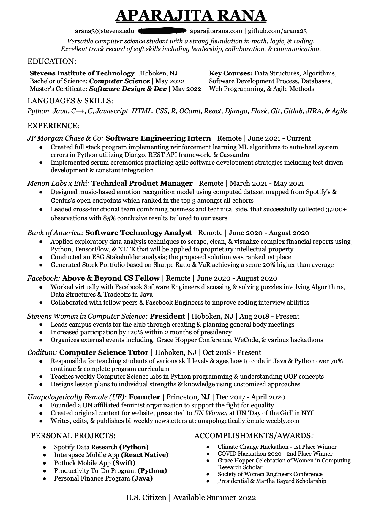

# 这份简历让我得到了所有 FAANG(新毕业生，SWE)的面试机会

> 原文：<https://levelup.gitconnected.com/the-resume-that-got-me-interviews-with-all-faang-companies-new-grad-swe-e4b96af0c64>

你好。我希望你一切都好。今天，让我们深入了解一下我的简历，以及它是如何让我参加 FAANG 的面试的。一定要看看这篇文章的前身[这里](https://medium.com/interviewnoodle/i-got-interviews-with-all-of-faang-as-a-new-grad-swe-ed57c5a58f86)！在这篇文章的底部，我附上了我申请的简历，但是请务必通读所有的提示，这样你就可以为自己准备一份完美的简历。

通过 RedChairRecruitment

# 基础知识:

所以，从头开始——假设你要从头开始写一份简历，下面是你应该包括的最基本的内容:

*   姓名、专业和参加的学院/项目
*   联系方式(电子邮件和电话号码)
*   最近的相关工作经验(最近在高层)
*   国籍
*   编码语言(*适用于软件工程师)
*   项目(*针对软件工程师)
*   ATS 友好格式(【https://www.jobscan.co/】T2，超级超级重要)

我用 Google Drawings 创建了自己的简历“模板”,以定制我的页边距，确保我可以在一页纸上写下我想要的所有内容。我也喜欢并检查了我的简历的 PDF 版本是 ATS 友好的，关于我的正确信息正在被阅读。如果你没有时间或者觉得你不能让简历看起来像你想要的那样整洁，去看看 Canva 的各种模板。如果你还没有个人项目，那就用你更感兴趣的课上的项目。你可能会被问到简历上的任何问题，所以确保你对你列出的所有内容都有信心。

# 最好的拥有者:

*   保持格式一致(2022 比 22，以'结尾)。或者什么都没有，什么是粗体/斜体，什么不是)。
*   搜索你的角色和简历中最好的关键词来优化你的简历。
*   让你的项目符号可测量或量化(如果你不知道确切的统计数据，估计一下，STEM 人喜欢数字和百分比)。
*   在每一个要点的开头使用强烈的动作动词，我喜欢哈佛大学[编辑的清单。](https://hls.harvard.edu/dept/opia/job-search-toolkit/action-verbs/)
*   平衡你的留白，太多和太少都不好看。

虽然我把这些归类为“最好拥有”,但至少在你提交给理想公司的简历中，这些绝对应该被包括在内或加以改进！

# 点睛之笔:

*   确保所有的链接和联系信息都是最新的和有效的。(有一次，我的简历被脸书的人审阅了，我的网站瘫痪了……yoikes)
*   让尽可能多的新鲜人看到它，看看他们记得什么，给他们留下什么印象，并据此进行编辑。
*   使用子项目符号中所需角色的关键字自定义简历。(例如:把你所具备的与招聘职位相匹配的具体资格，包括在你所拥有的相关经验中)
*   包含奖项！我认为奖项是展示你的价值和你对你所做的事情充满热情的一个很好的方式。
*   如果你正在努力减少事情，想想你最能谈论什么，然后在你的 LinkedIn 上添加“减少”的事情！

# 我的简历:

现在是我们一直在等待的时刻，我使用的简历让我在所有 FAANG(除了苹果 lol)面试:

划掉了我的电话号码，但它在这里！

就这样结束了！非常感谢您通读这些内容。如果你有任何额外的建议或强烈同意或不同意这里的任何东西，请在下面的评论中提出来！

**如果这篇文章在某种意义上有所帮助，我真的*非常感谢*的关注，帮助我在三月底达到 100 个关注者的目标:】**

祝你好运！

Aparajita 林蛙