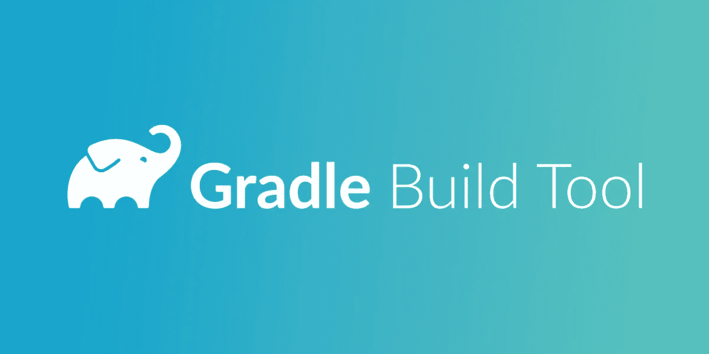
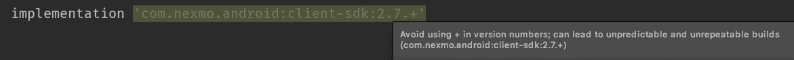
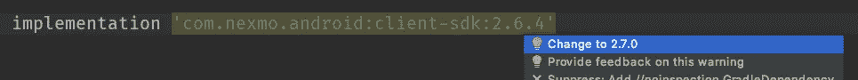

# 使用梯度动态依赖的正确方法

> 原文：<https://levelup.gitconnected.com/the-right-way-of-using-gradle-dynamic-dependencies-554a6b8b1d57>

Gradle 是一个流行且灵活的构建系统。其中，它允许我们处理依赖性管理。我们可以定义应用程序将使用的所有依赖项(外部框架和库),例如

上面的代码将下载一个修复的 2.7.0 版本的 Nexmo ClientSDK。在转向动态依赖之前，让我们快速看一下语义版本控制。

# 语义版本控制

如今大多数库都遵循语义版本规范[，也称为 semver。它促进了用于依赖版本控制的 major.minor.patch (2.7.0)格式。当满足特定标准时，每个数字都会增加:](https://semver.org/)

*   当进行向后不兼容的 API 更改时，零件增加。拉一个新版本很可能会破坏你的构建，例如方法签名的改变或者方法的移除。
*   `minor`当以向后兼容的方式添加功能或在私有代码中引入改进时，部件增加，例如，新方法被添加到 API。
*   `patch`当向后兼容的 bug 修复完成后，零件会增加。这是最常见的发布类型，通常，由于各种错误修复，我们希望拥有最新的路径版本。

# 动态依赖关系

Gradle 还允许您在依赖项定义中使用`+`字符来定义依赖项(库)的动态版本。

在上面的例子中，Gradle 将下载最新`path`版本的 client-sdk，例如 2.7.1、2.7.2、2.7.3 等等。Gradle 允许我们以多种方式定义动态版本检索。我们来看几个例子:实现' com . NEX mo . Android:client-SDK:2.7。+' -当`path`版本改变实现时下载新的库版本' com.nexmo.android:client-sdk:2。+' -当`minor`或`path`版本改变实现时下载新的库版本' com . NEX mo . Android:client-SDK:+'-总是下载库的最新版本

这种机制是一种很好的方法，可以确保我们使用的库版本具有最新的性能改进、补丁和错误修复。然而，在实践中，动态依赖关系的使用可能导致多个问题。让我们考虑几个真实的场景，在这些场景中，动态依赖的使用有严重的缺点。

# 有问题的场景 1

让我们从最简单的场景开始。我们的应用程序对第三方库使用动态依赖。我们在我们的应用程序中发现了一个 bug，我们知道它在 1 个月前工作正常。我们希望使用过去的一个或多个构建来确定错误何时被引入我们的代码库。我们从一个月前的存储库中检出代码，当时应用程序运行良好，然后我们构建了应用程序，但应用程序仍然不能按预期运行——问题仍然存在。发生了什么事？原来 bug 在外部库。我们的 src 代码是 30 天前的，但是 Gradle 动态依赖机制下载了最新版本的依赖项(有 bug ),该版本在 1 个月前创建初始版本(没有 bug 的版本)时并不存在。

第 1 课:当使用动态依赖项时，很难构建相同的应用程序，因为构建依赖于外部库版本，而外部库版本很可能会随时间而变化。

# 有问题的场景 2

我们是图书馆的创造者。我们明确要求我们库的用户使用这种动态依赖关系:

他们仅仅通过复制上面的代码就将这种依赖性添加到了他们的项目中。在某个时候，我们发布了一个引入了 bug 的新版本库。现在用户报告说“几天前，他们的应用程序停止了预期的工作。”开发人员使用了动态依赖版本，没有意识到库的新版本导致了错误。他们不是通过恢复库版本来快速修复问题，而是发送错误报告并等待修复。

第 2 课:不要建议你的库用户使用动态依赖版本，因为当你破坏库时，他们很可能不知道问题的确切原因。

# 解决方法

像 IntelliJ IDEA 这样的现代 ide 会警告我们动态依赖的用法:

为了避免不可预测性，我们可以显式指定依赖版本，并在需要时手动更新它们。这将允许您完全控制版本更新，并更仔细地查看依赖关系变更日志和审查更改。IDE 还会显示关于过时依赖项的警告，并提供更改版本的意图:

这种策略适用于小型项目，但是当您的项目包含大量依赖项时，手动更新可能会非常耗时。我们可以使用 [gradle-versions-plugin](https://github.com/ben-manes/gradle-versions-plugin) 来确定需要更新多少依赖项:

上面的命令将生成一个报告，列出所有过时的依赖项。

我们还可以更进一步，平衡确定性构建和动态依赖版本化。 [Gradle 依赖关系锁定插件](https://github.com/nebula-plugins/gradle-dependency-lock-plugin)和 [Gradle 锁定特性](https://docs.gradle.org/current/userguide/dependency_locking.html)允许我们在 Gradle 构建配置中使用动态依赖关系语法，同时将这些依赖关系锁定到特定版本(覆盖 Gradle 动态依赖关系行为)。这使我们可以完全控制何时更新依赖关系。

要更新与`Gradle Dependency Lock Plugin`的依赖关系，我们必须运行一个命令:

上面的命令将生成一个包含依赖项版本的`dependencies.lock`文件。

[梯度锁定功能](https://docs.gradle.org/current/userguide/dependency_locking.html)以类似的方式工作。首先，我们必须启用配置锁定:

然后我们可以生成一个依赖锁文件:

锁定状态将保存在项目或子项目目录下的文件夹`gradle/dependency-locks`中的文件中。

我们应该在版本控制中包含所有的依赖版本文件(`dependencies.lock`和`gradle/dependency-locks`)，以确保团队中的每个开发人员都使用相同版本的依赖。作为一个团队，您可以决定何时更新依赖关系，例如，每个开发周期的开始。

# 摘要

使用梯度动态依赖关系可能会导致应用程序中出现新的错误。如果幸运的话，这些 bug 可能会被测试发现，但这并不能保证。最重要的是，错误的原因通常不明显，导致更多的混乱。在构建我们的应用程序时，我们应该减少活动部件的数量。理想情况下，构建应该是确定性的，构建相同的源代码应该产生完全相同的应用程序。如果你计划使用动态依赖版本，你也应该使用[分级锁定特性](https://docs.gradle.org/current/userguide/dependency_locking.html)或[分级依赖锁定插件](https://github.com/nebula-plugins/gradle-dependency-lock-plugin)；否则，您应该显式指定依赖版本。

*最初发布于*[*https://learn . vonage . com/blog/2020/11/04/the-right-way-of-use-grad le-dynamic-dependencies*](https://learn.vonage.com/blog/2020/11/04/the-right-way-of-using-gradle-dynamic-dependencies)