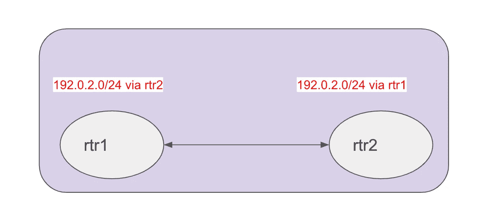
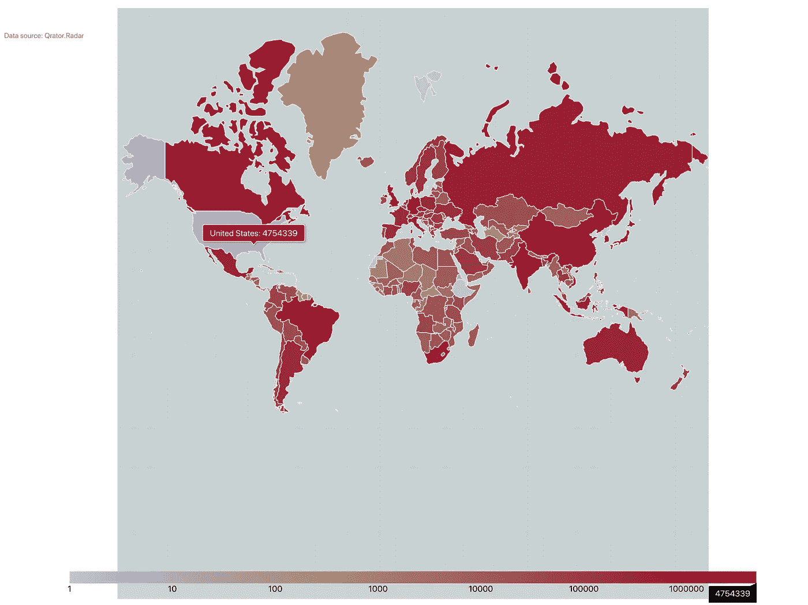
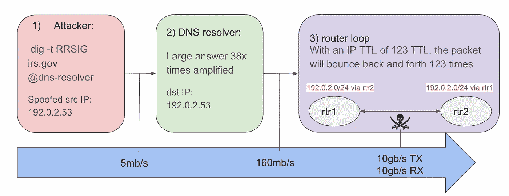
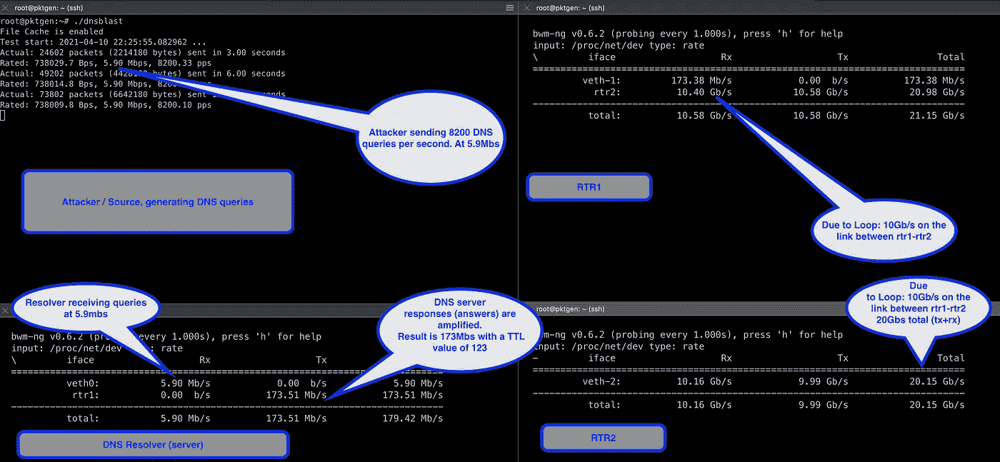

# 放大路由环路的风险和危险。

> 原文：<https://levelup.gitconnected.com/the-risks-and-dangers-of-amplified-routing-loops-b052a9bd31bf>


Yves Scheuber 在 [Unsplash](https://unsplash.com?utm_source=medium&utm_medium=referral) 上拍摄的照片

> **本文将深入探讨网络环路以及它们如何被滥用为 DDoS 攻击的一部分。网络环路与现有的基于反射的攻击相结合，可以产生超过一千倍的流量放大系数。在本文中，我们将了解攻击者如何只需要 50mb/s 就能填满 100gb/s 的链路。我将在实验室环境中演示这一点。**
> 
> 本博客也呼吁所有网络工程师采取行动，清理那些挥之不去的网络环路，因为它们不仅仅是糟糕的卫生状况，也是重大的操作性 DDoS 风险。

# 网络环路

所有网络工程师都熟悉网络环路。网络环路会导致单个数据包在网络中来回跳动，同时消耗宝贵的网络资源(带宽和 PPS)。IP 网络出现环路有多种原因，通常是由配置错误引起的。针对网络环路的唯一真正“保护”是生存时间(TTL)检查。然而,“生存时间”检查对循环的保护更少，对它们永远循环的保护更多。

生存时间(TTL)是指数据包在被路由器丢弃之前在网络中存在的时间或“跳数”。TTL 是 IP 报头中的一个 8 位字段，因此它的最大值为 255。大多数操作系统上的典型 TTL 值是 64，在大多数情况下应该可以正常工作。

大多数网络工程师都知道环路不卫生。我认为对循环的操作风险的理解(或思考)要少得多。根据我的经验，大多数环路都是针对那些实际上并没有使用的 IP 地址的(否则，这将是一次中断)，所以通常情况下，解决这个问题最终会被搁置。

## 一个简单的循环示例

让我们看一个简单的例子。下图显示了两台路由器；想象一下，这些是您数据中心的核心或边缘路由器。



不管出于什么原因，它们都认为 192.0.2.0/24 可以通过另一台路由器到达。因此，发往该目的地的数据包会在两台路由器之间来回传送。根据 TTL 值，用于该数据包的带宽为:

```
packet size in bytes x 8 x TTL. 
```

这意味着对于一个 512 字节的数据包和 60 的 TTL，使用的带宽量是 245Kbs。换句话说，512 字节的数据包在被丢弃之前变成了 307，20 字节(60x)。你可以把这个数字 60 看作放大系数。

# 但是..但是..网络环路很少见

那要看你对稀有的定义了。Qrator 的好人们监控互联网上的环路。根据 Qrator 的测量，大约有 2000 万个独特的环路(作为独特的路由器对来测量)。



来源:Qrator 雷达。全局路由环路的数量

# 组合循环和常见的放大攻击。

现在，我们已经讨论了环路的风险及其超过 100 倍(TLL)的潜在放大系数，这可能会让您想起传统的 DDoS 攻击。

你在新闻中读到的创纪录的 DDOS 攻击现在达到每秒数百千兆比特，并达到万亿比特的峰值。所有这些大容量度量攻击大多是同一类型的攻击，通常被称为放大或反射攻击。

它们依赖于攻击者发送一个带有假冒源 IP 的小数据包，然后该数据包被反射并放大到攻击目标。反射器/放大器通常是某种开放的 UDP 服务，接受一个小请求并产生一个大答案。典型的例子有 DNS、NTP、SSDP 和 LDAP。您在新闻中读到的大型攻击通常结合了其中一些服务。

到目前为止，将这两种类型的场景结合在一起的危险可能已经很明显了。让我们看一个例子。一个典型的 DNS 扩增查询可能是这样的，RRSIG 的 RRSIG 查询

```
 dig -t RRSIG irs.gov @8.8.8.8
```

这个查询在网络上有 64 个字节。得到的答案很大，需要分两个包发送；第一个包是 1500 字节，第二个包是 944 字节。所以总的来说，我们的放大系数是(1500+944)/64 = 38。

```
IP (tos 0x0, ttl 64, id 32810, offset 0, flags [none], proto UDP (17), length 64)
    192.168.0.30.57327 > 8.8.8.8.53: 42548+ [1au] RRSIG? irs.gov. (36)IP (tos 0x0, ttl 123, id 15817, offset 0, flags [+], proto UDP (17), length 1500)
    8.8.8.8.53 > 192.168.0.30.57327: 42548 8/0/1 irs.gov. RRSIG, irs.gov. RRSIG, irs.gov. RRSIG, irs.gov. RRSIG, irs.gov. RRSIG[|domain]IP (tos 0x0, ttl 123, id 15817, offset 1448, flags [none], proto UDP (17), length 944)
    8.8.8.8 > 192.168.0.30: ip-proto-17
```

*注意:有许多不同类型的放大攻击。这只是一个简单明了的 DNS 例子。此外，请注意，公共开放反射器(如公共 DNS 解析器)通常具有智能机制来限制可疑流量，以减少这些服务可能带来的负面影响。*

上面的 tcpdump 输出显示，当答案从 Google 的 DNS 服务返回时，TTL 值为 123；这高于大多数其他公共 DNS 解析器(大多数默认为 64)。

如果我们将这种攻击与我们之前看到的“环路”因子(由 TTL 值决定)结合起来，我们就有了总放大因子。

# 把数字加起来

好，让我们继续研究 DNS 扩增的例子。放大倍数为 38，TTL 为 123，则总放大倍数为:

```
38 * (123 / 2) = 2,337
```

*请注意，我将 TTL 数除以 2，这样我们就可以得到每个接收(RX)和发送(tx)数。*

现在，我们用 2337 作为一个合理的总扩增数。攻击者需要什么样的流量才能产生 10G 或 100G 流量？一条 10g 链路饱和只需要 5Mbs，一条 100Gbs 链路饱和大约需要 50Mbs！这些数字低到足以从简单的家庭连接中产生。现在想象一下，一个心怀不轨并能访问更大僵尸网络的攻击者会做些什么…

# 让我们用一个演示来仔细检查一下

为了确保这一切都是可能的，并且数学上是合理的，我决定建一个实验室来重现我们上面看到的场景。



事情的进展

实验室包含四个设备:

1.  一个**攻击者:**发起基于 DNS 的反射攻击。(假冒的)源 IP 被设置为 192.0.2.53
2.  一个 **DNS 解析器:**接收 DNS 查询(带有伪造的源 IP)并回复一个比原始问题大 38 倍的答案。DNS 应答中的 IP TTL 值是 123。
3.  一个**路由器对** (rtr1 — rtr2):两个路由器都有一条指向彼此的 192.0.2.0/24 的路由。因此，目的 IP 为 192.0.2.53 的 DNS 应答将在两台路由器之间来回跳动，直到 TTL 过期。



在上面的截图中，我们看到左上角的攻击者以 5.9 兆字节的速率发送查询。在左下角，我们看到 DNS 解析器以 5.9 兆字节的速率从客户端接收流量，并以大约 173 兆字节的速率回答查询。带有 DNS 响应的 IP 数据包的 TTL 为 123。

我们看到右边的路由器对:右上方的 rtr1 和右下方的 rtr2。如您所见，两台设备都以 10Gb/s 的速度发送和接收。因此，在这种情况下，我们观察客户端(攻击者)如何将 6mb/s 变为 10Gb/s。

# 包扎

在这篇博客中，我们探讨了网络环路的危险。我希望很清楚，循环不仅仅是一个卫生或装饰问题，而是暴露了一个重要的漏洞，应该尽快清理。

我们看到，环路并不罕见，有数百万对路由器存在网络环路。事实上，根据 Qrator 的数据，超过 30%的自治系统(ASN ),包括许多大型云提供商，都有带环路的网络。

我们观察到，攻击者可以轻松地使 85Mbs 的 10G 链路饱和(TTL 为 240 ),而无需任何 UDP 放大。或者，如果与典型的 UDP 放大攻击相结合，6mb 的种子流量将在环路上产生 10G 的流量，或者 60Mb/s 的流量可能会填满 100Gbs 的路径！

## 并非所有的循环都是相同的

大多数环路发生在两台相邻的路由器之间；其中相当一部分出现在 ISP 路由器和客户路由器之间。我也看到过在欧洲和美国之间的环路中，多达 8 跳(路由器)跨越不同的城域网。这些跨大西洋环路成本高昂，而且很难迅速扩大规模。因此，像这样的链接上的循环会产生更大的影响。

## 行动呼吁

我希望这篇文章说服您检查您的网络是否存在环路，并确保您不会受到此类攻击的影响。考虑注册免费的 [Qrator](https://radar.qrator.net/) 服务，当在您的网络中检测到新的环路(或其他问题)时，您会收到警报。