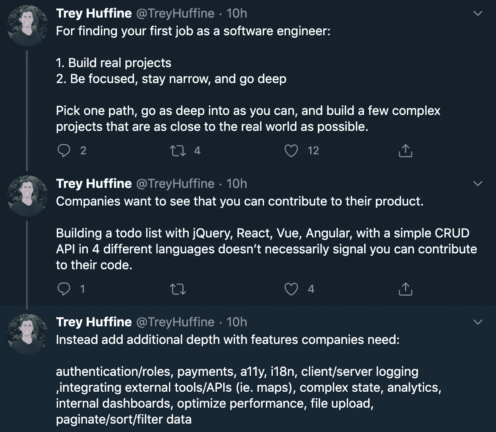

# 找到下一份软件工程师工作的路线图

> 原文：<https://levelup.gitconnected.com/the-roadmap-to-landing-your-next-job-as-a-software-engineer-cf6289d6f274>

6 年来，我面试了数百名开发人员，也作为一名候选人经历了求职过程，磨练出了获得软件工程工作的公式。我已经无数次地从两方面看到了整个过程，并且理解了获得你一直在寻找的角色所需要的步骤。

当我找到我的第一份软件工程工作时，我开始使用这个公式，从那以后，我一直在改进它。通过遵循此路线图，我能够:

1.  从编码训练营出来后，我在硅谷的一家初创公司( [GrubMarket](https://techcrunch.com/2020/10/05/grubmarket-raises-60m-at-a-500m-valuation-as-food-delivery-stays-center-stage/) )获得了一份六位数的工作(他们甚至给我的薪水**比我要求的高出了**10%。这不是我为了更多的钱而采取强硬手段，这是他们在与自己谈判，并向我提供比我要求的更高的薪水。
2.  一年后，在我的下一次求职中，我得到了谷歌的工作机会，在脸书进行了现场面试，面试了各种规模的初创公司，最终决定接受 Postmates(对不起，谷歌……)的工作，后者是最近被优步收购的[。](https://techcrunch.com/2020/07/06/uber-takes-out-postmates/)
3.  我已经帮助了许多不同背景的朋友——从自学成才到拥有计算机科学学位的高级工程师——找到工作，协商更高的薪水，并让他们有信心*进入编码面试，并开始冒险寻找工作。*

你是拥有公司需要的宝贵技能的人，你是掌控者。

坦率地说，为面试做准备需要时间和努力。它没有任何魔力。这个路线图告诉你应该把时间集中在哪里，确保你处理好所有必要的步骤，让你在申请工作时脱颖而出(或者更有可能的是，让公司主动联系你)，并拥有在面试中取得成功的所有必要知识和直觉。

 [## 编写面试问题+获得开发工作

### 掌握编码面试的过程

技术开发](https://skilled.dev/) 

**(^如果你准备开始学习，我也建了这个课程)**

# 路线图🗺️

该路线图将求职分为 3 个阶段:

1.  狩猎前
2.  求职
3.  面谈

虽然这三个阶段都很重要，但是钱是在狩猎前赚的。在求职前，你要用一些工具来武装自己，让自己在求职中脱颖而出，并对面试充满信心。在你提交第一份申请之前，你就已经在做你最重要的工作了。

事实上，如果您从本文中没有学到任何东西，请记住这两个步骤:

1.  构建真正的项目
2.  练习编写面试问题

…并尽可能早地开始。如果你能做到这两点，你就能顺利找到你梦寐以求的工作。

# 狩猎前💪

你听过“让练习比游戏更难”这句话吗？这正是预狩猎的目的。

第一步:开始为你的编码面试学习。在你和招聘人员交谈之前，你应该对核心数据结构和算法感到完全舒服。工作问题可以让你获得所需的直觉，让你有信心战胜任何面试问题。

此外，选择 1-2 种编程语言，并非常了解它们(除非你是一个非常有经验的多语言程序员)。相对于对许多语言的浅显介绍，展示知识的深度要好得多。这也适用于框架和库。**走深，不走宽**。

**第二步**:刷刷你的简历、LinkedIn、作品集网站。确保包含你希望招聘者锁定你的短语。这可能是从“专注于节点和反应的全栈 JavaScript 工程师”到“致力于底层系统架构的信任开发者”的任何事情。添加角色描述，包括您使用的技术，列出您的项目，并确保始终突出您所做的最重要的事情。

> *注意:如果你像我一样害怕更新你的简历和投资组合，你应该看看我为帮助自动化这个过程而构建的免费工具——一个* [*简历生成器*](https://gitconnected.com/resume-builder) *和一个用于你的投资组合网站* *的* [*API。*](https://gitconnected.com/portfolio-api)

描述并展示你所做的事情，并取得切实的成果。例如，“从 jQuery 重建了前端，以 React 将页面加载时间减少到 1 秒以下，将转化率提高了 12%，并显著提高了开发人员的迭代速度”。

第二步的目的是更新你的在线形象，并开始与招聘人员和公司建立联系。即使你现在没有在找工作，这也是你建立人际网络的时候，当你准备好了的时候，你就可以向他们伸出援手。

在过去大约 1 年的时间里，所有 FAANG 公司(不包括网飞)的招聘人员都来找我，Twitter、LinkedIn、优步、Instacart、比特币基地、Twitch 和许多其他公司——现在就开始建立你的人际网络吧。

认真对待这一步，它会在以后带来回报。

第三步:构建项目！构建真正的项目是我们向公司展示我们拥有的技能组合，让我们能够在工作中做出贡献。这也显示了我们对编程的热情和学习的渴望。

你的经验越少，你的项目越重要。如果你有多年的经验，如果需要的话，你的工作背景可以作为你的项目。

构建项目完成两件事:

1.  我们有切实的成果向公司展示我们拥有所需的技能
2.  我们**学到了更多**

从你的项目中获得的知识在面试中会有很大帮助。你将有能力创造引人入胜的讨论，学习为真实的应用程序编写良好的代码，并有具体的例子来回答面试问题。

面试也将建筑项目更多地融入到这个过程中。公司会给你一些带回家的项目，或者你可能会在面试时被要求开发一些迷你应用程序。你的经验越多，你就会感觉越舒服。

你需要对待每个项目，就像真实的人会使用它一样。它迫使你真正深入挖掘，彻底了解正在发生的事情。它还为那些您已经知道生产应用程序需要什么并能从第一天就投入使用的公司提供了非常强大的数据点。

除了项目，博客也非常有帮助。通过写博客，你强迫自己完全了解一个话题，因为你将公开分享它。你也不必写复杂或深刻的话题——只需分享你所学到的。

你学会了如何使用 React 钩子发出 API 请求吗？**关于它的博客。**

你用 Python 分析过一个有趣的数据集吗？**关于它的博客。**

您知道如何使用 Docker 部署 Golang 应用程序吗？如果你想知道是否应该写博客，答案是肯定的。

不要觉得缺乏经验会阻止你写博客。通常，最好的老师是那些最近学习了一个主题的人，因为他们深刻理解掌握这个主题所需要的挑战和心理障碍。

博客帮助我们更彻底地了解主题，同时也为招聘公司提供了另一个积极的数据点。它创建了一个在线的存在，在那里你可以利用你的空闲时间来帮助其他开发者学习和成长。

狩猎前的时间表:在理想的情况下，你应该在一年多后开始这个阶段。然而，你可能需要的绝对最短时间是 3 个月。你花费的实际时间取决于你的经验水平和你过去学到了多少。

*   至少每 6-12 个月更新一次你的简历、作品集和 LinkedIn。这些不一定是重大的变化，但要保持你的信息是最新的。
*   无论你是否在找工作，建立项目和写博客都应该是你可以花时间去做的事情。
*   编码面试是许多开发人员最害怕的求职方面。你给自己越多的时间去学习和吸收这些概念，你就会变得越好。我建议找一个非常强的课程，可以教授你需要的直觉，而不是磨磨蹭蹭地解决问题，希望你做的事情是正确的。

# 求职👀

你终于准备好开始申请公司了(或者终于开始接受招聘人员没完没了的 LinkedIn 请求)。根据你的工作经验，这个阶段可能会有很大的不同。

此时，你应该彻底更新你的简历、投资组合网站和 LinkedIn。确保你与世界分享的故事突出了你的激情和技能。展示你的项目和过去的经验，让自己成为一个准备好做出巨大贡献的人。

找工作需要时间，所以要做好遵循过程的准备。然而，一旦面试和工作机会开始到来，它就进入了超光速。

我就当这是某人在找自己的第一份工作，你可以根据自己的情况决定有多少是有意义的。

*   申请工作是一个数字游戏，尤其是如果这是你的第一份工作。适用于许多人，对每个人都表现出同样的热情和兴奋。
*   建立关系和网络。招聘人员是靠雇佣人来赚钱的，所以要努力和他们联系，展示你的激情和热情，并努力获得获得工作所需的技能。
*   参加聚会、黑客马拉松和其他编程活动，参与当地的技术社区。这可能会也可能不会直接带来一份工作，但它会让你保持动力，让你被相似的人包围，让你在业内建立人际网络。
*   联系在你想申请的公司工作的人(但也要尊重他们的时间，不要骚扰他们，并且明白你可能得不到回应)。从现任员工那里得到热情的介绍是快速进入面试的最好方法之一。联系内部招聘人员、与你背景相似的开发人员，或者你想要的职位的软件工程师。

当你联系软件工程师时，不要只是说“你能帮我找份工作吗”。走进去，寻找联系，建立关系。人类通常喜欢帮助他人。

我会这样对待它:

> “你好，特雷，
> 
> 我是一名有抱负的软件工程师，意识到我们有相似的背景。我也没有计算机科学学位，我想知道你是否能分享一些进入这个行业的建议。如果你有 30 分钟的时间聊天，我想请你喝杯咖啡。"

真诚一点，首先专注于建立联系。

# 面谈🤓

面试是对我们的挑战，毫无疑问，软件工程师比其他任何职业都更受考验——但是请记住，在面试的另一边，有一些很棒的角色在等着你。

面试过程分为几个部分，每个公司之间可能略有不同，但大致情况是相似的。

1.  招聘人员电话屏幕
2.  1-2 次技术视频访谈
3.  可能是一个带回家的项目
4.  现场面试。这通常包括 3-6 次与工程师的技术访谈，以及 1-2 次与经理或非技术团队成员的行为对话。

招聘人员是你的主要联系人。他们会安排面试时间，并在你结束后通知你结果。要记住的一点是，招聘人员是你的盟友。他们的工作是找到好的工程师，让人们被雇佣，所以他们会为你而战。这包括薪酬谈判。我强烈推荐阅读[这篇关于如何谈判的文章，这是我读过的最好的文章。](https://medium.com/@bayareabelletrist/how-i-negotiated-a-software-engineer-offer-in-silicon-valley-f11590f5c656)

与招聘人员建立牢固的联系，善待他们。

如果你没有得到一份工作呢？没关系。没有人会从他们面试的公司得到 100%的工作机会，但是你练习和面试得越多，你就会变得越好。你也将不再过多关注单次面试的结果，而是相信整个过程会顺利进行，这反过来通常会让大多数人在面试中更成功，因为他们不会想太多。

成功的一个重要因素是你的态度。**热情、积极、好学**。

记住，你正在接受其他工程师和潜在的未来同事的面试。想想你想和什么样的人一起工作。大多数面试官都希望求职者成功，所以只要确保你展现自己的方式能让你的同事有所期待。

我见过非常有技术天赋的人没有得到工作机会，因为他们非常消极，相处起来很痛苦；我也见过非常初级的工程师得到了相同职位的工作机会，因为他们显示出如果接受正确的培训，他们有激情和愿望做出贡献。

面试具有挑战性，但这并不意味着我们应该被吓倒。如果你花了时间，你会有足够的机会感到舒适。你会看到许多你学过的概念，你会感到自信，整个过程会开始感觉更像是一个证明自己的机会，而不是害怕会被问到什么问题。

你知道你在做什么，你应该得到一份优秀的工作来匹配。

不过，一切都是为了准备。**研究你的面试问题，建立项目。**

我将继续深入讨论求职过程和路线图的各个阶段，敬请关注更多文章。

— Trey ( [@treyhuffine](https://twitter.com/treyhuffine) )

**附言提醒:** [**Skilled.dev 编码面试课程**](https://skilled.dev/) **定于 11 月 17 日上线！最大的折扣将只在有限的时间内提供，所以一定要报名参加通知的电子邮件列表。**

 [## 编写面试问题+获得开发工作

### 掌握编码面试的过程

技术开发](https://skilled.dev)