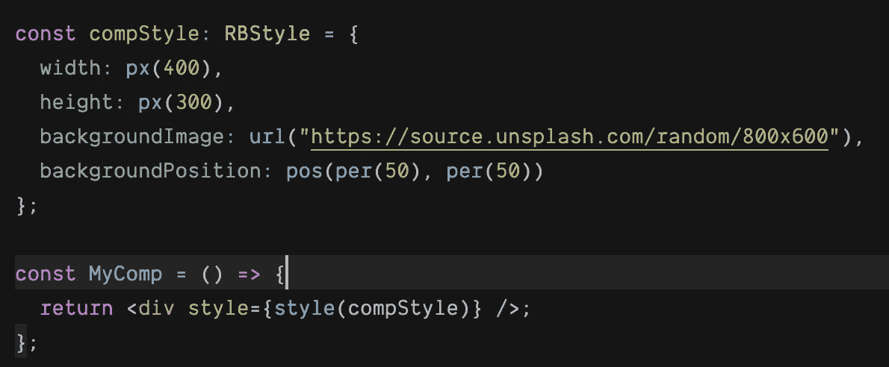

# 🌹Rosebox 项目

> 原文：<https://levelup.gitconnected.com/the-rosebox-project-30b01e7b3a12>

## 介绍

## 一个实验性的 Javascript 样式库


随着今天的 web 应用，我们发现我们越来越多地创作基于状态的样式，这为“CSS-in-JS”方法的诞生铺平了道路，其本质是**使用 Javascript API 来创作样式。**

Rosebox 是一个实验性的 CSS-in-JS 库，专注于以利用 TS 类型系统功能的方式在 Typescript 中建模 CSS，提供强表达类型和结构化的改进语法。说了这么多，让我们讨论一下 Rosebox 的两个主要焦点领域。

# 1.🧰强类型 API

Rosebox 使用类型和类型别名将 CSS 的数据类型映射到 Typescript 中，这样可以减少打字错误，使样式更具表现力。CSS 的一些数据类型直接映射到 Typescript 的内部类型(`[s](https://www.rosebox.dev/api/#rb-type-time)tring`和`[n](https://www.rosebox.dev/api/#rb-type-time)umber`)，因此使用类型别名来表示，其他的则映射到 RB 类型，如`[Time](https://www.rosebox.dev/api/#rb-type-time)`、`[TransformationFunction](https://www.rosebox.dev/api/#rb-type-transformfunction)`和`[Leng](https://www.rosebox.dev/api/#rb-type-length)th`。

让我们来看看下面这个 RB 中样式对象的例子:


在 CSS 中，`font-size`属性的值具有以下值定义:

```
[<absolute-size>](https://www.w3.org/TR/css-fonts-3/#absolute-size-value) [|](https://www.w3.org/TR/css-values-4/#comb-one) [<relative-size>](https://www.w3.org/TR/css-fonts-3/#relative-size-value) | [<length-percentage>](https://www.w3.org/TR/css-values-4/#typedef-length-percentage)
```

`<absolute-size>`和`<relative-size>`是 CSS 中的`keyword`数据类型，映射到`stringLiteral`类型。CSS 中的`<length-percentage>`数据类型映射到…好吧，RB 的`LengthPercentage`只是`Length`和`Percentage`的联合类型。

在上面的例子中，我们使用`px`值构造函数创建了一个类型为`Length`的值，它具有像素单元。值构造函数只是一个与特定类型相关联的函数，它构造该类型的值。值构造器的另一个例子是`rgb`，它创建了一个`Color`类型的 rgb 值。

> 值构造函数只是一个与特定类型相关联的函数，它构造该类型的值。

你可以在这里查看所有实现的类型[https://www.rosebox.dev/api/](https://www.rosebox.dev/api/)

# 2.🔤语法简化和清晰

如果我们查看速记属性`background-position`的文档，我们会发现`<bg-position>`的值定义如下:

```
[<bg-position>](https://www.w3.org/TR/css-backgrounds-3/#typedef-bg-position) = [  [ left [|](https://www.w3.org/TR/css3-values/#comb-one) center [|](https://www.w3.org/TR/css3-values/#comb-one) right [|](https://www.w3.org/TR/css3-values/#comb-one) top [|](https://www.w3.org/TR/css3-values/#comb-one) bottom [|](https://www.w3.org/TR/css3-values/#comb-one) [<length-percentage>](https://www.w3.org/TR/css3-values/#typedef-length-percentage) ]
[|](https://www.w3.org/TR/css3-values/#comb-one)
  [ left [|](https://www.w3.org/TR/css3-values/#comb-one) center [|](https://www.w3.org/TR/css3-values/#comb-one) right [|](https://www.w3.org/TR/css3-values/#comb-one) [<length-percentage>](https://www.w3.org/TR/css3-values/#typedef-length-percentage) ]
  [ top [|](https://www.w3.org/TR/css3-values/#comb-one) center [|](https://www.w3.org/TR/css3-values/#comb-one) bottom [|](https://www.w3.org/TR/css3-values/#comb-one) [<length-percentage>](https://www.w3.org/TR/css3-values/#typedef-length-percentage) ]
[|](https://www.w3.org/TR/css3-values/#comb-one)
  [ center [|](https://www.w3.org/TR/css3-values/#comb-one) [ left [|](https://www.w3.org/TR/css3-values/#comb-one) right ] [<length-percentage>](https://www.w3.org/TR/css3-values/#typedef-length-percentage)[?](https://www.w3.org/TR/css3-values/#mult-opt) ] [&&](https://www.w3.org/TR/css3-values/#comb-all)
  [ center [|](https://www.w3.org/TR/css3-values/#comb-one) [ top [|](https://www.w3.org/TR/css3-values/#comb-one) bottom ] [<length-percentage>](https://www.w3.org/TR/css3-values/#typedef-length-percentage)[?](https://www.w3.org/TR/css3-values/#mult-opt) ]
]
```

这意味着下列值是有效的:

```
left  // The second value is omitted
right 60%
center top 60%
top 50% left // changing the order of axes
```

太多的选项涉及省略值和颠倒轴的顺序…如果你问我，我会觉得困惑，没有明显的优势。

在 RB 中，`<bg-position>`有一个非常简单的对应类型叫做`Position`，它描述了一个元素在 2D 空间中的位置。它只接受`Length`或`Percentage`值，并且总是以相同的预期顺序(x，y)取值。为了构造这种类型的值，您调用它的值构造器`pos(x, y)`。

示例:



> 只要有机会在不真正牺牲表达性或准确性的情况下简化语法或减少歧义，我们就会这样做。

如果我们继续阅读`<bg-position>`的文档，我们会发现以下注释:

> 如果只指定了一个值，第二个值被假定为[中心](https://www.w3.org/TR/css-backgrounds-3/#valdef-background-position-center)

在这里我敢说:

> **编程中的隐含性导致认知开销和不确定性**。

每当开发人员在代码中发现一个类似的不包含所有值的松散的速记属性时，他/她就会想:“缺少的值将默认为什么？”*。*更糟糕的是，像`overflow`这样的简写属性将第一个提供的值复制到其他缺少的值中，而不是默认为某个值。所以现在我们有两种处理省略值的方法:**复制**和**默认**。

作为 RB 的一般经验法则，如果 CSS 中的一个速记属性可以接受多个值(例如`padding: 8px 16px 40px`)，但只有一个是强制的(例如`padding: 5px`)，其他缺少的值可以是从提供的值中复制的**(`padding: 5px`相当于`padding: 5px 5px 5px 5px`)，那么 RB 将提供一个单值语法和一个多值语法。另一方面，如果缺少的值将**默认**为某个其他值，那么 RB 将使所有的值都是强制的。这种方法在简洁和清晰之间取得了平衡。**

> **如果 CSS 中的一个速记属性可以接受多个值，但只有一个值是强制的，并且它使用**复制**来获得缺失的值，那么 RB 将提供一个单值语法和一个多值语法，否则**，** RB 将使所有的值都是强制的。**

# **✍️最后的话**

**Rosebox 仍然非常年轻，处于实验阶段，许多属性和 CSS 函数仍然没有实现，虽然你仍然可以使用它们，但是它们现在还没有得到类型系统的支持。**

**在下面，您可以找到与项目相关的不同链接:**

**github:[https://github.com/hugonteifeh/rosebox](https://github.com/hugonteifeh/rosebox)**

**网址:[https://www.rosebox.dev/](https://www.rosebox.dev/)**

> **如果它没有意义，继续重塑它，直到它有意义**