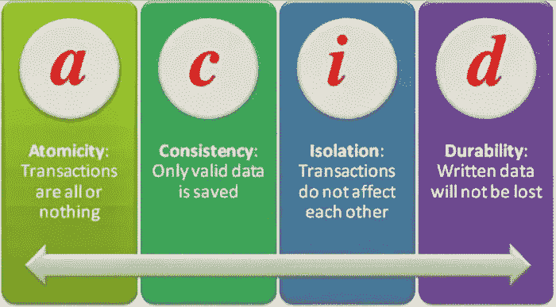
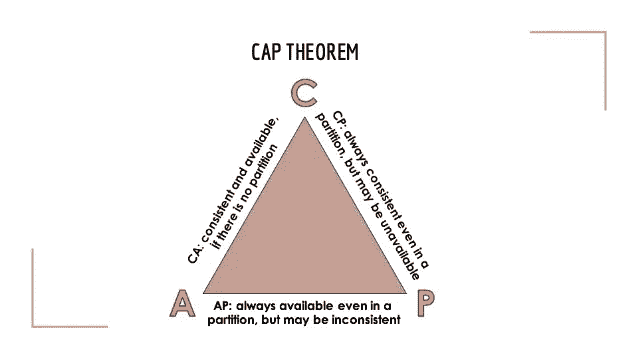
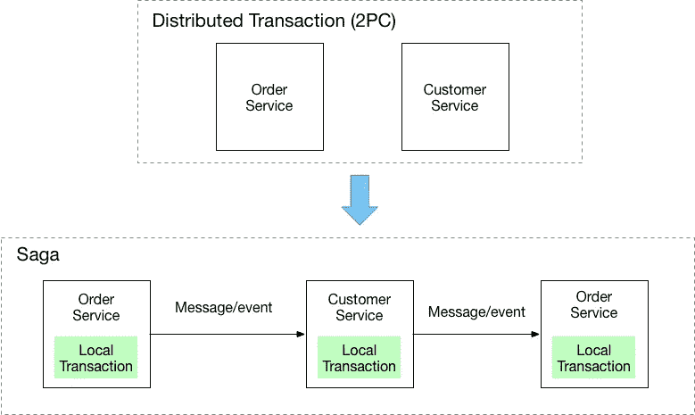
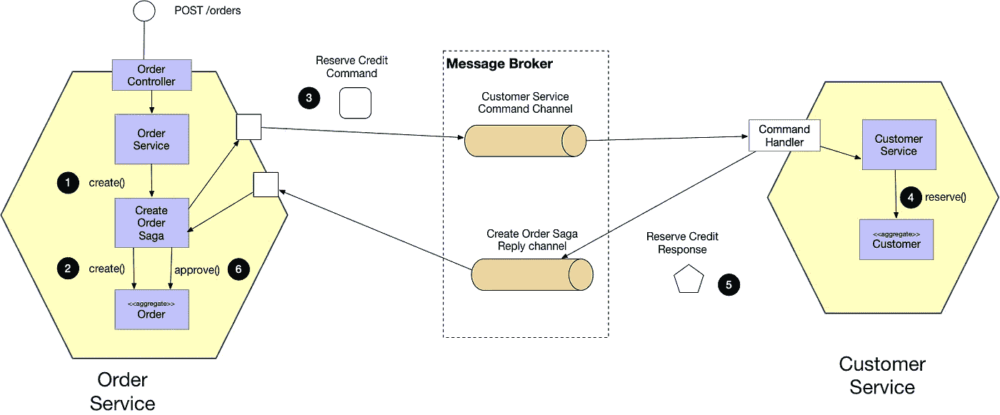
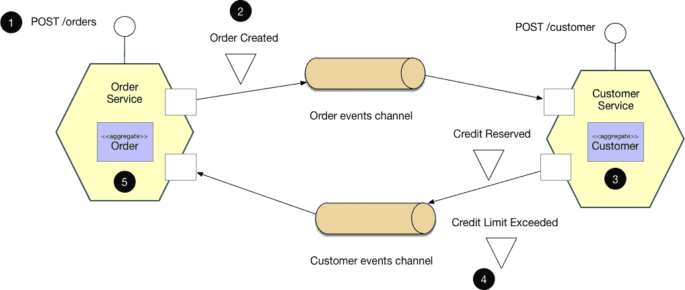

# 微服务中的传奇模式

> 原文：<https://levelup.gitconnected.com/the-saga-pattern-in-microservices-fbed0b90bf92>

## 处理分布式事务

paweczerwi ski 在 [Unsplash](https://unsplash.com/s/photos/saga-pattern?utm_source=unsplash&utm_medium=referral&utm_content=creditCopyText) 上的照片

当一切正常时，API 组合和 CQRS 模式可以为分布式查询提供合适的解决方案。

 [## 在微服务中运行分布式查询

### CQRS 和 API 组合方法

levelup.gitconnected.com](/running-distributed-queries-in-micro-services-157b12b93154) 

然而，维护分布式数据的完整性是复杂的。如果将所有数据存储在单个关系数据库中，并在模式中指定适当的约束，则可以依靠数据库引擎来维护数据完整性。

当多个微服务将数据保存在隔离的数据存储中(关系或非关系)时，情况就大不相同了。数据完整性很关键，但必须通过代码来维护。传奇模式解决了这个问题。

## 酸

数据完整性的一个常见衡量标准是所有修改数据的事务都具有 ACID 属性:

*   **原子:**事务中的所有操作要么成功，要么全部失败。
*   **一致:**数据状态满足事务前后的所有约束
*   **隔离:**并发事务的行为就像它们被序列化了一样。
*   **持久:**当事务成功完成时，结果被持久化。

ACID 属性并不特定于关系数据库，但经常在这种上下文中使用，主要是因为关系模式及其形式约束提供了一种方便的一致性度量。隔离属性通常会严重影响性能，一些偏好高性能和最终一致性的系统可能会放宽隔离属性。

## CAP 定理

CAP 定理指出，分布式系统不能同时具有以下三个属性:

*   **一致性:**是指无论客户端请求来自什么路径，所有客户端都会同时看到相同的数据。这对于频繁更新的应用程序来说至关重要。
*   **可用性:**意味着所有运行的应用程序组件都将返回有效的响应，即使它们关闭了。如果应用程序的用户群体对停机的容忍度较低(例如零售门户)，这一点尤其重要。
*   **分区弹性**:意味着即使在网络故障导致服务间消息丢失或延迟的情况下，应用程序也能运行。这在集成了大量分布式独立组件的应用程序中发挥了作用。

在实践中，您需要选择是实施 CP 系统还是 AP 系统。CP 系统(一致的和分区弹性的)总是一致的，并且如果组件之间存在网络分区，CP 系统将不会提供查询或做出改变。它只能在系统完全连接后运行。显然，这意味着你没有可用性。

另一方面，AP 系统(可用且具有分区弹性)总是可用的，并且可以以裂脑方式运行。当系统被拆分时，每个部分可能会继续正常运行，但系统会变得不一致，因为每个部分都不知道其他部分正在发生什么。

AP 系统通常被称为最终一致系统，因为当连接恢复时，某些协调过程可以确保整个系统再次同步。一个有趣的变体是冻结系统，当网络分区发生时，它们正常降级，两部分继续处理查询，但拒绝对系统的所有修改。请注意，由于分区中的一些事务可能仍然无法复制到另一个部分，因此不能保证这两个部分在分区期间是一致的。一般来说，这已经足够好了，因为分割部分之间的差异很小，并且不会因为拒绝新的更改而随着时间的推移而增加。

## 传奇模式

图片来自 microservices.io

saga 模式的基本思想是集中管理所有微服务的操作，对于每一个操作，如果因为某种原因无法完成整个事务，就会进行一次补偿操作。这实现了酸的原子性。然而，每个微服务上的变化是立即可见的，而不仅仅是在整个分布式事务结束时。这违反了一致性和隔离属性。如果你把你的系统设计成 AP(最终一致)，这不是问题。但是，它要求您的代码意识到这一点，并能够使用可能部分不一致或过期的数据。在许多情况下，这是一个可以接受的妥协。

传奇模式是如何运作的？Saga 是对微服务的一套操作和相应的补偿操作。当一个操作失败时，它的补偿操作和所有以前的补偿操作将以相反的顺序被调用，以回滚系统的整个状态。

Sagas 的实现并不容易，因为补偿操作也可能失败。通常，转换状态必须是持久的，并且必须被如此标记，并且必须存储大量元数据以实现可靠的回滚。一个好的做法是经常运行带外进程，并清除无法实时完成所有补偿操作的错误 Sagas。思考传奇的一个好方法是将其视为一个工作流程。工作流很酷，因为它们可以实现长流程，甚至涉及到人，而不仅仅是软件。

有两种类型的传奇:

*   **基于编排的 Saga:** 在这种方法中，有一个 Saga 编排器管理所有事务，并指导参与者服务基于事件执行本地事务。这位指挥者也可以被认为是一位传奇经理人。

图片来自 microservices.io

*   **基于编舞的传奇:**在这种方法中，没有中央指挥。参与 Saga 的每个服务执行它们的事务和发布事件。其他服务根据这些事件进行操作，并执行它们的事务。此外，他们可能会或不会根据情况发布其他事件。

图片来自 microservices.io

## 结论

Saga 模式的主要优点是，它可以帮助维护多个服务之间的数据一致性，而无需紧密耦合。这是微服务架构的一个极其重要的方面。

然而，从编程的角度来看，Saga 模式的主要缺点是明显的复杂性。另一个挑战是，补偿交易还必须设计成让传奇故事正常运行。

明智地选择您的数据库。然后，设计您的微服务工作流和框架，以确保您不会破坏您的目标